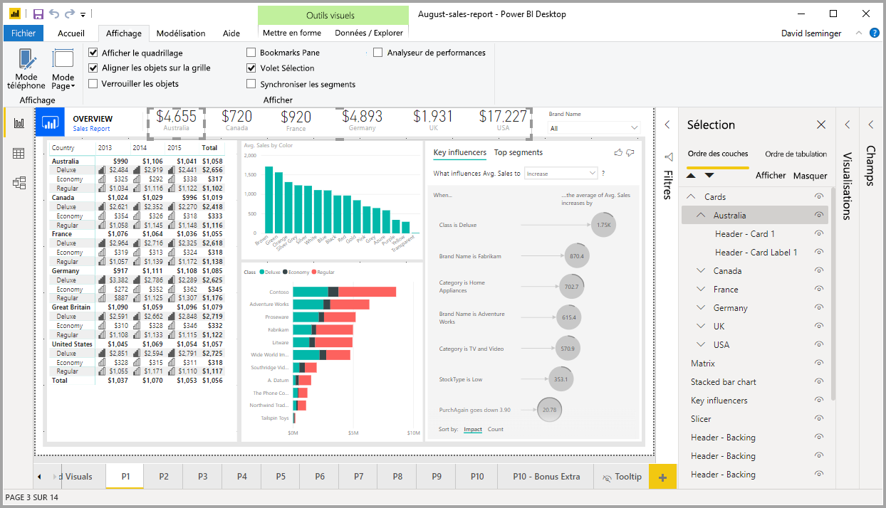
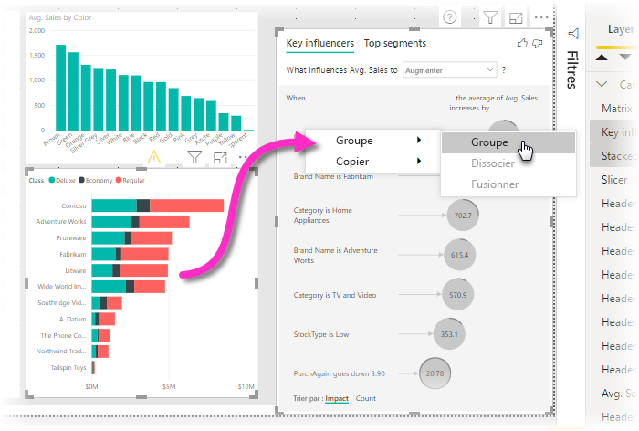
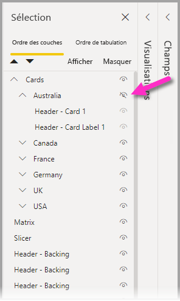

# Utiliser le regroupement dans Power BI Desktop
Avec le **regroupement** dans **Power BI Desktop**, vous pouvez regrouper des visuels dans votre rapport, comme des boutons, des zones de texte, des images de formes et tout visuel que vous créez, tout comme vous regroupez des éléments dans PowerPoint. Le fait de regrouper des visuels dans un rapport vous permet de traiter le groupe comme un objet unique, ce qui rend le déplacement, le redimensionnement et l’utilisation de couches dans votre rapport plus faciles, plus rapides et plus intuitifs.

## Création de groupes

Pour créer un groupe de visuels dans Power BI Desktop, sélectionnez le premier visuel dans le canevas, maintenez le bouton CTRL enfoncé, cliquez sur un ou plusieurs visuels supplémentaires que vous voulez placer dans le groupe, cliquez ensuite avec le bouton droit sur la collection de visuels, puis sélectionnez **Grouper** dans le menu qui s’affiche.

Les groupes sont affichés dans le volet **Sélection**. Vous pouvez avoir autant de groupes de visuels que nécessaire pour votre rapport, et vous pouvez également imbriquer des groupes de visuels. Dans l’image suivante, le groupe *Australia* (Australie) est imbriqué sous le groupe *Cards* (Cartes). Vous pouvez développer un groupe en sélectionnant l’accent circonflexe en regard du nom du groupe, et le réduire en resélectionnant l’accent circonflexe. 

Dans le volet **Sélection**, vous pouvez également faire glisser et déposer des visuels individuels pour les inclure dans un groupe, les supprimer d’un groupe, imbriquer un groupe ou supprimer un groupe ou un visuel individuel d’une imbrication. Faites simplement glisser le visuel que vous voulez ajuster, puis placez-le à l’emplacement de votre choix. En cas de chevauchement, la superposition de visuels est déterminée par leur ordre dans la liste *Ordre des couches*.

Pour dissocier un groupe, sélectionnez-le simplement, cliquez avec le bouton droit, puis sélectionnez **Dissocier** dans le menu qui s’affiche.

## Masquer et afficher des visuels ou des groupes

Vous pouvez facilement masquer ou afficher des groupes à l’aide du volet **Sélection**. Pour masquer un groupe, sélectionnez le bouton représentant un œil en regard du nom du groupe (ou de tout visuel individuel) pour afficher ou masquer le visuel ou le groupe. Dans l’image suivante, le groupe*Australia* (Australie) est masqué et le reste des groupes imbriqués dans le groupe *Cards*  (Cartes) s’affichent.

Quand vous masquez un groupe, tous les visuels présents dans ce groupe sont masqués. Cela est signalé par le fait que leur bouton représentant un œil est estompé (activation ou désactivation impossible car l’ensemble du groupe est masqué). Pour masquer uniquement un visuel donné d’un groupe, changez simplement l’état du bouton représentant un œil en regard de ce visuel : seul ce visuel dans le groupe est alors masqué.

## Sélection de visuels dans un groupe

Il existe plusieurs façons de parcourir et de sélectionner des éléments dans un groupe de visuels. La liste suivante décrit le comportement obtenu :

* Le fait de cliquer sur un espace vide dans un groupe (par exemple, un espace blanc entre des visuels) ne sélectionne rien
* Le fait de cliquer sur un visuel dans un groupe sélectionne l’ensemble du groupe ; un deuxième clic sélectionne le visuel en question
* Le fait de sélectionner un groupe, puis un autre objet sur le canevas de rapport, et de sélectionner ensuite **Grouper** dans le menu contextuel crée un groupe imbriqué
* Le fait de sélectionner deux groupes, puis de cliquer avec le bouton droit affiche une option permettant de fusionner les groupes sélectionnés, au lieu de les imbriquer

## Appliquer une couleur d’arrière-plan

Vous pouvez également appliquer une couleur d’arrière-plan à un groupe à l’aide de la section **Mise en forme** du volet **Visualisations**, comme illustré dans l’image suivante. 

Une fois que vous avez appliqué une couleur d’arrière-plan, le fait de cliquer sur l’espace entre les visuels du groupe sélectionne le groupe (contrairement au fait de cliquer sur l’espace blanc entre les visuels d’un groupe, qui ne sélectionne pas le groupe). 

## Étapes suivantes
Pour plus d’informations sur le regroupement, visionnez la vidéo suivante :

* [Regroupement dans Power BI Desktop - Vidéo](https://youtu.be/sf4n7VXoQHY?t=10)

Les articles suivants pourraient également vous intéresser :

* [Use cross-report drillthrough in Power BI Desktop](desktop-cross-report-drill-through.md) (Utiliser une extraction interrapport dans Power BI Desktop)
* [Utilisation de segments Power BI Desktop](visuals/power-bi-visualization-slicers.md)

