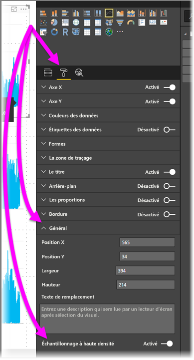

# Échantillonnage de lignes à haute densité dans Power BI
À compter de la version de juin 2017 de **Power BI Desktop** et des mises à jour du **service Power BI**, un nouvel algorithme d’échantillonnage est disponible, qui améliore les visuels qui échantillonnent des données à haute densité. Par exemple, vous pouvez créer un graphique en courbes à partir des résultats des ventes de magasins, chacun d’eux enregistrant plus de dix mille reçus d’achat chaque année. Un graphique en courbes de telles informations échantillonne des données (sélectionnez une représentation explicite de ces données pour illustrer les variations des ventes au fil du temps) à partir des données de chaque magasin, et montre plusieurs séries, représentant ainsi les données sous-jacentes. Il s’agit d’une pratique courante pour la visualisation de données à haute densité. Cet article décrit en détail comment Power BI Desktop a amélioré son échantillonnage des données à haute densité.

> [!NOTE]
> L’algorithme **Échantillonnage à haute densité** décrit dans cet article est disponible dans **Power BI Desktop** et dans le **service Power BI**.

## Fonctionnement de l’échantillonnage de ligne à haute densité
Auparavant, **Power BI** sélectionnait une collection de points de données échantillons dans la plage complète des données sous-jacentes de manière déterministe. Par exemple, pour des données à haute densité sur un visuel s’étendant sur une année civile, il pouvait y avoir 350 échantillons de points de données affichés dans le visuel, chacun d’eux étant sélectionné de façon que la plage complète des données (la série globale de données sous-jacentes) était représentée dans le visuel. Pour comprendre comment cela fonctionne, imaginons que nous traçons une cotation sur une période d’un an, et que nous avons sélectionné 365 points de données pour créer un visuel de graphique en courbes (soit un point de données pour chaque jour).

Dans ce cas, il existe un grand nombre de valeurs pour une cotation chaque jour. Bien entendu, il existe un plus haut et un plus bas chaque jour, mais ils peuvent se produire à tout moment de la journée quand la bourse est ouverte. Pour un échantillonnage de ligne à haute densité, si l’échantillon de données sous-jacentes a été pris à 10h30 et à 12h00 quotidiennement, vous obtenez un instantané représentatif des données sous-jacentes (le prix à 10h30 et à 12h00), mais il peut ne pas capturer le plus haut et le plus bas réels de la cotation pour ce point de données représentatif (ce jour-là). Dans ce cas (et dans d’autres), l’échantillonnage est représentatif des données sous-jacentes, mais il ne capture pas toujours certains points importants, qui sont dans ce cas le plus haut et le plus bas de la cotation du jour.

Par définition, les données à haute densité sont échantillonnées pour créer des visualisations d’une façon raisonnablement rapide, qui réagissent à l’interactivité. Trop de points de données sur un visuel peuvent le ralentir et nuire à la visibilité des tendances. Ainsi, la façon dont les données sont échantillonnées est ce qui gouverne la création de l’algorithme d’échantillonnage, pour offrir une expérience de visualisation optimale. Dans Power BI Desktop, l’algorithme a été amélioré afin de fournir la meilleure combinaison possible de réactivité, de représentation et de préservation claire des points importants de chaque tranche de temps.

## Fonctionnement du nouvel algorithme d’échantillonnage de ligne
Le nouvel algorithme d’échantillonnage de ligne à haute densité est disponible pour générer des visuels de graphique en courbes et en aires avec un axe X continu.

Pour un visuel à haute densité, **Power BI** découpe vos données de façon appropriée en segments de haute résolution, puis sélectionne les points importants pour représenter chaque segment. Ce processus de segmentation de données haute résolution est spécialement réglé pour s’assurer que le graphique obtenu soit visuellement indiscernable du rendu de tous les points de données sous-jacents, mais qu’il soit généré beaucoup plus rapidement et soit plus interactif.

### Valeurs minimales et maximales pour les visuels de ligne à haute densité
Pour chaque visualisation, les limitations visuelles suivantes s’appliquent :

* Le nombre maximal de points de données *affichés* sur la plupart des visuels est **3 500**, quel que soit le nombre de séries ou de points de données sous-jacents (voir les *exceptions* dans la liste à puces suivante). Par conséquent, si vous avez 10 séries avec 350 points de données chacune, le visuel a atteint sa limite globale maximale de points de données. Si vous avez une seule série, celle-ci peut comprendre jusqu’à 3 500 points de données si le nouvel algorithme estime qu’il s’agit de l’échantillonnage optimal pour les données sous-jacentes.

* Le nombre maximal de séries pour un visuel est fixé à **60**. Si vous avez plus de 60 séries, divisez les données et créez plusieurs visuels représentant chacun au maximum 60 séries. Il est recommandé d’utiliser un **slicer** (segment) afin d’afficher uniquement des segments des données (seulement certaines séries). Par exemple, si vous affichez toutes les sous-catégories dans la légende, vous pouvez utiliser un slicer afin de filtrer par catégorie générale sur la même page de rapport.

Le nombre maximal de limites de données est plus élevé pour les types de visuel suivants, qui sont des *exceptions* à la limite de points de données de 3 500 :

* **150 000** points de données au maximum pour les visuels R.
* **30 000** points de données pour les visuels personnalisés.
* **10 000** points de données pour les graphiques à nuages de points (la valeur par défaut est 3 500)
* **3 500** pour tous les autres visuels

Ces paramètres garantissent que les visuels dans Power BI Desktop s’affichent très rapidement et réagissent aux interactions des utilisateurs, et qu’ils n’entraînent pas une surcharge de calcul excessive sur l’ordinateur affichant le visuel.

### Évaluation des points de données représentatifs pour les visuels de ligne à haute densité
Quand le nombre de points de données sous-jacents dépasse le nombre maximal de points de données pouvant être représentés dans le visuel, un processus appelé *compartimentage* démarre et découpe les données sous-jacentes en blocs nommés *compartiments*, qu’il affine ensuite de manière itérative.

L’algorithme crée le plus grand nombre possible d’emplacements afin d’offrir une granularité maximale pour le visuel. Dans chaque emplacement, l’algorithme détecte les valeurs de données minimale et maximale pour s’assurer que les valeurs importantes et significatives (par exemple, des valeurs hors norme) sont capturées et affichées dans le visuel. Selon les résultats du compartimentage et de l’évaluation des données qui s’en suit par Power BI, la résolution minimale de l’axe X du visuel est déterminée de façon à garantir une granularité maximale de celui-ci.

Comme mentionné précédemment, la précision minimale pour chaque série est de 350 points et la valeur maximale est de 3 500 pour la plupart des visuels, avec des *exceptions* listées dans les paragraphes précédents.

Chaque emplacement est représenté par deux points de données qui deviennent les points de données représentatifs de l’emplacement dans le visuel. Les points de données sont simplement les valeurs haute et basse de cet emplacement et, en sélectionnant ces valeurs hautes et basses, le processus de compartimentage garantit qu’une valeur haute importante ou valeur basse significative est capturée et restituée dans le visuel.

Si vous trouvez que cela ressemble beaucoup à une analyse visant à vérifier que les valeurs hors norme occasionnelles sont capturées et correctement affichées dans le visuel, vous avez raison. C’est précisément la raison d’être du nouvel algorithme et du processus de compartimentage.

## Info-bulles et échantillonnage de ligne à haute densité
Il est important de noter que ce processus de compartimentage, qui entraîne la capture des valeurs minimale et maximale d’un compartiment donné et leur affichage, peut affecter la manière dont les info-bulles affichent les données quand vous placez le curseur sur les points de données. Pour expliquer comment et pourquoi cela se produit, revenons à notre exemple des cotations.

Supposons que vous créez un visuel basé sur une cotation et que vous comparez deux cotations différentes, toutes deux utilisant un **échantillonnage à haute densité**. Les données sous-jacentes de chaque série comprennent un grand nombre de points de données (vous capturez peut-être la cotation à chaque seconde de la journée). L’algorithme d’échantillonnage de ligne à haute densité effectue un compartimentage pour chaque série indépendamment de l’autre.

À présent, supposons que la première cotation augmente fortement à 12h02, puis redescende rapidement dix secondes plus tard. Il s’agit là d’un point de données important. Lors du compartimentage pour cette cotation, la valeur haute enregistrée à 12 h 02 constitue un point de données représentatif pour cet emplacement.

Cependant, pour la deuxième cotation, 12h02 n’était ni un plus haut ni un plus bas dans le compartiment incluant ce moment. Peut-être que le plus haut et le plus bas pour le compartiment incluant 12h02 se sont produits trois minutes plus tard. Dans ce cas, une fois le graphique en courbes créé, lorsque vous positionnez le curseur sur 12 h 02, vous voyez dans l’info-bulle une valeur pour la première cotation (car celle-ci a bondi à 12 h 02 et cette valeur a été sélectionnée comme point de données haut de cet emplacement), mais vous ne voyez *pas* de valeur dans l’info-bulle à 12 h 02 pour la deuxième cotation. Cela est dû au fait que la deuxième cotation ne présente ni de valeur haute, ni de valeur basse pour l’emplacement incluant 12 h 02. Il n’y a par conséquent aucune donnée à afficher pour la deuxième cotation à 12 h 02, de sorte qu’aucune donnée ne s’affiche dans l’info-bulle.

Cette situation se produit souvent avec les info-bulles. Les valeurs haute et basse d’un emplacement donné peuvent ne pas correspondre parfaitement avec les points de valeur d’axe X échelonnés de façon uniforme, de sorte que l’info-bulle n’affiche pas la valeur.  

## Comment activer un échantillonnage de ligne à haute densité
Par défaut, le nouvel algorithme est **activé**. Pour modifier ce paramètre, accédez au volet **Mise en forme**, dans la carte **Général**. Dans la partie inférieure, vous pouvez voir un curseur bascule nommé **Échantillonnage à haute densité**. Pour désactiver celui-ci, faites-le glisser en position **Désactivé**.

## Considérations et limitations
Le nouvel algorithme d’échantillonnage de ligne à haute densité constitue une amélioration importante apportée à Power BI. Vous devez cependant considérer certains points quand vous travaillez avec des valeurs et des données à haute densité.

* En raison de la granularité accrue et du processus de compartimentage, les **info-bulles** ne peuvent afficher une valeur que si les données représentatives sont alignées sur votre curseur. Pour plus d’informations, consultez la section *Info-bulles et échantillonnage de ligne à haute densité* de cet article.
* Lorsque la taille d’une source de données globale est trop volumineuse, le nouvel algorithme élimine des séries (éléments de légende) pour respecter la contrainte d’importation maximale de données.
  
  * Dans ce cas, le nouvel algorithme trie les séries de légende par ordre alphabétique, commence au bas de la liste des éléments de légende dans l’ordre alphabétique jusqu’à ce que le maximum de données importées soit atteint, et n’importe alors plus d’autres séries.
* Quand un jeu de données sous-jacent comprend plus de 60 séries (nombre maximal de séries, comme décrit précédemment), le nouvel algorithme trie les séries par ordre alphabétique et élimine les séries au-delà de la 60ème.
* Si les valeurs des données ne sont pas de type *numérique* ou *date/heure*, Power BI n’utilise pas le nouvel algorithme et revient à l’algorithme précédent (échantillonnage sans haute densité).
* Le paramètre **Afficher les éléments sans données** n’est pas pris en charge par le nouvel algorithme.
* Le nouvel algorithme n’est pas pris en charge en cas d’utilisation d’une connexion active à un modèle hébergé dans SQL Server Analysis Services (version 2016 ou antérieure). Il est pris en charge dans les modèles hébergés dans **Power BI** ou Azure Analysis Services.

## Étapes suivantes
Pour plus d’informations sur l’échantillonnage à haute densité dans des nuages de points, consultez l’article suivant.

* [Échantillonnage à haute densité dans les nuages de points de Power BI](desktop-high-density-scatter-charts.md)

