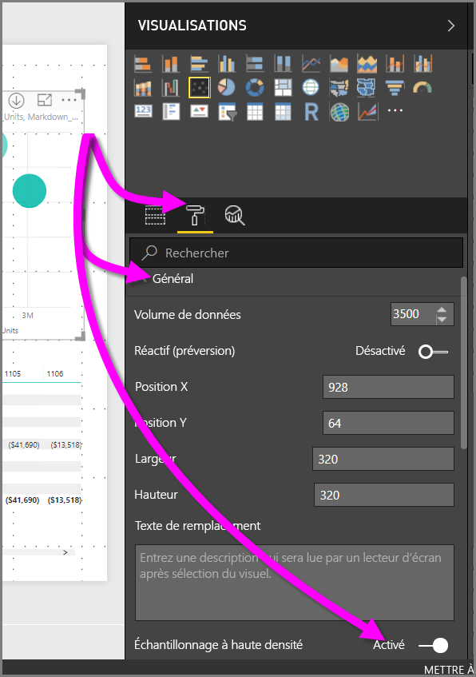

# Échantillonnage à haute densité dans les nuages de points de Power BI
Depuis la publication en juin 2017 de **Power BI Desktop** et des mises à jour du **service Power BI**, un nouvel algorithme d’échantillonnage est disponible, qui améliore les visuels qui échantillonnent des données à haute densité.

Par exemple, vous pouvez créer un nuage de points à partir de l’activité de ventes de votre organisation, chaque magasin ayant des dizaines de milliers de points de données chaque année. Un nuages de points formé à partir de telles informations constitue un échantillonnage (sélectionnez une représentation explicite de ces données pour illustrer la manière dont les ventes ont évolué au fil du temps) représentatif des données disponibles sous-jacentes. Il s’agit d’une pratique courante dans les nuages de points à haute densité, et Power BI Desktop a amélioré son échantillonnage des données à haute densité comme décrit en détail dans cet article.

> [!NOTE]
> L’algorithme d’**échantillonnage à haute densité** décrit dans cet article s’applique aux nuages de points de **Power BI Desktop** et du **service Power BI**, et est disponible dans les deux.
> 
> 

## Fonctionnement des nuages de points à haute densité
Auparavant, **Power BI** sélectionnait une collection de points de données échantillons dans la plage complète des données sous-jacentes de manière déterministe afin de créer un nuage de points. Plus précisément, Power BI sélectionnait les première et dernière lignes de données dans la série utilisée pour produire le nuage de points, puis divisait uniformément les lignes restantes de façon à ce que 3 500 points de données au total soient représentés sur le nuage de points. Par exemple, si l’échantillon comptait 35 000 lignes, les première et dernière lignes étaient sélectionnées pour le traçage, puis chaque dixième ligne était également tracée (35 000 / 10 = chaque dixième ligne = 3 500 points de données). Toujours auparavant, les valeurs ou points Null qui ne pouvaient pas être tracés (par exemple, les valeurs de texte) dans une série de données n’étaient pas affichés et donc ignorés lors de la génération du visuel. Avec ce type d’échantillonnage, la densité perçue du nuage de points était également basée sur les points de données représentatifs, de sorte que la densité du visuel obtenu dépendait des points échantillonnés, et non de la collection complète des données sous-jacentes.

Lorsque vous activez l’option **Échantillonnage à haute densité**, Power BI implémente un algorithme qui élimine les points qui se chevauchent, garantissant ainsi que les points du visuel sont accessibles lors de l’interaction avec celui-ci. Cela garantit également que tous les points du jeu de données sont représentés dans le visuel, ce qui fournit un contexte pour comprendre la signification des points sélectionnés, plutôt qu’un simple tracé d’un échantillon représentatif.

Par définition, les données à haute densité sont échantillonnées pour permettre une génération rapide de visualisations interactives (un trop grand nombre de points de données sur un visuel pouvant ralentir l’affichage de celui-ci et nuire à la lisibilité des tendances). L’algorithme d’échantillonnage dépend de la manière dont ces données sont échantillonnées afin d’offrir une expérience de visualisation optimale et de garantir que toutes les données sont représentées. Dans Power BI, l’algorithme a été amélioré afin de fournir une combinaison optimale de réactivité, de représentation et de préservation claire des points importants du jeu de données.

> [!NOTE]
> Les nuages de points basés sur un **échantillonnage à haute densité** sont tracés de façon optimale sur des visuels carrés, comme c’est le cas de tous les nuages de points.
> 
> 

## Fonctionnement du nouvel algorithme d’échantillonnage de nuage de points
Le nouvel algorithme d’**Échantillonnage à haute densité** utilisé pour la génération des nuages de points emploie des méthodes qui capturent et représentent les données sous-jacentes plus efficacement, et éliminent les points qui se chevauchent. Pour cela, il commence par un petit rayon pour chaque point de données (taille de cercle du visuel pour un point donné sur la visualisation). Il augmente ensuite le rayon de tous les points de données. En cas de chevauchement de points de données, un cercle unique (de la taille de rayon accrue) représente les points de données qui se chevauchent. L’algorithme continue d’augmenter le rayon des points de données, jusqu’à ce que la taille de celui-ci permette d’afficher à un nombre raisonnable de points de données (3 500) dans le nuage de points.

Les méthodes utilisées dans cet algorithme veillent que les valeurs hors norme soient représentées dans le visuel final. L’algorithme respecte également l’échelle lors de la détermination du chevauchement. Par exemple, les échelles exponentielles reflètent fidèlement les points de données sous-jacents visualisés.

L’algorithme conserve également la forme globale du nuage de points.

> [!NOTE]
> Lorsque vous utilisez l’algorithme d’**Échantillonnage à haute densité** pour des nuages de points, l’objectif est une *distribution précise* des données, *non* la densité du visuel obtenu. Par exemple, vous pouvez voir un nuage de points contenant un grand nombre de cercles qui se chevauchent (densité importante) dans une certaine zone, et imaginer que de nombreux points de données y sont agglutinés. Étant donné que l’algorithme d’**Échantillonnage à haute densité** peut utiliser un seul cercle pour représenter de nombreux points de données, une telle densité (ou « agglutination ») de visuel n’apparaît pas. Pour afficher plus de détails dans une zone donnée, vous pouvez utiliser des segments pour effectuer un zoom avant.
> 
> 

Par ailleurs, les points de données qui ne peuvent pas être tracés (par exemple, des valeurs Null ou des valeurs de texte) étant ignorés, une autre valeur traçable est sélectionnée, ce qui garantit la conservation de la forme réelle du nuage de points.

### Quand l’algorithme standard est utilisé pour les nuages de points
Dans certains circonstances, l’algorithme d’**Échantillonnage à haute densité** ne peut pas être appliqué à un nuage de points, et l’algorithme d’origine est utilisé. Ces circonstances sont les suivantes :

* Si vous cliquez avec le bouton droit sur **Détails**, puis sélectionnez **Afficher les éléments sans données** dans le menu qui s’affiche, le nuage de points revient à l’algorithme d’origine.
  
  
* Toute valeur sur l’axe de **lecture** a pour effet que le nuage de points revient à l’algorithme d’origine.
* Si les deux axes, X et Y, sont manquants sur un nuage de points, le graphique revient à l’algorithme d’origine.
* L’utilisation de l’option **Ligne du ratio** dans le volet **Analytique** a pour effet que le graphique revient à l’algorithme d’origine.
  
  

## Activer l’Échantillonnage à haute densité pour un nuage de points
Pour activer l’**Échantillonnage à haute densité**, sélectionnez un nuage de points, accédez au volet **Mise en forme**, puis développez la carte **Général**. Au bas de celle-ci, un curseur bascule nommé **Échantillonnage à haute densité** est disponible. Pour activer celui-ci, faites-le glisser en position **Activé**.

> [!NOTE]
> Une fois le curseur activé, Power BI essaie d’utiliser l’algorithme d’**Échantillonnage à haute densité** chaque fois que c’est possible. Quand l’algorithme est inutilisable (par exemple, vous si placez une valeur sur l’axe de *Lecture*), le curseur reste en position **Activé**, même si le graphique a été rétabli sur l’algorithme standard. Si vous supprimez ensuite une valeur de l’axe de *Lecture* (ou si les conditions changent pour permettre l’utilisation de l’algorithme d’échantillonnage à haute densité), le curseur étant activé, le graphique utilise automatiquement l’échantillonnage à haute densité pour ce graphique.
> 
> [!NOTE]
> Les points de données sont groupés et/ou sélectionnés par l’index. La présence d’une légende n’affecte pas l’échantillonnage pour l’algorithme, mais uniquement l’ordre du visuel.
> 
> 

## Considérations et limitations
L’algorithme d’échantillonnage à haute densité constitue une amélioration importante apportée à Power BI, mais vous n’avez que peu de choses à savoir lorsque vous travaillez avec des valeurs à haute densité et des nuage de points.

* L’algorithme d’**Échantillonnage à haute densité** fonctionne uniquement avec des connexions actives à des modèles basés sur le service Power BI, à des modèles importés ou à DirectQuery.

## Étapes suivantes
Pour plus d’informations sur l’échantillonnage à haute densité dans d’autres graphiques, voir l’article suivant.

* [Échantillonnage de lignes à haute densité dans Power BI](desktop-high-density-sampling.md)

