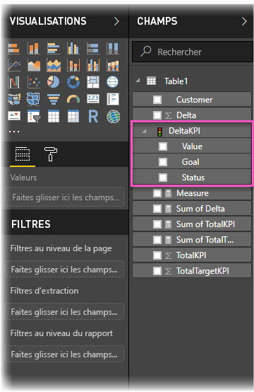

# Importer et afficher des indicateurs de performance clés (KPI)dans Power BI
Avec **Power BI Desktop**, vous pouvez importer et afficher les indicateurs de performance clés (KPI, Key Performance Indicator) dans des tables, matrices et cartes.

Pour importer et afficher les indicateurs de performance clés, procédez comme suit.

1. Démarrez avec un classeur Excel disposant d’un modèle Power Pivot et de KPI. Cet exercice utilise un classeur nommé *KPIs*.

1. Importez le classeur Excel dans Power BI, en utilisant **Fichier -> Importer -> Contenu du classeur Excel**. Vous pouvez également [découvrir comment importer des classeurs](desktop-import-excel-workbooks.md). 

1. Après l’importation dans Power BI, votre KPI s’affiche dans le volet **Champs**, avec l’icône de . Pour utiliser un KPI dans votre rapport, développez son contenu, pour exposer les champs **Valeur**, **Objectif** et **État**.

    

1. Les KPI importés sont idéalement adaptés aux types de visualisation standard, comme le type **Table**. Power BI inclut aussi le type de visualisation **KPI**, qui ne doit être utilisé que pour la création de nouveaux KPI.
   
    

C’est tout. Vous pouvez utiliser des indicateurs de performance clés pour mettre en évidence des tendances, une progression ou d’autres indicateurs importants.
