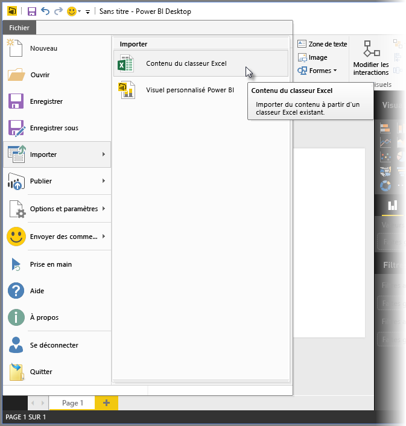
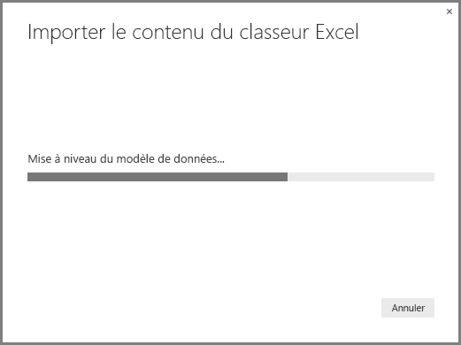
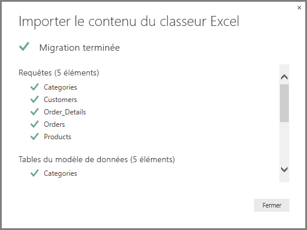

# Importer des classeurs Excel dans Power BI Desktop
Avec **Power BI Desktop**, vous pouvez facilement importer des classeurs Excel qui contiennent des requêtes Power Query, des modèles Power Pivot et des feuilles de calcul Power View dans Power BI Desktop. Les rapports et les visualisations sont créées automatiquement à partir du classeur Excel et, une fois importés, vous pouvez continuer à améliorer et à affiner ces rapports à l’aide de Power BI Desktop, avec les fonctionnalités existantes et les nouvelles fonctionnalités publiées lors de chaque mise à jour mensuelle de Power BI Desktop.

L’objectif futur est d’étendre la communication entre Excel et Power BI Desktop (par exemple l’importation/exportation). Cette capacité actuelle à importer des classeurs dans Power BI Desktop autorise une prise en main rapide par les utilisateurs d’Excel.

## Comment importer un classeur Excel ?
Pour importer un classeur, dans Power BI Desktop, sélectionnez **Fichier -\> Importer -\> Contenu du classeur Excel**.

Une fenêtre s’affiche, où vous pouvez sélectionner le classeur à importer. Il n’existe actuellement aucune limitation quant à la taille ou au nombre d’objets dans le classeur, mais il faut plus de temps à Power BI Desktop pour analyser et importer les classeurs volumineux.

> [!NOTE]
> Pour charger ou importer des fichiers Excel à partir de dossiers **OneDrive Entreprise partagés** ou à partir de dossiers de **groupe Office 365**, utilisez l’URL du fichier Excel et indiquez-la dans la source de données **Web** dans Power BI Desktop. Vous devez suivre plusieurs étapes pour formater correctement l’URL **OneDrive Entreprise**, aussi consultez [Utilisation de OneDrive Entreprise pour les liaisons commerciales dans Power BI Desktop](desktop-use-onedrive-business-links.md) pour plus d’informations et la bonne série d’étapes.
> 
> 

Une fois que vous avez sélectionné un classeur, Power BI Desktop l’analyse et le convertit en fichier Power BI Desktop (.pbix). Cette action est un événement ponctuel. Une fois le fichier Power BI Desktop créé avec ces étapes, il n’a aucune dépendance envers le classeur Excel d’origine et vous pouvez le modifier, l’enregistrer et le partager sans que cela n’affecte le classeur d’origine.

Une fois l’importation terminée, une page **Résumé** décrit les éléments qui ont été convertis et répertorie tous les éléments qui n’ont pas pu être importés.

Lorsque vous sélectionnez **Fermer**, le rapport est chargé dans Power BI Desktop. L’illustration suivante montre Power BI Desktop après l’importation d’un classeur Excel : Power BI Desktop a chargé automatiquement le rapport d’après le contenu du classeur.

Maintenant que le classeur a été importé, vous pouvez continuer à travailler sur le rapport (par exemple créer des visualisations, ajouter des données ou créer des pages de rapport) à l’aide des fonctionnalités de Power BI Desktop.

## Quels sont les éléments du classeur qui sont importés ?
Power BI Desktop peut importer les éléments suivants, communément appelés *objets*dans Excel.

| Objet de classeur Excel | Résultat final dans le fichier Power BI Desktop |
| --- | --- |
| Requêtes Power Query |Toutes les requêtes Power Query dans Excel sont converties en requêtes dans Power BI Desktop. Si des groupes de requêtes étaient définis dans le classeur Excel, la même organisation est répliquée dans Power BI Desktop. Toutes les requêtes sont chargées, sauf si elles étaient configurées avec l’option « Ne créer que la connexion » dans Excel. Vous pouvez personnaliser le comportement de chargement à partir de la boîte de dialogue **Propriétés** sous l’onglet **Accueil** de l’ **Éditeur de requête** dans Power BI Desktop. |
| Connexions de données externes Power Pivot |Toutes les connexions de données externes Power Pivot sont converties en requêtes dans Power BI Desktop. |
| Tables liées ou tables du classeur actuel |S’il existe dans Excel un tableau de feuille de calcul qui a été lié au modèle de données ou à une requête (à l’aide de l’option *À partir du tableau* ou de la fonction *Excel.CurrentWorkbook()* en M), les options suivantes sont proposées : <ol><li>Importer le tableau dans le fichier Power BI Desktop. Ce tableau est une capture instantanée ponctuelle des données, après laquelle vous ne pouvez pas modifier les données du tableau dans Power BI Desktop. Il existe une limite de taille de 1 million de caractères (au total, combinaison de tous les en-têtes de colonnes et de toutes les cellules) pour les tables créées à l’aide de cette option.</li><li>Conserver une connexion au classeur d’origine. En guise d’alternative, vous pouvez conserver une connexion au classeur Excel d’origine et Power BI Desktop récupère le contenu le plus récent de ce tableau à chaque actualisation, comme pour toute autre requête créée par rapport à un classeur Excel dans Power BI Desktop.</li></ul> |
| Mesures, catégories de données, relations et colonnes calculées du modèle de données |Ces objets de modèle de données sont convertis en objets équivalents dans Power BI Desktop. Notez que certaines catégories de données, comme **Image**, ne sont pas encore disponibles dans Power BI Desktop. Dans ces cas-là, les informations de catégorie de données sont réinitialisées pour les colonnes en question. |
| Feuilles de calcul Power View |Une page de rapport est créée pour chaque feuille de calcul Power View dans Excel. Le nom et l’ordre de ces pages de rapport correspondent à ceux du classeur Excel d’origine. |

## Y a-t-il des restrictions quant à l’importation d’un classeur ?
L’importation d’un classeur dans Power BI Desktop est soumise aux limitations suivantes :

* **Connexions externes à des modèles tabulaires Analysis Services :** dans Excel 2013, vous pouvez créer une connexion à des modèles tabulaires SQL Server Analysis Services et créer des rapports Power View sur ces modèles sans avoir à importer les données. Ce type de connexion n’est pas pris en charge actuellement dans le cadre de l’importation de classeurs Excel dans Power BI Desktop. Pour résoudre ce problème, vous devez recréer ces connexions externes dans Power BI Desktop.
* **Hiérarchies :** ce type d’objet de modèle de données n’est pas pris en charge actuellement dans Power BI Desktop. Par conséquent, les hiérarchies sont ignorées lors de l’importation d’un classeur Excel dans Power BI Desktop.
* **Colonnes de données binaires :** ce type de colonne de modèle de données n’est pas pris en charge actuellement dans Power BI Desktop. Les colonnes de données binaires sont supprimées de la table résultante dans Power BI Desktop.
* **Éléments Power View non pris en charge :** certaines fonctionnalités de Power View ne sont pas encore disponibles dans Power BI Desktop, telles que les thèmes ou certains types de visualisations (nuages de points avec axe de lecture, comportements de descente dans la hiérarchie, et ainsi de suite). Ces visualisations non prises en charge génèrent des messages *Visualisation non prise en charge* à leurs emplacements correspondants dans le rapport Power BI Desktop, que vous pouvez supprimer ou reconfigurer en fonction de vos besoins.
* **Plages nommées utilisant** ***À partir du tableau*** **dans Power Query ou utilisant** ***Excel.CurrentWorkbook*** **en M :** l’importation des données de cette plage nommée dans Power BI Desktop n’est pas prise en charge actuellement, mais il s’agit d’une mise à jour planifiée pour Power BI Desktop. Actuellement, ces plages nommées sont chargées dans Power BI Desktop en tant que connexion au classeur Excel externe.
* **PowerPivot vers SSRS :** les connexions externes PowerPivot vers SQL Server Reporting Services (SSRS) ne sont pas prises en charge actuellement, car cette source de données n’est pas disponible actuellement dans Power BI Desktop.

