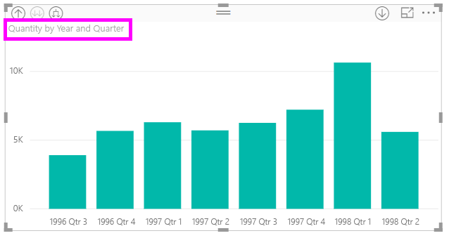
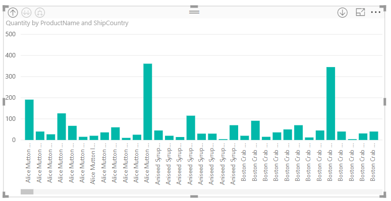

# Utilisation des étiquettes de hiérarchie incluses dans Power BI Desktop
**Power BI Desktop** prend en charge l’utilisation des **étiquettes de hiérarchie incluses**, la première des deux fonctionnalités visant à améliorer l’exploration hiérarchique. La deuxième fonctionnalité, qui est en cours de développement, est la possibilité d’utiliser des étiquettes de hiérarchie imbriquées (revenez régulièrement, nous mettons à jour le contenu fréquemment).   

## Fonctionnement des étiquettes de hiérarchie incluses
Avec les étiquettes de hiérarchie incluses, vous pouvez voir les étiquettes de la hiérarchie lorsque vous développez des éléments visuels à l’aide de la fonctionnalité **Développer tout**. Un grand avantage de pouvoir voir ces étiquettes de hiérarchie est que vous pouvez également choisir de **trier** avec les différentes étiquettes de hiérarchie lorsque vous développez vos données hiérarchiques.

### Avec la fonctionnalité Développer intégrée (sans trier par étiquettes de hiérarchie)
Avant de voir les étiquettes de hiérarchie incluses en action, examinons le comportement par défaut de la fonctionnalité **Développer au prochain niveau**. Cela nous aidera à comprendre (et apprécier) l’utilité des étiquettes de hiérarchie incluses.

L’image suivante montre un graphique à barres de ventes annuelles. Quand vous cliquez avec le bouton droit sur une barre, vous pouvez choisir **Développer au prochain niveau**.

> [!NOTE]
> Au lieu de cliquer avec le bouton droit sur une barre, vous pouvez sélectionner le bouton *Développer* en haut à gauche de la visualisation.

  

Une fois que vous sélectionnez **Développer au prochain niveau**, le visuel développe la hiérarchie de dates *d’année* à *trimestre*, comme illustré dans l’image suivante.

Notez que les étiquettes *Année* et *Trimestre* sont présentées intégrées ensemble. Ce schéma d’étiquetage continue quand vous utilisez **Développer tout** jusqu’en bas de la hiérarchie.

C’est ainsi que se comporte la hiérarchie *Date*, associée aux champs présentant un type de données *date/heure*. Passons à la section suivante, et découvrons comment la fonctionnalité d’étiquettes de hiérarchie incluses diffère.

### Utilisation des étiquettes de hiérarchie incluses
Regardons maintenant un graphique différent, avec des données ayant une hiérarchie informelle. Dans le visuel suivant, nous avons un graphique à barres avec **Quantity**, et *ProductName* comme axe. Dans ces données, *ProductName* et *ShipCountry* forment une hiérarchie informelle. De là, vous pouvez sélectionner à nouveau *Développer au prochain niveau* pour descendre dans la hiérarchie (« drill down »).

Le fait de sélectionner **Développer au prochain niveau** affiche le prochain niveau avec l’affichage intégré d’étiquettes de hiérarchie. Par défaut, les hiérarchies intégrées sont triées par la valeur de mesure, dans ce cas, **Quantity**. Avec les étiquettes de hiérarchie intégrées activées, vous pouvez aussi choisir de trier ces données par hiérarchie, en sélectionnant le bouton de points de suspension en haut à droite ( **...** ), puis en sélectionnant **Trier par ProductName ShipCountry** comme indiqué dans l’image suivante.

Une fois **ShipCountry** sélectionné, les données sont triées en fonction de la sélection de hiérarchie informelle, comme illustré dans l’image suivante.

> [!NOTE]
> La fonctionnalité d’étiquettes de hiérarchie incluses n’autorise pas encore le tri de la hiérarchie de temps intégrée par valeur, le tri se fait uniquement par ordre hiérarchique.
> 
> 

## Résolution des problèmes
Il est possible que vos éléments visuels soient coincés dans un état de niveau de hiérarchie inclus développé. Dans certains cas, vous constaterez que certains de vos éléments visuels sont bloqués dans le mode dans lequel ils ont été développés, auquel cas l’exploration ascendante ne fonctionne pas. Cela peut se produire si vous avez effectué les étapes suivantes (la solution à ce problème est données *après* ces étapes) :

Les étapes qui peuvent bloquer vos éléments visuels dans un état développé :

1. Vous activez la fonctionnalité **Étiquette de hiérarchie incluse**
2. Vous créez des éléments visuels avec des hiérarchies
3. Ensuite, vous utilisez **Développer tout** et enregistrez votre fichier
4. Vous *désactivez* alors la fonctionnalité **d’étiquettes de hiérarchie incluses** et redémarrez Power BI Desktop
5. Vous rouvrez ensuite votre fichier

Si vous avez accidentellement suivi ces étapes et que vos éléments visuels sont bloqués en mode développé, vous pouvez corriger le problème de la façon suivante :

1. Réactivez la fonctionnalité **d’étiquettes de hiérarchie incluses** et redémarrez Power BI Desktop
2. Rouvrez votre fichier et explorez à nouveau vos éléments visuels affectés vers le haut de la hiérarchie
3. Enregistrez votre fichier
4. Désactivez la fonctionnalité **d’étiquettes de hiérarchie incluses** et redémarrez Power BI Desktop
5. Rouvrez votre fichier

Vous pouvez également simplement effacer votre élément visuel et le recréer.

