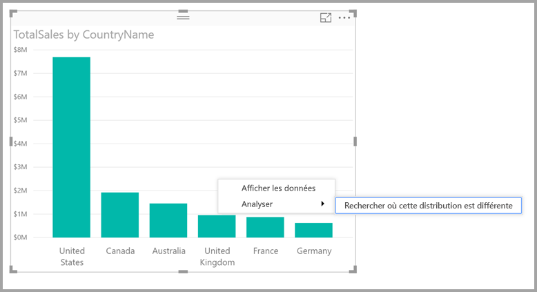

# Appliquer des insights dans Power BI Desktop pour rechercher où les distributions sont différentes (préversion)

Quand vous examinez un point de données dans un visuel, vous vous demandez souvent si la répartition serait la même pour d’autres catégories. Grâce aux **insights** de **Power BI Desktop**, vous pouvez obtenir la réponse en quelques clics.

Penchons-nous sur le visuel suivant, qui présente le total des ventes (*Total Sales*) par pays (*Country*). Comme le montre le graphique, la plupart des ventes sont réalisées aux États-Unis, qui représentent 57 % des ventes totales, la part des autres pays étant plus faible. En pareil cas, il est souvent intéressant de savoir si cette répartition serait identique pour des sous-populations différentes. Par exemple, le résultat est-il le même pour toutes les années, tous les canaux de vente et toutes les catégories de produits ?  Même s’il est possible d’appliquer des filtres différents et de comparer les résultats visuellement, cette opération s’avère fastidieuse et sujette à des erreurs. 

Vous pouvez demander à **Power BI Desktop** de localiser les différences de répartition et obtenir une analyse automatique, rapide et révélatrice de vos données. Cliquez simplement avec le bouton droit sur un point de données, puis sélectionnez **Analyser > Localiser les différences de répartition**. Vous obtenez alors des insights dans une fenêtre simple d’utilisation.

Dans cet exemple, l’analyse automatisée montre rapidement que pour la catégorie *Touring Bikes* (Vélos de cyclotourisme), la proportion de ventes réalisées aux États-Unis et au Canada est inférieure à celle observée dans les autres pays.   

> [!NOTE]
> Cette fonctionnalité étant en préversion, elle est sujette à modification. La fonctionnalité permettant d’obtenir des informations est activée par défaut (vous n’avez pas besoin de cliquer sur une zone d’aperçu pour l’activer) à partir de la version de septembre 2017 de **Power BI Desktop**.
> 
> 

## Utilisation des informations
Pour utiliser les insights de façon à localiser les différences de répartition dans les graphiques, cliquez simplement avec le bouton droit sur un point de données (ou sur le visuel dans sa globalité), puis sélectionnez **Analyser > Localiser les différences de répartition**.

**Power BI Desktop** exécute alors ses algorithmes de Machine Learning sur les données, puis insère dans une fenêtre un visuel et une description des catégories (colonnes) et des valeurs qui entraînent une différence de répartition la plus significative. Les insights sont fournis sous forme d’histogramme, comme le montre l’image suivante. 

Les valeurs auxquelles le filtre sélectionné est appliqué s’affichent dans la couleur par défaut normale. Les valeurs globales, telles qu’elles sont représentées dans le visuel initial, sont affichées en gris pour faciliter la comparaison. Il est possible d’appliquer jusqu’à trois filtres différents (en l’occurrence, *Touring Bikes* (Vélos de cyclotourisme), *Mountain Bikes* (VTT), *Road Bikes* (Vélos de route)). Pour choisir des filtres différents, il suffit de cliquer dessus (ou d’utiliser la combinaison ctrl-clic pour en sélectionner plusieurs).

Pour les mesures additives simples, comme *Total Sales* (Total des ventes) dans cet exemple, la comparaison s’effectue à partir de valeurs relatives, et non absolues. Par conséquent, même si les ventes de vélos de cyclotourisme sont plus faibles que les ventes globales qui concernent toutes les catégories, par défaut, le visuel utilise un axe double pour permettre à l’utilisateur de comparer la proportion des ventes dans les différents pays, pour la catégorie Touring Bikes par rapport à toutes les catégories de vélos.  En actionnant le bouton bascule situé au bas du visuel, vous pouvez afficher les deux valeurs sur le même axe, ce qui vous permet de comparer facilement les valeurs absolues (comme le montre l’image suivante).    

Le texte descriptif donne aussi des indications sur le niveau d’importance qui peut être lié à une valeur de filtre, selon le nombre d’enregistrements qui correspondent au filtre. Ainsi, dans cet exemple, même si la répartition pour la catégorie *Touring Bikes* (Vélos de cyclotourisme) est nettement différente, celle-ci représente seulement 16,6 % des enregistrements.

Les icônes de *pouce levé* et de *pouce baissé* en haut de la page vous permettent de commenter le visuel et la fonctionnalité. En procédant ainsi, vous communiquez des commentaires, mais vous ne formez pas l’algorithme pour influencer les résultats qui seront retournés la prochaine fois que vous utiliserez la fonctionnalité.

Et surtout, le bouton **+** en haut d’un visuel vous permet d’ajouter le visuel sélectionné à votre rapport, exactement comme si vous créiez le visuel manuellement. Vous pouvez ensuite mettre en forme ou ajuster autrement le visuel ajouté, comme vous le feriez pour tout autre visuel figurant sur votre rapport. Lorsque vous modifiez un rapport dans **Power BI Desktop**, vous ne pouvez ajouter qu’un seul visuel d’information sélectionné.

Vous pouvez utiliser cette fonctionnalité d’affichage d’informations lorsque votre rapport est en mode de lecture ou de modification. La fonctionnalité est donc polyvalente pour l’analyse de données et la création de visuels que vous pouvez aisément ajouter à vos rapports.

## Détails des résultats retournés
Voici comment fonctionne l’algorithme : après avoir pris toutes les autres colonnes du modèle, il applique toutes les valeurs de ces colonnes en guise de filtres au visuel d’origine et identifie les valeurs de filtre qui produisent le résultat le plus *différent* de l’original.

Vous vous demandez probablement ce que l’on entend par *différent*. Par exemple, supposons que la répartition globale des ventes entre les États-Unis et le Canada était la suivante :

|Pays  |Ventes (en millions de dollars)|
|---------|----------|
|États-Unis      |15        |
|Canada   |5         |

Ensuite, pour une catégorie de produit déterminée (*Road Bikes*) (Vélos de route), les ventes pouvaient être réparties comme suit :

|Pays  |Ventes (en millions de dollars)|
|---------|----------|
|États-Unis      |3        |
|Canada   |1         |

Même si les chiffres sont différents dans chacun de ces tableaux, les valeurs relatives entre les États-Unis et le Canada sont identiques (75 % et 25 % pour les ventes globales et de vélos de route). De ce fait, elles ne sont pas considérées comme étant différentes. Pour des mesures additives simples comme celles-ci, l’algorithme recherche donc des différences dans les valeurs *relatives*.  

Maintenant, penchons-nous sur un autre type de mesure : la marge, qui est calculée en tant que Bénéfice/Coût. Supposons que les marges globales pour les États-Unis et le Canada étaient les suivantes :

|Pays  |Marge (%)|
|---------|----------|
|États-Unis      |15        |
|Canada   |5         |

Ensuite, pour une catégorie de produit déterminée (*Road Bikes*) (Vélos de route), les ventes pouvaient être réparties comme suit :

|Pays  |Marge (%)|
|---------|----------|
|États-Unis      |3        |
|Canada   |1         |

Compte tenu de la nature de ces mesures, elles *sont* considérés comme étant différentes et donc intéressantes. Par conséquent, pour les mesures non additives telles que cet exemple de marge, l’algorithme recherche des différences dans la valeur absolue.

Les visuels affichés ont donc pour but de mettre en évidence les différences trouvées entre la répartition globale (telle que présentée dans le visuel d’origine) et la valeur après application du filtre spécifique.  

Ainsi, pour les mesures additives, telles que les ventes (*Sales*) dans l’exemple précédent, un histogramme et un graphique en courbes sont utilisés, de même qu’un double axe et une mise à l’échelle appropriée pour faciliter la comparaison des valeurs relatives. Les colonnes présentent la valeur avec le filtre appliqué, tandis que la ligne présente la valeur globale (l’axe des colonnes étant situé à gauche et l’axe des lignes étant situé à droite, comme à l’habitude). La ligne s’affiche avec un style *en escalier*, avec une ligne en pointillés, remplie de gris. Pour l’exemple précédent, si la valeur maximale de l’axe des colonnes est 4 et que la valeur maximale de l’axe des lignes est 20, les valeurs relatives entre les États-Unis et le Canada sont faciles à comparer pour les valeurs filtrées et les valeurs globales. 

De la même façon, pour les mesures non additives comme la marge (*Margin*) dans l’exemple précédent, un histogramme et un graphique en courbes sont utilisés, de même qu’un axe unique, ce qui signifie que les valeurs absolues peuvent être facilement comparées. Là encore, la ligne (remplie de gris) présente la valeur globale. Qu’il s’agisse de comparer des valeurs réelles ou des valeurs relatives, il ne suffit pas de calculer la différence entre les valeurs pour déterminer le degré de différence entre deux répartitions. Par exemple :

* La taille de la population est prise en compte, car une différence est statistiquement moins significative et moins intéressante quand elle s’applique à une faible proportion de la population globale. De ce fait, si la répartition des ventes entre les pays est très différente pour un produit donné, il ne s’agit pas d’un élément intéressant s’il existait plusieurs milliers de produits, car ce produit ne représente qu’un faible pourcentage des ventes globales.

* Les différences concernant les catégories dont les valeurs d’origine étaient très élevées ou proches de zéro ont plus de poids que les autres. Par exemple, si la part globale des ventes dans un pays se limite à 1 %, mais que la part pour un certain type de produit est de 6 %, il s’agit d’un élément statistiquement plus significatif et donc considéré comme plus intéressant qu’un pays dont la part est passée de 50 % à 55 %. 

* Plusieurs méthodes heuristiques sont utilisées pour sélectionner les résultats les plus significatifs, par exemple en prenant en considération d’autres relations entre les données.
     
Après examen des différentes colonnes et des valeurs de chacune de ces colonnes, c’est l’ensemble de valeurs qui présentent les plus grandes différences qui est choisi. Pour faciliter la compréhension, ces valeurs sont regroupées par colonne, la colonne dont les valeurs présentent la plus grande différence étant répertoriée en premier. Chaque colonne contient au maximum trois valeurs, mais peut en présenter moins si le nombre de valeurs ayant un effet important est moindre ou si certaines valeurs ont beaucoup plus d’impact que d’autres. 

Toutes les colonnes du modèle n’étant pas nécessairement examinées pendant la période disponible, il n’est pas garanti que les colonnes et les valeurs ayant le plus fort impact soient affichées. Cependant, diverses méthodes heuristiques sont utilisées pour faire en sorte que les meilleurs candidats parmi les colonnes soient examinés en premier. Par exemple, supposons qu’après examen de toutes les colonnes, il est établi que les colonnes/valeurs suivantes ont le plus fort impact sur la répartition (ordre décroissant) :

    Subcategory = Touring Bikes
    Channel = Direct
    Subcategory = Mountain Bikes
    Subcategory = Road Bikes
    Subcategory = Kids Bikes
    Channel = Store

La sortie obtenue en fonction de l’ordre des colonnes est la suivante :

    Subcategory: Touring Bikes, Mountain Bikes, Road Bikes (only three listed, with the text including “...amongst others” to indicate that more than three have a significant impact) 

    Channel = Direct (only Direct listed, if it’s level of impact was much greater than Store)

## Considérations et limitations
La liste suivante répertorie les scénarios actuellement non pris en charge pour la fonctionnalités d’affichage d’**informations** :

* Filtres TopN
* Filtres de mesures
* Mesures non numériques
* Utilisation de « Afficher la valeur comme »
* Mesures filtrées (les mesures filtrées sont des calculs effectués au niveau du visuel auxquels est appliqué un filtre spécifique (par exemple, *Total des ventes pour la France*) ; elles sont utilisées dans certains visuels créés par la fonctionnalité d’insights.

De plus, les sources de données et les types de modèles suivants ne sont actuellement pas pris en charge pour la fonctionnalité d’affichage d’informations :

* DirectQuery
* Live Connect
* Reporting Services en local
* Incorporation

## Étapes suivantes
Pour plus d’informations sur **Power BI Desktop** et la prise en main de cette solution, voir les articles suivants.

* [Qu’est-ce que Power BI Desktop ?](desktop-what-is-desktop.md)
* [Présentation des requêtes dans Power BI Desktop](desktop-query-overview.md)
* [Sources de données dans Power BI Desktop](desktop-data-sources.md)
* [Se connecter aux données dans Power BI Desktop](desktop-connect-to-data.md)
* [Mettre en forme et combiner des données dans Power BI Desktop](desktop-shape-and-combine-data.md)
* [Tâches courantes relatives aux requêtes dans Power BI Desktop](desktop-common-query-tasks.md)   

