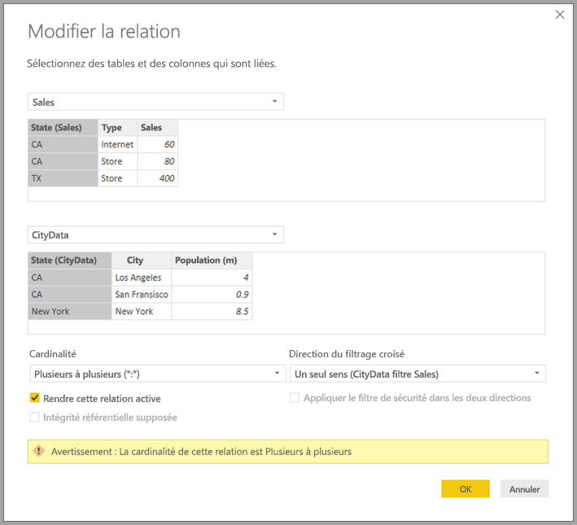

# Relations plusieurs à plusieurs dans Power BI Desktop (préversion)

Avec la fonctionnalité *Relations plusieurs à plusieurs* dans Power BI Desktop, vous pouvez joindre des tables qui utilisent une cardinalité *Plusieurs à plusieurs*. Vous pouvez créer plus facilement et intuitivement des modèles de données qui contiennent deux ou plusieurs sources de données. La fonctionnalité *Relations plusieurs à plusieurs* fait partie des capacités plus étendues des *modèles composites* dans Power BI Desktop.

La fonctionnalité *Relations plusieurs à plusieurs* dans Power BI Desktop est une des trois fonctionnalités connexes :

* **Modèles composites** : permet à un rapport d’avoir deux connexions de données ou plus, y compris des connexions provenant de DirectQuery ou d’une importation, dans toutes les combinaisons. Pour plus d’informations, consultez [Modèles composites dans Power BI Desktop (préversion)](desktop-composite-models.md).

* **Relations plusieurs à plusieurs** : avec les *modèles composites*, vous pouvez établir des *relations plusieurs à plusieurs* entre les tables. Cette approche supprime la nécessité d’avoir des valeurs uniques dans les tables. Les solutions de contournement précédentes, comme la présentation de nouvelles tables uniquement pour établir des relations, sont également supprimées. La fonctionnalité est décrite en détail dans cet article.

* **Mode de stockage** : vous pouvez désormais spécifier les visuels qui nécessitent une requête sur les sources de données back-end. Les visuels qui ne nécessitent pas une requête sont importés même s’ils sont basés sur DirectQuery. Cette fonctionnalité permet d’améliorer les performances et de réduire la charge du back-end. Avant, même de simples visuels, comme les segments, démarraient des requêtes qui étaient envoyées à des sources back-end. Pour plus d’informations, consultez [Mode de stockage dans Power BI Desktop (préversion)](desktop-storage-mode.md).

## Activer la fonctionnalité en préversion *Relations plusieurs à plusieurs*

La fonctionnalité *Relations plusieurs à plusieurs* doit être activée dans Power BI Desktop. Pour activer les modèles composites, sélectionnez **Fichier** > **Options et paramètres** > **Options** > **Fonctionnalités en préversion**, puis cochez la case **Modèles composites**.

Pour activer la fonctionnalité, vous devez redémarrer Power BI Desktop.

## Ce que résolvent les *relations plusieurs à plusieurs*

Avant que la fonctionnalité *Relations plusieurs à plusieurs* ne soit disponible, la relation entre deux tables était définie dans Power BI. Au moins une des colonnes de table impliquées dans la relation devait contenir des valeurs uniques. Souvent, cependant, aucune colonne ne contenait de valeurs uniques. 

Par exemple, deux tables pouvaient avoir une colonne étiquetée *pays*, mais les valeurs de *pays* n’étaient pas uniques dans les tables. Pour joindre ces tables, il était nécessaire de créer une solution de contournement. Celle-ci pouvait consister à introduire dans le modèle des tables supplémentaires contenant les valeurs uniques nécessaires. Avec la fonctionnalité *Relations plusieurs à plusieurs*, vous pouvez joindre ces tables directement à l’aide d’une relation avec une cardinalité **Plusieurs à plusieurs**.  

## Utiliser des *relations plusieurs à plusieurs*

Quand vous définissez une relation entre deux tables dans Power BI, vous devez définir la cardinalité de la relation. Par exemple, la relation entre *ProductSales* et *Product*&mdash;à l’aide des colonnes *ProductSales[ProductCode]* et *Product[ProductCode]*&mdash;serait définie en tant que relation *Plusieurs à 1*. Nous définissons la relation de cette façon, car il existe de nombreuses ventes de chaque produit et la colonne de la table *Product* *(ProductCode)* est unique. Quand vous définissez une cardinalité de relation de type *Plusieurs à 1*, *1 à plusieurs*, ou *1 à 1*, Power BI la valide pour s’assurer qu’elle correspond aux données réelles.

Par exemple, examinons le modèle simple dans l’image suivante :

Imaginons maintenant que la table *Product* affiche seulement deux lignes, comme suit :

Imaginez également que la table *Sales* a seulement quatre lignes, dont une ligne pour un produit C. En raison d’une erreur d’intégrité référentielle, le produit C n’existe pas dans la table *Product*.

Les colonnes *ProductName* et *Price* (à partir de la table *Product*), ainsi que la quantité (*Qty*) totale pour chaque produit (à partir de la table *ProductSales*) se présenteraient comme suit : 

Comme vous pouvez le voir dans l’image précédente, il existe une ligne *ProductName* vide qui est associée aux ventes du produit C. Cette ligne vide tient compte des éléments suivants :

* Toutes les lignes de la table *ProductSales* pour lesquelles aucune ligne correspondante n’existe dans la table *Product*. Il existe un problème d’intégrité référentielle, comme nous le voyons pour le produit *C* dans cet exemple.

* Toutes les lignes de la table *ProductSales* pour lesquelles la colonne clé étrangère est Null. 

Pour ces raisons, la ligne vide dans les deux cas tient compte des ventes où *ProductName* et *Price* sont inconnus.

Il arrive parfois que les tables soient jointes par deux colonnes, mais qu’aucune colonne ne soit unique. Par exemple, considérez les deux tables suivantes :

* La table *Sales* affiche les données de ventes par État (*State*), chaque ligne contenant le montant des ventes pour le type de vente dans l’État concerné. Les États incluent CA, WA et TX. 

    

* La table *CityData* affiche des données sur les villes, y compris la population et l’État (dont les États de CA, de WA et de New York).

    

Bien qu’il existe une colonne *State* dans les deux tables et qu’il soit raisonnable de créer des rapports sur le total des ventes par État et population totale de chaque État, il y a un problème : la colonne *State* n’est unique dans aucune des tables. 

## Solution de contournement précédente

Dans les versions de Power BI Desktop antérieures à la version de juillet 2018, les utilisateurs ne pouvaient pas créer de relation directe entre ces tables. Une solution de contournement courante consistait à effectuer les opérations suivantes :

* Créer une troisième table contenant uniquement les ID d’*État* uniques. La table pouvait être :
  * Une table calculée (définie à l’aide du langage DAX [Data Analysis Expressions]).
  * Une table basée sur une requête définie dans l’Éditeur de requête, qui pouvait afficher les ID uniques provenant d’une des tables.
  * L’ensemble combiné.

* Lier les deux tables d’origine à cette nouvelle table, à l’aide de relations *Plusieurs à 1* classiques.

Vous pouviez laisser la table de la solution de contournement visible ou la masquer afin qu’elle n’apparaisse pas dans la liste **Champs**. Si vous masquiez la table, la relation *plusieurs à 1* était généralement définie pour filtrer dans les deux directions et vous pouviez utiliser le champ *State* d’une des deux tables. Le filtrage croisé qui s’ensuivait assurait la propagation à l’autre table. Cette approche est illustrée dans l’image suivante :

Un visuel affichant le champ *State* (État) (à partir de la table *CityData*), ainsi que la *Population* totale et les ventes (*Sales*) totales ressemblerait alors à ce qui suit :

> [!NOTE]
> Étant donné que l’État issu de la table *CityData* est utilisé dans cette solution de contournement, seuls les États de cette table sont répertoriés, ce qui explique l’exclusion de TX. De plus, contrairement aux relations *Plusieurs à 1*, alors que la ligne totale inclut toutes les *ventes* (y compris celles du TX), les détails n’incluent pas de ligne vide couvrant les lignes qui ne correspondent pas. De même, il n’y aurait pas de ligne vide couvrant les ventes (*Sales*) pour lesquelles il y a une valeur Null pour l’État (*State*).

Si vous ajoutez également *City* à ce visuel, bien que la population par ville (*City*) soit connue, les ventes (*Sales*) indiquées pour *City* reprennent les ventes (*Sales*) pour l’État (*State*) correspondant. C’est normalement le cas quand le regroupement dans une colonne n’est pas lié à une mesure d’agrégation, comme illustré dans l’image suivante :

Si nous définissons la nouvelle table *Sales* en tant que combinaison de tous les *États* dans cette solution de contournement et que nous la rendons visible dans la liste **Champs**, le même visuel afficherait *State* (État) (sur la nouvelle table), ainsi que la *Population* totale et les ventes (*Sales*) totales, comme illustré dans l’image suivante :

Comme vous pouvez le voir, *TX*&mdash;avec données *Sales*, mais données *Population* inconnues&mdash;et *New York*&mdash; avec données *Population* connues, mais aucune donnée *Sales* connue&mdash;seraient inclus. Cette solution de contournement n’est pas optimale et présente plusieurs problèmes. Avec la création de relations plusieurs à plusieurs, ces problèmes sont résolus, comme décrit dans la section suivante.

## Utiliser des *relations plusieurs à plusieurs* au lieu de la solution de contournement

À compter de la version de juillet 2018 de Power BI Desktop, vous pouvez lier des tables directement, telles que celles que nous avons décrites précédemment, sans devoir recourir à des solutions de contournement similaires. Il est désormais possible de définir la cardinalité de la relation sur *Plusieurs à plusieurs*. Ce paramètre indique qu’aucune table ne contient de valeurs uniques. Pour ce type de relation, vous pouvez toujours contrôler quelle table filtre l’autre table, ou appliquer un filtrage bidirectionnel où chaque table filtre l’autre.  

> [!NOTE]
> La possibilité de créer des *relations plusieurs à plusieurs* est disponible en préversion. Tant qu’il en est ainsi, il n’est pas possible de publier sur le service Power BI des modèles qui utilisent des *relations plusieurs à plusieurs*. 

Dans Power BI Desktop, la cardinalité par défaut est *Plusieurs à plusieurs* quand elle est détermine qu’aucune table ne contient de valeurs uniques pour les colonnes de la relation. Dans ces cas-là, un avertissement s’affiche pour confirmer que le paramètre de la relation est votre comportement prévu, et non l’effet non intentionnel d’un problème de données. 

Par exemple, quand vous créez une relation directe entre *CityData* et *Sales*&mdash;où les filtres devraient aller de *CityData* à *Sales*&mdash;Power BI Desktop affiche la fenêtre **Modifier la relation**, comme l’illustre l’image suivante :

La vue **Relation** résultante montrerait alors la relation directe plusieurs à plusieurs entre les deux tables. L’aspect des tables dans la liste **Champs** et leur comportement ultérieur à la création des visuels sont similaires à ceux observables pendant l’application de la solution de contournement. Dans la solution de contournement, la table supplémentaire qui affiche les données des différents États (*State*) n’est pas rendue visible. Par exemple, comme décrit dans la section précédente, un visuel montrant les données *State*, *Population* et *Sales* s’afficherait comme suit :

Les principales différences entre des *relations plusieurs à plusieurs* et les relations plus courantes *Plusieurs à 1* sont les suivantes :

* Les valeurs indiquées n’incluent pas de ligne vide tenant compte des lignes qui ne correspondent pas dans l’autre table. Les valeurs ne tiennent pas non plus compte des lignes dans lesquelles la colonne utilisée dans la relation dans l’autre table est Null.
* Il n’est pas possible d’utiliser la fonction `RELATED()`, car plusieurs lignes pourraient être liées.
* L’utilisation de la fonction `ALL()` sur une table ne supprime pas les filtres qui sont appliqués à d’autres tables reliées par une relation plusieurs à plusieurs. Dans l’exemple précédent, une mesure définie comme illustré dans le script suivant ne supprimerait pas de filtres de colonnes dans la table *CityData* reliée :

    

    Un visuel montrant les donnes *State*, *Sales* et *Sales total* ressemblerait à ce qui suit :

    

En tenant compte des différences indiquées plus haut, assurez-vous que les calculs qui utilisent `ALL(\<Table>)`, tels que *% du total général*, retournent les résultats prévus. 

## Considérations et limitations

Il existe quelques limitations pour cette version de *relations plusieurs à plusieurs* et de modèles composites.

Les sources (multidimensionnelles) Live Connect suivantes ne peuvent pas être utilisées avec les modèles composites :

* SAP HANA
* SAP Business Warehouse
* SQL Server Analysis Services
* Jeux de données Power BI
* Azure Analysis Services

Quand vous vous connectez à ces sources multidimensionnelles à l’aide de DirectQuery, vous ne pouvez pas vous connecter à une autre source DirectQuery ou la combiner avec des données importées.

Les limitations existantes concernant l’utilisation de DirectQuery s’appliquent quand vous utilisez des *relations plusieurs à plusieurs*. Plusieurs de ces limitations sont désormais appliquées par table, selon le mode de stockage de la table. Par exemple, une colonne calculée d’une table importée peut faire référence à d’autres tables, mais une colonne calculée d’une table DirectQuery ne peut faire référence qu’à des colonnes de la même table. D’autres limitations s’appliquent au modèle dans son ensemble si aucune des tables du modèle n’est de type DirectQuery. Par exemple, les fonctionnalités QuickInsights et Questions et réponses ne sont pas disponibles sur un modèle si une des tables qu’il contient présente un mode de stockage de type DirectQuery. 

## Étapes suivantes

Pour plus d’informations sur les modèles composites et DirectQuery, consultez les articles suivants :
* [Modèles composites dans Power BI Desktop (préversion)](desktop-composite-models.md)
* [Mode de stockage dans Power BI Desktop (préversion)](desktop-storage-mode.md)
* [Utiliser DirectQuery dans Power BI Desktop](desktop-directquery-about.md)
* [Sources de données prises en charge par DirectQuery dans Power BI Desktop](desktop-directquery-data-sources.md)
