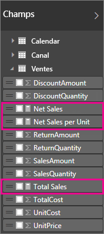
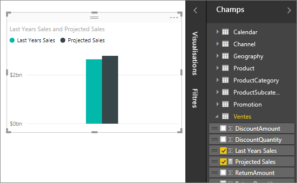

# Mesures dans Power BI Desktop

**Power BI Desktop** vous aide à créer des analyses de vos données en quelques clics seulement. Mais parfois, ces données n’incluent pas tout ce dont vous avez besoin pour répondre à certaines de vos questions les plus importantes. Les mesures peuvent vous y aider.

Les mesures sont utilisées dans certaines des analyses de données les plus courantes. Par exemple, les sommes, les moyennes, les valeurs minimales ou maximales, les comptages ou des calculs plus avancés que vous créez vous-même avec une formule DAX. Les résultats calculés des mesures changent toujours en réponse à votre interaction avec vos rapports, favorisant ainsi l’exploration rapide et dynamique des données appropriées. Examinons cela de plus près.

## Présentation des mesures

Dans **Power BI Desktop**, les mesures sont créées et utilisées dans la **vue Rapport** ou dans la **vue Données**. Les mesures que vous créez vous-même apparaissent dans la liste Champs avec une icône de calculatrice. Vous pouvez nommer les mesures comme vous le souhaitez et les ajouter à une visualisation nouvelle ou existante comme tout autre champ.

> [!NOTE]
> Les **mesures rapides** peuvent également vous intéresser. Il s’agit de mesures prédéfinies que vous pouvez sélectionner à partir de boîtes de dialogue. C’est un bon moyen de créer rapidement des mesures et également d’apprendre la syntaxe DAX, car les formules DAX créées automatiquement sont disponibles pour révision. Consultez l’article : [Mesures rapides](desktop-quick-measures.md).
> 
> 

## Langage DAX (Data Analysis Expressions)

Les mesures calculent un résultat à partir d’une formule d’expression. Vous utilisez le langage de formule DAX ([Data Analysis Expressions](https://msdn.microsoft.com/library/gg413422.aspx)) pour créer vos propres mesures. DAX inclut une bibliothèque de plus de 200 fonctions, opérateurs et constructions. Sa bibliothèque offre ainsi une flexibilité considérable pour créer des mesures afin d’effectuer les calculs nécessaires pour quasiment tout type d’analyse de données.

Les formules DAX sont similaires aux formules Excel. DAX a même de nombreuses fonctions identiques à celles d’Excel, comme DATE, SUM (SOMME) et LEFT (GAUCHE). Toutefois, les fonctions DAX sont censées fonctionner avec des données relationnelles, comme celles figurant dans Power BI Desktop.

## Examinons un exemple.
Diane est responsable des ventes chez Contoso. Elle a été chargée de fournir les prévisions de ventes des revendeurs au cours du prochain exercice. Diane décide de baser ses estimations sur les montants des ventes de l’année précédente, en appliquant une augmentation annuelle de 6 % résultant des différentes promotions planifiées au cours des six prochains mois.

Pour communiquer ces estimations, Diane importe les données des ventes de l’année précédente dans Power BI Desktop. Elle trouve le champ SalesAmount dans la table Reseller Sales (Ventes des revendeurs). Comme les données importées contiennent seulement les montants des ventes de l’année précédente, Diane renomme le champ SalesAmount (Ventes) en Last Years Sales (Ventes de l’année précédente). Diane fait ensuite glisser le champ Last Years Sales sur le canevas du rapport. Il apparaît dans une visualisation de graphique en tant que valeur unique correspondant à la somme de toutes les ventes des revendeurs réalisées l’année précédente.

Diane remarque que même si elle n’a pas spécifié de calcul elle-même, un calcul a été fourni automatiquement. Power BI Desktop a créé sa propre mesure en cumulant toutes les valeurs du champ Last Years Sales.

Toutefois, Diane a besoin d’une mesure pour calculer les prévisions de ventes pour l’année à venir, qui sont basées sur les ventes de l’année précédente multipliées par 1,06 pour tenir compte de la hausse de 6 % attendue de l’activité. Pour ce calcul, elle crée sa propre mesure. Elle utilise la fonctionnalité Nouvelle mesure pour créer une nouvelle mesure, puis entre la formule DAX suivante :

    Projected Sales = SUM('Sales'[Last Years Sales])*1.06

Ensuite, Diane fait glisser sa nouvelle mesure Projected Sales (Ventes prévues) dans le graphique.

Rapidement et avec un minimum d’efforts, Diane a obtenu une mesure pour calculer les ventes prévues. Diane peut aller plus loin dans l’analyse de ses prévisions en filtrant sur des revendeurs spécifiques ou en ajoutant d’autres champs à son rapport.

## Catégories de données pour les mesures

Vous pouvez également choisir des catégories de données pour les mesures. 

Entre autres choses, cela vous permet d’utiliser des mesures pour créer dynamiquement des URL et de marquer la catégorie de données comme URL web. 

Vous pouvez créer des tableaux qui affichent les mesures comme URL web, puis cliquer sur l’URL qui est créée en fonction de votre sélection. C’est particulièrement utile quand vous voulez créer un lien vers d’autres rapports Power BI avec [des paramètres de filtre d’URL](service-url-filters.md).

## En savoir plus
Nous vous avons présenté ici une brève introduction aux mesures, mais de nombreuses informations complémentaire pourront vous aider à apprendre à créer vos propres mesures. Veillez à consulter le [Tutoriel : Création de mesures personnalisées dans Power BI Desktop](desktop-tutorial-create-measures.md), où vous pourrez télécharger un exemple de fichier et bénéficier de leçons pas à pas sur la création de mesures supplémentaires.  

Pour approfondir un peu plus votre connaissance du langage DAX, veillez à consulter [Principes fondamentaux de DAX dans Power BI Desktop](desktop-quickstart-learn-dax-basics.md). La page [Informations de référence sur DAX (Data Analysis Expressions)](https://msdn.microsoft.com/library/gg413422.aspx) propose des articles détaillés sur chaque fonction, syntaxe, opérateur et convention d’affectation de noms. DAX est présent depuis déjà plusieurs années dans Power Pivot dans Excel et dans SQL Server Analysis Services : de nombreuses autres ressources utiles sont donc disponibles. Veillez à consulter [DAX Resource Center Wiki](http://social.technet.microsoft.com/wiki/contents/articles/1088.dax-resource-center.aspx), où des membres influents de la communauté BI partagent leurs connaissances sur DAX.

