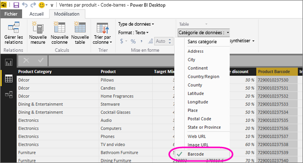

# Identifier des codes-barres dans Power BI Desktop pour les applications mobiles
Dans Power BI Desktop, vous pouvez [catégoriser les données](desktop-data-categorization.md) dans une colonne pour que Power BI Desktop sache comment traiter les valeurs dans les éléments visuels du rapport. Vous pouvez également classer une colonne comme **Code-barres**. Lorsque vous ou vos collègues [utilisez un code-barres sur un produit avec l’application Power BI](mobile-apps-scan-barcode-iphone.md) sur l’iPhone, vous avez accès à tous les rapports qui incluent ce code-barres. Lorsque vous ouvrez le rapport dans l’application mobile, Power BI le filtre automatiquement pour afficher les données liées à ce code-barres.

1. Dans Power BI Desktop, passez dans la vue Données.
2. Sélectionnez une colonne avec des données de code-barres. Consultez la liste des [formats de code-barres pris en charge](#supported-barcode-formats) ci-dessous.
3. Dans l’onglet **Modélisation**, sélectionnez **Catégorie de données** > **Code-barres**.
   
    
4. Dans la vue Rapport, ajoutez ce champ aux éléments visuels à filtrer par le code-barres.
5. Enregistrez le rapport et publiez-le sur le service Power BI.

Maintenant lorsque vous ouvrez le scanner dans l’[application Power BI pour iPhone](mobile-iphone-app-get-started.md) et que vous scannez un code-barres, vous voyez ce rapport dans la liste des rapports. Lorsque vous ouvrez le rapport, ses éléments visuels sont filtrés en fonction du code-barres produit que vous avez utilisé.

## Formats de code-barres pris en charge
Voici les codes-barres que Power BI reconnaît si vous les identifiez dans un rapport Power BI : 

* UPCECode 
* Code39Code  
* A39Mod43Code 
* EAN13Code 
* EAN8Code  
* 93Code  
* 128Code 
* PDF417Code 
* Interleaved2of5Code 
* ITF14Code 

## Étapes suivantes
* [Scannez un code-barres depuis l’application Power BI sur votre iPhone](mobile-apps-scan-barcode-iphone.md)
* [Problèmes avec les codes-barres sur un iPhone](mobile-apps-scan-barcode-iphone.md#issues-with-scanning-a-barcode)
* [Catégorisation des données dans Power BI Desktop](desktop-data-categorization.md)  
* Vous avez des questions ? [Essayez d’interroger la communauté Power BI](http://community.powerbi.com/)

