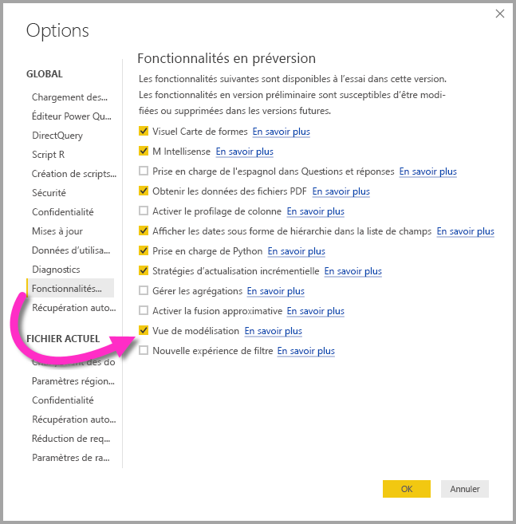
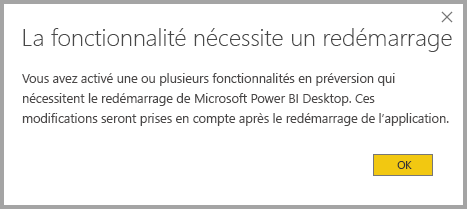

# Affichage Modélisation dans Power BI Desktop (préversion)

**L’affichage Modélisation** de **Power BI Desktop** permet d’afficher et d’utiliser des jeux de données complexes qui contiennent de nombreuses tables. Voici ses applications possibles :

## Activer la fonctionnalité d’évaluation Affichage Modélisation

La fonctionnalité Affichage Modélisation, en préversion, doit être activée dans **Power BI Desktop**. Pour cela, sélectionnez **Fichier > Options et paramètres > Options > Fonctionnalités d’évaluation**, puis cochez la case **Affichage Modélisation** comme dans l’illustration suivante.

Un message vous invitera à redémarrer **Power BI Desktop** pour activer la fonctionnalité d’évaluation. 

## Utiliser l’affichage Modélisation

Pour accéder à l’affichage Modélisation, sélectionnez l’icône Affichage Modélisation qui se trouve sur le côté gauche de **Power BI Desktop**, comme dans l’illustration suivante.

## Créer des diagrammes séparés

Avec l’affichage Modélisation, vous pouvez créer des diagrammes de votre modèle qui ne contiennent qu’un sous-ensemble des tables de votre modèle. Vous aurez ainsi une vision plus claire des tables que vous souhaitez utiliser et pourrez travailler plus facilement avec des jeux de données complexes. Pour créer un diagramme comportant seulement un sous-ensemble des tables, cliquez sur le signe **+** à côté de l’onglet **Toutes les tables**, en bas de la fenêtre Power BI Desktop.

Vous pouvez ensuite faire glisser une table de la ligne **Champs** à la surface du diagramme. Cliquez avec le bouton droit sur la table, puis sélectionnez **Ajouter des tables associées** dans le menu qui s’affiche.

Les tables liées à la table d’origine s’affichent alors dans le nouveau diagramme. L’illustration suivante montre comment apparaissent les tables associées lorsque l’option de menu **Ajouter des tables associées** est sélectionnée.

## Définir des propriétés communes

Pour sélectionner plusieurs objets à la fois dans l’affichage Modélisation, maintenez la touche **CTRL** enfoncée et cliquez sur plusieurs tables. Les tables sélectionnées sont mises en surbrillance dans l’affichage Modélisation. Les modifications effectuées dans le volet **Propriétés** s’appliquent à toutes les tables sélectionnées.

Supposons que vous souhaitiez modifier le [mode de stockage](desktop-storage-mode.md) de plusieurs tables dans votre affichage en diagrammes : maintenez la touche **CTRL** enfoncée, sélectionnez les tables, puis modifiez le paramètre du mode de stockage dans le volet **Propriétés**.

## Étapes suivantes

Les articles suivants décrivent plus en détail les modèles de données ainsi que le mode DirectQuery.

* [Agrégations dans Power BI Desktop (préversion)](desktop-aggregations.md)
* [Modèles composites dans Power BI Desktop (préversion)](desktop-composite-models.md)
* [Mode de stockage dans Power BI Desktop (préversion)](desktop-storage-mode.md)
* [Relations plusieurs-à-plusieurs dans Power BI Desktop (préversion)](desktop-many-to-many-relationships.md)

Articles DirectQuery :

* [Utilisation de DirectQuery dans Power BI](desktop-directquery-about.md)
* [Sources de données prises en charge par DirectQuery dans Power BI](desktop-directquery-data-sources.md)
