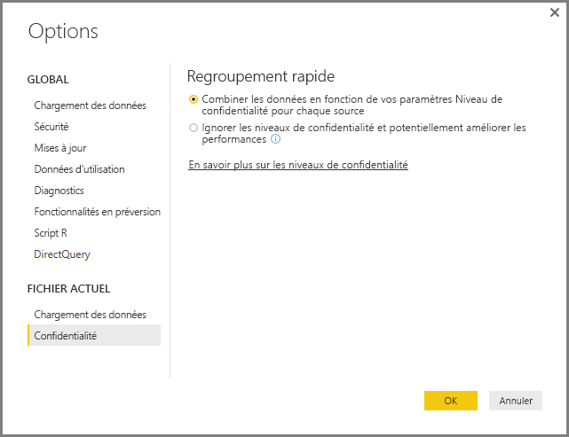

# Niveaux de confidentialité Power BI Desktop
Dans **Power BI Desktop**, les niveaux de confidentialité spécifient un niveau d’isolement qui définit le degré d’isolement d’une source de données par rapport aux autres sources de données. Bien qu'un niveau d'isolement restrictif empêche l’échange d’informations entre les sources de données, cela peut réduire les fonctionnalités et affecter les performances.

Le paramètre **Niveaux de confidentialité**, accessible via **Fichier > Options et paramètres > Options** puis **Fichier actuel > Confidentialité**, détermine si Power BI Desktop utilise vos paramètres de niveau de confidentialité pendant le regroupement de données. Cette boîte de dialogue inclut un lien vers la documentation de Power BI Desktop sur les niveaux de confidentialité (cet article).

## Configurer le niveau de confidentialité
Les niveaux de confidentialité vous permettent de spécifier un niveau d'isolement qui définit le degré d'isolement d'une source de données par rapport aux autres sources de données.

| Paramètre | Description | Exemple de sources de données |
| --- | --- | --- |
| **Source de données privées** |Une source de données **privée** contient des informations sensibles ou confidentielles. Sa visibilité peut être limitée aux utilisateurs autorisés. Une source de données privée est complètement isolée des autres sources de données. |Des données Facebook, un fichier texte contenant des primes sous forme d’actions, ou un classeur contenant des informations relatives à l’évaluation d’employés. |
| **Source de données professionnelle** |La visibilité d’une source de données **professionnelle** est limitée à un groupe d'utilisateurs approuvé. Une source de données **professionnelle** est isolée de toutes les autres sources de données **publiques**, mais est visible pour les autres sources de données **professionnelles**. |Un document **Microsoft Word** sur un site intranet SharePoint avec des autorisations activées pour un groupe approuvé. |
| **Source de données publique** |Une source de données **publique** offre une visibilité totale des données qu’elle contient à tous les utilisateurs. Seuls les fichiers, les sources de données Internet et les données de classeur peuvent être marqués comme **Publics**. |Des données libres provenant de la Place de marché Microsoft Azure, les données d'une page Wikipedia ou un fichier local contenant des données copiées à partir d'une page web publique. |

## Configurer les paramètres de niveau de confidentialité
La boîte de dialogue des paramètres **Confidentialité** se trouve, pour chaque source de données, sous **Fichier > Options et paramètres > Paramètres de source de données**.

Pour configurer le niveau de confidentialité d’une source de données, sélectionnez la source de données, puis sélectionnez **Modifier**. À partir de la boîte de dialogue **Paramètres de Source de données** qui s'affiche, vous pouvez sélectionner le niveau de confidentialité approprié dans le menu déroulant en bas de la boîte de dialogue, comme illustré dans l'image suivante.

> [!CAUTION]
> Vous devez configurer une source de données contenant des données très sensibles ou confidentielles en tant que source **privée**.
> 

## Configurer les niveaux de confidentialité
Le paramètre **Niveaux de confidentialité** est défini par défaut sur **Combiner les données en fonction de vos paramètres Niveau de confidentialité pour chaque source**, ce qui signifie que le paramètre **Niveaux de confidentialité** est appliqué.

| Paramètre | Description |
| --- | --- |
| **Regrouper les données en fonction de vos paramètres Niveau de confidentialité pour chaque source** (paramètre par défaut et activé) |Les paramètres de niveau de confidentialité permettent de déterminer le niveau d'isolation entre les sources de données lors de la combinaison de données. |
| **Ignorer les niveaux de confidentialité et potentiellement améliorer les performances** (désactivé) |Les niveaux de confidentialité ne sont pas pris en compte lors de la combinaison des données. Cependant, les performances et les fonctionnalités des données peuvent augmenter. |

> **Note de sécurité :** Sélectionner **Ignorer les niveaux de confidentialité et potentiellement améliorer les performances** dans la boîte de dialogue **Niveaux de confidentialité** risque d’exposer des données sensibles ou confidentielles à une personne non autorisée. Ne *désactivez pas* ce paramètre à moins d’être certain que la source de données ne contient pas de données sensibles ou confidentielles.
> 
> 

> [!CAUTION]
> L’option **Ignorer les niveaux de confidentialité et potentiellement améliorer les performances** ne fonctionne pas dans le service Power BI. Par conséquent, les rapports Power BI Desktop pour lesquels ce paramètre est activé et qui sont ensuite publiés sur le service Power BI ne reflètent *pas* ce comportement en cas d’utilisation dans le service.
> 

**Configurer les niveaux de confidentialité**

Dans Power BI Desktop ou dans l'Éditeur de requête, sélectionnez **Fichier > Options et paramètres > Options**, puis **Fichier actuel > Confidentialité**

a. Lorsque le paramètre **Combiner des données en fonction de vos paramètres Niveau de confidentialité pour chaque source** est sélectionné, les données seront combinées en fonction de votre définition des niveaux de confidentialité. La fusion de données entre des zones d'isolation de confidentialité peut entraîner une mise en mémoire tampon des données.

b. Lorsque le paramètre **Ignorer les niveaux de confidentialité et potentiellement améliorer les performances** est sélectionné, les données sont regroupées en ignorant les niveaux de confidentialité, ce qui pourrait révéler des données sensibles ou confidentielles à un utilisateur non autorisé. Ce paramètre peut améliorer les performances et les fonctionnalités.

> **Note de sécurité :** le fait de sélectionner le paramètre **Ignorer les niveaux de confidentialité et potentiellement améliorer les performances** peut améliorer les performances ; cependant, Power BI Desktop ne peut pas garantir la confidentialité des données fusionnées dans le fichier Power BI Desktop.
> 
> 

