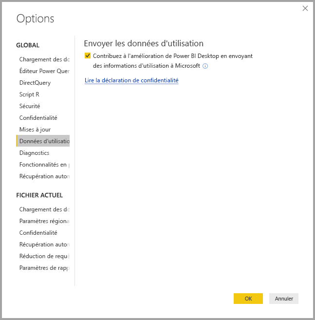

# Confidentialité de Power BI Desktop

Microsoft s’efforce de préserver la confidentialité de vos informations, tout en proposant des produits offrant les performances, la puissance et la commodité souhaitées. Microsoft recueille certaines informations sur votre utilisation de Power BI Desktop pour aider à diagnostiquer les problèmes et à améliorer le produit. Pour plus d’informations sur la politique de confidentialité de Microsoft, consultez la déclaration de confidentialité de Microsoft. Elle s’applique aux données que nous collectons sur votre utilisation de **Power BI Desktop**.
 
Les informations collectées auprès des utilisateurs de **Power BI Desktop** peuvent inclure des données sur le système d’exploitation, et des informations sur Power BI Desktop et sur les versions d’Internet Explorer. 
 
Si vous voulez refuser cette collecte de données, vous pouvez accéder à **Fichier > Options et paramètres > Options** et, sous l’onglet **Données d’utilisation**, décocher **Envoyer les données d’utilisation**, comme indiqué dans l’image suivante.

## Envoi d’informations supplémentaires

Si vous rencontrez des blocages ou d’autres problèmes, vous pouvez choisir d’envoyer des rapports d’erreurs et des informations supplémentaires, qui peuvent nous aider à résoudre le problème dans une version ultérieure. Nous collectons aussi des informations sur l’état du fichier **Power BI Desktop** que vous utilisez, comme les paramètres régionaux du document, les fonctionnalités en préversion qui sont activées et le mode de stockage. Cela peut inclure des captures d’écran, les messages d’erreur et les formules de votre modèle. Ces éléments peuvent comprendre le contenu des fichiers que vous utilisez quand une erreur s’est produite : vous devez donc les examiner avant de les envoyer. Nous vous rappelons avant l’envoi que vous pouvez choisir les informations qui sont envoyées à Microsoft.  
 
Si vous ne voulez pas envoyer ces informations, vous pouvez cliquer sur **Fermer** quand une erreur se produit, ou choisir ne pas envoyer les données d’utilisation, comme expliqué ci-dessus. 

