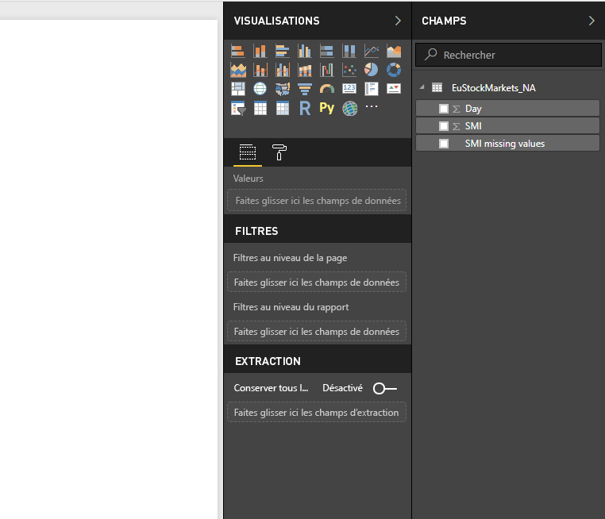
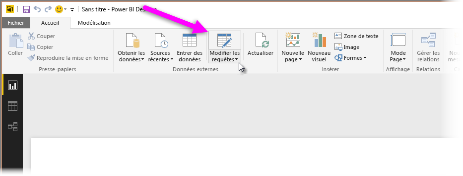
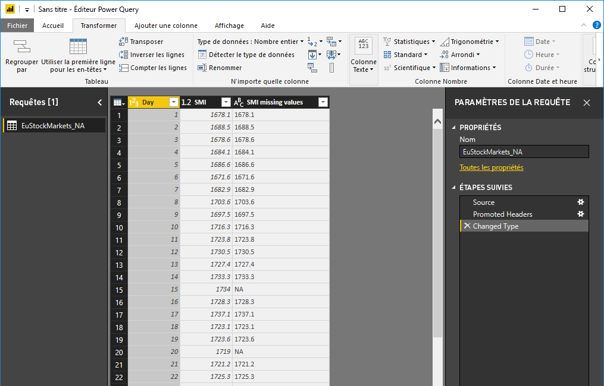
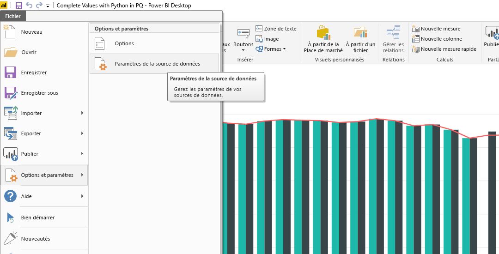

# <a name="using-python-in-query-editor"></a>Utilisation de Python dans l’Éditeur de requête
Vous pouvez utiliser **Python**, langage de programmation largement utilisé par les analystes de données, les scientifiques des données et les statisticiens, dans l’**Éditeur de requête** Power BI Desktop. Cette intégration de Python dans l’**Éditeur de requête** vous permet de procéder au nettoyage des données à l’aide de Python et d’effectuer une mise en forme et une analytique avancées des données des jeux de données, notamment la saisie de données manquantes, les prédictions et le clustering pour ne citer que quelques exemples. **Python** est un langage puissant qui peut être utilisé dans l’**Éditeur de requête** pour préparer votre modèle de données et créer des rapports.

## <a name="installing-python"></a>Installation de Python
Pour utiliser **Python** dans l’**Éditeur de requête** Power BI Desktop, vous devez installer **Python** sur votre ordinateur local. Vous pouvez télécharger et installer **Python** gratuitement à partir de nombreux emplacements, notamment de la [page de téléchargement officielle de Python](https://www.python.org/) et d’[Anaconda](https://anaconda.org/anaconda/python/).

## <a name="using-python-in-query-editor"></a>Utilisation de Python dans l’Éditeur de requête
Pour comprendre comment utiliser **Python** dans l’**Éditeur de requête**, prenez cet exemple qui provient d’un jeu de données boursières basé sur un fichier CSV ([téléchargeable ici](https://download.microsoft.com/download/F/8/A/F8AA9DC9-8545-4AAE-9305-27AD1D01DC03/EuStockMarkets_NA.csv)). Les étapes de cet exemple sont les suivantes :

1. Tout d’abord, entrez des données dans **Power BI Desktop**. Dans cet exemple, chargez le fichier *EuStockMarkets_NA.csv* et sélectionnez **Obtenir des données > CSV** dans le ruban **Accueil** de **Power BI Desktop**.
   
   
2. Sélectionnez le fichier et choisissez **Ouvrir**. Le fichier CSV s’affiche dans la boîte de dialogue **Fichier CSV**.
   
   
3. Une fois que les données sont chargées, elles s’affichent dans le volet **Champs** de Power BI Desktop.
   
   
4. Ouvrez l’**Éditeur de requête** en sélectionnant **Modifier les requêtes** dans le ruban **Accueil** de **Power BI Desktop**.
   
   
5. Sous l’onglet **Transformation**, sélectionnez **Exécuter un script Python**. L’éditeur **Exécuter un script Python** apparaît (voir l’étape suivante). Notez que les lignes 15 et 20 ont des données manquantes, comme les autres lignes qui ne figurent pas dans l’image suivante. Les étapes ci-dessous montrent comment Python peut compléter ces lignes pour vous.
   
   
6. Pour cet exemple, entrez le code de script suivant :
   
    ```python
       import pandas as pd
       completedData = dataset.fillna(method='backfill', inplace=False)
       dataset["completedValues"] =  completedData["SMI missing values"]
   ```

   > [!NOTE]
   > La bibliothèque *pandas* doit être installée dans votre environnement Python pour que le code de script précédent fonctionne correctement. Pour installer pandas, exécutez la commande suivante dans votre installation de Python : |      > pip install pandas
   > 
   > 
   
   Lorsqu’il est placé dans la boîte de dialogue **Exécuter un script Python**, le code ressemble à ce qui suit :
   
   
7. Une fois que vous avez sélectionné **OK**, l’**Éditeur de requête** affiche un avertissement concernant la confidentialité des données.
   
   
8. Pour que les scripts Python fonctionnent correctement dans le service Power BI, toutes les sources de données doivent être définies comme étant *publiques*. Pour plus d’informations sur les paramètres de confidentialité et leurs implications, consultez [Niveaux de confidentialité](desktop-privacy-levels.md).
   
   
   
   Le volet **Champs** comporte une nouvelle colonne appelée *completedValues*. Il existe quelques éléments de données manquants, par exemple sur les lignes 15 et 18. La section suivante explique de quelle façon Python gère ce problème.
   

Avec seulement cinq lignes de script Python, l’**Éditeur de requête** a renseigné les valeurs manquantes à l’aide d’un modèle prédictif.

## <a name="creating-visuals-from-python-script-data"></a>Création de visuels à partir des données de script Python
Maintenant, nous pouvons créer un visuel pour voir comment le script Python a complété les valeurs manquantes à l’aide de la bibliothèque *pandas*, comme illustré dans l’image suivante :


Quand vous avez terminé ce visuel et tout autre visuel que vous souhaitiez créer à l’aide de **Power BI Desktop**, vous pouvez enregistrer le fichier **Power BI Desktop** (au format .pbix), puis utiliser le modèle de données, notamment les scripts Python associés, dans le service Power BI.

> [!NOTE]
> Vous voulez voir un fichier .pbix complété une fois les étapes ci-dessus terminées ? Vous pouvez télécharger le fichier **Power BI Desktop** complet utilisé dans ces exemples [ici](https://download.microsoft.com/download/A/B/C/ABCF5589-B88F-49D4-ADEB-4A623589FC09/Complete%20Values%20with%20Python%20in%20PQ.pbix).

Une fois que vous avez téléchargé le fichier .pbix dans le service Power BI, quelques étapes supplémentaires sont nécessaires pour activer l’actualisation des données (dans le service) et pour mettre à jour les visuels dans le service (pour cela, les données doivent accéder à Python). Les étapes supplémentaires sont les suivantes :

* **Activer l’actualisation planifiée pour le jeu de données** : pour activer l’actualisation planifiée pour le classeur qui contient votre jeu de données avec des scripts Python, consultez [Configuration d’une actualisation planifiée](refresh-scheduled-refresh.md), qui contient également des informations sur **Personal Gateway**.
* **Installer Personal Gateway** : vous devez installer **Personal Gateway** sur l’ordinateur où se trouvent le fichier et Python. Le service Power BI doit accéder à ce classeur et restituer de nouveau les visuels mis à jour. Vous pouvez obtenir plus d’informations sur l’[installation et la configuration de Personal Gateway](personal-gateway.md).

## <a name="limitations"></a>Limites
Il existe certaines limitations pour les requêtes qui contiennent des scripts Python créés dans l’**Éditeur de requête** :

* Tous les paramètres de source de données Python doivent être définis comme étant *publics* et toutes les autres étapes d’une requête créée dans l’**Éditeur de requête** doivent également être publiques. Pour accéder aux paramètres de la source de données, dans **Power BI Desktop**, sélectionnez **Fichier > Options et paramètres > Paramètres de la source de données**.
  
  
  
  Dans la boîte de dialogue **Paramètres de la source de données**, sélectionnez la ou les sources de données, puis sélectionnez **Modifier les autorisations...** et vérifiez que le **niveau de confidentialité** est défini sur *Public*.
  
      
* Pour activer l’actualisation planifiée de votre jeu de données ou de vos visuels Python, vous devez activer l’**actualisation planifiée** et installer **Personal Gateway** sur l’ordinateur qui héberge le classeur et l’installation de Python. Pour plus d’informations à ce sujet, consultez les liens indiqués dans la section précédente de cet article.
* Actuellement, les tables imbriquées (table de tables) ne sont pas prises en charge. 

Vous pouvez effectuer toutes sortes d’opérations avec Python et les requêtes personnalisées. Par conséquent, explorez et mettez en forme vos données de la façon dont vous souhaitez qu’elles apparaissent.

