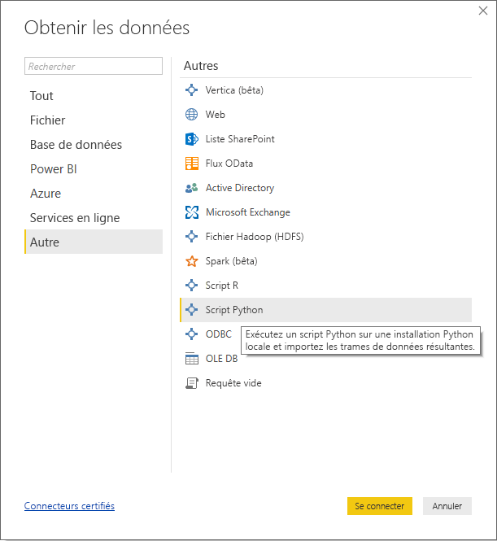
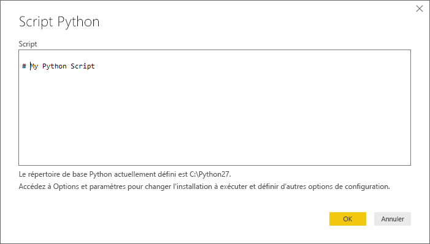
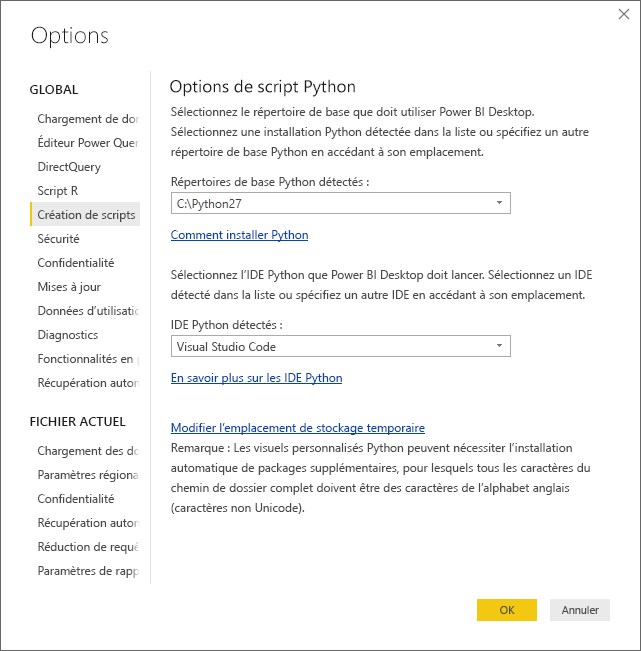

# <a name="run-python-scripts-in-power-bi-desktop"></a>Exécuter des scripts Python dans Power BI Desktop
Vous pouvez exécuter des scripts Python directement dans **Power BI Desktop** et importer les jeux de données obtenus dans un modèle de données Power BI Desktop.

## <a name="install-python"></a>Installer Python
Pour exécuter des scripts Python dans Power BI Desktop, vous devez installer **Python** sur votre ordinateur local. Vous pouvez télécharger et installer **Python** gratuitement à partir de nombreux emplacements, notamment de la [page de téléchargement officielle de Python](https://www.python.org/) et d’[Anaconda](https://anaconda.org/anaconda/python/). La version actuelle des scripts Python dans Power BI Desktop prend en charge les caractères Unicode ainsi que les espaces (caractères vides) dans le chemin d’installation.

### <a name="install-required-python-packages"></a>Installer les packages Python requis
L’intégration de Power BI Python requiert l’installation de deux packages Python (Pandas et Matplotlib).  À l’aide de l’outil de ligne de commande pip, installez les deux packages suivants,

```
pip install pandas
pip install matplotlib
```

## <a name="run-python-scripts"></a>Exécuter les scripts Python
Dans Power BI Desktop, quelques étapes suffisent pour exécuter des scripts Python et créer un modèle de données à partir duquel vous pouvez créer des rapports et les partager sur le service Power BI.

### <a name="prepare-a-python-script"></a>Préparer un script Python
Pour exécuter un script Python dans Power BI Desktop, créez-le dans votre environnement de développement Python local, puis vérifiez qu’il fonctionne correctement.

Pour exécuter le script dans Power BI Desktop, assurez-vous qu’il s’exécute correctement dans un espace de travail nouveau et non modifié. Cela signifie que l’ensemble des packages et dépendances doivent être explicitement chargés et exécutés.

Lors de la préparation et de l’exécution d’un script Python dans Power BI Desktop, vous pouvez être confronté à quelques limitations :

* Seules les trames de données Pandas sont importées, donc vérifiez que les données que vous souhaitez importer dans Power BI sont représentées dans une trame de données.
* Tous les scripts Python exécutés pendant plus de 30 minutes expirent.
* Les appels interactifs dans le script Python, comme l’attente d’une entrée utilisateur, arrêtent l’exécution du script.
* Lorsque vous définissez le répertoire de travail dans le script Python, vous *devez* définir un chemin complet vers le répertoire de travail au lieu d’un chemin relatif.
* Actuellement, les tables imbriquées (table de tables) ne sont pas prises en charge. 

### <a name="run-your-python-script-and-import-data"></a>Exécuter votre script Python et importer des données
1. Dans Power BI Desktop, le connecteur de données du script Python se trouve dans **Obtenir des données**. Pour exécuter votre script Python, sélectionnez **Obtenir des données &gt; Plus...**, puis sélectionnez **Autres &gt; Script Python**, comme illustré dans l’image suivante :
   
   
2. Si Python est installé sur votre ordinateur local, la dernière version installée est sélectionnée comme votre moteur Python. Copiez simplement votre script dans la fenêtre de script, puis cliquez sur **OK**.
   
   
3. Si Python n’est pas installé, n’est pas identifié ou s’il existe plusieurs installations sur votre ordinateur local, un avertissement s’affiche.
   
   
   
   Les paramètres d’installation de Python sont centralisés dans la section des scripts Python de la boîte de dialogue Options. Pour spécifier vos paramètres d’installation de Python, sélectionnez **Fichier > Options et paramètres**, puis **Options > Scripts Python**. Si plusieurs installations de Python sont disponibles, un menu déroulant s’affiche pour sélectionner l’installation à utiliser. Vous pouvez également sélectionner **Autres** et donner un chemin personnalisé.
   
   
4. Sélectionnez **OK** pour exécuter le script Python. Lorsque le script s’exécute correctement, vous pouvez choisir les trames de données obtenues pour les ajouter au modèle Power BI.

### <a name="refresh"></a>Actualiser
Vous pouvez actualiser un script Python dans Power BI Desktop. Lorsque vous actualisez un script Python, Power BI Desktop le réexécute dans l’environnement de Power BI Desktop.

## <a name="next-steps"></a>Étapes suivantes
Consultez les informations supplémentaires suivantes sur Python dans Power BI.

* [Créer des visuels Python dans Power BI Desktop](desktop-python-visuals.md)
* [Utiliser un IDE Python externe avec Power BI](desktop-python-ide.md)
