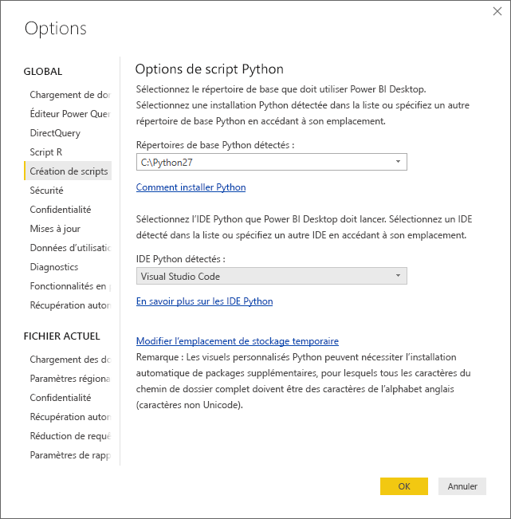
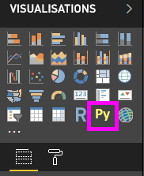
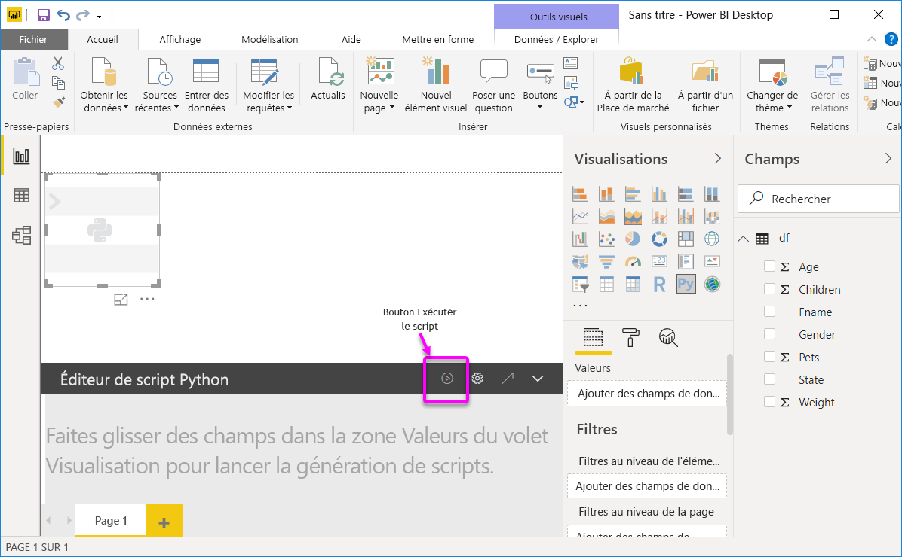
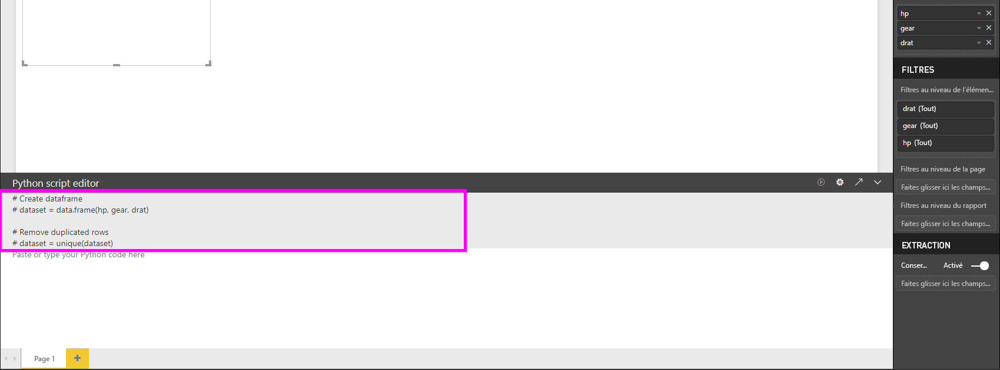
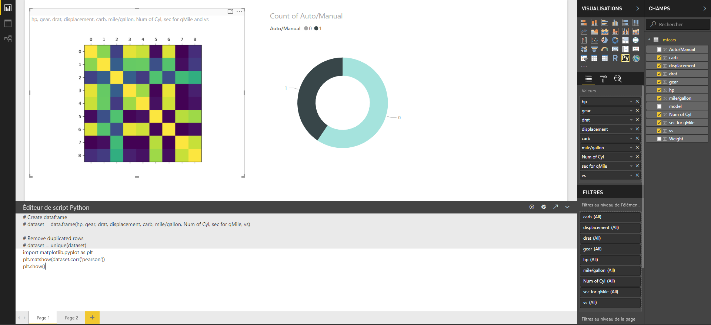
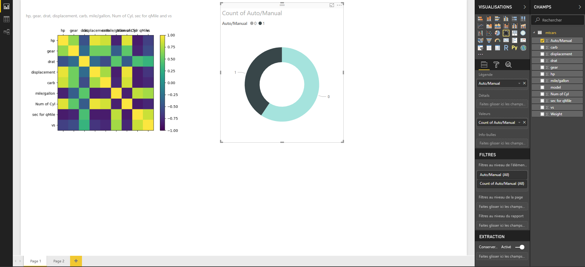
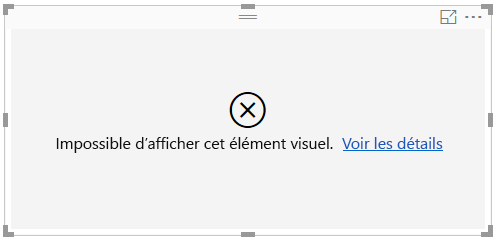

# Créer des visuels Power BI avec Python
**Power BI Desktop** vous permet d’utiliser **Python** pour visualiser vos données.

## Installer Python
**Power BI Desktop** ne contient pas le moteur **Python**, ne le déploie pas ni ne l’installe. Pour exécuter des scripts Python dans **Power BI Desktop**, vous devez installer **Python** séparément sur votre ordinateur local. Vous pouvez télécharger et installer **Python** gratuitement à partir de nombreux emplacements, notamment de la [page de téléchargement officielle de Python](https://www.python.org/) et d’[Anaconda](https://anaconda.org/anaconda/python/). La version actuelle des scripts Python dans Power BI Desktop prend en charge les caractères Unicode ainsi que les espaces (caractères vides) dans le chemin d’installation.

## Activer les visuels Python
Pour activer les visuels Python, sélectionnez **Fichier > Options et paramètres > Options**, puis dans la page **Options** qui s’affiche, vérifiez que votre installation Python locale est spécifiée dans la section **Script Python** de la fenêtre **Options**, comme illustré dans l’image suivante. Dans l’image suivante, le chemin de l’installation locale de Python est le suivant : **C:\Python27**, explicitement fourni dans la zone de texte. Vérifiez que le chemin indiqué reflète correctement l’installation locale de Python que **Power BI Desktop** doit utiliser.
   
   

Après avoir spécifié votre installation de Python, vous pouvez commencer à créer des visuels Python.

## Créer des visuels Python dans Power BI Desktop
1. Sélectionnez l’icône **Visuel Python** dans le volet **Visualization**, comme indiqué dans l’image suivante, pour ajouter un visuel Python.
   
   

   Quand vous ajoutez un visuel Python à un rapport, **Power BI Desktop** effectue les opérations suivantes :
   
   - Une image de visuel Python apparaît sous forme d’espace réservé sur le canevas de rapport.
   
   - L’**Éditeur de script Python** s’affiche en bas du volet central.
   
   

2. Ensuite, ajoutez les champs que vous souhaitez utiliser dans votre script Python à la section **Valeurs** de la zone **Champs**, comme vous le feriez pour tout autre visuel **Power BI Desktop**. 
    
    Seuls les champs qui ont été ajoutés dans la zone **Champs** sont disponibles pour votre script Python. Vous pouvez ajouter de nouveaux champs ou supprimer les champs inutiles de la zone **Champs** pendant que vous travaillez sur votre script Python dans l’**Éditeur de scripts Python de Power BI Desktop**. **Power BI Desktop** détecte automatiquement les champs que vous avez ajoutés ou supprimés.
   
   > [!NOTE]
   > Le type d’agrégation par défaut pour les visuels Python est *Ne pas synthétiser*.
   > 
   > 
   
3. Vous pouvez à présent utiliser les données sélectionnées pour créer un tracé. 

    Quand vous sélectionnez des champs, l’**Éditeur de script Python** génère un code de liaison au script Python de prise en charge en fonction des sélections effectuées dans la section grise située en haut du volet de l’éditeur. Quand vous sélectionnez ou supprimez des champs supplémentaires, le code de prise en charge dans l’Éditeur de script Python est automatiquement généré ou supprimé selon le cas.
   
   Dans l’exemple présenté dans l’image suivante, trois champs ont été sélectionnés : hp, gear et drat. Suite à ces sélections, l’Éditeur de script Python a généré le code de liaison suivant :
   
   * Une trame de données appelée **dataset** a été créée
     * Cette trame de données se compose des différents champs sélectionnés par l’utilisateur
   * L’agrégation par défaut est *ne pas résumer*
   * Comme pour les éléments visuels de table, les champs sont regroupés et les lignes en double n’apparaissent qu’une fois
   
   
   
   > [!TIP]
   > Dans certains cas, il peut être dans votre intérêt de ne pas avoir recours au regroupement automatique ou bien d’afficher toutes les lignes, notamment les doublons. Dans ce cas, vous pouvez ajouter un champ d’index à votre jeu de données. De cette façon, toutes les lignes sont considérées comme étant uniques, ce qui empêche le regroupement.
   > 
   > 
   
   La trame de données générée est appelée **dataset** et les colonnes sélectionnées sont accessibles par leurs noms respectifs. Par exemple, vous pouvez accéder au champ d’engrenage en écrivant *dataset["gear"]* dans votre script Python.

4. Une fois la trame de données générée automatiquement par les champs que vous avez sélectionnés, vous pouvez écrire un script Python qui aboutit au traçage sur l’appareil Python par défaut. Une fois le script terminé, sélectionnez **Exécuter** dans la barre de titre **Éditeur de script Python** (**Exécuter** se trouve à droite de la barre de titre).
   
    Quand vous sélectionnez **Exécuter**, **Power BI Desktop** identifie le tracé et le présente sur le canevas. Le processus étant exécuté sur l’installation locale de Python, vérifiez que les packages nécessaires sont installés.
   
   **Power BI Desktop** retrace le visuel lorsque l’un des événements suivants se produit :
   
   * Lorsque vous sélectionnez **Exécuter** dans la barre de titres **Éditeur de script Python**
   * À chaque changement de données dû à l’actualisation des données, au filtrage ou à la mise en surbrillance

    L’image suivante montre un exemple du code de tracé de corrélation et trace les corrélations entre les attributs de différents types de voitures.

    

5. Pour obtenir une plus grande vue des visualisations, vous pouvez réduire l’**Éditeur de script Python**. Bien entendu, comme pour d’autres visuels dans **Power BI Desktop**, vous pouvez appliquer un filtre croisé au tracé de corrélation en sélectionnant uniquement les voitures de sport dans le visuel en anneau (visuel rond à droite, dans l’exemple ci-dessus).

    

6. Vous pouvez également modifier le script Python pour personnaliser le visuel et mettre à profit toute la puissance de Python en ajoutant des paramètres à la commande de traçage.

    La commande de traçage d’origine était la suivante :

    plt.matshow(dataset.corr('pearson'))

    Après quelques changements apportés au script Python, la commande se présente maintenant comme suit :

    plt.matshow(dataset.corr('kendall'))

    Par conséquent, le visuel Python trace maintenant à l’aide du coefficient de corrélation de Kendall Tau, comme indiqué dans l’image suivante.

    

    Quand vous exécutez un script Python qui aboutit à une erreur, le visuel Python n’est pas tracé et un message d’erreur s’affiche sur le canevas. Pour plus d’informations sur l’erreur, sélectionnez **Voir les détails** dans l’erreur se rapportant au visuel Python sur le canevas.

    

    > **Sécurité des scripts Python :** Les visuels Python sont créés à partir de scripts Python, qui peuvent contenir du code présentant des risques pour la sécurité ou la confidentialité. Quand un utilisateur tente de voir ou d’utiliser un visuel Python pour la première fois, un message d’avertissement de sécurité lui est présenté. Activez les visuels Python seulement si vous faites confiance à l’auteur et à la source ou après avoir examiné et compris le script Python.
    > 
    > 

## Limites connues
Les visuels Python dans **Power BI Desktop** présentent quelques limitations :

* Limites concernant la taille des données : les données utilisées par les visuels Python pour le traçage sont limitées à 150 000 lignes. Si plus de 150 000 lignes sont sélectionnées, seules les 150 000 premières lignes sont utilisées et un message s’affiche sur l’image.
* Limite concernant la durée du calcul : si le calcul d’un visuel Python prend plus de 5 minutes, le délai d’exécution est dépassé et une erreur est générée.
* Relations : comme avec d’autres visuels Power BI Desktop, si des champs de données issus de différentes tables avec aucune relation définie entre elles sont sélectionnés, une erreur se produit.
* Les visuels Python sont actualisés lors de la mise à jour, du filtrage et de la sélection des données. Toutefois, l’image elle-même n’est pas interactive et ne peut pas être la source du filtrage croisé.
* Les visuels Python répondent à la sélection d’autres visuels, mais vous ne pouvez pas cliquer sur des éléments dans le visuel Python pour appliquer un filtre croisé à d’autres éléments.
* Seuls les tracés représentés sur l’écran Python par défaut s’affichent correctement sur le canevas. Évitez d’utiliser explicitement un autre écran Python.

## Étapes suivantes
Consultez les informations supplémentaires suivantes sur Python dans Power BI.

* [Exécution de scripts Python dans Power BI Desktop](desktop-python-scripts.md)
* [Utiliser un IDE Python externe avec Power BI](desktop-python-ide.md)

