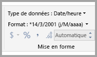
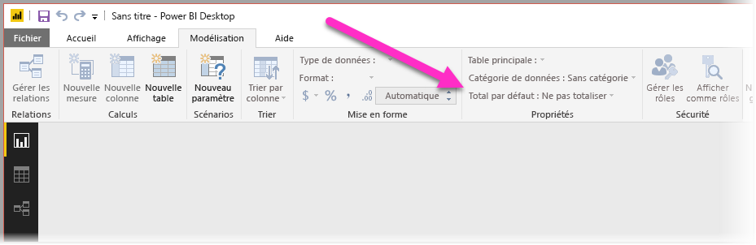
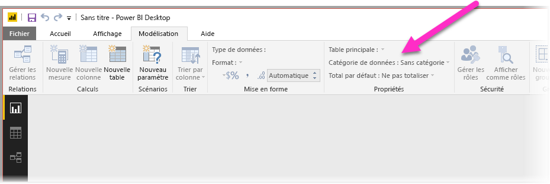
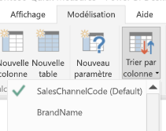
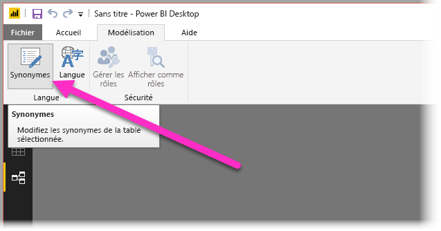
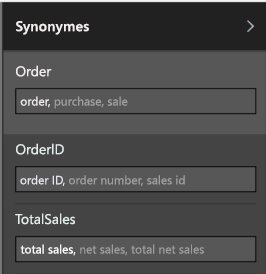

# Utiliser Q&A dans Power BI Desktop pour des requêtes en langage naturel
Utiliser des phrases courantes et un langage naturel pour poser des questions sur vos données, c’est fort. Et ce qui est encore plus fort, c’est que vos données répondent, grâce à Q&A dans **Power BI Desktop**.

Pour que l’application Q&A interprète correctement les nombreuses questions auxquelles elle peut répondre, elle doit émettre des hypothèses sur le modèle. Si la structure de votre modèle ne répond pas à une ou plusieurs de ces hypothèses, vous devrez ajuster votre modèle. Ces ajustements pour Q&A sont les mêmes optimisations recommandées pour tous les modèles dans Power BI, indépendamment de Q&A. 

> [!NOTE]
> Q&A est disponible uniquement quand vous utilisez un modèle qui contient des données **importées**. Les connexions actives aux modèles SSAS et DirectQuery ne sont pas prises en charge.
>
>

Dans les sections suivantes, nous allons décrire comment ajuster votre modèle pour qu’il fonctionne correctement avec Q&A dans Power BI.

## Ajouter des relations manquantes

Si des relations entre tables sont manquantes dans votre modèle, ni les rapports Power BI ni Q&A ne peuvent interpréter la façon de joindre ces tables si vous posez une question les concernant. Les relations sont la pierre angulaire d’un bon modèle. Par exemple, vous ne pouvez pas demander le « total des ventes pour les clients de Seattle » si la relation entre la table *commandes* et la table *clients* n’existe pas. Les images suivantes vous montrent un exemple de modèle qui doit être modifié et un exemple prêt à être utilisé avec Q&A.

**Modification nécessaire**

**Prêt pour Q&A**

## Renommer les tables et les colonnes

Pour Q&A, le choix des tables et des colonnes est primordial. Par exemple, si vous avez une table nommée *CustomerSummary* qui contient une liste de vos clients, vous devez poser des questions telles que « Liste des résumés de client à Chicago » plutôt que « Liste des clients à Chicago ». 

Même si l’application est capable de reconnaître des mots de base et des pluriels, Q&A part du principe que le nom de vos tables et colonnes reflète précisément leur contenu.

Prenons un autre exemple. Imaginez que vous avez une table nommée *Headcount* qui contient les noms et prénoms des employés ainsi que leur numéro, et une autre table nommée *Employees* qui contient des numéros d’employés, des numéros de tâches et des dates de début. Même si les personnes habituées au modèle pourraient comprendre, une autre personne qui demande « nombre d’employés » obtiendra le total des lignes de la table « Employees », ce qui n’est probablement pas ce qu’elle recherchait, puisqu’il s’agit du nombre de tâches par employé. Il serait préférable de renommer ces tables de manière à refléter réellement ce qu’elles contiennent.

**Modification nécessaire**

**Prêt pour Q&A**

## Résoudre les types de données incorrects

Les données importées peuvent présenter des types de données incorrects. En particulier, les colonnes contenant des *dates* et des *nombres* qui sont importées en tant que *chaînes* ne seront pas interprétées par Q&A comme des dates et des nombres. Vous devez veiller à sélectionner le type de données approprié dans votre modèle Power BI.

## Définir Ne pas synthétiser pour les colonnes Année et Identificateur

Power BI agrège par défaut les colonnes numériques de façon radicale. Par conséquent, des questions comme « total des ventes par année » peuvent aboutir à un total général des ventes associé à un total général des années. Si vous souhaitez empêcher ce comportement de Power BI sur des colonnes spécifiques, définissez la propriété **Synthétiser par** pour la colonne sur **Ne pas synthétiser**. Prêtez une attention particulière aux colonnes **année**, **mois**, **jour** et **ID**, qui posent le plus souvent problème. Pour les autres colonnes qui ne craignent pas d’être synthétisées, telles que *âge*, il peut également être préférable de définir **Synthétiser par** sur **Ne pas synthétiser** ou **Calculer la moyenne**. Ce paramètre est disponible dans l’onglet **Modélisation**.

## Choisir une catégorie de données pour chaque colonne contenant des dates et des indications géographiques

La **catégorie de données** apporte des informations sémantiques supplémentaires sur le contenu d’une colonne au-delà de son type de données. Par exemple, une colonne d’entiers peut être marquée Code postal, une colonne de chaînes peut indiquer Ville, Pays, Région, etc. Ces informations sont utilisées par Q&A de deux manières : pour la sélection de la visualisation et pour les tendances de langage.

Premièrement, Q&A utilise la **catégorie de données** pour guider les choix en matière de présentation visuelle. Par exemple, l’application reconnaît que les colonnes contenant une **catégorie de données** « date » ou « heure » sont généralement appropriées pour l’axe horizontal d’un graphique en courbes ou pour l’axe de lecture d’un graphique en bulles. L’application estime également que les résultats contenant des colonnes avec des **catégories de données** d’indication géographique se prêtent parfaitement à un affichage sur une carte.

Deuxièmement, Q&A émet des hypothèses sur la façon dont les utilisateurs peuvent évoquer les colonnes de date et d’indication géographique, pour pouvoir comprendre certains types de questions. Par exemple, le mot « quand » dans « Quand John Smith a-t-il été embauché ? » renverra certainement à une colonne contenant des dates, et le mot « Orange » dans « Nombre de clients à Orange » sera plus susceptible de désigner une ville qu’une couleur.

## Choisir Trier par colonne pour les colonnes appropriées

La propriété **Trier par colonne** permet d’effectuer automatiquement le tri d’une colonne en fonction d’une autre colonne. Par exemple, si vous demandez « trier les clients par taille de T-shirt », vous voulez sans doute trier votre colonne « Taille de T-shirt » par numéro de taille (XS, S, M, L, XL) plutôt que par ordre alphabétique (L, M, S, XL, XS).

## Normaliser votre modèle

Rassurez-vous, nous ne vous conseillons pas de reformer entièrement votre modèle. Cependant, certaines structures sont tellement complexes que Q&A ne pourra pas les traiter correctement. Si vous effectuez une normalisation simple de la structure de votre modèle, la facilité d’utilisation des rapports Power BI augmentera de manière significative, de même que la précision des résultats de Q&A.

La règle générale à suivre est la suivante : chaque « objet » unique dont parle l’utilisateur doit être représenté par un seul objet de modèle (table ou colonne). Ainsi, si vos utilisateurs parlent de clients, vous devez avoir un objet *client*. S’ils parlent de ventes, vous devez avoir un objet *ventes*. Ça paraît simple, non ? La simplicité du processus dépend de la forme de vos données de départ. Des fonctionnalités enrichies de mise en forme des données sont disponibles dans l’**Éditeur de requête**, mais la plupart des transformations simples peuvent être effectuées à l’aide de calculs dans le modèle Power BI.

Les sections suivantes présentent des transformations courantes que vous pourriez être amené à effectuer.

### Créer de nouvelles tables pour les entités à plusieurs colonnes

Si vous avez plusieurs colonnes qui forment une seule unité distincte au sein d’une table plus grande, celles-ci doivent être fractionnées en tables propres. Par exemple, si votre table *Sociétés* comporte les colonnes Nom du contact, Fonction du contact et Téléphone du contact, il serait préférable d’utiliser une table *Contacts* distincte contenant les informations Nom, Fonction et Téléphone ainsi qu’un lien vers la table *Sociétés*. Cela simplifie grandement l’interrogation à propos des contacts, indépendamment des questions concernant les sociétés qu’ils représentent, et améliore la flexibilité de l’affichage.

**Modification nécessaire**

**Prêt pour Q&A**

### Utilisez des valeurs croisées dynamiques pour éliminer les conteneurs de propriétés

Si votre modèle possède des conteneurs de propriétés, ceux-ci doivent être restructurés de manière à obtenir une seule colonne par propriété. Les conteneurs de propriétés, qui sont utiles pour gérer un grand nombre de propriétés, présentent trop de limitations inhérentes que ni les rapports Power BI ni Q&A ne peuvent contourner.

Par exemple, prenons une table *CustomerDemographics* avec les colonnes CustomerID, Property et Value, dans laquelle chaque ligne représente une propriété différente du client (âge, état civil, ville, etc). Le fait d’avoir plusieurs significations pour la colonne Value, qui dépendent du contenu de la colonne Property, empêche Q&A d’interpréter la plupart des requêtes qui y font référence. Une question simple telle que « montrer l’âge de chaque client » est susceptible de marcher, car elle peut être interprétée comme « montrer les clients et les données démographiques des clients où la propriété est l’âge ». Cependant, la structure du modèle ne prend pas en charge les questions un peu plus complexes telles que « âge moyen des clients à Chicago ». Même si les utilisateurs qui créent directement des rapports Power BI peuvent parfois trouver des astuces pour obtenir les données qu’ils recherchent, Q&A fonctionne seulement quand chaque colonne n’a qu’une seule signification.

**Modification nécessaire**

**Prêt pour Q&A**

### Unir pour éliminer le partitionnement

Si vous avez partitionné vos données sur plusieurs tables ou réutilisé des valeurs dans différentes colonnes, certaines opérations courantes vont se révéler difficiles voire impossibles à effectuer pour vos utilisateurs. Prenons tout d’abord un partitionnement de table typique : une table *Sales2000-2010* et une table *Sales2011-2020*. Si vos rapports importants sont tous limités à une décennie spécifique, vous pouvez les laisser tels quels pour les rapports Power BI. Cependant, la flexibilité de Q&A amènera vos utilisateurs à attendre des réponses à des questions telles que « total des ventes par année ». Pour que cela fonctionne, vous devrez réunir les données en une seule table de modèle Power BI.

De même, prenons un colonne de valeur croisée dynamique typique : une table *BookTour* contenant les colonnes Author, Book, City1, City2 et City3. Avec une telle structure, même une question simple telle que « compter les livres par ville » ne peut pas être interprétée correctement. Pour que cela fonctionne, vous devez créer une table *BookTourCities* séparée, qui réunit les valeurs de villes en une seule colonne.

**Modification nécessaire**

**Prêt pour Q&A**

### Fractionner les colonnes mises en forme

Si la source à partir de laquelle vous importez vos données contient des colonnes mises en forme, les rapports Power BI (et Q&A) ne pourront pas atteindre le contenu de la colonne pour l’analyser. Ainsi, si vous avez une colonne **Full Address** qui contient l’adresse, la ville et le pays, vous devez également la fractionner en plusieurs colonnes Adresse, Ville et Pays pour que vos utilisateurs puissent les interroger de manière individuelle.

**Modification nécessaire**

**Prêt pour Q&A**

De même, si vous avez une colonne contenant des noms complets, vous devez ajouter des colonnes **Nom** et **Prénom**, au cas où un utilisateur souhaite poser une question contenant seulement une partie du nom. 

### Créer de nouvelles tables pour les colonnes à plusieurs valeurs

Dans une situation similaire, si la source à partir de laquelle vous importez vos données contient des colonnes à plusieurs valeurs, les rapports Power BI (et Q&A) ne pourront pas atteindre le contenu de la colonne pour l’analyser. Ainsi, si vous avez une colonne Compositeur qui contient les noms de plusieurs compositeurs d’une chanson, vous devez la diviser en plusieurs lignes dans une table *Compositeurs* distincte.

**Modification nécessaire**

**Prêt pour Q&A**

### Dénormaliser pour éliminer les relations inactives

La règle de toujours préférer la normalisation accepte une seule exception : lorsqu’il existe plusieurs façons de passer d’une table à l’autre. Par exemple, si vous avez une table *Flights* avec les colonnes SourceCityID et DestinationCityID, chacune étant reliée à la table *Cities*, l’une de ces relations devra être marquée comme inactive. Étant donné que Q&A ne peut utiliser que des relations actives, vous ne pourrez pas poser de questions sur le point de départ ou la destination, selon ce que vous choisissez. Si vous dénormalisez les colonnes contenant le nom des villes dans la table *Flights*, vous pourrez poser des questions telles que : « Liste des vols pour demain au départ de Seattle et à destination de San Francisco ».

**Modification nécessaire**

**Prêt pour Q&A**

### Ajouter des synonymes aux tables et aux colonnes

Cette étape s’applique spécifiquement à Q&A (et non aux rapports Power BI en général). Les utilisateurs ont souvent recours à différents termes pour parler de la même chose, par exemple total des ventes, ventes nettes, total net des ventes. Le modèle Power BI permet d’ajouter ces synonymes aux tables et aux colonnes au sein du modèle. 

Cette étape peut se révéler essentielle. Même avec des noms de table et de colonne simples, les utilisateurs de Q&A posent des questions à l’aide d’un vocabulaire spontané, et ne choisissent pas dans une liste de colonnes prédéfinie. Plus vous ajouterez de synonymes justes, meilleure sera l’expérience de vos utilisateurs avec votre rapport. Pour ajouter des synonymes, dans la vue **Relations**, sélectionnez le bouton Synonymes du ruban, comme illustré ci-dessous.

Le champ **Synonymes** apparaît du côté droit de **Power BI Desktop**, vous permettant d’ajouter vos synonymes, comme illustré ci-dessous.

 Lorsque vous ajoutez des synonymes, prenez garde à ne pas utiliser le même dans plusieurs colonnes ou tables, car cela serait source d’ambiguïté. Q&A utilise un contexte dès que possible pour choisir entre des synonymes ambigus, mais toutes les questions ne fournissent pas suffisamment de contexte. Par exemple, lorsque l’utilisateur demande « nombre de clients », si trois éléments contiennent le synonyme « client » dans votre modèle, il risque de ne pas obtenir la réponse attendue. Dans ce cas, assurez-vous que le synonyme principal est unique, car c’est celui qui est utilisé dans la reformulation. L’application peut signaler l’ambiguïté à l’utilisateur (par exemple, la reformulation de « montrer le nombre d’enregistrements clients archivés ») et lui suggérer de reformuler sa question.

## Étapes suivantes
Pour en savoir plus sur les fonctionnalités de Power BI Desktop, consultez les articles suivants :

* [Utiliser une extraction dans Power BI Desktop](desktop-drillthrough.md)
* [Afficher une vignette de tableau de bord ou un visuel de rapport en mode Focus](service-focus-mode.md)

