# Présentation des requêtes dans Power BI Desktop
Avec **Power BI Desktop**, vous pouvez vous connecter à tout un monde de données, créer des rapports attrayants et fondamentaux, puis les partager avec d’autres utilisateurs, qui peuvent ensuite s’appuyer sur votre travail pour développer leurs talents en matière de décisionnel.

Power BI Desktop propose trois vues :

* La vue **Rapport** : c’est là où vous utilisez des requêtes que vous avez créées pour générer des visualisations attrayantes, organisées comme vous souhaitez qu’elles apparaissent et avec plusieurs pages, que vous pouvez partager avec d’autres utilisateurs.
* La vue **Données** : elle vous permet de consulter les données de votre rapport dans un format de modèle de données, où vous pouvez ajouter des mesures, créer des colonnes et gérer les relations.
* La vue **Relations** : elle vous permet d’obtenir une représentation graphique des relations qui ont été définies dans votre modèle de données et de les gérer ou de les modifier si nécessaire.

Vous pouvez accéder à ces vues en sélectionnant l’une des trois icônes affichées sur le côté gauche de Power BI Desktop. Dans l’image suivante, la vue Rapport est sélectionnée, ce qu’indique la bande jaune en regard de l’icône.  

Power BI Desktop propose également un **Éditeur de requête**, avec lequel vous pouvez vous connecter à une ou plusieurs sources de données, former et transformer les données en fonction de vos besoins, puis charger ce modèle dans Power BI Desktop.

Ce document fournit une vue d’ensemble de ce que vous pouvez faire avec des données dans **l’Éditeur de requête**. Il existe bien entendu de nombreuses autres fonctionnalités. À la fin de ce document, vous trouverez des liens vers des informations détaillées et de l’aide sur les types de données pris en charge, la connexion aux données, la mise en forme des données, la création de relations et la prise en main.

Mais tout d’abord, nous allons nous familiariser avec l’ **Éditeur de requête**.

## Éditeur de requête
Pour accéder à l’**Éditeur de requête**, sous l’onglet **Accueil** de Power BI Desktop, sélectionnez **Modifier les requêtes**.  

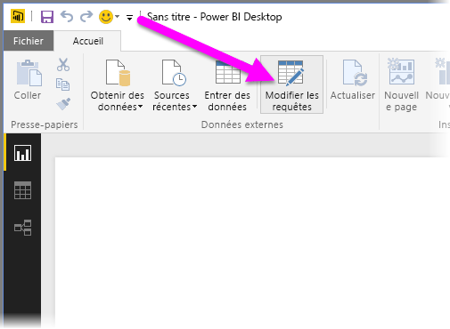

Sans connexion de données, l’**Éditeur de requête** se présente sous la forme d’un volet vide, prêt à accueillir des données.  

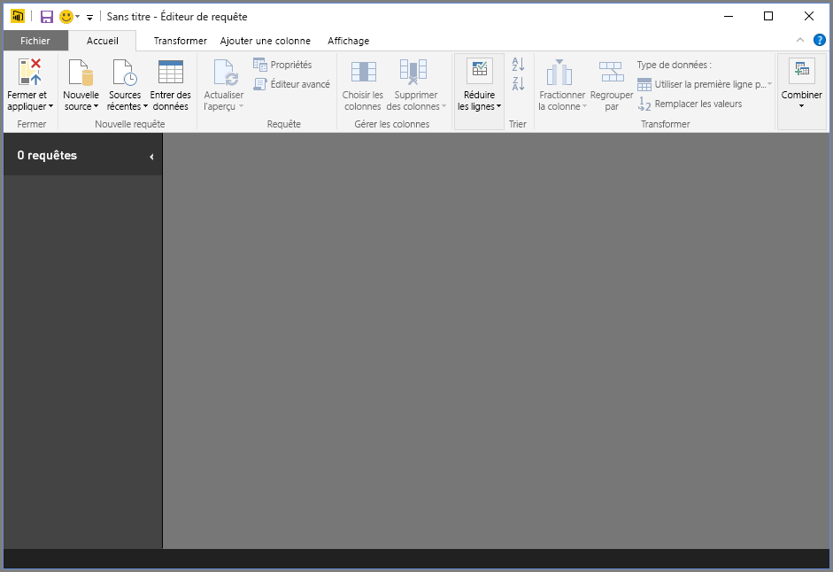

Une fois qu’une requête est chargée, la fenêtre de l’**Éditeur de requête** devient plus intéressante. Si nous nous connectons à la source de données web suivante, l’**Éditeur de requête** charge des informations sur les données, que nous pouvons commencer à mettre en forme.

[*http://www.bankrate.com/finance/retirement/best-places-retire-how-state-ranks.aspx*](http://www.bankrate.com/finance/retirement/best-places-retire-how-state-ranks.aspx)

Voici à quoi ressemble l’**Éditeur de requête** une fois qu’une connexion de données est établie :

1. Dans le ruban, de nombreux boutons sont actifs, qui permettent d’interagir avec les données de la requête.
2. Dans le volet gauche, les requêtes sont répertoriées et disponibles pour la sélection, l’affichage et la mise en forme.
3. Dans le volet central, les données issues de la requête sélectionnée sont affichées et disponibles pour la mise en forme.
4. La fenêtre **Paramètres de requête** s’affiche. Elle répertorie les propriétés et les étapes appliquées  
   
   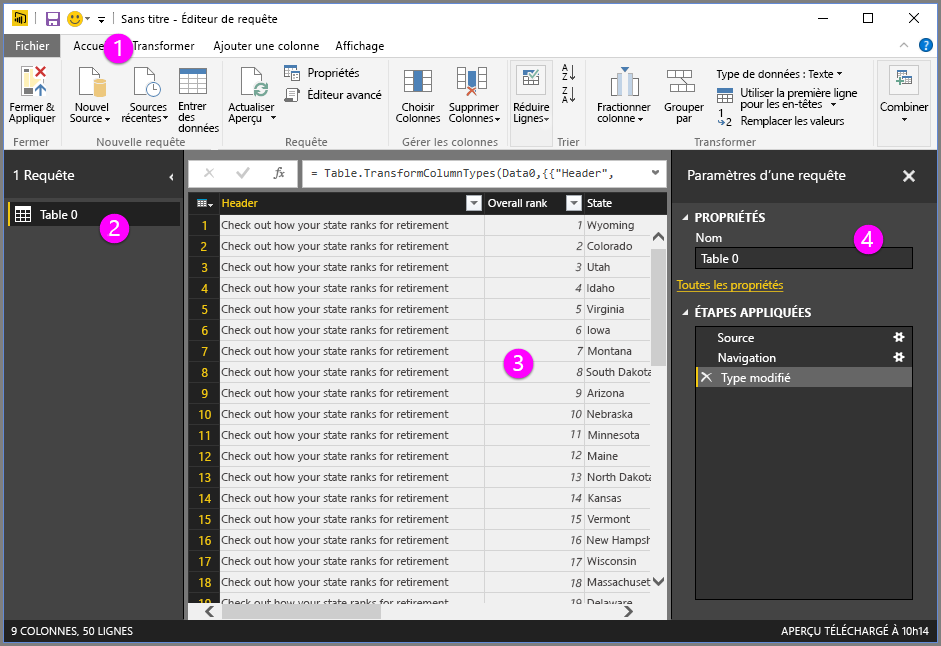

Nous allons examiner chacune de ces quatre zones – le ruban, le volet des requêtes, la vue des données et le volet Paramètres d’une requête – dans les sections suivantes.

## Ruban de la vue Requête
Le ruban de l’**Éditeur de requête** comporte quatre onglets : **Accueil**, **Transformer**, **Ajouter une colonne** et **Affichage**.

L’onglet **Accueil** contient les tâches de requête courantes, notamment la première étape d’une requête, qui consiste à **Obtenir des données**. L’image suivante montre le ruban **Accueil**.  

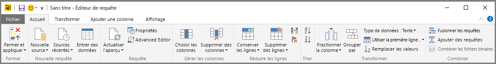

Pour vous connecter à des données et lancer le processus de création de requête, cliquez sur le bouton **Obtenir des données** . Un menu s’affiche, proposant les sources de données les plus courantes.  

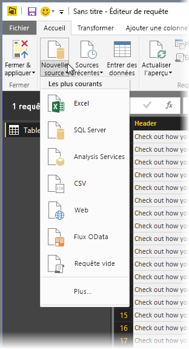

Pour plus d’informations sur les sources de données disponibles, consultez **Sources de données**. Pour obtenir plus d’informations sur la connexion à des données, ainsi que des exemples et des étapes, consultez **Se connecter à des données**.

L’onglet **Transformer** donne accès à des tâches de transformation de données courantes, telles que l’ajout ou la suppression de colonnes, la modification des types de données, le fractionnement des colonnes et d’autres tâches pilotées par des données. L’image suivante montre l’onglet **Transformer** .  

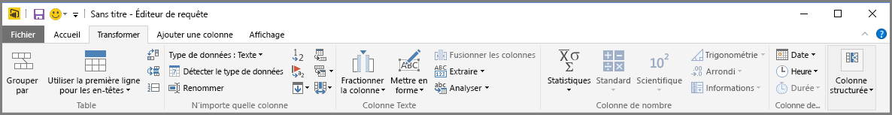

Pour obtenir plus d’informations sur la transformation des données, ainsi que des exemples, consultez **Combiner et mettre en forme des données**.

L’onglet **Ajouter une colonne** offre des tâches supplémentaires associées à l’ajout de colonne, à la mise en forme des données d’une colonne et à l’ajout de colonnes personnalisées. L’image suivante montre l’onglet **Ajouter une colonne** .  

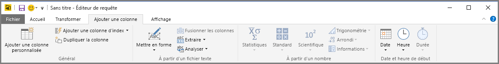

L’onglet **Affichage** du ruban permet d’afficher ou de masquer certains volets ou fenêtres. Il est également utilisé pour afficher l’Éditeur avancé. L’image suivante montre l’onglet **Affichage**.  

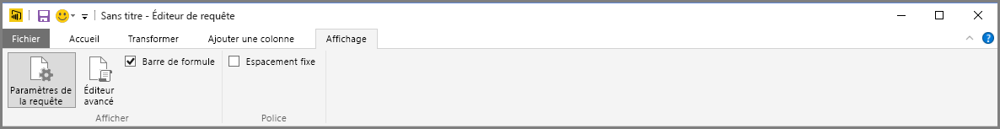

Le saviez-vous ? De nombreuses tâches disponibles à partir du ruban sont également accessibles dans le volet central en cliquant avec le bouton droit sur une colonne ou sur des données.

## Volet gauche
Le volet gauche affiche le nombre de requêtes actives, ainsi que le nom des requêtes. Quand vous sélectionnez une requête dans le volet gauche, ses données sont affichées dans le volet central, où vous pouvez mettre en forme et transformer les données à votre guise. L’image suivante montre le volet gauche avec plusieurs requêtes.  

## Volet central (données)
Le volet central, ou volet Données, affiche les données issues de la requête sélectionnée. C’est à cet endroit que l’essentiel du travail de la vue Requête est effectué.

Dans l’image suivante, la connexion de données web établie précédemment s’affiche, la colonne **Overall score** (Score global) est sélectionnée et les éléments de menu disponibles s’affichent quand l’utilisateur clique avec le bouton droit sur l’en-tête de cette colonne. Notez que la plupart de ces éléments de menu contextuel correspondent à des boutons des onglets du ruban.  

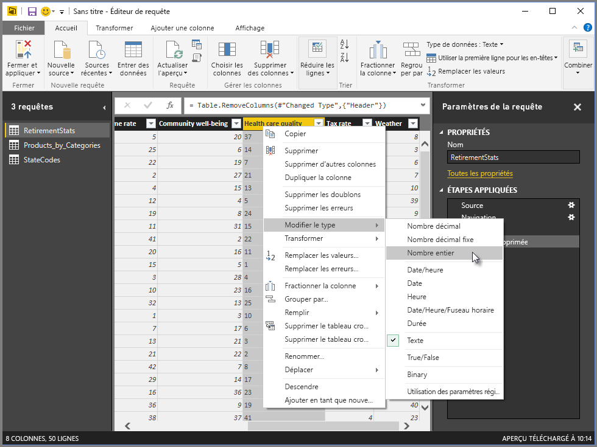

Quand vous sélectionnez un élément de menu contextuel (ou un bouton de ruban), la fonctionnalité Requête applique l’étape aux données et l’enregistre dans le cadre de la requête proprement dite. Les étapes sont enregistrées séquentiellement dans le volet **Paramètres d’une requête** , comme décrit dans la section suivante.  

## Volet Paramètres d’une requête
Le volet **Paramètres d’une requête** affiche toutes les étapes associées à une requête. Par exemple, dans l’image suivante, la section **Étapes appliquées** du volet **Paramètres d’une requête** reflète le fait que nous venons de modifier le type de la colonne **Overall score** (Score global).

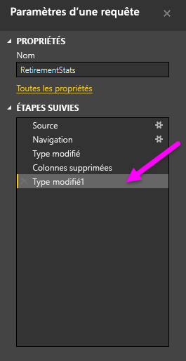

À mesure que d’autres étapes de mise en forme sont appliquées à la requête, elles sont capturées dans la section **Étapes appliquées** .

Il est important de savoir que les données sous-jacentes *ne sont pas* modifiées ; au lieu de cela, l’Éditeur de requête ajuste et met en forme sa vue des données, et toute interaction avec les données sous-jacentes repose sur la vue ainsi obtenue.

Dans le volet **Paramètres d’une requête** , vous pouvez renommer des étapes, supprimer des étapes ou réorganiser les étapes comme vous le souhaitez. Pour ce faire, cliquez avec le bouton droit sur l’étape dans la section **Étapes appliquées** , puis choisissez une option dans le menu qui s’affiche. Toutes les étapes de la requête sont effectuées dans l’ordre de leur apparition dans le volet **Étapes appliquées**.

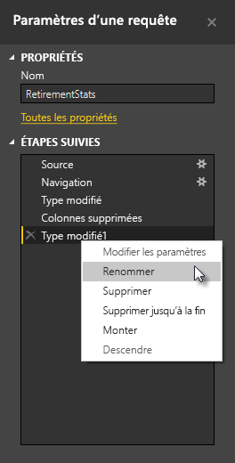

## Éditeur avancé
Si vous voulez voir le code généré par l’Éditeur de requête à chaque étape ou créer votre propre code de mise en forme, vous pouvez utiliser l’ **Éditeur avancé**. Pour lancer l’Éditeur avancé, sélectionnez **Affichage** dans le ruban, puis sélectionnez **Éditeur avancé**. Une fenêtre apparaît, affichant le code de requête existant.  
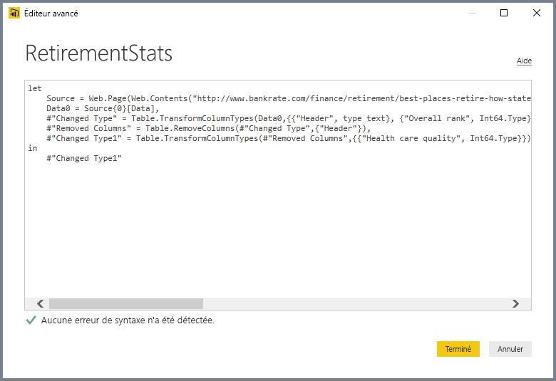

Vous pouvez modifier le code directement dans la fenêtre **Éditeur avancé** . Pour fermer la fenêtre, cliquez sur le bouton **Terminé** ou **Annuler** .  

## Enregistrement de votre travail
Quand votre requête est là où vous le voulez, vous pouvez faire en sorte que l’Éditeur de requête applique les modifications au modèle de données dans Power BI Desktop, puis fermer l’Éditeur de requête. Pour cela, sélectionnez **Fermer et appliquer** dans le menu **Fichier** de l’Éditeur de requête.  
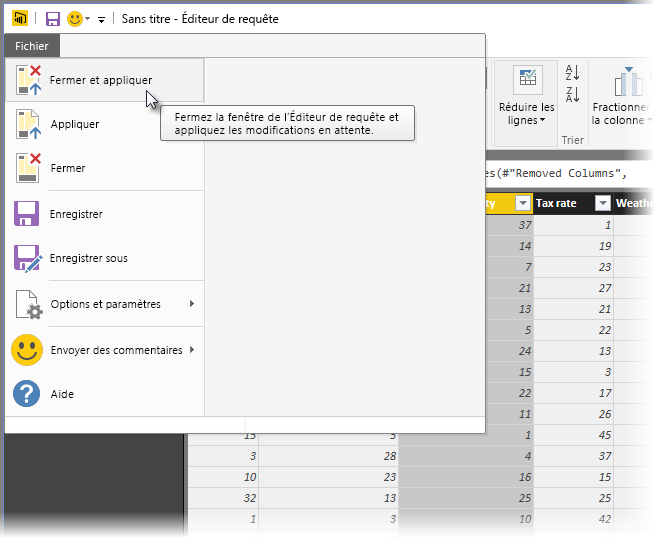

À chaque étape, Power BI Desktop affiche une boîte de dialogue pour afficher l’état de la progression.  

Une fois que votre requête est prête, ou si vous souhaitez simplement ne rien perdre de votre travail, Power BI Desktop peut enregistrer ce dernier sous la forme d’un fichier .pbix.

Pour enregistrer votre travail, sélectionnez **Fichier\>Enregistrer**(ou**Fichier\>Enregistrer sous**), comme illustré dans l’image suivante.  
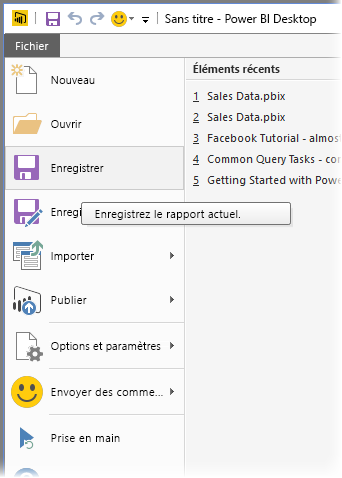

## Étapes suivantes
Power BI Desktop vous permet d’effectuer des tâches très diverses. Pour plus d’informations sur ses fonctionnalités, passez en revue les ressources suivantes :

* [Prise en main de Power BI Desktop](desktop-getting-started.md)
* [Sources de données dans Power BI Desktop](desktop-data-sources.md)
* [Se connecter aux données dans Power BI Desktop](desktop-connect-to-data.md)
* [Mettre en forme et combiner des données dans Power BI Desktop](desktop-shape-and-combine-data.md)
* [Tâches courantes relatives aux requêtes dans Power BI Desktop](desktop-common-query-tasks.md)   

