# Utiliser la fonctionnalité Mesures rapides pour effectuer facilement des calculs courants et puissants (version préliminaire)
Depuis la publication de **Power BI Desktop** d’avril 2017, vous pouvez utiliser la fonctionnalité **Mesures rapides** pour effectuer rapidement et facilement des calculs courants et puissants. Une **mesure rapide** exécute un ensemble de commandes DAX en arrière-plan (vous n’avez pas besoin d’écrire de commande DAX : cela est fait pour vous) en fonction de ce que vous entrez dans une boîte de dialogue, puis affiche les résultats que vous pouvez utiliser dans votre rapport. Mieux encore, vous pouvez voir la commande DAX que la mesure rapide exécute, et ainsi apprendre ou développer vos propres connaissances concernant DAX.

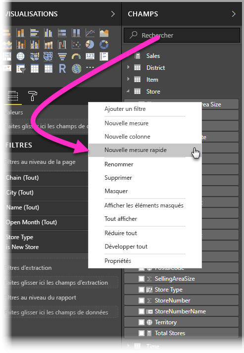

Pour créer des **mesures rapides**, double-cliquez sur un champ dans le puits **Champs**, puis sélectionnez **Mesures rapides** dans le menu qui s’affiche. Vous pouvez également cliquer avec le bouton droit sur toute valeur dans le volet **Valeurs** d’un visuel existant (par exemple, le champ *Valeurs* dans un visuel *Graphique à barres*). Il existe de nombreuses catégories de calculs disponibles et manières de modifier chaque calcul selon vos besoins.

### Activer la fonctionnalité Mesures rapides en version préliminaire
Vous pouvez essayer la nouvelle fonctionnalité **Mesures rapides** à partir de la publication d’**avril 2017** de **Power BI Desktop**. Pour activer cette fonctionnalité en version préliminaire, sélectionnez **Fichier > Options et paramètres > Options > Fonctionnalités en version préliminaire**, puis activez la case à cocher en regard de **Mesures rapides**. Vous devez redémarrer Power BI Desktop après avoir effectué la sélection.

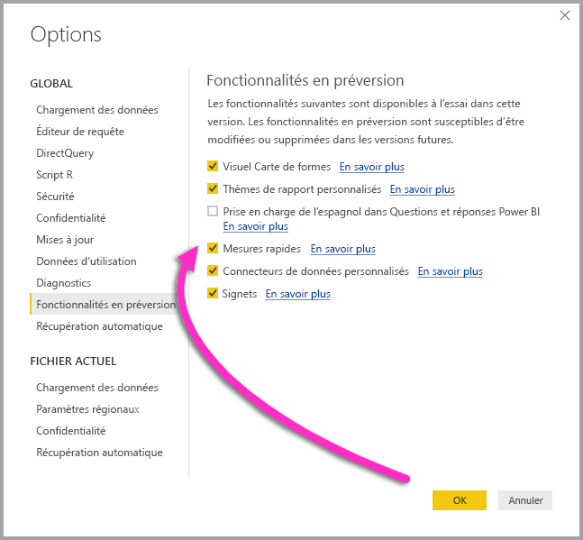

Après avoir effectué la sélection, vous devez redémarrer **Power BI Desktop**.

## Utilisation de la fonctionnalité Mesures rapides
Pour créer une **mesure rapide**, dans **Power BI Desktop** cliquez avec le bouton droit sur un champ (quelconque) dans le puits **Champs**, puis, dans le menu contextuel qui s’affiche, sélectionnez **Mesure rapide**.

Pour que la fonctionnalité **Mesures rapides** soit disponible, la modélisation doit être disponible sur le jeu de données actuellement chargé. En tant que telles, les connexions actives (par exemple, une connexion à un jeu de données du service Power BI) n’affichent pas l’option de menu **Mesures rapides** en cas de clic droit sur la liste **Champs**, à l’exception des connexions actives SSAS. 

Lors de l’utilisation de connexions actives SSAS (SQL Server Analysis Services), certaines **mesures rapides** sont disponibles. **Power BI Desktop** affiche uniquement les **mesures rapides** prises en charge pour la version de SSAS à laquelle la connexion est établie. Par conséquent, si vous êtes connecté à une source de données active SSAS et que vous ne voyez pas certaines **mesures rapides** dans la liste, cela signifie que la version SSAS à laquelle vous êtes connecté ne prend pas en charge la mesure DAX permettant d’implémenter cette **mesure rapide**.

Après sélection de cette option dans le menu contextuel, la fenêtre **Mesures rapides** s’affiche, dans laquelle vous pouvez sélectionner le calcul de votre choix, ainsi que les champs sur lesquels il doit s’exécuter.

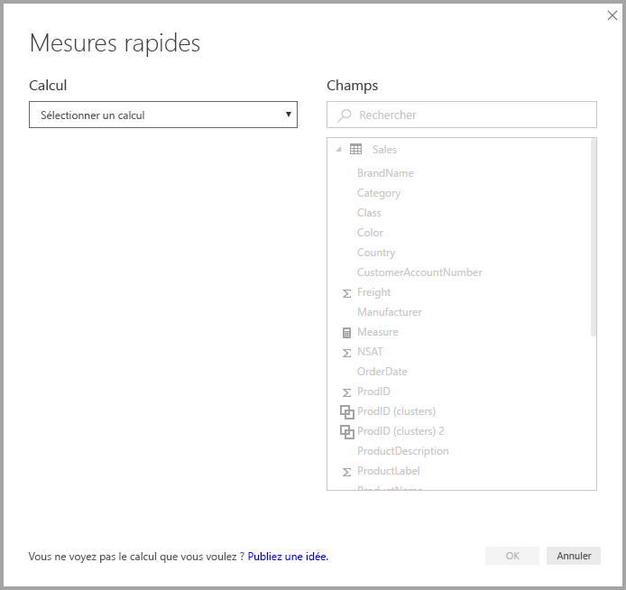

Lorsque vous sélectionnez le menu déroulant, la longue liste des **Mesures rapides** disponibles s’affiche.

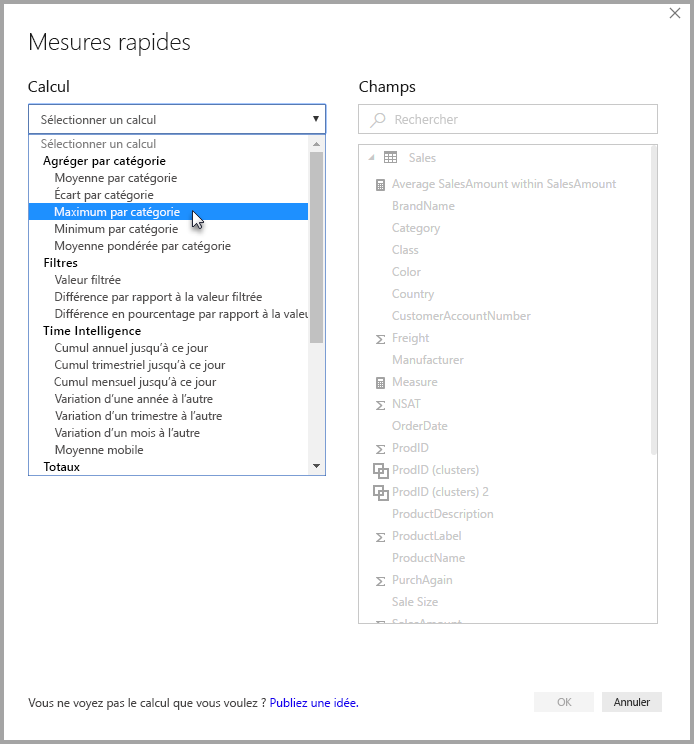

Il existe cinq groupes distincts de types de calculs de mesure rapide, chacun comprenant un ensemble spécifique de calculs. Ces groupes et calculs sont les suivants :

* **Agrégat dans une catégorie**
  * Moyenne dans la catégorie
  * Variance dans la catégorie
  * Maximum dans la catégorie
  * Minimum dans la catégorie
  * Moyenne pondérée par catégorie
* **Filtres et bases de référence**
  * Mesure filtrée
  * Différence par rapport à la référence
  * Différence en pourcentage par rapport à la référence
  * Totaux provenant des nouvelles catégories
* **Time intelligence**
  * Cumul annuel jusqu’à ce jour
  * Cumul trimestriel jusqu’à ce jour
  * Cumul mensuel jusqu’à ce jour
  * Variation d’une année à l’autre
  * Variation d’un trimestre à l’autre
  * Variation d’un mois à l’autre
  * Moyenne mobile
* **Totaux**
  * Résultat cumulé
  * Total de la catégorie (filtres appliqués)
  * Total de la catégorie (filtres non appliqués)
* **Opérations mathématiques**
  * Addition
  * Soustraction
  * Multiplication
  * Division
  * Différence en pourcentage
* **Texte**
  * Nombre d’étoiles
  * Liste concaténée de valeurs

Nous prévoyons d’apporter des ajouts à ces calculs. Nous souhaitons donc que vous nous fassiez part des **Mesures rapides** dont vous aimeriez pouvoir disposer, et nous disiez si vous avez des idées (y compris de formules DAX sous-jacentes) pour les **Mesures rapides** que nous devrions prendre en considération. Vous trouverez davantage d’informations à ce sujet à la fin de cet article.

## Exemple relatifs à la fonctionnalité Mesures rapides
Examinons un exemple de cette fonctionnalité **Mesures rapides** en action.

Le visuel **Matrice** suivant présente un tableaux des ventes de différents produits. Il s’agit d’un tableau de base incluant le total de chaque catégorie.

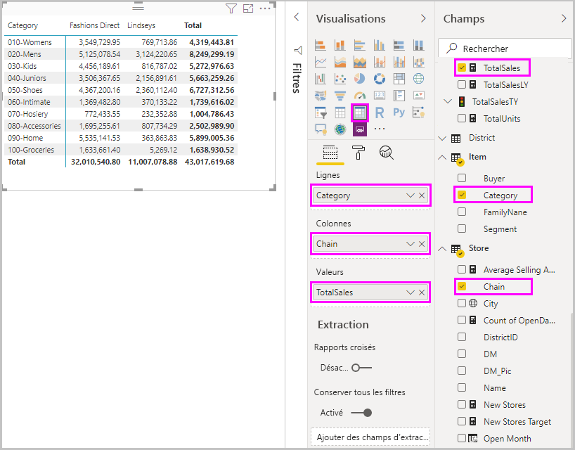

Lorsque nous cliquons avec le bouton droit sur le puits du champ **Valeurs** et sélectionnez **Mesures rapides**, nous pouvons sélectionner *Moyenne dans la catégorie* en tant que le *Calcul*, sélectionner *Somme de SalesAmount* en tant que *Valeur de base*, puis spécifier *SalesAmount* en faisant glisser ce champ à partir de la zone *Champs* dans le volet droit vers la section *Catégorie* sur la gauche.

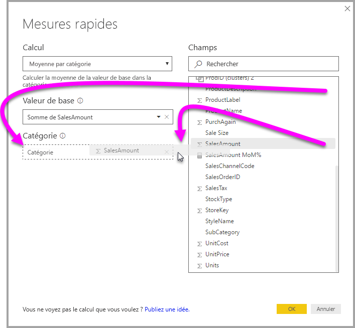

Lorsque nous sélectionnons **OK**, nous observons que des comportements intéressants se produisent, comme illustré dans l’image suivant cette liste :

1. Le visuel **Matrice** comporte maintenant une nouvelle colonne qui affiche notre calcul, en l’occurrence, *SalesAmount moyen dans SalesAmount*.
2. Une nouvelle **mesure** a été créée, qui est disponible dans le puits **Champs** en évidence (Power BI l’entoure d’un cadre de couleur jaune). Cette mesure est disponible pour tout autre visuel dans le rapport, pas seulement pour celui pour lequel elle a été créée.
3. La formule DAX créée pour la **mesure rapide** s’affiche dans la barre de formule.

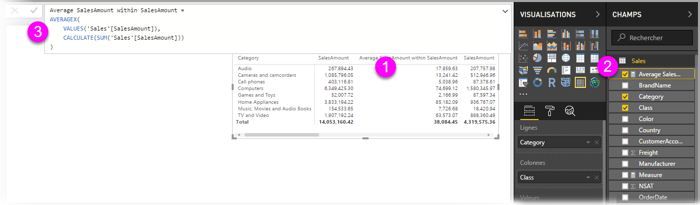

Pour commencer par le premier élément, vous pouvez observer que la **mesure rapide** a été appliquée au visuel. Une nouvelle colonne et une valeur associée s’affichent, toutes deux basées sur la **mesure rapide** créée.

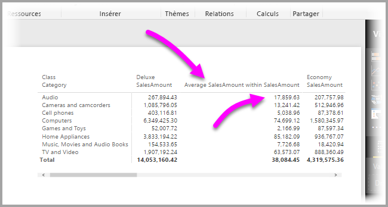

Ensuite, la **mesure rapide** s’affiche dans le puits **Champs** du modèle de données, que vous pouvez utiliser comme tout autre champ du modèle, pour tout autre visuel. Dans l’image suivante, un visuel rapide de type **graphique à barres** a été généré à l’aide du champ créé par la **mesure rapide**.

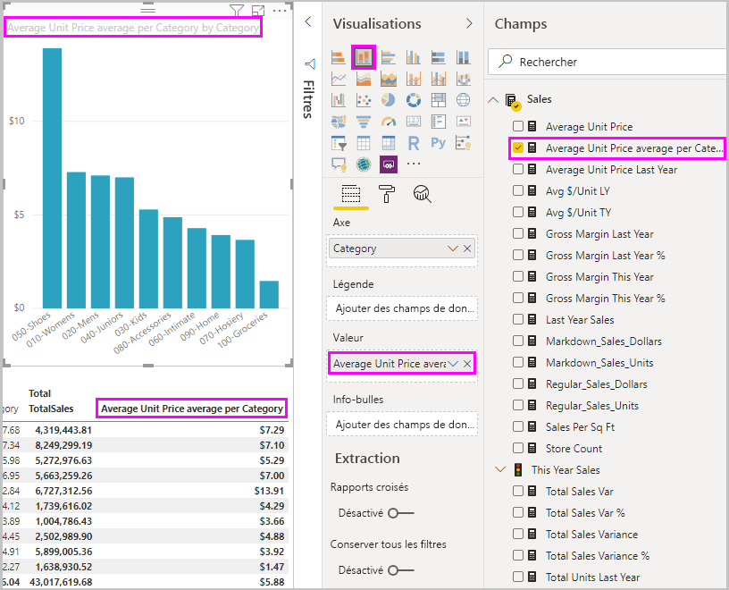

Passons à la section suivante pour discuter de ce troisième élément, à savoir celui des formules DAX.

## Découvrir DAX à l’aide de la fonctionnalité Mesures rapides
Un autre avantage de la fonctionnalité **Mesures rapides** est qu’elle affiche directement la formule DAX créée pour implémenter la mesure. Dans l’image suivante, nous avons sélectionné la mesure créée par la **mesure rapide**. Comme elle figure à présent dans le puits **Champs**, il nous suffit de cliquer dessus. Lorsque nous procédons de la sorte, la **barre de formule** apparaît, affichant la formule DAX que Power BI a créée pour implémenter la mesure.

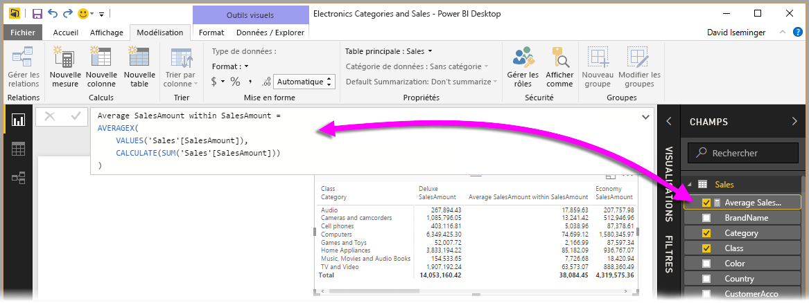

Cela est intéressant en soi, puisque vous pouvez ainsi voir la formule sous-jacente à la mesure. Mais peut-être plus important encore, cela vous permet d’utiliser la fonctionnalité **Mesures rapides** pour voir comment les formules DAX sous-jacentes doivent être créées.

Imaginons que vous devez effectuer un calcul de variation d’une année à l’autre mais que vous hésitez sur la manière de structurer la formule DAX, ou ignorez tout simplement par où commencer. Au lieu de vous cogner la tête contre le mur, vous pouvez créer une **mesure rapide** à l’aide du calcul **Variation d’une année à l’autre** et observer ce qui se passe. Ainsi, vous créez la **mesure rapide** pour voir comment elle s’affiche dans votre visuel, observez comment la formule DAX a fonctionné, puis modifiez directement celle-ci ou créez une autre mesure, jusqu’à ce que les calculs répondent à vos besoins ou à vos attentes.

C’est comme si vous étiez assisté par un professeur qui répondrait immédiatement à vos hypothèses en quelques clics. Si une mesure ne vous plaît pas, vous pouvez toujours l’écarter de votre modèle en cliquant dessus avec le bouton droit, puis en sélectionnant **Supprimer**.

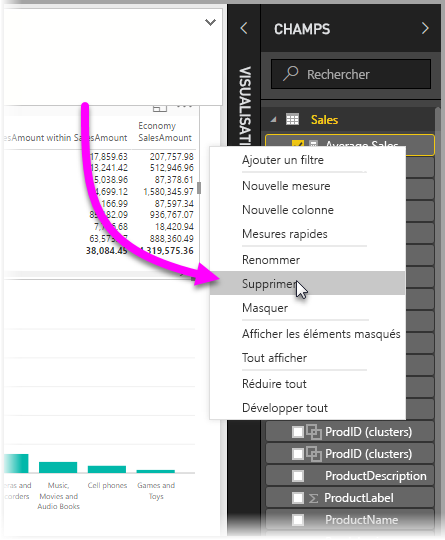

Enfin, une fois que votre mesure est au point, vous pouvez la renommer à votre guise en utilisant le même menu contextuel.

## Considérations et limitations
Dans cette version préliminaire de la fonctionnalité **Mesures rapides**, vous devez garder à l’esprit les considérations et limitations suivantes.

* Les **mesures rapides** sont disponibles uniquement si vous pouvez modifier le modèle, ce qui n’est pas le cas lorsque vous travaillez avec des connexions DirectQuery ou la plupart des connexions actives (comme expliqué précédemment, les connexions actives SSAS ne sont pas prises en charge).
* La mesure ajoutée au puits **Champs** peut être utilisée avec n’importe quel visuel inclus dans le rapport.
* Vous pouvez toujours voir la commande DAX associée à une **mesure rapide** en sélectionnant la mesure créée dans le puits **Champs**. La formule s’affiche alors dans la **barre de formule**.

> [!WARNING]
> Les mesures rapides ne génèrent actuellement *que* des instructions DAX avec des virgules comme séparateurs d’arguments. Si votre version de **Power BI Desktop** est traduite dans une langue qui utilise la virgule comme séparateur décimal, les mesures rapides ne fonctionnent pas correctement.
> 
> 

### Time intelligence et Mesures rapides
Depuis la mise à jour d’octobre 2017 de **Power BI Desktop**, vous pouvez utiliser vos propres tables de dates personnalisées avec les **mesures rapides** Time Intelligence. Si votre modèle de données possède une table de dates personnalisée, vous pouvez utiliser la colonne de date principale de la table pour les mesures rapides Time Intelligence. Vous *devez* vous assurer que lorsque le modèle a été créé, la colonne de date principale de cette table a été marquée en tant que table de dates, comme décrit dans [cet article](https://docs.microsoft.com/sql/analysis-services/tabular-models/specify-mark-as-date-table-for-use-with-time-intelligence-ssas-tabular).

### Exemples et informations supplémentaires
Nous prévoyons de fournir des exemples et des conseils pour chacun des calculs de la fonctionnalité **Mesures rapides**. Nous vous invitons par conséquent à consulter cet article de temps à autre afin de voir s’il contient des mises à jour.

Dans la mesure où il s’agit d’une fonctionnalité en **version préliminaire**, nous sommes particulièrement intéressés par vos commentaires et vos idées.

Vous avez une idée de **mesure rapide** non encore disponible ? Excellent ! Visitez [cette page](https://go.microsoft.com/fwlink/?linkid=842906) et soumettez vos idées (et formules DAX) pour la **mesure rapide** que vous aimeriez voir dans **Power BI Desktop**. Nous envisagerons d’ajouter celle-ci à la liste fournie de **mesures rapides** dans une prochaine publication.

