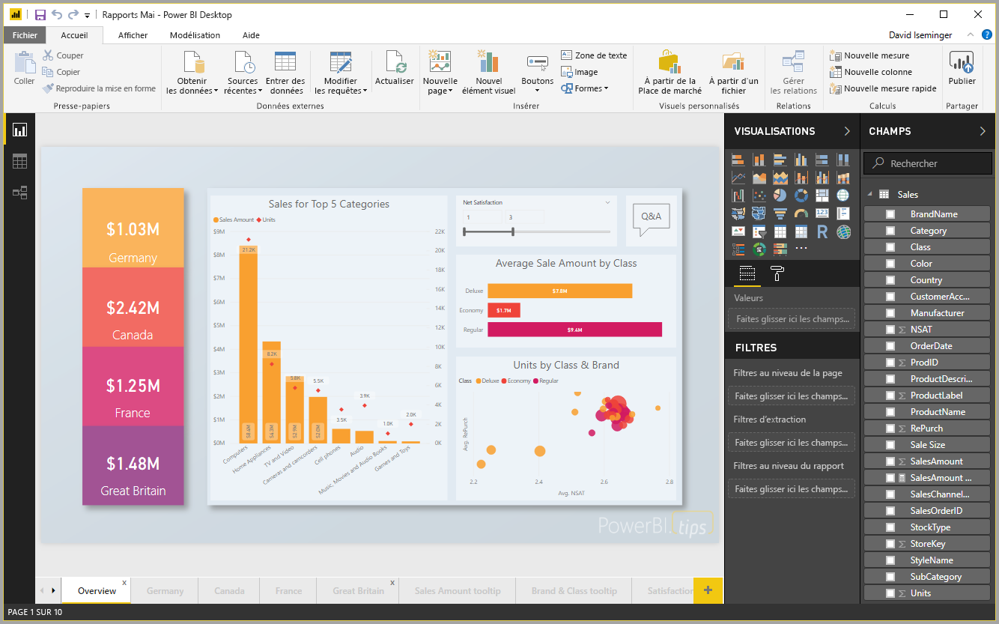
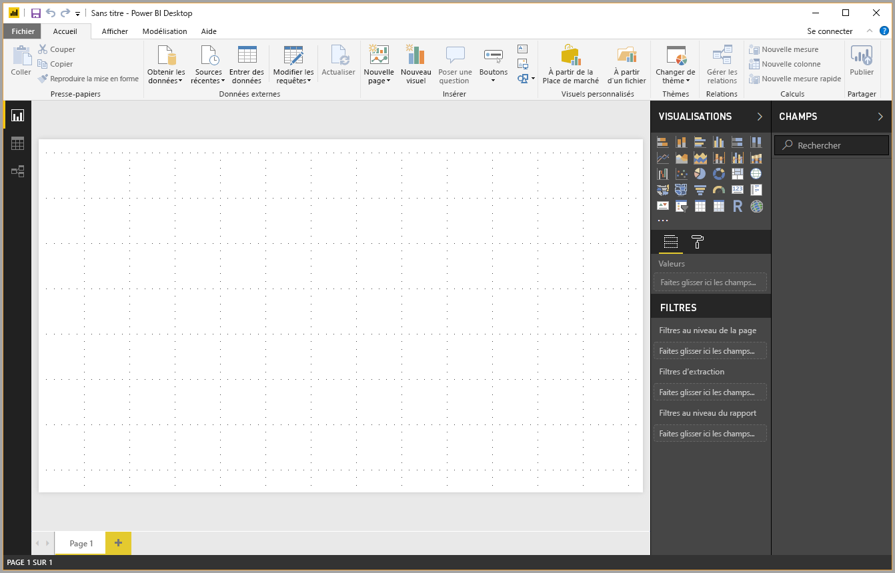
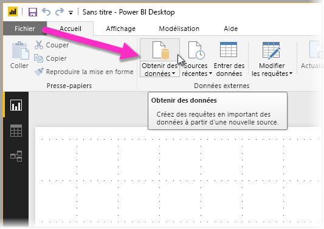
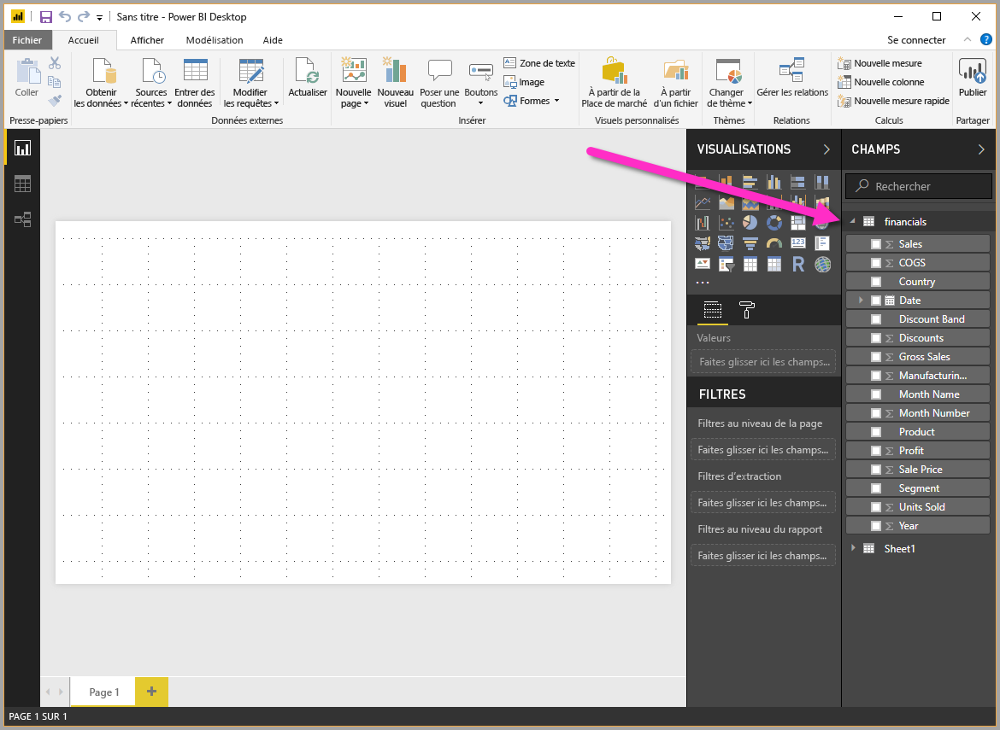

# Démarrage rapide : Se connecter à des données dans Power BI Desktop

Dans ce démarrage rapide, vous vous connectez aux données à l’aide de **Power BI Desktop**, ce qui constitue la première étape de la création de modèles de données et de rapports.

Si vous n’êtes pas inscrit à Power BI, [inscrivez-vous à un essai gratuit](https://app.powerbi.com/signupredirect?pbi_source=web) avant de commencer.

## Conditions préalables

Pour effectuer les étapes décrites dans cet article, les opérations suivantes sont nécessaires :
* Téléchargez et installez **Power BI Desktop**, une application gratuite qui s’exécute sur votre ordinateur local. Vous pouvez [télécharger **Power BI Desktop**](https://powerbi.microsoft.com/desktop) directement, ou l’obtenir à partir [du **Microsoft Store**](http://aka.ms/pbidesktopstore).
* [Téléchargez cet exemple de classeur Excel](http://go.microsoft.com/fwlink/?LinkID=521962), puis créez un dossier appelé *C:\PBID-qs* dans lequel vous pouvez stocker le fichier Excel. Les étapes suivantes de ce démarrage rapide utilisent cet emplacement pour le stockage du classeur Excel téléchargé.

## Démarrer Power BI Desktop

Après avoir installé **Power BI Desktop**, lancez l’application pour l’exécuter sur votre ordinateur local. Un canevas vierge apparaît, dans lequel vous pouvez créer des éléments visuels et des rapports à partir des données auxquelles vous vous connectez. 

## Se connecter aux données

**Power BI Desktop** vous permet de vous connecter à de nombreux types de données. Vous pouvez vous connecter à des sources de données de base telle qu’un fichier Microsoft Excel, et à des services en ligne hébergeant toutes sortes de données comme Salesforce, Microsoft Dynamics, Stockage Blob Azure, et bien plus encore. 

Pour vous connecter à des données, dans le ruban **Accueil**, sélectionnez **Obtenir les données**.

La fenêtre **Obtenir les données** s’affiche, où vous pouvez choisir parmi les différentes sources de données auxquelles **Power BI Desktop** peut se connecter. Dans ce démarrage rapide, nous utilisons le classeur Excel que vous avez téléchargé, comme décrit dans la section *Conditions préalables* au début de cet article. 

Puisqu’il s’agit d’un fichier Excel, sélectionnez **Excel** dans la fenêtre **Obtenir les données**, puis cliquez sur le bouton **Se connecter**.

À l’invite, indiquez l’emplacement du fichier Excel auquel vous souhaitez vous connecter. Le fichier téléchargé s’appelle *Financial Sample*. Sélectionnez ce fichier, puis cliquez sur **Ouvrir**.

**Power BI Desktop** charge alors le classeur et lit son contenu, puis affiche les données disponibles dans le fichier dans la fenêtre **Navigator**, où vous pouvez choisir les données à charger dans Power BI Desktop. Vous sélectionnez les tables en cochant les cases en regard de chaque table à importer. Dans ce cas, nous allons importer les deux tables disponibles.

Après avoir effectué vos sélections, choisissez **Charger** pour importer les données dans Power BI Desktop.

## Afficher les données dans le volet Champs

Une fois les tables chargées, le volet **Champs** affiche les données. Vous pouvez développer chaque table en cliquant sur le triangle à côté de son nom. Dans l’image suivante, la table *financials* est développée, montrant chacun de ses champs. 

Et voilà ! Vous vous êtes connecté à des données dans **Power BI Desktop**, vous avez chargé ces données, et vous pouvez maintenant voir tous les champs disponibles dans ces tables.

## Étapes suivantes
Il existe toutes sortes d’opérations que vous pouvez effectuer avec **Power BI Desktop** une fois que vous vous êtes connecté aux données, par exemple créer des rapports et des éléments visuels. Pour commencer, examinez les ressources suivantes :

* [Prise en main de Power BI Desktop](desktop-getting-started.md)

