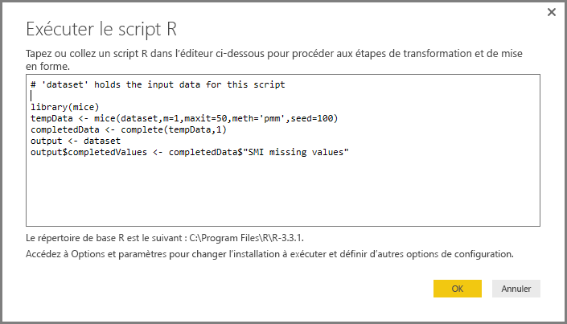

# Utilisation du langage R dans l’Éditeur de requête
Vous pouvez utiliser le langage de programmation **R** largement utilisé par les analystes de données, les scientifiques de données et les statisticiens dans l’**Éditeur de requête** Power BI Desktop. Cette intégration de R dans l’**Éditeur de requête** permet de procéder au nettoyage des données à l’aide de R et d’effectuer une mise en forme et des analyses avancées des données dans les jeux de données, y compris la saisie de données manquantes, les prévisions et le clustering pour ne citer que quelques exemples. **R** est un langage puissant. Il peut être utilisé dans l’**Éditeur de requête** pour préparer votre modèle de données et créer des rapports.

## Installation de R
Pour utiliser **R** dans l’**Éditeur de requête** Power BI Desktop, vous devez installer **R** sur votre ordinateur local. Vous pouvez télécharger et installer **R** gratuitement à partir de nombreux emplacements, dont les pages [Download Revolution R Open](https://mran.revolutionanalytics.com/download/) et [CRAN Repository](https://cran.r-project.org/bin/windows/base/).

## Utilisation du langage R dans l’Éditeur de requête
Pour comprendre comment utiliser **R** dans l’**Éditeur de requête**, prenez cet exemple qui provient d’un jeu de données boursières basé sur un fichier CSV ([téléchargeable ici](http://download.microsoft.com/download/F/8/A/F8AA9DC9-8545-4AAE-9305-27AD1D01DC03/EuStockMarkets_NA.csv)). Les étapes de cet exemple sont les suivantes :

1. Tout d’abord, entrez des données dans **Power BI Desktop**. Dans cet exemple, chargez le fichier *EuStockMarkets_NA.csv* et sélectionnez **Obtenir des données > CSV** dans le ruban **Accueil** de **Power BI Desktop**.
   
   
2. Sélectionnez le fichier et choisissez **Ouvrir**. Le fichier CSV s’affiche dans la boîte de dialogue **Fichier CSV**.
   
   
3. Une fois que les données sont chargées, elles s’affichent dans le volet **Champs** de Power BI Desktop.
   
   
4. Ouvrez l’**Éditeur de requête** en sélectionnant **Modifier les requêtes** dans le ruban **Accueil** de **Power BI Desktop**.
   
   
5. Sous l’onglet **Transformation**, sélectionnez **Exécuter un script R**. L’éditeur **Exécuter un script R** apparaît (voir l’étape suivante). Notez que les lignes 15 et 20 ont des données manquantes, comme les autres lignes qui ne figurent pas dans l’image suivante. Les étapes ci-dessous montrent comment R peut compléter ces lignes pour vous.
   
   
6. Pour cet exemple, entrez le code de script suivant :
   
       library(mice)
       tempData <- mice(dataset,m=1,maxit=50,meth='pmm',seed=100)
       completedData <- complete(tempData,1)
       output <- dataset
       output$completedValues <- completedData$"SMI missing values"
   
   > [!NOTE]
   > La bibliothèque *mice* doit être installée dans votre environnement R pour que le code de script précédent fonctionne correctement. Pour installer mice, exécutez la commande suivante dans votre installation de R : |      > install.packages('mice')
   > 
   > 
   
   Lorsqu’il est placé dans la boîte de dialogue **Exécuter un script R**, le code ressemble à ce qui suit :
   
   
7. Une fois que vous avez sélectionné **OK**, l’**Éditeur de requête** affiche un avertissement concernant la confidentialité des données.
   
   
8. Pour que les scripts R fonctionnent correctement dans le service Power BI, toutes les sources de données doivent être définies comme étant *publiques*. Pour plus d’informations sur les paramètres de confidentialité et leurs implications, consultez [Niveaux de confidentialité](desktop-privacy-levels.md).
   
   
   
   Le volet **Champs** comporte une nouvelle colonne appelée *completedValues*. Il existe quelques éléments de données manquants, par exemple sur les lignes 15 et 18. La section suivante explique de quelle façon R gère ce problème.
   

Avec seulement cinq lignes de script R, l’**Éditeur de requête** a renseigné les valeurs manquantes à l’aide d’un modèle de prévision.

## Création d’éléments visuels à partir des données de script R
Maintenant, nous pouvons créer un visuel pour voir comment le script R a complété les valeurs manquantes à l’aide de la bibliothèque *mice*, comme illustré dans l’image suivante :

Quand vous avez terminé ce visuel et les autres visuels éventuels à créer à l’aide de **Power BI Desktop**, vous pouvez enregistrer le fichier **Power BI Desktop** (au format .pbix), puis utiliser le modèle de données, y compris les scripts R associés, dans le service Power BI.

> [!NOTE]
> Vous voulez voir un fichier .pbix complété une fois les étapes ci-dessus terminées ? Vous pouvez télécharger le fichier **Power BI Desktop** complet utilisé dans ces exemples [ici](http://download.microsoft.com/download/F/8/A/F8AA9DC9-8545-4AAE-9305-27AD1D01DC03/Complete Values with R in PQ.pbix).
> 
> 

Une fois que vous avez téléchargé le fichier .pbix vers le service Power BI, quelques étapes supplémentaires sont nécessaires pour activer l’actualisation des données (dans le service) et pour mettre à jour les éléments visuels dans le service (pour cela, les données doivent accéder à R). Les étapes supplémentaires sont les suivantes :

* **Activer l’actualisation planifiée pour le jeu de données** : pour activer l’actualisation planifiée pour le classeur qui contient votre jeu de données avec des scripts R, consultez [Configuration d’une actualisation planifiée](refresh-scheduled-refresh.md), qui inclut également des informations sur **Personal Gateway**.
* **Installer Personal Gateway** : vous devez installer **Personal Gateway** sur l’ordinateur où se trouvent le fichier et R. Le service Power BI doit accéder à ce classeur et restituer de nouveau les éléments visuels mis à jour. Vous pouvez obtenir plus d’informations sur l’[installation et la configuration de Personal Gateway](personal-gateway.md).

## Limites
Il existe certaines limitations pour les requêtes qui incluent des scripts R créés dans l’**Éditeur de requête** :

* Tous les paramètres de source de données R doivent être définis comme étant *publics* et toutes les autres étapes d’une requête créée dans l’**Éditeur de requête** doivent également être publiques. Pour accéder aux paramètres de la source de données, dans **Power BI Desktop**, sélectionnez **Fichier > Options et paramètres > Paramètres de la source de données**.
  
  
  
  Dans la boîte de dialogue **Paramètres de la source de données**, sélectionnez la ou les sources de données, puis sélectionnez **Modifier les autorisations...** et vérifiez que le **niveau de confidentialité** est défini sur *Public*.
  
      
* Pour activer l’actualisation planifiée de vos éléments visuels R ou d’un jeu de données, vous devez activer l’**actualisation planifiée** et installer **Personal Gateway** sur l’ordinateur qui héberge le classeur et l’installation de R. Pour plus d’informations à ce sujet, consultez les liens indiqués dans la section précédente de cet article.

Il existe toutes sortes d’opérations que vous pouvez faire avec R et les requêtes personnalisées. Par conséquent, explorez et mettez en forme vos données de la façon dont vous souhaitez qu’elles apparaissent.

