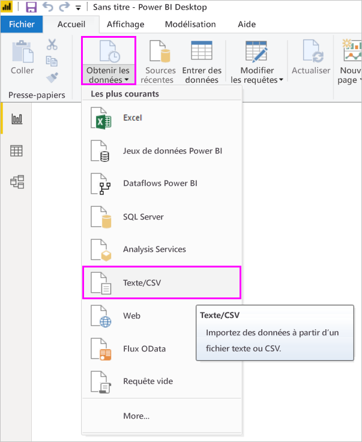
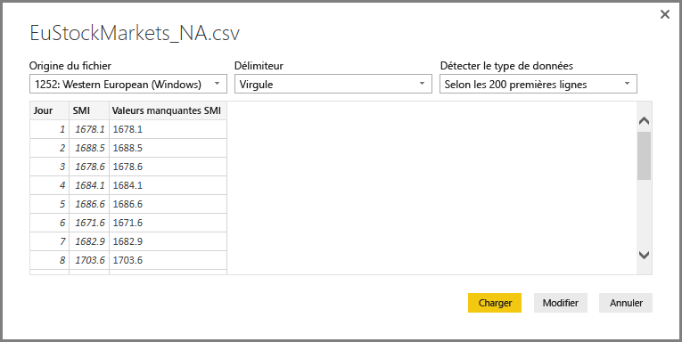
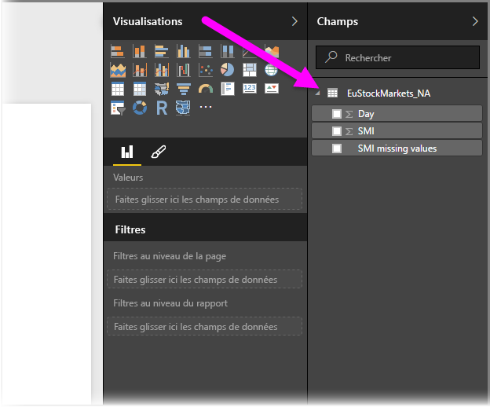
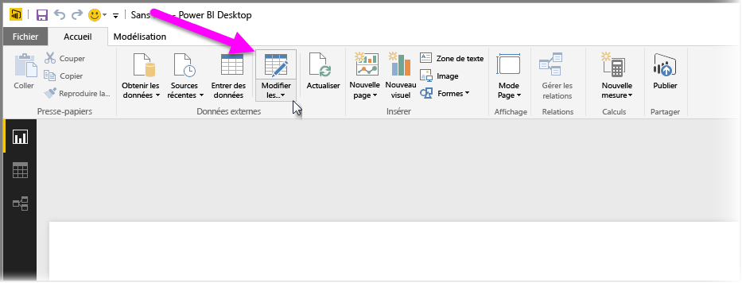
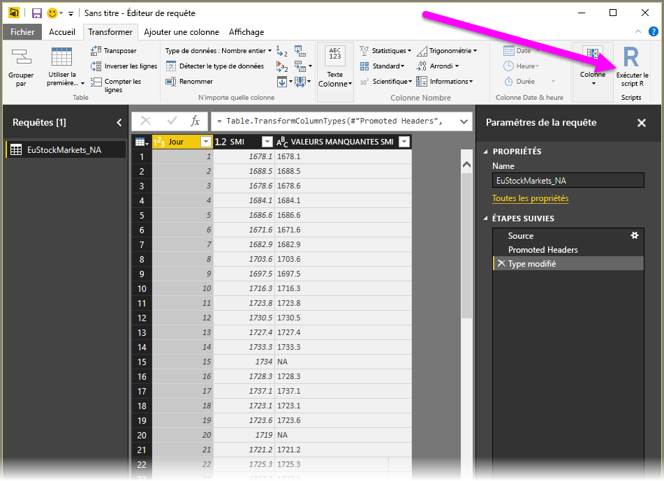
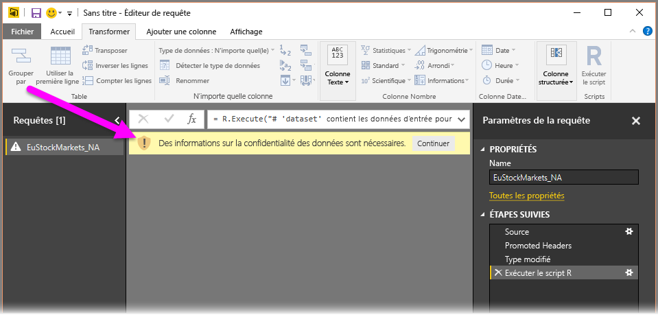
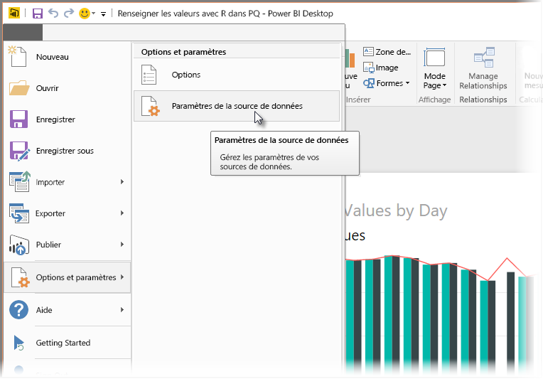
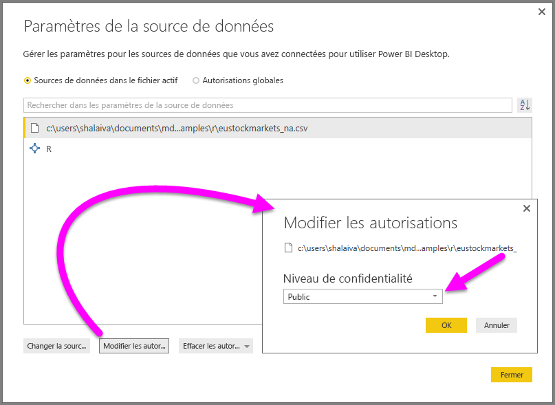

# <a name="use-r-in-query-editor"></a>Utiliser le langage R dans l’Éditeur de requête

[**R**](https://mran.microsoft.com/documents/what-is-r) est un langage de programmation puissant qui est utilisé par de nombreux statisticiens, scientifiques des données et analystes de données. Vous pouvez utiliser **R** dans l’**éditeur de requête** de Power BI Desktop pour :

* Préparer des modèles de données

* Créer des rapports

* Procéder au nettoyage de données, à la mise en forme avancée de données et à l’analytique de jeux de données, ce qui inclut la saisie semi-automatique des données, les prédictions, le clustering, et bien plus encore.  

## <a name="install-r"></a>Installer R

Vous pouvez télécharger **R** gratuitement à partir de la [page de téléchargement de Revolution Open](https://mran.revolutionanalytics.com/download/) et du [dépôt CRAN](https://cran.r-project.org/bin/windows/base/).

### <a name="install-mice"></a>Installer mice

La bibliothèque [**mice**](https://www.rdocumentation.org/packages/mice/versions/3.5.0/topics/mice) doit être installée dans votre environnement R. Sans **mice**, l’exemple de code de script ne fonctionnera pas correctement. Le package **mice** implémente une méthode pour traiter les données manquantes.

Pour installer **mice** :

1. Lancez le programme R.exe (par exemple, C:\Program Files\Microsoft\R Open\R-3.5.3\bin\R.exe)  

2. Exécutez la commande d’installation :

   ``` 
   >  install.packages('mice') 
   ```

## <a name="use-r-in-query-editor"></a>Utiliser le langage R dans l’Éditeur de requête

Pour illustrer l’utilisation de **R** dans l’**Éditeur de requête**, nous allons utiliser un exemple de jeu de données boursières contenues dans un fichier .csv et suivre les étapes suivantes :

1. [Téléchargez le fichier **EuStockMarkets_NA.csv**](http://download.microsoft.com/download/F/8/A/F8AA9DC9-8545-4AAE-9305-27AD1D01DC03/EuStockMarkets_NA.csv). Notez l’endroit où vous l’enregistrez.

1. Chargez le fichier dans **Power BI Desktop** : dans le ruban **Accueil**, sélectionnez **Obtenir des données > Texte/CSV**.

   

1. Sélectionnez le fichier, puis **Ouvrir**. Les données CSV s’affichent dans la boîte de dialogue **Fichier texte/CSV**.

   

1. Une fois les données chargées, vous pouvez les voir dans le volet **Champs**.

   

1. Pour ouvrir l’**Éditeur de requête**, dans le ruban **Accueil**, sélectionnez **Modifier les requêtes** .

   

1. Dans le ruban **Transformer**, sélectionnez **Exécuter un script R**. L’éditeur **Exécuter un script R** s’affiche.  

   Les lignes 15 et 20 ont des données manquantes, tout comme d’autres lignes qui ne sont pas visibles dans l’image. Les étapes ci-dessous montrent comment R complète ces lignes pour vous.

   

1. Pour cet exemple, entrez le code de script suivant. Veillez à remplacer « &lt;Your File Path&gt; » (Chemin de votre fichier) par le chemin de **EuStockMarkets_NA.csv** dans votre système de fichiers local ; par exemple, C:/Users/John Doe/Documents/Microsoft/EuStockMarkets_NA.csv

    ```r
       dataset <- read.csv(file="<Your File Path>/EuStockMarkets_NA.csv", header=TRUE, sep=",")
       library(mice)
       tempData <- mice(dataset,m=1,maxit=50,meth='pmm',seed=100)
       completedData <- complete(tempData,1)
       output <- dataset
       output$completedValues <- completedData$"SMI missing values"
    ```

7. Une fois que vous avez sélectionné **OK**, l’**Éditeur de requête** affiche un avertissement concernant la confidentialité des données.

   
8. Pour que les scripts R fonctionnent correctement dans le service Power BI, vous devez définir toutes les sources de données comme étant **publiques**. Pour plus d’informations sur les paramètres de confidentialité et leurs implications, consultez [Niveaux de confidentialité](desktop-privacy-levels.md).

   

   Une fois que vous avez sélectionné **Enregistrer**, le script s’exécute. Le volet **Champs** comporte une nouvelle colonne appelée **completedValues**. Il existe quelques éléments de données manquants, par exemple sur les lignes 15 et 18. La section suivante explique de quelle façon R gère ce problème.

   Avec seulement cinq lignes de script R, l’**Éditeur de requête** a renseigné les valeurs manquantes à l’aide d’un modèle de prévision.

## <a name="create-visuals-from-r-script-data"></a>Créer des visuels à partir des données de script R

Maintenant, nous pouvons créer un visuel pour voir comment le script R a complété les valeurs manquantes à l’aide de la bibliothèque **mice**, comme illustré dans l’image suivante :


Vous pouvez enregistrer tous les visuels terminés dans un fichier .pbix **Power BI Desktop**, et utiliser le modèle de données et ses scripts R dans le service Power BI.

> [!NOTE]
> Vous pouvez [télécharger un fichier .pbix](http://download.microsoft.com/download/F/8/A/F8AA9DC9-8545-4AAE-9305-27AD1D01DC03/Complete%20Values%20with%20R%20in%20PQ.pbix) une fois toutes ces étapes terminées.

Une fois que vous avez téléchargé le fichier .pbix vers le service Power BI, vous devez effectuer des étapes supplémentaires pour activer l’actualisation des données du service et les visuels mis à jour :  

* **Activer l’actualisation planifiée pour le jeu de données** : pour activer l’actualisation planifiée pour le classeur contenant votre jeu de données avec des scripts R, consultez [Configuration d’une actualisation planifiée](refresh-scheduled-refresh.md), qui inclut également des informations sur la **passerelle personnelle**.

* **Installer la passerelle personnelle** : une **passerelle personnelle** doit être installée sur l’ordinateur où se trouvent le fichier et **R**. Le service Power BI accède à ce classeur et restitue de nouveau tous les visuels mis à jour. Pour plus d’informations, consultez [Installer et configurer la passerelle personnelle](service-gateway-personal-mode.md).

## <a name="limitations"></a>Limites

Il existe certaines limitations pour les requêtes qui incluent des scripts R créés dans l’**Éditeur de requête** :

* Tous les paramètres de source de données R doivent être définis comme étant **publics**. Toutes les autres étapes d’une requête de l’**Éditeur de requête** doivent également être publiques. Pour accéder aux paramètres de la source de données, dans **Power BI Desktop**, sélectionnez **Fichier > Options et paramètres > Paramètres de la source de données**.

  

  Dans la boîte de dialogue **Paramètres de la source de données**, sélectionnez la ou les sources de données, puis **Modifier les autorisations...** .  Définissez le **Niveau de confidentialité** sur **Public**.

      
* Pour activer l’actualisation planifiée de vos visuels R ou d’un jeu de données, vous devez activer l’**Actualisation planifiée** et avoir une **Passerelle personnelle** installée sur l’ordinateur contenant le classeur et **R**. Pour plus d’informations à ce sujet, consultez les liens indiqués dans la section précédente de cet article.

Il existe toutes sortes d’opérations que vous pouvez faire avec R et les requêtes personnalisées. Par conséquent, explorez et mettez en forme vos données de la façon dont vous souhaitez qu’elles apparaissent.

## <a name="next-steps"></a>Étapes suivantes

* [Présentation de R](https://mran.microsoft.com/documents/what-is-r) 

* [Exécuter des scripts R dans Power BI Desktop](desktop-r-scripts.md) 

* [Utiliser un IDE R externe avec Power BI](desktop-r-ide.md) 

* [Packages R du service Power BI](service-r-packages-support.md)
