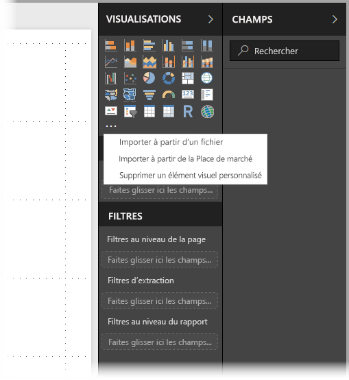
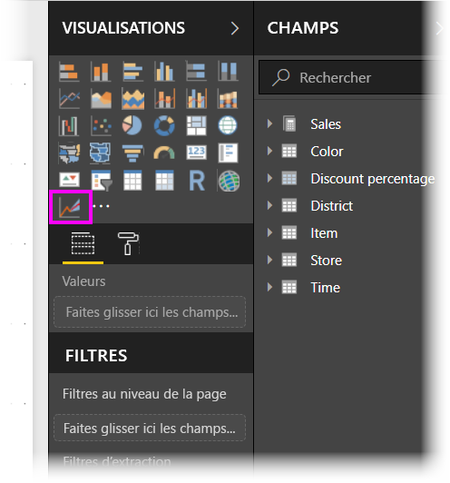
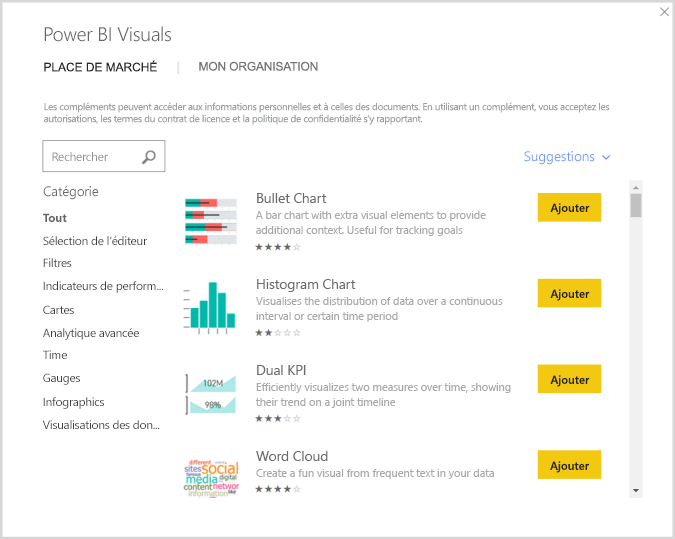

# Utiliser des visuels personnalisés optimisés pour R dans Power BI
Dans **Power BI Desktop** et dans le **service Power BI**, vous pouvez utiliser des visuels personnalisés optimisés pour R sans connaître R ni utiliser de script R. Cela vous permet d’exploiter la puissance d’analyse et visuelle des visuels R et des scripts R sans connaître R ni effectuer de programmation.

Pour utiliser les visuels personnalisés optimisés pour R, il suffit de sélectionner préalablement le visuel personnalisé R qui vous intéresse à partir de la galerie [**AppSource**](https://appsource.microsoft.com/marketplace/apps?product=power-bi-visuals&page=1) de **visuels personnalisés** pour Power BI.

Les sections suivantes expliquent comment sélectionner, charger et utiliser les visuels optimisés pour R dans **Power BI Desktop**.

## Utiliser des visuels personnalisés R
Pour utiliser les visuels optimisés pour R, vous devez télécharger chaque visuel depuis la bibliothèque **de visuels personnalisés**, puis vous pouvez utiliser le visuel comme n’importe quel autre type de visuel dans **Power BI Desktop**. Il existe deux façons d’obtenir des visuels personnalisés : vous pouvez les télécharger à partir du site en ligne **AppSource** ou les parcourir et les obtenir à partir de **Power BI Desktop**. 

### Se procurer des visuels personnalisés à partir d’AppSource

Voici les étapes pour parcourir et sélectionner des visuels à partir du site en ligne **AppSource** :

1. Accédez à la bibliothèque des [visuels Power BI](https://appsource.microsoft.com/marketplace/apps?product=power-bi-visuals&page=1) à l’adresse [https://appsource.microsoft.com](https://appsource.microsoft.com/). Sélectionnez la case à cocher *Applications Power BI* sous *Affiner par produit*, puis sélectionnez le lien **Afficher tout**.
   
   

2. Sélectionnez **Visuels Power BI** dans la liste des compléments dans le volet gauche. 

   

3. Sélectionnez le **visuel** qui vous intéresse dans la galerie. La fenêtre qui s’affiche décrit le visuel. Sélectionnez le bouton **Obtenir maintenant** pour effectuer le téléchargement.
   
   > [!NOTE]
> Pour créer des scripts dans **Power BI Desktop**, il est nécessaire que R soit installé sur votre ordinateur local. Mais lorsque les utilisateurs souhaitent afficher un visuel optimisé pour R dans le **service Power BI**, *il n’est pas*  nécessaire que R soit installé localement.
   > 
   > 
   
   
   
   Vous n’avez pas besoin d’installer R pour utiliser des visuels personnalisés optimisés pour R dans le **service Power BI**. Toutefois, si vous souhaitez utiliser des visuels personnalisés optimisés pour R dans **Power BI Desktop**, vous *devez* installer R sur l’ordinateur local. Vous pouvez télécharger R à partir des emplacements suivants :
   
   * [CRAN](https://cran.r-project.org/)
   * [MRO](https://mran.microsoft.com/)

4. Une fois le visuel téléchargé (comme n’importe quel fichier depuis le navigateur), accédez à **Power BI Desktop** et cliquez avec le bouton droit sur les points de suspension (...) dans le volet **Visualisations**, puis sélectionnez **Importer à partir du fichier**.
   
   
5. Un message vous met en garde sur l’importation d’un visuel personnalisé, comme dans l’image suivante :
   
   
6. Accédez à l’emplacement dans lequel le visuel a été enregistré, puis sélectionnez le fichier correspondant. Les visualisations **Power BI Desktop** personnalisées ont l’extension .pbiviz.
   
   
7. De retour dans Power BI Desktop, vous pouvez constater que le nouveau type de visuel figure dans le volet **Visualisations**.
   
   
8. Lorsque vous importez le nouveau visuel (ou que vous ouvrez un rapport qui contient un visuel personnalisé optimisé pour R), **Power BI Desktop** installe les packages R requis.
   
   

Vous pouvez alors ajouter des données au visuel comme vous le feriez pour n’importe quel autre visuel **Power BI Desktop**. Lorsque vous avez terminé, votre visuel généré s’affiche sur le canevas. Dans l’élément visuel suivant, le visuel **Prévision** optimisé pour R a été utilisé dans les projections de natalité des Nations Unies (visuel sur la gauche).

Comme pour n’importe quel autre visuel **Power BI Desktop**, vous pouvez publier ce rapport avec ses visuels optimisés pour R dans le **service Power BI** et le partager avec d’autres utilisateurs.

Visitez souvent la bibliothèque, car elle est continuellement mise à jour avec de nouveaux visuels.

### Obtenir des visuels personnalisés à partir de **Power BI Desktop**

Vous pouvez également obtenir des visuels personnalisés à partir de **Power BI Desktop**. Dans **Power BI Desktop**, cliquez sur les points de suspension (...) dans le volet **Visualisations** et sélectionnez **Importer du Store**.
   
   

Lorsque vous procédez ainsi, la boîte de dialogue **Visuels personnalisés Power BI** apparaît. Vous pouvez y faire défiler les visuels personnalisés disponibles et sélectionner ceux qui vous intéressent. Vous pouvez effectuer une recherche par nom, sélectionner une catégorie ou simplement parcourir les visuels disponibles. Lorsque vous êtes prêt, sélectionnez simplement **ajouter** pour ajouter le visuel personnalisé à **Power BI Desktop**.

## Contribuer aux visuels personnalisés optimisés pour R
Si vous créez vos propres visuels R pour les utiliser dans vos rapports, vous pouvez les partager de façon publique en les ajoutant à la **galerie de visuels personnalisés**. Le processus de contribution réalisé par le biais de GitHub est décrit ici :

* [Contribution à la galerie des visuels optimisés pour R](https://github.com/Microsoft/PowerBI-visuals#building-r-powered-custom-visual-corrplot)

## Résoudre les problèmes liés aux visuels personnalisés optimisés pour R
Pour qu’ils fonctionnent correctement, les visuels personnalisés optimisés pour R doivent avoir certaines dépendances. Quand les visuels personnalisés optimisés pour R ne s’exécutent pas ou ne se chargent pas correctement, le problème est généralement l’un des suivants :

* Le moteur R est manquant.
* Il existe des erreurs dans les scripts R sur lesquels repose le visuel.
* Les packages R sont manquants ou obsolètes.

La section suivante décrit les étapes de dépannage possibles pour aider à répondre aux difficultés que vous rencontrez.

### Packages R manquants ou obsolètes
Quand vous tentez d’installer un visuel personnalisé optimisé pour R, vous pouvez rencontrer des erreurs lorsque des packages R sont obsolètes ou manquants. Cela est généralement dû à une des raisons suivantes :

* L’installation de R n’est pas compatible avec le package R.
* Des paramètres de proxy, un logiciel antivirus ou un pare-feu empêchent R de se connecter à Internet.
* La connexion Internet est lente ou il y a un problème de connexion.

L’équipe Power BI travaille activement à atténuer ces problèmes en amont. La prochaine version de Power BI Desktop intègrera des mises à jour qui permettront de les résoudre. En attendant, vous pouvez effectuer une ou plusieurs des étapes suivantes pour atténuer les problèmes :

1. Supprimez le visuel personnalisé, puis réinstallez-le. Cela lance une nouvelle installation des packages R.
2. Si votre installation de R n’est pas à jour, mettez-la à niveau, puis supprimez/réinstallez le visuel personnalisé comme décrit à l’étape précédente.
   
   * Les versions prises en charge de R sont répertoriées dans la description de chaque visuel personnalisé optimisé pour R, comme illustré dans l’image suivante.
     
     > [!NOTE]
> Vous pouvez conserver l’installation R d’origine et associer uniquement Power BI Desktop avec la version actuelle que vous installez. Accédez à **Fichier -> Options et paramètres -> Options > Script R**.
3. Installez les packages R manuellement à l’aide d’une console R. Les étapes de cette approche sont les suivantes :
   
   a.  Téléchargez le script d’installation des visuels optimisés pour R et enregistrez ce fichier sur un lecteur local.
   
   b.  Dans la console R, exécutez la commande suivante :
   
       > source(“C:/Users/david/Downloads/ScriptInstallPackagesForForecastWithWorkarounds.R”)    
   
   Les emplacements d’installation par défaut sont les suivants :
   
       c:\Program Files\R\R-3.3.x\bin\x64\Rterm.exe (for CRAN-R)
       c:\Program Files\R\R-3.3.x\bin\x64\Rgui.exe (for CRAN-R)
       c:\Program Files\R\R-3.3.x\bin\R.exe (for CRAN-R)
       c:\Program Files\Microsoft\MRO-3.3.x\bin\R.exe (for MRO)
       c:\Program Files\Microsoft\MRO-3.3.x\bin\x64\Rgui.exe (for MRO)
       c:\Program Files\RStudio\bin\rstudio.exe (for RStudio)
4. Si les étapes précédentes ne fonctionnent pas, essayez ce qui suit :
   
   a. Utilisez **R Studio** et suivez les étapes décrites dans la section 3.b. ci-dessus (exécuter la ligne de script à partir de la console R).
   
   b. Si l’étape précédente ne fonctionne pas, modifiez **Outils > Options globales > Packages** dans **R Studio**, activez la case à cocher **Utiliser la bibliothèque/le proxy Internet Explorer pour HTTP**, puis répétez l’étape 3.b. décrite ci-dessus.

## Étapes suivantes
Consultez les informations supplémentaires suivantes sur R dans Power BI.

* [Galerie de visuels personnalisés Power BI](https://app.powerbi.com/visuals/)
* [Exécution de scripts R dans Power BI Desktop](desktop-r-scripts.md)
* [Créer des visuels Power BI Desktop avec R](desktop-r-visuals.md)
* [Utiliser un IDE R externe avec Power BI](desktop-r-ide.md)

