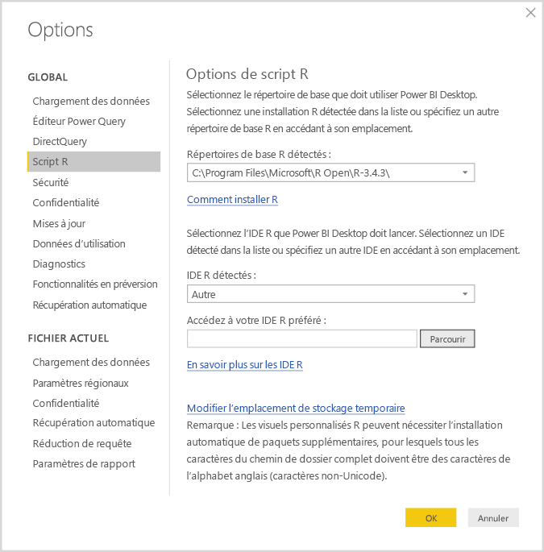
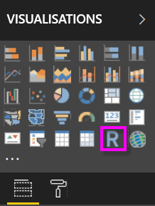
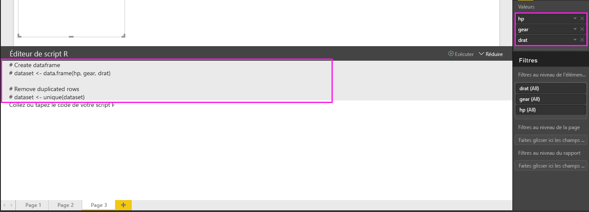
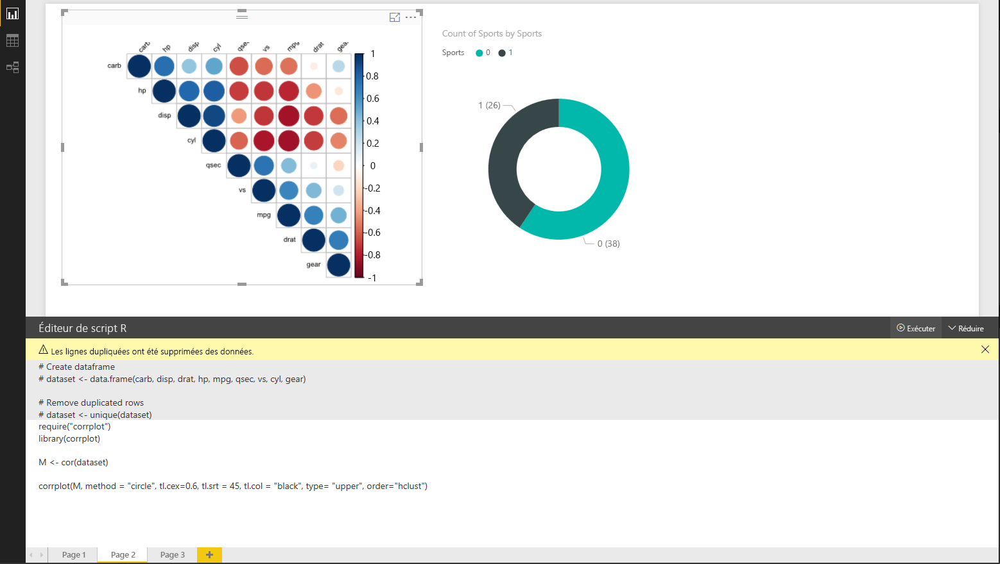
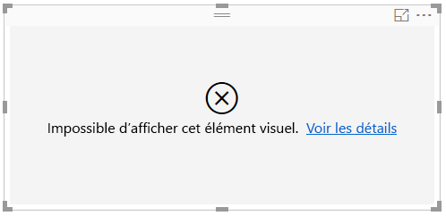

# Créer des éléments visuels Power BI avec R
**Power BI Desktop** vous permet d’utiliser **R** pour visualiser vos données.

## Installer R
**Power BI Desktop** n’inclut pas le moteur **R**. Vous ne pouvez pas non plus le déployer ni l’installer. Pour exécuter des scripts R dans **Power BI Desktop**, vous devez installer **R** séparément sur votre ordinateur local. Vous pouvez télécharger et installer **R** gratuitement à partir de nombreux emplacements, dont les pages [Download Revolution R Open](https://mran.revolutionanalytics.com/download/) et [CRAN Repository](https://cran.r-project.org/bin/windows/base/). La version actuelle des scripts R dans **Power BI Desktop** prend en charge les caractères Unicode ainsi que les espaces (caractères vides) dans le chemin d’installation.

## Activer les visuels R
Pour activer les visuels R, sélectionnez **Fichier > Options et paramètres > Options**, puis, dans la page **Options** qui s’affiche, assurez-vous que votre installation R locale est spécifiée dans la section **Script R** de la fenêtre **Options**, comme illustré dans l’image suivante. Dans l’image suivante, le chemin de l’installation locale de R est le suivant : **C:\Program Files\R\R-3.2.0** . Celui-ci est explicitement fourni dans la zone de texte. Vérifiez que le chemin indiqué reflète correctement l’installation locale de R que **Power BI Desktop** doit utiliser.
   
   

Après avoir spécifié votre installation R, vous pouvez commencer à créer des éléments visuels R.

## Créer des visuels R dans Power BI Desktop
1. Sélectionnez l’icône **Élément visuel R** s’affiche dans le volet **Visualization**, comme indiqué dans l’image suivante.
   
   

   Quand vous ajoutez un visuel R à un rapport, **Power BI Desktop** effectue les opérations suivantes :
   
   - Une image de visuel R apparaît sous forme d’espace réservé sur le canevas de rapport.
   
   - L’**Éditeur de script R** s’affiche dans la partie inférieure du volet central.
   
   

2. Ensuite, ajoutez les champs que vous souhaitez utiliser dans votre script R à la section **Valeurs** de la zone **Champs**, comme vous le feriez pour tout autre visuel **Power BI Desktop**. 
    
    Seuls les champs qui ont été ajoutés à la barre d’outils **Champs** sont disponibles pour votre script R. Vous pouvez ajouter de nouveaux champs ou supprimer les champs inutiles de la barre d’outils **Champs** pendant que vous travaillez sur votre script R dans **l’Éditeur de scripts R de Power BI Desktop**. **Power BI Desktop** détecte automatiquement les champs que vous avez ajoutés ou supprimés.
   
   > [!NOTE]
   > Le type d’agrégation par défaut pour les éléments visuels R est *Ne pas résumer*.
   > 
   > 
   
3. Vous pouvez à présent utiliser les données sélectionnées pour créer un tracé. 

    Quand vous sélectionnez des champs, l’ **Éditeur de script R** génère un code de liaison au script R de prise en charge en fonction des sélections effectuées dans la section grise située dans la partie supérieure du volet de l’éditeur. Quand vous sélectionnez ou supprimez des champs supplémentaires, le code de prise en charge dans l’Éditeur de script R est automatiquement généré ou supprimé selon le cas.
   
   Dans l’exemple présenté dans l’image suivante, trois champs ont été sélectionnés : hp, gear et drat. Suite à ces sélections, l’éditeur de script R a généré le code de liaison suivant :
   
   * Une trame de données appelée **dataset** a été créée
     * Cette trame de données se compose des différents champs sélectionnés par l’utilisateur
   * L’agrégation par défaut est *ne pas résumer*
   * Comme pour les éléments visuels de table, les champs sont regroupés et les lignes en double n’apparaissent qu’une fois
   
   
   
   > [!TIP]
   > Dans certains cas, il peut être dans votre intérêt de ne pas avoir recours au regroupement automatique ou bien d’afficher toutes les lignes, notamment les doublons. Dans ce cas, vous pouvez ajouter un champ d’index à votre jeu de données. De cette façon, toutes les lignes sont considérées comme étant uniques, ce qui empêche le regroupement.
   > 
   > 
   
   La tramedonnées générée est appelée **jeu de données** et les colonnes sélectionnées sont accessibles par leurs noms respectifs. Par exemple, vous pouvez accéder au champ d’engrenage en écrivant *dataset$gear* dans votre script R. Pour les champs avec des espaces ou des caractères spéciaux, utilisez des guillemets simples.

4. Une fois la tramedonnées générée automatiquement par les champs que vous avez sélectionnés, vous pouvez écrire un script R de traçage sur le périphérique R par défaut. Une fois le script terminé, sélectionnez **Exécuter** dans la barre de titre **Éditeur de script R** (**Exécuter** se trouve à droite de la barre de titre).
   
    Quand vous sélectionnez **Exécuter**, **Power BI Desktop** identifie le tracé et le présente sur le canevas. Le processus étant exécuté sur l’installation locale de R, vérifiez que les packages nécessaires sont installés.
   
   **Power BI Desktop** retrace le visuel lorsque l’un des événements suivants se produit :
   
   * Lorsque vous sélectionnez **Exécuter** dans la barre de titres **Éditeur de script R**
   * À chaque changement de données dû à l’actualisation des données, au filtrage ou à la mise en surbrillance

    L’image suivante montre un exemple du code de tracé de corrélation et trace les corrélations entre les attributs de différents types de voitures.

    

5. Pour obtenir une vue agrandie des visualisations, vous pouvez réduire l’ **Éditeur de script R**. Bien entendu, comme pour d’autres visuels dans **Power BI Desktop**, vous pouvez appliquer un filtre croisé au tracé de corrélation en sélectionnant uniquement les voitures de sport dans le visuel en anneau (visuel rond à droite, dans l’exemple ci-dessus).

    

6. Vous pouvez également modifier le script R pour personnaliser l’élément visuel et mettre à profit toute la puissance de R en ajoutant des paramètres à la commande de traçage.

    La commande de traçage d’origine était la suivante :

    corrplot(M, method = "color",  tl.cex=0.6, tl.srt = 45, tl.col = "black")

    Après quelques modifications apportées au script R, la commande se présente désormais comme suit :

    corrplot(M, method = "circle", tl.cex=0.6, tl.srt = 45, tl.col = "black", type= "upper", order="hclust")

    L’élément visuel R trace donc à présent des cercles, en considérant uniquement la moitié supérieure, et réorganise la matrice pour mettre en cluster les attributs corrélés, comme le montre l’image suivante.

    

    Quand vous exécutez un script R qui génère une erreur, l’élément visuel R n’est pas tracé et un message d’erreur s’affiche sur le canevas. Pour obtenir plus d’informations sur l’erreur, sélectionnez **Voir les détails** dans l’erreur se rapportant à l’élément visuel R sur le canevas.

    

    > **Sécurité des scripts R :** les éléments visuels R sont créés à partir de scripts R, qui peuvent contenir du code qui présente des risques pour la sécurité ou la confidentialité. Quand un utilisateur tente d’afficher un visuel R ou d’interagir avec ce dernier pour la première fois, un message d’avertissement de sécurité lui est présenté. Activez les éléments visuels R seulement si vous faites confiance à l’auteur et à la source ou après avoir examiné et compris le script R.
    > 
    > 

## Limites connues
Les visuels R dans **Power BI Desktop** présentent quelques limitations :

* Limites concernant la taille des données : les données utilisées par les éléments visuels R pour le traçage sont limitées à 150 000 lignes. Si plus de 150 000 lignes sont sélectionnées, seules les 150 000 premières lignes sont utilisées et un message s’affiche sur l’image.
* Limite concernant la durée du calcul : si le calcul d’un visuel R prend plus de 5 minutes, le délai d’exécution est dépassé et une erreur est générée.
* Relations : comme avec d’autres éléments visuels Power BI Desktop, si des champs de données issus de différentes tables avec aucune relation définie entre elles sont sélectionnés, une erreur se produit.
* Les éléments visuels R sont actualisés lors de la mise à jour, du filtrage et de la mise en surbrillance des données. Toutefois, l’image elle-même n’est pas interactive et ne peut pas être la source du filtrage croisé.
* Les éléments visuels R répondent à la mise en surbrillance d’autres éléments visuels, mais vous ne pouvez pas cliquer sur des éléments dans l’élément visuel R pour appliquer un filtre croisé à d’autres éléments.
* Seuls les tracés représentés sur le périphérique d’affichage R par défaut R s’affichent correctement sur le canevas. Évitez d’utiliser explicitement un autre périphérique d’affichage R.
* Dans cette version, les installations RRO ne sont pas automatiquement identifiées par la version 32 bits de Power BI Desktop. Par conséquent, vous devez définir manuellement le chemin d’accès au répertoire d’installation R dans **Options et paramètres > Options > scripts R**.

## Étapes suivantes
Consultez les informations supplémentaires suivantes sur R dans Power BI.

* [Exécution de scripts R dans Power BI Desktop](desktop-r-scripts.md)
* [Utiliser un IDE R externe avec Power BI](desktop-r-ide.md)

