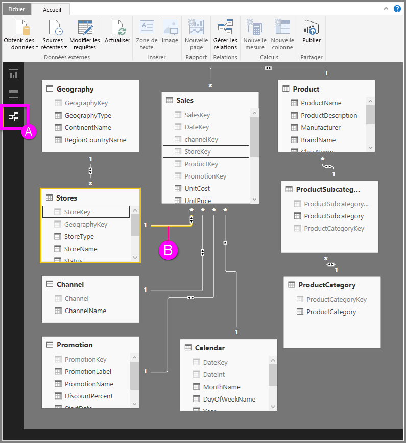

# Vue Relation dans Power BI Desktop
La **vue Relation** affiche toutes les tables, colonnes et relations dans votre modèle. Cela peut être particulièrement utile quand votre modèle contient des relations complexes entre de nombreuses tables.

Jetons un œil !

**A.**  Icône de vue Relation : cliquez dessus pour afficher votre modèle dans la vue Relation.

**B.** Relation : vous pouvez pointer votre curseur sur une relation pour voir les colonnes utilisées. Double-cliquez sur une relation pour l’ouvrir dans la boîte de dialogue **Modifier la relation**. 

Dans la figure ci-dessus, vous pouvez voir que la table *Stores (Magasins)* possède une colonne *StoreKey (Clé_Magasin)* qui est liée à la table *Sales (Ventes)*, qui possède également une colonne *StoreKey*. Nous constatons qu’il s’agit d’une relation de type *plusieurs à un* (\*:1), et l’icône au milieu de la ligne indique que la direction du filtrage croisé est *À double sens*. La flèche sur l’icône indique la direction du flux de contexte de filtre.

Pour en savoir plus sur les relations, consultez [Créer et gérer des relations dans Power BI Desktop](desktop-create-and-manage-relationships.md).

