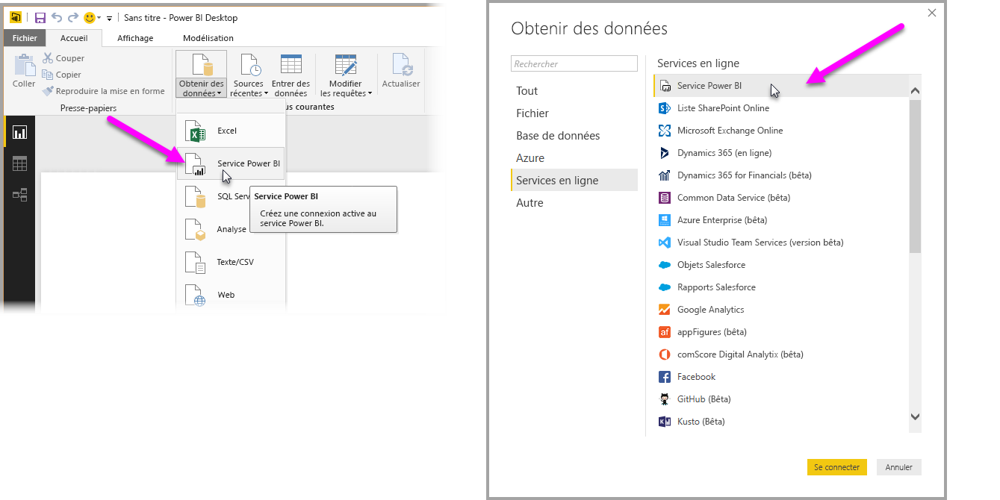
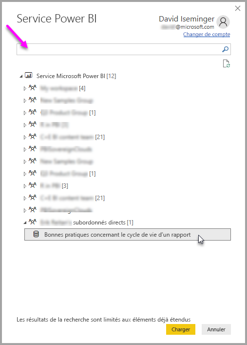

# Se connecter à des jeux de données dans le service Power BI à partir de Power BI Desktop
Vous pouvez établir une connexion active à un jeu de données partagé dans le service Power BI, et créer de nombreux rapports différents à partir du même jeu de données. Cela signifie que vous pouvez créer votre modèle de données idéal dans Power BI Desktop et le publier sur le service Power BI, après quoi vos collègues et vous pouvez créer plusieurs rapports (dans des fichiers .pbix distinct) à partir de ce modèle de données commun. Cette fonctionnalité est appelée **Connexion active du service Power BI**.

Cette fonctionnalité présente toutes sortes d’avantages, dont des meilleures pratiques que nous allons évoquer dans le cadre de cet article. Il y a également quelques considérations et limitations à prendre en compte. Celles-ci figurent à la fin de cet article et nous vous recommandons vivement de les lire.

## Utilisation d’une Connexion active du service Power BI pour gérer le cycle de vie des rapports
L’un des problèmes liés à la popularité de Power BI est la prolifération des rapports, des tableaux de bord et de leurs modèles de données sous-jacents. En effet, il est facile de créer des rapports percutants dans **Power BI Desktop** puis de les partager ([publier](desktop-upload-desktop-files.md)) sur le **service Power BI**, ainsi que de créer des tableaux de bord à partir de ces jeux de données. Étant donné que de nombreux utilisateurs procèdent de la sorte, souvent en utilisant les mêmes (ou presque les mêmes) jeux de données, il est devenu difficile de déterminer le jeu de données sur lequel un rapport est basé, ainsi que la fraîcheur du jeu de données en question. La fonctionnalité **Connexion active du service Power BI** relève ce défi en facilitant la création, le partage et le développement cohérents de rapports et tableaux de bord basés sur un jeu de données commun.

### Créer et partager un jeu de données utilisable par chacun
Supposons qu’Annette (analyste d’entreprise) fait partie de votre équipe. Elle excelle dans la création de modèles de données (souvent appelés jeux de données) de qualité. Forte de son expertise, Annette peut créer un jeu de données et un rapport, puis partager ce dernier sur le **service Power BI**.

Tout le monde apprécie son rapport et son jeu de données, et cela peut occasionner un problème. En effet, tous les membres de son équipe peuvent tenter de créer *leur propre version* de ce jeux de données, puis partager leur propre rapport avec l’équipe. Soudainement, il y a une multitude de rapports (basés sur des jeux de données différents) au sein de l’espace de travail de votre équipe dans le **service Power BI**. Quel est le plus récent ? Les jeux de données utilisés sont-ils identiques, ou seulement presque identiques ? Quelles sont les différences ? La fonctionnalité **Connexion active du service Power BI** peut changer tout cela pour mieux. La section suivante explique comment d’autres personnes peuvent utiliser le jeu de données d’Annette pour créer leurs propres rapports, et permettre à chacun d’utiliser le même jeu de données solide, vérifié et publié pour générer leurs rapports uniques.

### Se connecter à un jeu de données du service Power BI à l’aide d’une connexion active
Après avoir créé son rapport (et le jeu de données sur lequel il est basé), Annette publie celui-ci sur le **service Power BI**. Le rapport s’affiche alors dans l’espace de travail de son équipe sur le service Power BI. Tous les membres de l’équipe peuvent désormais consulter le rapport d’Annette dans l’espace de travail de celle-ci.

D’autres membres de l’espace de travail d’Annette peuvent à présent établir une connexion active au modèle de données qu’elle a partagé (à l’aide de la fonctionnalité **Connexion active du service Power BI**) et créer leurs propres rapports uniques à partir de *son jeu de données d’origine*.

L’image suivante montre comment Annette crée un rapport **Power BI Desktop** (et son modèle de données) et le publie sur le **service Power BI**. Ensuite, d’autres membres de son espace de travail peuvent se connecter à son modèle de données à l’aide de la fonctionnalité **Connexion active du service Power BI** et créer leurs propres rapports uniques basés sur son jeu de données.

> [!NOTE]
> Les jeux de données sont partagés dans un seul espace de travail. Pour que vous puissiez établir une Connexion active du service Power BI, le jeu de données auquel vous vous connectez doit figurer dans un espace de travail partagé dont vous êtes membre.
> 
> 

## Procédure détaillée d’utilisation de la fonctionnalité Connexion active du service Power BI
À présent que nous savons l’utilité de la fonctionnalité **Connexion active du service Power BI** et comment vous d’en servir en tant que meilleure approche pratique de la gestion du cycle de vie des rapports, nous allons étudier les étapes qui permettent de passer de l’excellent rapport d’Annette (et du jeu de données sous-jacent) à un jeu de données partagé que ses coéquipiers peuvent utiliser dans son espace de travail Power BI.

### Publier un rapport et un jeu de données Power BI
La première étape de la gestion du cycle de vie des rapports à l’aide de la fonctionnalité **Connexion active du service Power BI** est de disposer d’un rapport (et d’un jeu de données) que les coéquipiers ont envie utiliser. Annette doit donc commencer par **publier** son rapport à partir de **Power BI Desktop**. Pour ce faire, elle sélectionne **Publier** dans le ruban **Accueil** de Power BI Desktop.

Si elle n’est pas connectée à son compte de service Power BI, elle est invitée à le faire.

À partir de là, elle peut choisir l’espace de travail sur lequel le rapport et le jeu de données doivent être publiés. N’oubliez pas que seuls les membres ayant accès à l’espace de travail sur lequel un rapport est publié peuvent accéder au jeu de données de celui-ci à l’aide de la fonctionnalité **Connexion active du service Power BI**.

Le processus de publication commence et **Power BI Desktop** affiche sa progression.

Une fois la publication terminée, **Power BI Desktop** vous indique la réussite de l’opération et fournit quelques liens pour accéder au rapport proprement dit sur le **service Power BI**, ainsi qu’un lien pour accéder à des **Informations rapides** sur le rapport.

Voyons à présent comment les autres coéquipiers ayant accès à l’espace de travail dans lequel le rapport (et le jeu de données) a été publié peuvent se connecter au jeu de données pour créer leurs propres rapports.

### Établir une Connexion active du service Power BI au jeu de données publié
Pour établir une connexion au rapport publié et créer votre propre rapport basé sur le jeu de données publié, dans le ruban **Accueil** de **Power BI Desktop**, sélectionnez **Obtenir des données**, puis sélectionnez **Service Power BI**. Vous pouvez également sélectionner **Obtenir des données > Services en ligne > Service Power BI**.

Si vous n’êtes pas connecté à Power BI, vous êtes invité à le faire. Une fois connecté, vous voyez une fenêtre qui affiche les espaces de travail dont vous êtes membre, dans laquelle pouvez sélectionner celui qui contient le jeu de données avec lequel vous souhaitez établir une **Connexion active du service Power BI**.

Le nombre entre parenthèses en regard de l’espace de travail correspond au nombre de jeux de données partagés disponibles dans ce groupe de travail, et la sélection du triangle à gauche a pour effet de développer l’espace de travail dans lequel vous pouvez sélectionner le jeu de données partagé.

Quelques éléments sont à noter dans la fenêtre précédente de connexion active du **service Power BI**:

* Vous pouvez rechercher un jeu de données partagé mais, les résultats de la recherche étant limités aux éléments développés, ils n’incluent pas les espaces de travail que vous n’avez pas développés.
* Vous pouvez développer plusieurs espaces de travail pour élargir votre recherche.

Lorsque vous sélectionnez **Charger** dans la fenêtre, vous établissez une connexion active au jeu de données sélectionné, ce qui signifie que les données que vous voyez (les champs et leurs valeurs) sont chargées dans **Power BI Desktop** en temps réel.

À présent, vous (et vos coéquipiers) pouvez créer et partager des rapports personnalisés basés sur le même jeu de données. Il s’agit d’un excellent moyen d’avoir un jeu de données bien formé créé par une personne expérimentée (en l’occurrence, Annette) et d’autoriser de nombreux coéquipiers à utiliser ce jeu de données partagé pour créer leurs propres rapports.

> [!NOTE]
> Lorsque vous créez des rapports basés sur un jeu de données à l’aide d’une connexion active au **service Power BI**, vous ne pouvez publier ce rapport que pour l’espace de travail de service Power BI qui contient le jeu de données utilisé.
> 
> 

## Considérations et limitations
Lors de l’utilisation de la **connexion active du service Power BI**, vous devez garder à l’esprit les quelques considérations et limitations suivantes.

* Les membres en lecture seule d’un espace de travail ne peuvent pas se connecter à des jeux de données à partir de **Power BI Desktop**.
* Seuls les utilisateurs faisant partie du même espace de travail du **service Power BI** peuvent se connecter à un jeu de données publié à l’aide de la fonctionnalité **Connexion active du service Power BI**. Les utilisateurs peuvent (c’est souvent le cas) appartenir à plusieurs espaces de travail.
* Dans la mesure où il s’agit d’une connexion active, le volet de navigation de gauche et la modélisation sont désactivés. Ce comportement est similaire à celui observé en cas de connexion à **SQL Server Analysis Services**.
* Dans la mesure où il s’agit d’une connexion active, la sécurité au niveau des lignes (RLS), OneDrive Entreprise et d’autres comportements de connexion similaires sont appliqués, tout comme en cas de connexion à **SQL Server Analysis Services**.
* Lorsque vous sélectionnez le jeu de données auquel se connecter dans le **service Power BI**, la zone de recherche s’applique uniquement aux espaces de travail développés.
* Si le propriétaire modifie le fichier .pbix partagé d’origine, le jeu de données et le rapport partagé dans le **service Power BI** sont remplacés.
* Les membres d’un espace de travail ne peuvent pas remplacer le rapport partagé d’origine. Sinon, un avertissement vous invite à renommer le fichier et à le publier.
* Si vous supprimez le jeu de données partagé dans le **service Power BI**, les autres fichiers **Power BI Desktop** (.pbix) cessent de fonctionner correctement ou d’afficher leurs visuels.
* Pour les packs de contenu, vous devez commencer par créer une copie d’un pack de contenu afin de l’utiliser comme base pour partager un rapport et un jeu de données .pbix pour le **service Power BI**.
* Pour les packs de contenu à partir de *Mon organisation*, une fois la copie effectuée, vous ne pouvez pas remplacer le rapport créé sur le service et/ou un rapport créé dans le cadre de la copie d’un pack de contenu avec une connexion active. Sinon, un avertissement vous invite à renommer le fichier et à le publier. Dans ce cas, vous pouvez uniquement remplacer des rapports publiés connectés en direct.
* Lorsque vous créez un rapport basé sur un jeu de données à l’aide d’une connexion active au **service Power BI**, vous ne pouvez publier ce rapport que pour l’espace de travail de service Power BI qui contient le jeu de données utilisé.
* Lorsque vous supprimez un jeu de données partagé dans le **service Power BI**, vous ne pouvez plus y accéder à partir de **Power BI Desktop**.

