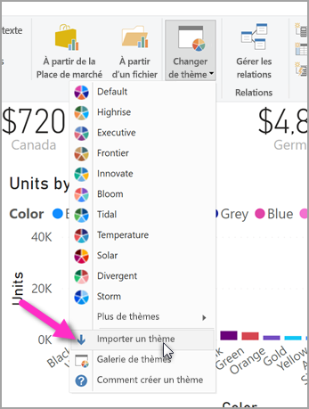
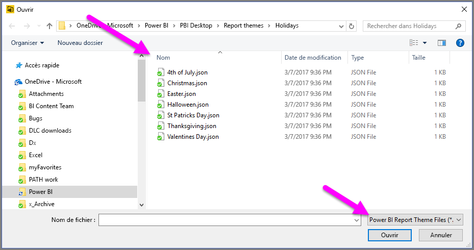
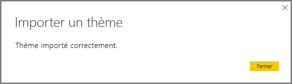
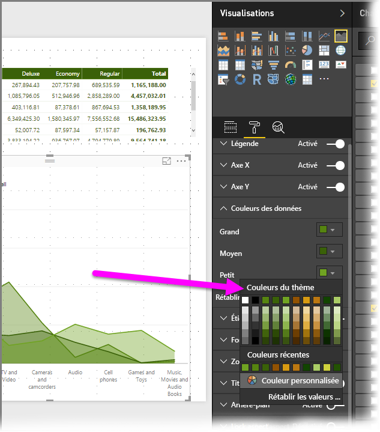
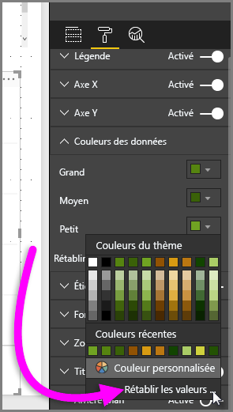
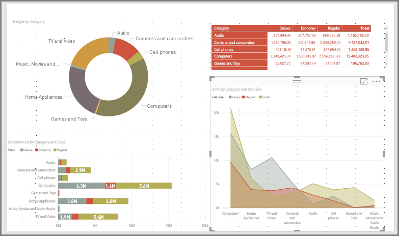

# <a name="use-report-themes-in-power-bi-desktop"></a>Utiliser des thèmes de rapport dans Power BI Desktop
Avec les **Thèmes de rapport**, vous pouvez appliquer des modifications de conception à l’ensemble de votre rapport, par exemple en utilisant les couleurs de votre entreprise, en modifiant des jeux d’icônes ou en appliquant une nouvelle mise en forme visuelle par défaut. Lorsque vous appliquez un **thème de rapport**, tous les visuels du rapport utilisent les couleurs et la mise en forme du thème sélectionné. Quelques exceptions s’appliquent. Elles sont décrites plus loin dans cet article.


Lorsque vous appliquez un **thème de rapport** personnalisé, vous avez besoin d’un fichier JSON qui utilise une structure de base. Vous pouvez ensuite importer ce fichier JSON dans Power BI Desktop et l’appliquer à votre rapport.

Vous pouvez également personnaliser et normaliser presque tous les éléments affichés dans le volet **Mise en forme** via des personnalisations effectuées directement dans Power BI Desktop ou via le fichier JSON du thème. L’objectif est de vous donner un contrôle complet sur l’apparence des rapports à un niveau granulaire.

## <a name="how-report-themes-work"></a>Fonctionnement des thèmes de rapport
Pour appliquer un thème de rapport à un rapport Power BI Desktop, vous pouvez effectuer votre choix parmi les thèmes de rapport intégrés disponibles, ou bien créer ou importer un thème personnalisé.

| Thème de rapport intégré | Séquence de couleurs par défaut    |
|------ |---------- |
| Par défaut   | |
| Tour  | |
| Executive     | |
| Frontière  | |
| Innovant    | |
| Bourgeon     | |
| Marée | |
| Température   | |
| Solaire | |
| Divergent     | |
| Orage     | |
| Classique   | |
| Jardin public     | |
| Classe     | |
| Adapté aux daltoniens   | |
| Électrique  | |
| Contraste élevé     | |
| Coucher de soleil    | |
| Crépuscule  | |

Pour choisir parmi les thèmes de rapport intégrés, sélectionnez le bouton **Changer de thème** dans le ruban **Accueil**, puis sélectionnez l’un des thèmes inclus dans le menu déroulant.


Votre thème de rapport est appliqué au rapport, tout est prêt.

### <a name="importing-report-themes"></a>Importation de thèmes de rapport

Pour importer un thème de rapport personnalisé, sélectionnez le bouton **Changer de thème** dans le ruban **Accueil**. Puis sélectionnez **Importer un thème** dans le menu déroulant.



Une fenêtre s’affiche dans laquelle vous pouvez naviguer pour accéder à l’emplacement du fichier de thème JSON. Power BI Desktop recherche des fichiers JSON, c’est-à-dire le type de fichier de thème rapport Power BI. Dans l’image suivante, quelques fichiers de thème des vacances sont disponibles. Pour mars, nous allons choisir un thème basé sur les vacances.



Une fois le fichier de thème correctement chargé, Power BI Desktop vous en informe.



Il y a deux façons de personnaliser des thèmes dans Power BI Desktop. Examinons plus en détail chacun d’entre eux.


## <a name="customize-report-themes-preview"></a>Personnaliser les thèmes de rapport (préversion)

À compter de la version de décembre 2019 de **Power BI Desktop**, il existe maintenant deux façons de personnaliser un thème de rapport :

* Créer et personnaliser un thème dans Power BI Desktop (préversion)
* Création et personnalisation d’un fichier JSON de thème de rapport personnalisé

Pour personnaliser un thème directement dans Power BI Desktop, vous devez d’abord sélectionner **Fichier > Options et paramètres > Options** puis, dans la section **Fonctionnalités en préversion**, cochez la case en regard de **Personnaliser le thème actif**, comme illustré dans l’image suivante.


Vous pouvez être invité à redémarrer Power BI Desktop pour activer la fonctionnalité en préversion.

Après avoir redémarré, vous pouvez commencer à personnaliser le thème actif en sélectionnant le ruban **Accueil**, puis en sélectionnant **Changer de thème > Personnaliser le thème actif** dans le ruban. Une boîte de dialogue s’affiche, qui présente les différentes façons de personnaliser un thème existant.


Si vous aimez un thème existant et que vous souhaitez effectuer quelques ajustements, vous pouvez le sélectionner, puis sélectionner **Personnaliser le thème actif** dans la boîte de dialogue, comme illustré dans l’image suivante. 


> [!NOTE]
> L’image précédente a été capturée avec le nouveau ruban activé, qui est actuellement en préversion. Vous pouvez activer la préversion du nouveau ruban en sélectionnant **Fichier > Options et paramètres > Options** puis, dans la section **Fonctionnalités en préversion**, sélectionnez **Préversion du nouveau ruban**.

Les paramètres de thème qui peuvent être personnalisés se trouvent dans les catégories suivantes, qui apparaissent dans la boîte de dialogue Personnaliser le thème :

* Nom du thème (vous pouvez nommer le thème que vous personnalisez) et différents paramètres de couleur (couleurs du thème, couleurs de sentiment, couleurs divergentes, etc.)
* Paramètres de texte, notamment la famille de polices, la taille et la couleur, ainsi que les titres d’axe, les couleurs, les cartes et les indicateurs de performance clés, et les en-têtes des onglets
* Éléments des visuels, comme l’arrière-plan, la bordure, l’en-tête et les info-bulles
* Éléments des pages, comme le papier peint et l’arrière-plan
* Paramètres du volet de filtre, notamment la couleur d’arrière-plan, la transparence, la police et la couleur des icônes, la taille, les cartes de filtre, etc.

Une fois que vous avez apporté vos modifications et sélectionné le bouton **Appliquer et enregistrer**, votre thème est enregistré, et il peut ensuite être utilisé dans le rapport actif et être exporté. 

La personnalisation du thème actif de cette façon peut vous permettre de travailler rapidement et facilement sur la personnalisation des thèmes. Il existe cependant un nombre limité d’ajustements pour les thèmes qui nécessitent la modification du fichier JSON du thème, comme décrit dans la section suivante.

> [!TIP]
> Vous pouvez personnaliser la plupart des éléments des thèmes en utilisant des éléments visuels avec la boîte de dialogue **Personnaliser le thème actif**, puis vous pouvez exporter le fichier JSON et effectuer manuellement les ajustements (en modifiant le fichier JSON lui-même). Ensuite, vous pouvez renommer ce fichier JSON optimisé, l’importer et disposer ainsi de tous les ajustements souhaités.


## <a name="structure-of-a-report-theme-json-file"></a>Structure d’un fichier JSON de thème de rapport
 Ouvert dans un éditeur, le fichier JSON de base sélectionné dans la section précédente (fichier *St Patrick's Day.json*) ressemble à la capture d’écran suivante :


Ce fichier JSON doit contenir les lignes suivantes :

* **name** : Le nom du thème, qui est le seul champ obligatoire.

* **dataColors** : La liste des codes hexadécimaux des couleurs à utiliser pour les données dans les visuels Power BI Desktop. Cette liste peut contenir le nombre de couleurs que vous voulez.

* **background**, **foreground**, et **tableAccent** : Plusieurs classes de couleurs. Nous étudierons les détails des classes de couleurs plus loin dans cet article, mais vous savez que les classes de couleurs vous permettent de définir simultanément de nombreuses couleurs dans votre rapport.

Ensuite vient le texte du fichier *St Patrick's Day.json* que vous pouvez utiliser pour créer votre propre fichier JSON :

```json
    {
        "name": "St Patricks Day",
        "dataColors": ["#568410", "#3A6108", "#70A322", "#915203", "#D79A12", "#bb7711", "#114400", "#aacc66"],
        "background":"#FFFFFF",
        "foreground": "#3A6108",
        "tableAccent": "#568410"
    }
```

Si tout ce que vous voulez faire est d’ajuster les couleurs de base de votre rapport, vous pouvez simplement modifier le nom et les codes hexadécimaux de ce fichier pour préparer votre fichier JSON personnel à l’importation.

Dans le fichier JSON, vous définissez uniquement la mise en forme que vous souhaitez régler, et tout ce qui n’est *pas* spécifié dans votre fichier JSON prend simplement les paramètres par défaut de Power BI.

Les avantages de la création d’un fichier JSON sont nombreux. Par exemple, vous pouvez spécifier que tous les graphiques utilisent une taille de police de 12 points ou que certains visuels utilisent une famille de polices particulière. Ou vous pouvez désactiver les étiquettes de données pour des types de graphiques spécifiques.

Lorsque vous utilisez un fichier JSON granulaire, vous pouvez créer un fichier de thèmes qui normalise vos graphiques et rapports, facilitant ainsi la mise en cohérence des rapports de votre organisation.

Pour plus d’informations sur le format du fichier JSON détaillé, voir la section **Format de fichier de JSON de thèmes de rapport** plus loin dans cet article.

## <a name="how-report-theme-colors-stick-to-your-reports"></a>Comment les couleurs de thème de rapport restent associées à celui-ci
Lorsque vous publiez votre rapport sur le **Service Power BI**, les couleurs de thème du rapport restent associées à celui-ci.

La section **Couleurs des données** du volet **Format** reflète votre thème de rapport. Par exemple, une fois que nous appliquons la palette de couleurs vertes et marron du thème **St. Patrick's Day**, nous sélectionnons un visuel. Puis nous accédons à **Format > Couleurs des données** et consultons les informations suivantes :



Vous voyez tout ce vert ? C’est parce que ces couleurs faisaient partie du **thème de rapport** que nous avons importé et appliqué.

Les couleurs de la palette de couleurs sont également relatives au thème actuel. Par conséquent, si vous sélectionnez la troisième couleur de la ligne du haut pour un point de données, par exemple, et que vous modifiez ultérieurement le thème, la couleur de ce point de données est automatiquement mise à jour vers la troisième couleur de la ligne du haut dans le nouveau thème, comme lorsque vous modifiez des thèmes dans Microsoft Office.

### <a name="situations-when-report-theme-colors-wont-stick-to-your-reports"></a>Situations où les couleurs de thème de rapport ne restent pas associées à vos rapports
Supposons que vous appliquez un jeu de couleurs personnalisé (ou une couleur individuelle) à un point de données spécifique dans un élément visuel avec l’option Couleur personnalisée du sélecteur de couleur. Lorsque vous appliquez un thème de rapport, il ne remplace *pas* la couleur personnalisée du point de données.

Vous souhaitez peut-être également définir manuellement la couleur d’un point de données à l’aide de la section Couleurs du thème. Les couleurs ne sont *pas* mises à jour lorsque vous appliquez un nouveau thème de rapport. Pour rétablir vos couleurs par défaut (de façon à ce qu’elles soient mises à jour quand vous appliquez un nouveau thème de rapport), sélectionnez **Rétablir les valeurs par défaut** ou sélectionnez une couleur dans la palette **Couleurs du thème** du sélecteur de couleurs.



Par ailleurs, bon nombre de **visuels personnalisés** n’appliquent pas les thèmes de rapport.

## <a name="report-theme-files-you-can-use-right-now"></a>Fichiers de thème de rapport que vous pouvez utiliser dès à présent
Vous voulez commencer à utiliser des **thèmes de rapports** ? Voici quelques fichiers JSON de thème de rapport prêts à l’emploi que vous pouvez télécharger et importer dans votre rapport **Power BI Desktop**. Nous avons également inclus une image du thème de rapport qui est appliqué au rapport dans cet article.

* Le [thème](https://go.microsoft.com/fwlink/?linkid=843924) utilisé dans le [billet de blog](https://powerbi.microsoft.com/blog/power-bi-desktop-march-feature-summary/) qui annonçait la première version des **thèmes de rapport**, nommé [*waveform.json*](https://go.microsoft.com/fwlink/?linkid=843924).

  

* Le [thème plus facile à lire pour les personnes présentant un handicap visuel](https://go.microsoft.com/fwlink/?linkid=843923) que le thème de couleur par défaut. Il est appelé [*ColorblindSafe-Longer.JSON*](https://go.microsoft.com/fwlink/?linkid=843923).

  

* Un groupe de [thèmes Power View](https://go.microsoft.com/fwlink/?linkid=843925) empaquetés dans un fichier zip, dont le thème [*Apothecary.json*](https://go.microsoft.com/fwlink/?linkid=843925) illustré ci-dessous.

  

* Enfin, il y a le thème *Valentine's Day*.

  

Pour vous éviter de devoir télécharger, voici le code du fichier JSON Valentine's Day :

```json
    {
        "name": "Valentine's Day",
        "dataColors": ["#990011", "#cc1144", "#ee7799", "#eebbcc", "#cc4477", "#cc5555", "#882222", "#A30E33"],
        "background":"#FFFFFF",
        "foreground": "#ee7799",
        "tableAccent": "#990011"
    }
```

Les **Thèmes de rapport** vous permettent de colorer vos rapports Power BI Desktop de façon à refléter votre personnalité, l’image de votre organisation, voire une ambiance saisonnière. 

Voici quelques thèmes de rapport supplémentaires que vous pouvez utiliser comme point de départ :

* [Tournesol-Crépuscule](https://community.powerbi.com/t5/Themes-Gallery/Sunflower-Twilight/m-p/140749)
* [Prune](https://community.powerbi.com/t5/Themes-Gallery/Plum/m-p/140711)
* [Automne](https://community.powerbi.com/t5/Themes-Gallery/Autumn/m-p/140746)
* [Contraste élevé](https://community.powerbi.com/t5/Themes-Gallery/Color-Blind-Friendly/m-p/140597)

## <a name="report-theme-json-file-format"></a>Format de fichier de JSON de thèmes de rapport
Au niveau le plus basique, le fichier JSON du thème n’a qu’une seule ligne obligatoire : le **nom**. 

```json
    {
        "name": "Custom Theme",
    }
```

En dehors du *nom*, tout le reste est facultatif, ce qui signifie que vous pouvez simplement ajouter les propriétés que vous souhaitez mettre en forme au fichier de thème, et continuer à utiliser les valeurs par défaut de Power BI pour le reste. 

Sous le nom, vous pouvez ajouter des propriétés de base relatives aux couleurs des données. 


* **dataColors** : La liste des codes hexadécimaux des couleurs à utiliser pour les données dans les visuels Power BI Desktop. Cette liste peut contenir le nombre de couleurs que vous voulez. Une fois que toutes les couleurs de cette liste ont été utilisées, si l’élément visuel a encore besoin d’autres couleurs, il revient à l’utilisation de la palette de couleurs par défaut de Power BI. 
* **bon, neutre, mauvais** : Ces valeurs définissent les couleurs d’état utilisées par le graphique en cascade et l’élément visuel d’indicateur de performance clé.
* **maximum, centre, minimum, null** : Ces couleurs définissent les différentes couleurs de dégradé dans la boîte de dialogue de mise en forme conditionnelle.  

Un thème de base qui définit ces couleurs devrait ressembler à ce qui suit :

```json
    {
        "name": "Custom Theme",
          "dataColors": [
                "#118DFF",
                "#12239E", 
                "#E66C37", 
                "#6B007B", 
                "#E044A7",
                "#744EC2", 
                "#D9B300", 
                "#D64550",
                "#197278", 
                "#1AAB40"
    ],
        "good": "#1AAB40",
        "neutral": "#D9B300",
        "bad": "#D64554",
        "maximum": "#118DFF",
        "center": "#D9B300",
        "minimum": "#DEEFFF",
        "null": "#FF7F48"
    }
```

Vous pouvez ensuite ajouter différentes classes de couleurs. Les classes de couleurs vous permettent de définir de nombreuses couleurs dans le rapport en une seule ligne, en regroupant les propriétés visuelles similaires qui ont généralement la même couleur. 

Vous pouvez voir les six classes de couleurs que vous pouvez mettre en forme dans le tableau suivant.


|Classe de couleur  |Ce qui est mis en forme  |
|---------|---------|
|premier plan | Couleur d’arrière-plan des étiquettes (en dehors des points de données) <br> Couleur de la courbe de tendance <br>  Couleur par défaut de la zone de texte <br> Valeurs de tableau et de matrice et couleurs de police des totaux, couleur de l’axe des barres de données <br> Étiquettes de données de carte <br> Couleur de valeur de légende de jauge <br> Couleur d’objectif de l’indicateur de performance clé <br>  Couleur du texte d’indicateur de performance clé <br> Couleur de l’élément de segment (en mode Focus)  <br> Couleur de police de l’élément déroulant du segment <br> Couleur de police d’entrée numérique du segment <br> Couleur de police d’en-tête du segment <br> Couleur de ligne du ratio du graphique à nuages de points <br> Couleur de ligne de prévision de graphique en courbes <br> Couleur de ligne d’en-tête de la carte <br> Couleur du volet de filtre et du texte de la carte|
|foregroundNeutralSecondary |Couleurs d’étiquette  <br> Couleu de l’étiquette de légende <br> Couleur des étiquettes de l’axe <br> Couleur de police d’en-tête de tableau et de matrice <br> Couleur de ligne d’en-tête de jauge cible <br>  Couleur de l’axe de tendance de l’indicateur de performance clé <br> Couleur du curseur du segment <br> Couleur de police d’élément de segment <br> Couleur de contour de segment <br> Couleur de pointage de graphique en courbes <br> Couleur de titre de carte à plusieurs lignes <br> Couleur de trait de graphique de ruban <br> Couleur de bordure de carte de formes <br> Couleur de police de texte de bouton <br> Couleur de ligne d’icône de bouton <br> Couleur de contour de bouton |
| foregroundNeutralTertiary | Couleur estompée de légende <br> Couleur d’étiquette de catégorie de carte <br> Couleur des étiquettes de catégorie des cartes à plusieurs lignes <br> Couleur de barre de carte à plusieurs lignes <br> Couleur de trait du taux de conversion de graphique en entonnoir 
| backgroundLight | Couleur du quadrillage de l’axe <br> Couleur de grille de table et de matrice <br> Couleur d’arrière-plan d’en-tête de segment (en mode Focus)  <br> Couleur de contour de carte à plusieurs lignes  <br> Couleur de remplissage de forme <br> Couleur d’arrière-plan d’arc de jauge <br> Couleur d’arrière-plan de la carte de filtre appliquée <br> |
backgroundNeutral | Couleur de contour de la grille de table et de matrice <br> Couleur par défaut de la carte de formes <br> Couleur de remplissage du ruban du graphique de ruban (lorsque l’option Faire correspondre la couleur de la série est désactivée) |
arrière-plan | Couleur d’arrière-plan des étiquettes (au sein des points de données) <br> Couleur d’arrière-plan des éléments déroulants du segment  <br> Couleur de trait de graphique en anneau <br> Couleur de trait de treemap <br> Couleur d’arrière-plan de graphique combiné <br> Couleur de remplissage de bouton <br> Couleur d’arrière-plan de carte de filtre disponible et de volet de filtre |
tableAccent | Remplace la couleur de contour de la grille des tableaux et matrices quand elle est présente |


Voici un exemple de thème qui définit les classes de couleurs :

```json
    {
        "name": "Custom Theme",
        "foreground": "#252423",
          "foregroundNeutralSecondary": "#605E5C",
          "foregroundNeutralTertiary": "#B3B0AD",
        "background": "#FFFFFF",
          "backgroundLight": "#F3F2F1",
          "backgroundNeutral": "#C8C6C4",
        "tableAccent": "#118DFF"
    }
```

Ensuite, vous pouvez ajouter des classes de texte à votre fichier JSON, qui sont similaires aux classes de couleurs, mais qui sont conçues pour vous permettre de mettre à jour la taille de police, la couleur et la famille pour des groupes de texte dans votre rapport. Il existe 12 classes de texte, mais vous n’avez besoin de définir que quatre classes, appelées *classes principales*, pour modifier l’ensemble de la mise en forme du texte dans votre rapport. Les autres classes de texte, considérées comme des *classes secondaires*, héritent automatiquement ou dérivent leurs propriétés de leurs classes principales associées. Il arrive souvent qu’une classe secondaire dérive une nuance plus claire de couleur de texte, ou un pourcentage de taille de texte plus grand ou plus petit par rapport à la classe principale. 

Prenez la classe *label* à titre d’exemple. La mise en forme par défaut de la classe label est Segoe UI, #252423 (couleur gris foncé) et 12 points, et cette classe est utilisée pour mettre en forme les valeurs des tableaux et matrices. En règle générale, les totaux d’une table ou d’une matrice ont une mise en forme similaire, mais sont mis en gras pour qu’ils soient plus visibles ; ils utilisent donc la classe bold label. Toutefois, vous n’avez jamais à spécifier cela vous-même dans le thème JSON. Power BI détermine cela automatiquement pour vous. Si vous décidez par la suite que vous souhaitez que vos étiquettes aient une police de 14 points et que vous spécifiez cela dans votre thème, vous n’avez pas besoin de mettre à jour la classe bold label, car elle hérite de la mise en forme du texte de la classe label et met simplement en gras la famille de polices en plus. 

La liste des tableaux affiche les informations suivantes :
* Les quatre classes de texte principales, leur format et leurs paramètres par défaut
* Chaque classe secondaire, ce qu’elle met en forme et son paramètre par défaut, unique par rapport à la classe principale


|Classe principale  |Classes secondaires  |Nom de la classe en JSON  |Paramètres  |Objets visuels associés  |
|---------|---------|---------|---------|---------|
| Légende   | N/A   | légende | DIN <br> #252423 <br> 45pt |Étiquettes de données de carte <br> Indicateurs de performance clés|
|En-tête|N/A|en-tête|Segoe UI Semibold <br> #252423 <br> 12pt |En-têtes d’influenceurs clés |
| Titre || title    |DIN <br> #252423 <br> 12pt |Titre de l'axe de catégorie <br> Titre de l'axe des ordonnées <br> Titre de carte à plusieurs lignes * <br> En-tête de segment|
|-| Grand titre | largeTitle    |14pt   |Titre visuel |
|Étiquette ||label |Segoe UI<br>#252423<br>10pt |En-têtes de colonnes de tableau et de matrice <br> En-têtes de lignes de matrice<br>Grille de tableau et de matrice<br>Valeurs de table et de matrice |
|-|Demi-gras |semiboldLabel| Segoe UI Semibold   | Texte du profil des influenceurs clés
|-|Large    |largeLabel |12pt   | Étiquettes de données de carte à plusieurs lignes |
|-|Small    |smallLabel |9pt    |Étiquettes de ligne de référence * <br>Étiquettes de la plage de dates du segment<br> Style de texte d’entrée numérique du segment<br>Zone de recherche de segment<br>Texte d’influenceur pour les influenceurs clés|
|-|Clair    |lightLabel |#605E5C    |Texte de légende<br>Texte du bouton<br>Étiquettes de l’axe des catégories<br>Étiquettes de données de graphique en entonnoir<br>Étiquettes de taux de conversion de graphique en entonnoir<br>Cible de la jauge<br>Étiquette de catégorie de graphique à nuages de points<br>Éléments de segment|
|-|Gras |boldLabel  |Segoe UI Bold  |Sous-totaux de la matrice<br>Totaux généraux de la matrice<br>Totaux de tableau |
|-|Grand et clair  |largeLightLabel    |#605E5C<br>12pt    |Étiquettes des catégories de carte<br>Étiquettes de jauge<br>Étiquettes de catégorie de carte à plusieurs lignes |
|-|Petit et clair  |smallLightLabel    |#605E5C<br>9pt |Étiquettes de données<br>Étiquettes de l’axe des valeurs|


Même si vous n’avez pas besoin de définir les classes secondaires dans votre fichier de thème, car elles héritent des classes principales, si vous n’aimez pas les règles d’héritage (par exemple, si vous ne souhaitez pas que vos totaux soient une version en gras des valeurs dans un tableau) , vous pouvez formater explicitement les classes secondaires dans le fichier de thème, comme vous mettriez en forme les classes principales.

Voici un exemple de thème qui définit uniquement les classes de texte principales : 

```json
    {
            "name": "Custom Theme",
          "textClasses": {
                "callout": {
                    "fontSize": 45,
                    "fontFace": "wf_standard-font",
                    "color": "#252423"
                },
                "title": {
                    "fontSize": 12,
                    "fontFace": "wf_standard-font",
                    "color": "#252423"
                },
                "header": {
                    "fontSize": 12,
                    "fontFace": "Segoe UI Semibold",
                    "color": "#252423"
                },
                "label": {
                    "fontSize": 10,
                    "fontFace": "Segoe UI",
                    "color": "#252423"
                }
        }    
    }
```

Enfin, pour créer un fichier JSON de format étendu, avec un contrôle plus précis et détaillé de la mise en forme entière, vous pouvez ajouter au fichier JSON une section **visualStyles**. Vous incorporez les spécificités de la mise en forme dans la section **visualStyles**. La section **visualStyles** est similaire au format suivant :

    visualStyles: {
        visualName: {
            styleName: {
                cardName: [{
                    propertyName: propertyValue
                }]
            }
        }
    }

Pour les sections **visualName** et **cardName**, utilisez des valeurs de nom spécifiques. Actuellement, le **styleName** est toujours un astérisque (« * »), mais dans une version ultérieure, vous serez en mesure de créer différents styles pour vos éléments visuels et de leur attribuer des noms (comme pour la fonctionnalité de style de tableau et de matrice). **PropertyName** est le nom de l’option de mise en forme spécifique et **PropertyValue** est l’endroit où vous placez l’option de mise en forme souhaitée.  

Pour **visualName** et **cardName**, vous pouvez utiliser un astérisque (« \* ») à la place d’un nom d’élément visuel ou de carte spécifique si vous souhaitez que ce paramètre s’applique à tous les éléments visuels ou cartes qui ont une propriété. Si vous utilisez l’astérisque (« \* ») pour à la fois pour le nom de l’élément visuel et de la carte, vous appliquerez un paramètre à l’échelle globale dans votre rapport, par exemple une taille de police ou une famille de polices spécifique pour tout le texte dans tous les éléments visuels.

Voici un exemple de définition de quelques propriétés via les styles visuels. 

```json
{  
   "name":"Custom Theme",
   "visualStyles":{  
      "*":{  
         "*":{  
            "*":[{  
                  "wordWrap":true
            }],
            "categoryAxis":[{
                  "gridlineStyle":"dotted"
            }],
            "filterCard":[{  
                  "$id":"Applied",
                  "foregroundColor":{"solid":{"color":"#252423"}}
               },
               {  
                  "$id":"Available",
                  "border":true
            }]
         }
      },
      "scatterChart":{  
         "*":{  
            "bubbles":[{  
                  "bubbleSize":-10
            }]
         }
      }
   }
}
```

Cet exemple illustre les éléments suivants :

* Activation du retour automatique à la ligne partout
* Définition du style de quadrillage sur pointillés pour tous les éléments visuels avec un axe des abscisses
* Définition de la mise en forme des cartes de filtre disponibles et appliquées (notez le format utilisant « $id » pour définir différentes versions des cartes de filtre)
* Définition de la taille de la bulle pour les nuages de points sur -10.


> [!NOTE]
> Vous devez uniquement spécifier les éléments de mise en forme que vous souhaitez ajuster. Tous les éléments de mise en forme non inclus dans le fichier JSON reprennent simplement leurs valeurs et paramètres par défaut.
> 
> 

### <a name="json-file-element-definitions"></a>Définitions d’élément de fichier JSON
Les tableaux de cette section définissent les noms de visuel (*visualName*), les noms de carte (*cardName*) et les énumérations nécessaires à la création de votre fichier JSON.

| **visualName** |
| --- |
| areaChart |
| barChart |
| basicShape |
| carte |
| clusteredBarChart |
| clusteredColumnChart |
| columnChart |
| comboChart |
| donutChart |
| filledMap |
| entonnoir |
| jauge |
| hundredPercentStackedBarChart |
| hundredPercentStackedColumnChart |
| image |
| indicateur de performance clé |
| lineChart |
| lineClusteredColumnComboChart |
| lineStackedColumnComboChart |
| carte |
| multiRowCard |
| graphique à secteurs |
| tableau croisé dynamique |
| ribbonChart |
| scatterChart |
| shapeMap |
| segment |
| stackedAreaChart |
| tableEx |
| treemap |
| waterfallChart |

Le tableau suivant définit les valeurs de *cardName*. La première valeur dans chaque cellule est le terme du fichier JSON. La deuxième valeur est le nom de la carte, tel qu’affiché dans l’interface utilisateur de **Power BI Desktop**.

| **cardName** |
| --- |
| axis : Axe de la jauge |
| breakdown : Répartition |
| bubbles : Bulles |
| calloutValue : Valeur de la légende |
| card : Carte |
| cardTitle : Titre de la carte |
| categoryAxis : Axe X |
| categoryLabels : Étiquettes des catégories |
| columnFormatting : Mise en forme des champs |
| columnHeaders : En-têtes de colonnes |
| dataLabels : Étiquettes de données |
| fill : Remplir |
| fillPoint : Point de remplissage |
| forecast : Feuille |
| general : Général |
| goals : Objectifs |
| grid : Grille |
| header : En-tête |
| imageScaling : Mise à l’échelle |
| indicator : Indicateur |
| items : Éléments |
| labels : Étiquettes de données |
| legend : Légende |
| lineStyles : Formes |
| mapControls : Commandes de la carte |
| mapStyles : Styles de la carte |
| numericInputStyle : Entrées numériques |
| percentBarLabel : Étiquette de taux de conversion |
| plotArea : Zone de traçage |
| plotAreaShading : Symétrie en grisé |
| ratioLine : Ligne du ratio |
| referenceLine : Ligne de constante |
| ribbonChart : Rubans |
| rotation : Rotation |
| rowHeaders : En-têtes de ligne |
| selection : Contrôles de sélection |
| sentimentColors : Couleurs de sentiment |
| shape : Forme |
| slider : Curseur |
| status : Code couleur |
| subTotals : Sous-totaux |
| target : Cible |
| total : Total général |
| trend : Courbe de tendance |
| trendline : Axe de tendance |
| valueAxis : Axe Y |
| values : Valeurs |
| wordWrap : Retour automatique à la ligne |
| xAxisReferenceLine : Ligne de constante de l’axe X |
| y1AxisReferenceLine : Ligne de constante |
| zoom : Zoom |

### <a name="properties-within-each-card"></a>Propriétés au sein de chaque carte
La section suivante définit les propriétés de chaque carte. Le nom de la carte est suivi de chaque nom de propriété. Pour chaque propriété, vous avez le nom que vous voyez si le volet de mise en forme s’affiche, une description de ce que fait l’option de mise en forme et le type d’option de mise en forme. Cette approche vous permet de connaître le type de valeur que vous pouvez utiliser dans votre fichier de thème. 

Lorsque vous utilisez **dateTime**, la date doit être une date ISO entre apostrophes, avec la valeur de date/heure au début. Voici un exemple :

    “datetime’2011-10-05T14:48:00.000Z’”

Les valeurs booléennes sont true (vrai) ou false (faux). Les chaînes doivent être entre guillemets, comme dans "ceci est une chaînes". Les nombres sont simplement la valeur elle-même, sans guillemets.

Les couleurs doivent utiliser le format suivant, où vous placerez votre code hexadécimal personnalisé au lieu de « FFFFFF » dans l’exemple suivant.  

    { "solid": { "color": "#FFFFFF" } }

Une énumération, généralement utilisée pour les options de mise en forme de liste déroulante, signifie qu’elle peut être définie sur n’importe laquelle des options affichées dans le volet, par exemple « RightCenter » pour la position de la légende ou « Valeur de données, pourcentage du total » pour l’étiquette de données de secteur. Les options d’énumération sont affichées sous la liste des propriétés.


```json
{
      "general":{ 
        "responsive": {
          "type": [
            "bool"
          ],
          "displayName": [
            "(Preview) Responsive"
          ],
          "description": [
            "The visual will adapt to size changes"
          ]
        },
        "legend": {
        "show": {
          "type": [
            "bool"
          ],
          "displayName": [
            "Show"
          ]
        },
        "position": {
          "type": [
            "enumeration"
          ],
          "displayName": [
            "Position"
          ],
          "description": [
            "Select the location for the legend"
          ]
        },
        "showTitle": {
          "type": [
            "bool"
          ],
          "displayName": [
            "Title"
          ],
          "description": [
            "Display a title for legend symbols"
          ]
        },
        "labelColor": {
          "type": [
            "fill"
          ],
          "displayName": [
            "Color"
          ]
        },
        "fontFamily": {
          "type": [
            "formatting"
          ],
          "displayName": [
            "Font family"
          ]
        },
        "fontSize": {
          "type": [
            "formatting"
          ],
          "displayName": [
            "Text Size"
          ]
        }
      },
      "categoryAxis": {
        "show": {
          "type": [
            "bool"
          ],
          "displayName": [
            "Show"
          ]
        },
        "axisScale": {
          "type": [
            "enumeration"
          ],
          "displayName": [
            "Scale type"
          ]
        },
        "start": {
          "type": [
            "numeric",
            "dateTime"
          ],
          "displayName": [
            "Start"
          ],
          "description": [
            "Enter a starting value (optional)"
          ]
        },
        "end": {
          "type": [
            "numeric",
            "dateTime"
          ],
          "displayName": [
            "End"
          ],
          "description": [
            "Enter an ending value (optional)"
          ]
        },
        "axisType": {
          "type": [
            "enumeration"
          ],
          "displayName": [
            "Type"
          ]
        },
        "showAxisTitle": {
          "type": [
            "bool"
          ],
          "displayName": [
            "Title"
          ],
          "description": [
            "Title for the X-axis",
            "Title for the Y-axis"
          ]
        },
        "axisStyle": {
          "type": [
            "enumeration"
          ],
          "displayName": [
            "Style"
          ]
        },
        "labelColor": {
          "type": [
            "fill"
          ],
          "displayName": [
            "Color"
          ]
        },
        "fontFamily": {
          "type": [
            "formatting"
          ],
          "displayName": [
            "Font family"
          ]
        },
        "fontSize": {
          "type": [
            "formatting"
          ],
          "displayName": [
            "Text Size"
          ]
        },
        "labelDisplayUnits": {
          "type": [
            "formatting"
          ],
          "displayName": [
            "Display units"
          ],
          "description": [
            "Select the units (millions, billions, etc.)"
          ]
        },
        "labelPrecision": {
          "type": [
            "numeric"
          ],
          "displayName": [
            "Value decimal places"
          ],
          "description": [
            "Select the number of decimal places to display for the values"
          ]
        },
        "concatenateLabels": {
          "type": [
            "bool"
          ],
          "displayName": [
            "Concatenate labels"
          ],
          "description": [
            "Always concatenate levels of the hierarchy instead of drawing the hierarchy."
          ]
        },
        "preferredCategoryWidth": {
          "type": [
            "numeric"
          ],
          "displayName": [
            "Minimum category width"
          ]
        },
        "titleColor": {
          "type": [
            "fill"
          ],
          "displayName": [
            "Title color"
          ]
        },
        "titleFontFamily": {
          "type": [
            "formatting"
          ],
          "displayName": [
            "Font family"
          ]
        },
        "titleFontSize": {
          "type": [
            "formatting"
          ],
          "displayName": [
            "Title text size"
          ]
        },
        "position": {
          "type": [
            "enumeration"
          ],
          "displayName": [
            "Position"
          ],
          "description": [
            "Select left or right"
          ]
        },
        "color": {
          "type": [
            "fill"
          ],
          "displayName": [
            "Color"
          ],
          "description": [
            "Select color for data labels"
          ]
        },
        "duration": {
          "type": [
            "numeric"
          ]
        }
      },
      "valueAxis": {
        "show": {
          "type": [
            "bool"
          ],
          "displayName": [
            "Show"
          ]
        },
        "position": {
          "type": [
            "enumeration"
          ],
          "displayName": [
            "Position"
          ],
          "description": [
            "Select left or right"
          ]
        },
        "axisScale": {
          "type": [
            "enumeration"
          ],
          "displayName": [
            "Scale type"
          ]
        },
        "start": {
          "type": [
            "numeric",
            "dateTime"
          ],
          "displayName": [
            "Start"
          ],
          "description": [
            "Enter a starting value (optional)"
          ]
        },
        "end": {
          "type": [
            "numeric",
            "dateTime"
          ],
          "displayName": [
            "End"
          ],
          "description": [
            "Enter an ending value (optional)"
          ]
        },
        "showAxisTitle": {
          "type": [
            "bool"
          ],
          "displayName": [
            "Title"
          ],
          "description": [
            "Title for the Y-axis",
            "Title for the X-axis"
          ]
        },
        "axisStyle": {
          "type": [
            "enumeration"
          ],
          "displayName": [
            "Style"
          ]
        },
        "labelColor": {
          "type": [
            "fill"
          ],
          "displayName": [
            "Color"
          ]
        },
        "fontFamily": {
          "type": [
            "formatting"
          ],
          "displayName": [
            "Font family"
          ]
        },
        "fontSize": {
          "type": [
            "formatting"
          ],
          "displayName": [
            "Text Size"
          ]
        },
        "labelDisplayUnits": {
          "type": [
            "formatting"
          ],
          "displayName": [
            "Display units"
          ],
          "description": [
            "Select the units (millions, billions, etc.)"
          ]
        },
        "labelPrecision": {
          "type": [
            "numeric"
          ],
          "displayName": [
            "Value decimal places"
          ],
          "description": [
            "Select the number of decimal places to display for the values"
          ]
        },
        "titleColor": {
          "type": [
            "fill"
          ],
          "displayName": [
            "Title color"
          ]
        },
        "titleFontFamily": {
          "type": [
            "formatting"
          ],
          "displayName": [
            "Font family"
          ]
        },
        "titleFontSize": {
          "type": [
            "formatting"
          ],
          "displayName": [
            "Title text size"
          ]
        },
        "axisLabel": {
          "type": [
            "none"
          ],
          "displayName": [
            "Y-Axis (Column)"
          ]
        },
        "secShow": {
          "type": [
            "bool"
          ],
          "displayName": [
            "Show secondary"
          ]
        },
        "alignZeros": {
          "type": [
            "bool"
          ],
          "displayName": [
            "Align zeros"
          ],
          "description": [
            "Align the zero tick marks for both value axes"
          ]
        },
        "secAxisLabel": {
          "type": [
            "none"
          ],
          "displayName": [
            "Y-Axis (Line)"
          ]
        },
        "secPosition": {
          "type": [
            "enumeration"
          ],
          "displayName": [
            "Position"
          ],
          "description": [
            "Select left or right"
          ]
        },
        "secAxisScale": {
          "type": [
            "enumeration"
          ],
          "displayName": [
            "Scale type"
          ]
        },
        "secStart": {
          "type": [
            "numeric"
          ],
          "displayName": [
            "Start"
          ],
          "description": [
            "Enter a starting value (optional)"
          ]
        },
        "secEnd": {
          "type": [
            "numeric"
          ],
          "displayName": [
            "End"
          ],
          "description": [
            "Enter an ending value (optional)"
          ]
        },
        "secShowAxisTitle": {
          "type": [
            "bool"
          ],
          "displayName": [
            "Title"
          ],
          "description": [
            "Title for the Y-axis"
          ]
        },
        "secAxisStyle": {
          "type": [
            "enumeration"
          ],
          "displayName": [
            "Style"
          ]
        },
        "secLabelColor": {
          "type": [
            "fill"
          ],
          "displayName": [
            "Color"
          ]
        },
        "secFontFamily": {
          "type": [
            "formatting"
          ],
          "displayName": [
            "Font family"
          ]
        },
        "secFontSize": {
          "type": [
            "formatting"
          ],
          "displayName": [
            "Text Size"
          ]
        },
        "secLabelDisplayUnits": {
          "type": [
            "formatting"
          ],
          "displayName": [
            "Display units"
          ],
          "description": [
            "Select the units (millions, billions, etc.)"
          ]
        },
        "secLabelPrecision": {
          "type": [
            "numeric"
          ],
          "displayName": [
            "Value decimal places"
          ],
          "description": [
            "Select the number of decimal places to display for the values"
          ]
        },
        "secTitleColor": {
          "type": [
            "fill"
          ],
          "displayName": [
            "Title color"
          ]
        },
        "secTitleFontFamily": {
          "type": [
            "formatting"
          ],
          "displayName": [
            "Font family"
          ]
        },
        "secTitleFontSize": {
          "type": [
            "formatting"
          ],
          "displayName": [
            "Title text size"
          ]
        }
      },
      "dataPoint": {
        "defaultColor": {
          "type": [
            "fill"
          ],
          "displayName": [
            "Default color",
            "Default Column Color"
          ]
        },
        "fill": {
          "type": [
            "fill"
          ],
          "displayName": [
            "Fill"
          ]
        },
        "defaultCategoryColor": {
          "type": [
            "fill"
          ],
          "displayName": [
            "Default color",
            "Default Column Color"
          ]
        },
        "showAllDataPoints": {
          "type": [
            "bool"
          ],
          "displayName": [
            "Show all"
          ]
        }
      },
      "labels": {
        "show": {
          "type": [
            "bool"
          ],
          "displayName": [
            "Show"
          ]
        },
        "showSeries": {
          "type": [
            "bool"
          ],
          "displayName": [
            "Show"
          ]
        },
        "color": {
          "type": [
            "fill"
          ],
          "displayName": [
            "Color"
          ],
          "description": [
            "Select color for data labels"
          ]
        },
        "labelDisplayUnits": {
          "type": [
            "formatting"
          ],
          "displayName": [
            "Display units"
          ],
          "description": [
            "Select the units (millions, billions, etc.)"
          ]
        },
        "labelPrecision": {
          "type": [
            "numeric"
          ],
          "displayName": [
            "Value decimal places"
          ],
          "description": [
            "Select the number of decimal places to display for the values"
          ]
        },
        "showAll": {
          "type": [
            "bool"
          ],
          "displayName": [
            "Customize series"
          ]
        },
        "fontSize": {
          "type": [
            "formatting"
          ],
          "displayName": [
            "Text Size"
          ]
        },
        "fontFamily": {
          "type": [
            "formatting"
          ],
          "displayName": [
            "Font family"
          ]
        },
        "labelDensity": {
          "type": [
            "formatting"
          ],
          "displayName": [
            "Label density"
          ]
        },
        "labelOrientation": {
          "type": [
            "enumeration"
          ],
          "displayName": [
            "Orientation"
          ]
        },
        "labelPosition": {
          "type": [
            "enumeration"
          ],
          "displayName": [
            "Position"
          ]
        },
        "percentageLabelPrecision": {
          "type": [
            "numeric"
          ],
          "displayName": [
            "% decimal places"
          ],
          "description": [
            "Select the number of decimal places to display for the percentages"
          ]
        },
        "labelStyle": {
          "type": [
            "enumeration"
          ],
          "displayName": [
            "Label style"
          ]
        }
      },
      "lineStyles": {
        "strokeWidth": {
          "type": [
            "numeric"
          ],
          "displayName": [
            "Stroke width"
          ]
        },
        "strokeLineJoin": {
          "type": [
            "enumeration"
          ],
          "displayName": [
            "Join type"
          ]
        },
        "lineStyle": {
          "type": [
            "enumeration"
          ],
          "displayName": [
            "Line style"
          ]
        },
        "showMarker": {
          "type": [
            "bool"
          ],
          "displayName": [
            "Show marker"
          ]
        },
        "markerShape": {
          "type": [
            "enumeration"
          ],
          "displayName": [
            "Marker shape"
          ]
        },
        "markerSize": {
          "type": [
            "numeric"
          ],
          "displayName": [
            "Marker size"
          ]
        },
        "markerColor": {
          "type": [
            "fill"
          ],
          "displayName": [
            "Marker color"
          ]
        },
        "showSeries": {
          "type": [
            "bool"
          ],
          "displayName": [
            "Customize series",
            "Show"
          ]
        },
        "shadeArea": {
          "type": [
            "bool"
          ],
          "displayName": [
            "Shade area"
          ]
        }
      },
      "plotArea": {
        "transparency": {
          "type": [
            "numeric"
          ],
          "displayName": [
            "Transparency"
          ],
          "description": [
            "Set transparency for background color"
          ]
        }
      },
      "trend": {
        "show": {
          "type": [
            "bool"
          ],
          "displayName": [
            "Show"
          ]
        },
        "displayName": {
          "type": [
            "text"
          ],
          "displayName": [
            "Name"
          ],
          "description": [
            "Set trend line name"
          ]
        },
        "lineColor": {
          "type": [
            "fill"
          ],
          "displayName": [
            "Color"
          ],
          "description": [
            "Set trend line color"
          ]
        },
        "transparency": {
          "type": [
            "numeric"
          ],
          "displayName": [
            "Transparency"
          ],
          "description": [
            "Set transparency for trend line color"
          ]
        },
        "style": {
          "type": [
            "enumeration"
          ],
          "displayName": [
            "Style"
          ],
          "description": [
            "Set trend line style"
          ]
        },
        "combineSeries": {
          "type": [
            "bool"
          ],
          "displayName": [
            "Combine Series"
          ],
          "description": [
            "Show one trend line per series or combine"
          ]
        }
      },
      "y1AxisReferenceLine": {
        "show": {
          "type": [
            "bool"
          ],
          "displayName": [
            "Show"
          ]
        },
        "value": {
          "type": [
            "numeric"
          ],
          "displayName": [
            "Value"
          ],
          "description": [
            "Set reference line numeric value"
          ]
        },
        "lineColor": {
          "type": [
            "fill"
          ],
          "displayName": [
            "Color"
          ],
          "description": [
            "Set reference line color"
          ]
        },
        "transparency": {
          "type": [
            "numeric"
          ],
          "displayName": [
            "Transparency"
          ],
          "description": [
            "Set transparency for reference line color"
          ]
        },
        "style": {
          "type": [
            "enumeration"
          ],
          "displayName": [
            "Line style"
          ]
        },
        "position": {
          "type": [
            "enumeration"
          ],
          "displayName": [
            "Position"
          ],
          "description": [
            "Arrange relative to chart data points"
          ]
        },
        "dataLabelShow": {
          "type": [
            "bool"
          ],
          "displayName": [
            "Data label"
          ],
          "description": [
            "Display a data label for the reference line"
          ]
        },
        "dataLabelColor": {
          "type": [
            "fill"
          ],
          "displayName": [
            "Color"
          ],
          "description": [
            "Set the reference line data label color"
          ]
        },
        "dataLabelDecimalPoints": {
          "type": [
            "numeric"
          ],
          "displayName": [
            "Decimal Places"
          ]
        },
        "dataLabelHorizontalPosition": {
          "type": [
            "enumeration"
          ],
          "displayName": [
            "Horizontal Position"
          ],
          "description": [
            "Set the horizontal position for the reference line data label"
          ]
        },
        "dataLabelVerticalPosition": {
          "type": [
            "enumeration"
          ],
          "displayName": [
            "Vertical Position"
          ],
          "description": [
            "Set the vertical position for the reference line data label"
          ]
        },
        "dataLabelDisplayUnits": {
          "type": [
            "formatting"
          ],
          "displayName": [
            "Display units"
          ],
          "description": [
            "Select the units (millions, billions, etc.)"
          ]
        }
      },
      "referenceLine": {
        "show": {
          "type": [
            "bool"
          ],
          "displayName": [
            "Show"
          ]
        },
        "displayName": {
          "type": [
            "text"
          ],
          "displayName": [
            "Name"
          ],
          "description": [
            "Set reference line name"
          ]
        },
        "value": {
          "type": [
            "numeric"
          ],
          "displayName": [
            "Value"
          ],
          "description": [
            "Set reference line numeric value"
          ]
        },
        "lineColor": {
          "type": [
            "fill"
          ],
          "displayName": [
            "Color"
          ],
          "description": [
            "Set reference line color"
          ]
        },
        "transparency": {
          "type": [
            "numeric"
          ],
          "displayName": [
            "Transparency"
          ],
          "description": [
            "Set transparency for reference line color"
          ]
        },
        "style": {
          "type": [
            "enumeration"
          ],
          "displayName": [
            "Line style"
          ]
        },
        "position": {
          "type": [
            "enumeration"
          ],
          "displayName": [
            "Position"
          ],
          "description": [
            "Arrange relative to chart data points"
          ]
        },
        "dataLabelShow": {
          "type": [
            "bool"
          ],
          "displayName": [
            "Data label"
          ],
          "description": [
            "Display a data label for the reference line"
          ]
        },
        "dataLabelColor": {
          "type": [
            "fill"
          ],
          "displayName": [
            "Color"
          ],
          "description": [
            "Set the reference line data label color"
          ]
        },
        "dataLabelDecimalPoints": {
          "type": [
            "numeric"
          ],
          "displayName": [
            "Decimal Places"
          ]
        },
        "dataLabelHorizontalPosition": {
          "type": [
            "enumeration"
          ],
          "displayName": [
            "Horizontal Position"
          ],
          "description": [
            "Set the horizontal position for the reference line data label"
          ]
        },
        "dataLabelVerticalPosition": {
          "type": [
            "enumeration"
          ],
          "displayName": [
            "Vertical Position"
          ],
          "description": [
            "Set the vertical position for the reference line data label"
          ]
        },
        "dataLabelDisplayUnits": {
          "type": [
            "formatting"
          ],
          "displayName": [
            "Display units"
          ],
          "description": [
            "Select the units (millions, billions, etc.)"
          ]
        }
      },
      "line": {
        "lineColor": {
          "type": [
            "fill"
          ],
          "displayName": [
            "Line color"
          ]
        },
        "transparency": {
          "type": [
            "numeric"
          ],
          "displayName": [
            "Transparency"
          ],
          "description": [
            "Set transparency for background color"
          ]
        },
        "weight": {
          "type": [
            "numeric"
          ],
          "displayName": [
            "Weight"
          ]
        },
        "roundEdge": {
          "type": [
            "numeric"
          ],
          "displayName": [
            "Round edges"
          ]
        }
      },
      "fill": {
        "show": {
          "type": [
            "bool"
          ],
          "displayName": [
            "Show"
          ]
        },
        "fillColor": {
          "type": [
            "fill"
          ],
          "displayName": [
            "Fill color"
          ]
        },
        "transparency": {
          "type": [
            "numeric"
          ],
          "displayName": [
            "Transparency"
          ],
          "description": [
            "Set transparency for background color"
          ]
        }
      },
      "rotation": {
        "angle": {
          "type": [
            "numeric"
          ],
          "displayName": [
            "Rotation"
          ]
        }
      },
      "categoryLabels": {
        "show": {
          "type": [
            "bool"
          ],
          "displayName": [
            "Show"
          ]
        },
        "color": {
          "type": [
            "fill"
          ],
          "displayName": [
            "Color"
          ],
          "description": [
            "Select color for data labels"
          ]
        },
        "fontSize": {
          "type": [
            "formatting"
          ],
          "displayName": [
            "Text Size"
          ]
        },
        "fontFamily": {
          "type": [
            "formatting"
          ],
          "displayName": [
            "Font family"
          ]
        }
      },
      "wordWrap": {
        "show": {
          "type": [
            "bool"
          ],
          "displayName": [
            "Show"
          ]
        }
      },
      "dataLabels": {
        "color": {
          "type": [
            "fill"
          ],
          "displayName": [
            "Color"
          ],
          "description": [
            "Select color for data labels"
          ]
        },
        "fontSize": {
          "type": [
            "formatting"
          ],
          "displayName": [
            "Text Size"
          ]
        },
        "fontFamily": {
          "type": [
            "formatting"
          ],
          "displayName": [
            "Font family"
          ]
        }
      },
      "cardTitle": {
        "color": {
          "type": [
            "fill"
          ],
          "displayName": [
            "Color"
          ],
          "description": [
            "Select color for data labels"
          ]
        },
        "fontSize": {
          "type": [
            "formatting"
          ],
          "displayName": [
            "Text Size"
          ]
        },
        "fontFamily": {
          "type": [
            "formatting"
          ],
          "displayName": [
            "Font family"
          ]
        }
      },
      "card": {
        "outline": {
          "type": [
            "enumeration"
          ],
          "displayName": [
            "Outline"
          ]
        },
        "outlineColor": {
          "type": [
            "fill"
          ],
          "displayName": [
            "Outline color"
          ],
          "description": [
            "Color of the outline"
          ]
        },
        "outlineWeight": {
          "type": [
            "numeric"
          ],
          "displayName": [
            "Outline weight"
          ],
          "description": [
            "Thickness of the outline in pixels"
          ]
        },
        "barShow": {
          "type": [
            "bool"
          ],
          "displayName": [
            "Show bar"
          ],
          "description": [
            "Display a bar to the left side of the card as an accent"
          ]
        },
        "barColor": {
          "type": [
            "fill"
          ],
          "displayName": [
            "Bar color"
          ]
        },
        "barWeight": {
          "type": [
            "numeric"
          ],
          "displayName": [
            "Bar thickness"
          ],
          "description": [
            "Thickness of the bar in pixels"
          ]
        },
        "cardPadding": {
          "type": [
            "numeric"
          ],
          "displayName": [
            "Padding"
          ],
          "description": [
            "Background"
          ]
        },
        "cardBackground": {
          "type": [
            "fill"
          ],
          "displayName": [
            "Background"
          ]
        }
      },
      "percentBarLabel": {
        "show": {
          "type": [
            "bool"
          ],
          "displayName": [
            "Show"
          ]
        },
        "color": {
          "type": [
            "fill"
          ],
          "displayName": [
            "Color"
          ],
          "description": [
            "Select color for data labels"
          ]
        },
        "fontSize": {
          "type": [
            "formatting"
          ],
          "displayName": [
            "Text Size"
          ]
        },
        "fontFamily": {
          "type": [
            "formatting"
          ],
          "displayName": [
            "Font family"
          ]
        }
      },
      "axis": {
        "min": {
          "type": [
            "numeric"
          ],
          "displayName": [
            "Min"
          ]
        },
        "max": {
          "type": [
            "numeric"
          ],
          "displayName": [
            "Max"
          ]
        },
        "target": {
          "type": [
            "numeric"
          ],
          "displayName": [
            "Target"
          ]
        }
      },
      "target": {
        "show": {
          "type": [
            "bool"
          ],
          "displayName": [
            "Show"
          ]
        },
        "color": {
          "type": [
            "fill"
          ],
          "displayName": [
            "Color"
          ],
          "description": [
            "Select color for data labels"
          ]
        },
        "labelDisplayUnits": {
          "type": [
            "formatting"
          ],
          "displayName": [
            "Display units"
          ],
          "description": [
            "Select the units (millions, billions, etc.)"
          ]
        },
        "labelPrecision": {
          "type": [
            "numeric"
          ],
          "displayName": [
            "Value decimal places"
          ],
          "description": [
            "Select the number of decimal places to display for the values"
          ]
        },
        "fontSize": {
          "type": [
            "formatting"
          ],
          "displayName": [
            "Text Size"
          ]
        },
        "fontFamily": {
          "type": [
            "formatting"
          ],
          "displayName": [
            "Font family"
          ]
        }
      },
      "calloutValue": {
        "show": {
          "type": [
            "bool"
          ],
          "displayName": [
            "Show"
          ]
        },
        "color": {
          "type": [
            "fill"
          ],
          "displayName": [
            "Color"
          ],
          "description": [
            "Select color for data labels"
          ]
        },
        "labelDisplayUnits": {
          "type": [
            "formatting"
          ],
          "displayName": [
            "Display units"
          ],
          "description": [
            "Select the units (millions, billions, etc.)"
          ]
        },
        "labelPrecision": {
          "type": [
            "numeric"
          ],
          "displayName": [
            "Value decimal places"
          ],
          "description": [
            "Select the number of decimal places to display for the values"
          ]
        }
      },
      "forecast": {
        "show": {
          "type": [
            "bool"
          ],
          "displayName": [
            "Show"
          ]
        },
        "displayName": {
          "type": [
            "text"
          ],
          "displayName": [
            "Name"
          ],
          "description": [
            "Set forecast name"
          ]
        },
        "confidenceBandStyle": {
          "type": [
            "enumeration"
          ],
          "displayName": [
            "Confidence band style"
          ],
          "description": [
            "Set forecast confidence band style"
          ]
        },
        "lineColor": {
          "type": [
            "fill"
          ],
          "displayName": [
            "Color"
          ],
          "description": [
            "Set forecast line color"
          ]
        },
        "transparency": {
          "type": [
            "numeric"
          ],
          "displayName": [
            "Transparency"
          ],
          "description": [
            "Set transparency for background color"
          ]
        },
        "style": {
          "type": [
            "enumeration"
          ],
          "displayName": [
            "Line style"
          ]
        },
        "transform": {
          "type": [
            "queryTransform"
          ]
        }
      },
      "bubbles": {
        "bubbleSize": {
          "type": [
            "formatting"
          ],
          "displayName": [
            "Size"
          ]
        }
      },
      "mapControls": {
        "autoZoom": {
          "type": [
            "bool"
          ],
          "displayName": [
            "Auto zoom"
          ]
        },
        "zoomLevel": {
          "type": [
            "numeric"
          ]
        },
        "centerLatitude": {
          "type": [
            "numeric"
          ]
        },
        "centerLongitude": {
          "type": [
            "numeric"
          ]
        }
      },
      "mapStyles": {
        "mapTheme": {
          "type": [
            "enumeration"
          ],
          "displayName": [
            "Theme"
          ]
        }
      },
      "shape": {
        "map": {
          "type": [
            "geoJson"
          ]
        },
        "projectionEnum": {
          "type": [
            "enumeration"
          ],
          "displayName": [
            "Projection"
          ],
          "description": [
            "Projection"
          ]
        }
      },
      "zoom": {
        "autoZoom": {
          "type": [
            "bool"
          ],
          "displayName": [
            "Auto zoom"
          ],
          "description": [
            "Zoom in on shapes with available data"
          ]
        },
        "selectionZoom": {
          "type": [
            "bool"
          ],
          "displayName": [
            "Selection zoom"
          ],
          "description": [
            "Zoom in on selected shapes"
          ]
        },
        "manualZoom": {
          "type": [
            "bool"
          ],
          "displayName": [
            "Manual zoom"
          ],
          "description": [
            "Allow user to zoom and pan"
          ]
        }
      },
      "xAxisReferenceLine": {
        "show": {
          "type": [
            "bool"
          ],
          "displayName": [
            "Show"
          ]
        },
        "value": {
          "type": [
            "numeric"
          ],
          "displayName": [
            "Value"
          ],
          "description": [
            "Set reference line numeric value"
          ]
        },
        "lineColor": {
          "type": [
            "fill"
          ],
          "displayName": [
            "Color"
          ],
          "description": [
            "Set reference line color"
          ]
        },
        "transparency": {
          "type": [
            "numeric"
          ],
          "displayName": [
            "Transparency"
          ],
          "description": [
            "Set transparency for reference line color"
          ]
        },
        "style": {
          "type": [
            "enumeration"
          ],
          "displayName": [
            "Line style"
          ]
        },
        "position": {
          "type": [
            "enumeration"
          ],
          "displayName": [
            "Position"
          ],
          "description": [
            "Arrange relative to chart data points"
          ]
        },
        "dataLabelShow": {
          "type": [
            "bool"
          ],
          "displayName": [
            "Data label"
          ],
          "description": [
            "Display a data label for the reference line"
          ]
        },
        "dataLabelColor": {
          "type": [
            "fill"
          ],
          "displayName": [
            "Color"
          ],
          "description": [
            "Set the reference line data label color"
          ]
        },
        "dataLabelDecimalPoints": {
          "type": [
            "numeric"
          ],
          "displayName": [
            "Decimal Places"
          ]
        },
        "dataLabelHorizontalPosition": {
          "type": [
            "enumeration"
          ],
          "displayName": [
            "Horizontal Position"
          ],
          "description": [
            "Set the horizontal position for the reference line data label"
          ]
        },
        "dataLabelVerticalPosition": {
          "type": [
            "enumeration"
          ],
          "displayName": [
            "Vertical Position"
          ],
          "description": [
            "Set the vertical position for the reference line data label"
          ]
        },
        "dataLabelDisplayUnits": {
          "type": [
            "formatting"
          ],
          "displayName": [
            "Display units"
          ],
          "description": [
            "Select the units (millions, billions, etc.)"
          ]
        }
      },
      "fillPoint": {
        "show": {
          "type": [
            "bool"
          ],
          "displayName": [
            "Show"
          ]
        }
      },
      "colorByCategory": {
        "show": {
          "type": [
            "bool"
          ],
          "displayName": [
            "Show"
          ]
        }
      },
      "plotAreaShading": {
        "show": {
          "type": [
            "bool"
          ],
          "displayName": [
            "Show"
          ]
        },
        "upperShadingColor": {
          "type": [
            "fill"
          ],
          "displayName": [
            "Upper shading"
          ],
          "description": [
            "Shading color of the upper region"
          ]
        },
        "lowerShadingColor": {
          "type": [
            "fill"
          ],
          "displayName": [
            "Lower shading"
          ],
          "description": [
            "Shading color of the lower region"
          ]
        },
        "transparency": {
          "type": [
            "numeric"
          ],
          "displayName": [
            "Transparency"
          ],
          "description": [
            "Set transparency for background color"
          ]
        }
      },
      "ratioLine": {
        "show": {
          "type": [
            "bool"
          ],
          "displayName": [
            "Show"
          ]
        },
        "lineColor": {
          "type": [
            "fill"
          ],
          "displayName": [
            "Color"
          ],
          "description": [
            "Set reference line color"
          ]
        },
        "transparency": {
          "type": [
            "numeric"
          ],
          "displayName": [
            "Transparency"
          ],
          "description": [
            "Set transparency for line color"
          ]
        },
        "style": {
          "type": [
            "enumeration"
          ],
          "displayName": [
            "Line style"
          ]
        }
      },
      "grid": {
        "outlineColor": {
          "type": [
            "fill"
          ],
          "displayName": [
            "Outline color"
          ],
          "description": [
            "Color of the outline"
          ]
        },
        "outlineWeight": {
          "type": [
            "numeric"
          ],
          "displayName": [
            "Outline weight"
          ],
          "description": [
            "Thickness of the outline in pixels"
          ]
        },
        "gridVertical": {
          "type": [
            "bool"
          ],
          "displayName": [
            "Vert grid"
          ],
          "description": [
            "Show/Hide the vertical gridlines"
          ]
        },
        "gridVerticalColor": {
          "type": [
            "fill"
          ],
          "displayName": [
            "Vert grid color"
          ],
          "description": [
            "Color for the vertical gridlines"
          ]
        },
        "gridVerticalWeight": {
          "type": [
            "numeric"
          ],
          "displayName": [
            "Vert grid thickness"
          ],
          "description": [
            "Thickness of the vertical gridlines in pixels"
          ]
        },
        "gridHorizontal": {
          "type": [
            "bool"
          ],
          "displayName": [
            "Horiz grid"
          ],
          "description": [
            "Show/Hide the horizontal gridlines"
          ]
        },
        "gridHorizontalColor": {
          "type": [
            "fill"
          ],
          "displayName": [
            "Horiz grid color"
          ],
          "description": [
            "Color for the horizontal gridlines"
          ]
        },
        "gridHorizontalWeight": {
          "type": [
            "numeric"
          ],
          "displayName": [
            "Horiz grid thickness"
          ],
          "description": [
            "Thickness of the horizontal gridlines in pixels"
          ]
        },
        "rowPadding": {
          "type": [
            "numeric"
          ],
          "displayName": [
            "Row padding"
          ],
          "description": [
            "Padding in pixels applied to top and bottom of every row"
          ]
        },
        "imageHeight": {
          "type": [
            "numeric"
          ],
          "displayName": [
            "Image height"
          ],
          "description": [
            "The height of images in pixels"
          ]
        },
        "textSize": {
          "type": [
            "numeric"
          ],
          "displayName": [
            "Text Size"
          ]
        }
      },
      "columnHeaders": {
        "outline": {
          "type": [
            "enumeration"
          ],
          "displayName": [
            "Outline"
          ]
        },
        "fontColor": {
          "type": [
            "fill"
          ],
          "displayName": [
            "Font color"
          ],
          "description": [
            "Font color of the cells"
          ]
        },
        "backColor": {
          "type": [
            "fill"
          ],
          "displayName": [
            "Background color"
          ],
          "description": [
            "Background color of the cells"
          ]
        },
        "wordWrap": {
          "type": [
            "bool"
          ],
          "displayName": [
            "Word wrap"
          ]
        },
        "fontFamily": {
          "type": [
            "formatting"
          ],
          "displayName": [
            "Font family"
          ]
        },
        "fontSize": {
          "type": [
            "formatting"
          ],
          "displayName": [
            "Text Size"
          ]
        },
        "autoSizeColumnWidth": {
          "type": [
            "bool"
          ],
          "displayName": [
            "Auto-size column width"
          ]
        },
        "urlIcon": {
          "type": [
            "bool"
          ],
          "displayName": [
            "URL icon"
          ],
          "description": [
            "Show an icon instead of the full URL"
          ]
        }
      },
      "values": {
        "outline": {
          "type": [
            "enumeration"
          ],
          "displayName": [
            "Outline"
          ]
        },
        "backColor": {
          "type": [
            "fill"
          ],
          "displayName": [
            "Color scales"
          ]
        },
        "fontColorPrimary": {
          "type": [
            "fill"
          ],
          "displayName": [
            "Font color"
          ],
          "description": [
            "Font color of the odd rows"
          ]
        },
        "backColorPrimary": {
          "type": [
            "fill"
          ],
          "displayName": [
            "Background color"
          ],
          "description": [
            "Background color of the odd rows"
          ]
        },
        "fontColorSecondary": {
          "type": [
            "fill"
          ],
          "displayName": [
            "Alternate font color"
          ],
          "description": [
            "Font color of the even rows"
          ]
        },
        "backColorSecondary": {
          "type": [
            "fill"
          ],
          "displayName": [
            "Alternate background color"
          ],
          "description": [
            "Background color of the even rows"
          ]
        },
        "urlIcon": {
          "type": [
            "bool"
          ],
          "displayName": [
            "URL icon"
          ],
          "description": [
            "Show an icon instead of the full URL"
          ]
        },
        "fontFamily": {
          "type": [
            "formatting"
          ],
          "displayName": [
            "Font family"
          ]
        },
        "fontSize": {
          "type": [
            "formatting"
          ],
          "displayName": [
            "Text Size"
          ]
        },
        "wordWrap": {
          "type": [
            "bool"
          ],
          "displayName": [
            "Word wrap"
          ]
        },
        "bandedRowHeaders": {
          "type": [
            "bool"
          ],
          "displayName": [
            "Banded row style"
          ],
          "description": [
            "Apply banded row style to the last level of the row group headers, using the colors of the values."
          ]
        },
        "valuesOnRow": {
          "type": [
            "bool"
          ],
          "displayName": [
            "Show on rows"
          ],
          "description": [
            "Show values in row groups rather than columns"
          ]
        }
      },
      "total": {
        "outline": {
          "type": [
            "enumeration"
          ],
          "displayName": [
            "Outline"
          ]
        },
        "fontColor": {
          "type": [
            "fill"
          ],
          "displayName": [
            "Font color"
          ],
          "description": [
            "Font color of the cells"
          ]
        },
        "backColor": {
          "type": [
            "fill"
          ],
          "displayName": [
            "Background color"
          ],
          "description": [
            "Background color of the cells"
          ]
        },
        "applyToHeaders": {
          "type": [
            "bool"
          ],
          "displayName": [
            "Apply to labels"
          ]
        },
        "totals": {
          "type": [
            "bool"
          ],
          "displayName": [
            "Totals"
          ]
        },
        "fontFamily": {
          "type": [
            "formatting"
          ],
          "displayName": [
            "Font family"
          ]
        },
        "fontSize": {
          "type": [
            "formatting"
          ],
          "displayName": [
            "Text Size"
          ]
        }
      },
      "columnFormatting": {
        "fontColor": {
          "type": [
            "fill"
          ],
          "displayName": [
            "Font color"
          ],
          "description": [
            "Font color of the cells"
          ]
        },
        "backColor": {
          "type": [
            "fill"
          ],
          "displayName": [
            "Background color"
          ],
          "description": [
            "Background color of the cells"
          ]
        },
        "styleHeader": {
          "type": [
            "bool"
          ],
          "displayName": [
            "Color header"
          ]
        },
        "styleValues": {
          "type": [
            "bool"
          ],
          "displayName": [
            "Color values"
          ]
        },
        "styleTotal": {
          "type": [
            "bool"
          ],
          "displayName": [
            "Color total"
          ]
        },
        "styleSubtotals": {
          "type": [
            "bool"
          ],
          "displayName": [
            "Color subtotals"
          ]
        }
      },
      "rowHeaders": {
        "outline": {
          "type": [
            "enumeration"
          ],
          "displayName": [
            "Outline"
          ]
        },
        "fontColor": {
          "type": [
            "fill"
          ],
          "displayName": [
            "Font color"
          ],
          "description": [
            "Font color of the cells"
          ]
        },
        "backColor": {
          "type": [
            "fill"
          ],
          "displayName": [
            "Background color"
          ],
          "description": [
            "Background color of the cells"
          ]
        },
        "wordWrap": {
          "type": [
            "bool"
          ],
          "displayName": [
            "Word wrap"
          ]
        },
        "fontFamily": {
          "type": [
            "formatting"
          ],
          "displayName": [
            "Font family"
          ]
        },
        "fontSize": {
          "type": [
            "formatting"
          ],
          "displayName": [
            "Text Size"
          ]
        },
        "stepped": {
          "type": [
            "bool"
          ],
          "displayName": [
            "Stepped layout"
          ],
          "description": [
            "Render row headers with stepped layout"
          ]
        },
        "steppedLayoutIndentation": {
          "type": [
            "numeric"
          ],
          "displayName": [
            "Stepped layout indentation"
          ],
          "description": [
            "Set the indentation, in pixels, applied to row headers"
          ]
        },
        "urlIcon": {
          "type": [
            "bool"
          ],
          "displayName": [
            "URL icon"
          ],
          "description": [
            "Show an icon instead of the full URL"
          ]
        }
      },
      "subTotals": {
        "outline": {
          "type": [
            "enumeration"
          ],
          "displayName": [
            "Outline"
          ]
        },
        "fontColor": {
          "type": [
            "fill"
          ],
          "displayName": [
            "Font color"
          ],
          "description": [
            "Font color of the cells"
          ]
        },
        "backColor": {
          "type": [
            "fill"
          ],
          "displayName": [
            "Background color"
          ],
          "description": [
            "Background color of the cells"
          ]
        },
        "fontFamily": {
          "type": [
            "formatting"
          ],
          "displayName": [
            "Font family"
          ]
        },
        "fontSize": {
          "type": [
            "formatting"
          ],
          "displayName": [
            "Text Size"
          ]
        },
        "rowSubtotals": {
          "type": [
            "bool"
          ],
          "displayName": [
            "Total row"
          ]
        },
        "columnSubtotals": {
          "type": [
            "bool"
          ],
          "displayName": [
            "Total column"
          ]
        },
        "applyToHeaders": {
          "type": [
            "bool"
          ],
          "displayName": [
            "Apply to labels"
          ]
        }
      },
      "selection": {
        "selectAllCheckboxEnabled": {
          "type": [
            "bool"
          ],
          "displayName": [
            "Select All"
          ]
        },
        "singleSelect": {
          "type": [
            "bool"
          ],
          "displayName": [
            "Single Select"
          ]
        }
      },
      "header": {
        "show": {
          "type": [
            "bool"
          ],
          "displayName": [
            "Show"
          ]
        },
        "fontColor": {
          "type": [
            "fill"
          ],
          "displayName": [
            "Font color"
          ],
          "description": [
            "Font color of the cells"
          ]
        },
        "background": {
          "type": [
            "fill"
          ],
          "displayName": [
            "Background"
          ]
        },
        "outline": {
          "type": [
            "enumeration"
          ],
          "displayName": [
            "Outline"
          ]
        },
        "textSize": {
          "type": [
            "numeric"
          ],
          "displayName": [
            "Text Size"
          ]
        },
        "fontFamily": {
          "type": [
            "formatting"
          ],
          "displayName": [
            "Font family"
          ]
        }
      },
      "items": {
        "fontColor": {
          "type": [
            "fill"
          ],
          "displayName": [
            "Font color"
          ],
          "description": [
            "Font color of the cells"
          ]
        },
        "background": {
          "type": [
            "fill"
          ],
          "displayName": [
            "Background"
          ]
        },
        "outline": {
          "type": [
            "enumeration"
          ],
          "displayName": [
            "Outline"
          ]
        },
        "textSize": {
          "type": [
            "numeric"
          ],
          "displayName": [
            "Text Size"
          ]
        },
        "fontFamily": {
          "type": [
            "formatting"
          ],
          "displayName": [
            "Font family"
          ]
        }
      },
      "numericInputStyle": {
        "fontColor": {
          "type": [
            "fill"
          ],
          "displayName": [
            "Font color"
          ],
          "description": [
            "Font color of the cells"
          ]
        },
        "textSize": {
          "type": [
            "numeric"
          ],
          "displayName": [
            "Text Size"
          ]
        },
        "fontFamily": {
          "type": [
            "formatting"
          ],
          "displayName": [
            "Font family"
          ]
        },
        "background": {
          "type": [
            "fill"
          ],
          "displayName": [
            "Background"
          ]
        }
      },
      "slider": {
        "show": {
          "type": [
            "bool"
          ],
          "displayName": [
            "Show"
          ]
        },
        "color": {
          "type": [
            "fill"
          ],
          "displayName": [
            "Color"
          ]
        }
      },
      "dateRange": {
        "includeToday": {
          "type": [
            "bool"
          ],
          "displayName": [
            "Include today"
          ]
        }
      },
      "sentimentColors": {
        "increaseFill": {
          "type": [
            "fill"
          ],
          "displayName": [
            "Increase"
          ]
        },
        "decreaseFill": {
          "type": [
            "fill"
          ],
          "displayName": [
            "Decrease"
          ]
        },
        "totalFill": {
          "type": [
            "fill"
          ],
          "displayName": [
            "Total"
          ]
        },
        "otherFill": {
          "type": [
            "fill"
          ],
          "displayName": [
            "Other"
          ]
        }
      },
      "breakdown": {
        "maxBreakdowns": {
          "type": [
            "integer"
          ],
          "displayName": [
            "Max breakdowns"
          ],
          "description": [
            "The number of individual breakdowns to show (rest grouped into Other)"
          ]
        }
      },
      "indicator": {
        "indicatorDisplayUnits": {
          "type": [
            "formatting"
          ],
          "displayName": [
            "Display units"
          ],
          "description": [
            "Select the units (millions, billions, etc.)"
          ]
        },
        "indicatorPrecision": {
          "type": [
            "numeric"
          ],
          "displayName": [
            "Value decimal places"
          ],
          "description": [
            "Select the number of decimal places to display for the values"
          ]
        },
        "kpiFormat": {
          "type": [
            "text"
          ],
          "displayName": [
            "Format"
          ]
        }
      },
      "trendline": {
        "show": {
          "type": [
            "bool"
          ],
          "displayName": [
            "Show"
          ]
        }
      },
      "goals": {
        "showGoal": {
          "type": [
            "bool"
          ],
          "displayName": [
            "Goal"
          ]
        },
        "showDistance": {
          "type": [
            "bool"
          ],
          "displayName": [
            "Distance"
          ]
        }
      },
      "status": {
        "direction": {
          "type": [
            "enumeration"
          ],
          "displayName": [
            "Direction"
          ]
        },
        "goodColor": {
          "type": [
            "fill"
          ],
          "displayName": [
            "Good Color"
          ]
        },
        "neutralColor": {
          "type": [
            "fill"
          ],
          "displayName": [
            "Neutral Color"
          ]
        },
        "badColor": {
          "type": [
            "fill"
          ],
          "displayName": [
            "Bad Color"
          ]
        }
      }
```


### <a name="enumerations-in-the-json-file"></a>Énumérations dans le fichier JSON
La section suivante définit les énumérations que vous pouvez utiliser dans le fichier JSON.

```json
    {
        "legend": {
            "position": [
                {
                    "value": "Top",
                    "displayName": "Top"
                },
                {
                    "value": "Bottom",
                    "displayName": "Bottom"
                },
                {
                    "value": "Left",
                    "displayName": "Left"
                },
                {
                    "value": "Right",
                    "displayName": "Right"
                },
                {
                    "value": "TopCenter",
                    "displayName": "Top Center"
                },
                {
                    "value": "BottomCenter",
                    "displayName": "Bottom Center"
                },
                {
                    "value": "LeftCenter",
                    "displayName": "Left Center"
                },
                {
                    "value": "RightCenter",
                    "displayName": "Right center"
                }
            ],
            "legendMarkerRendering": [
                {
                    "value": "markerOnly",
                    "displayName": "Markers only"
                },
                {
                    "value": "lineAndMarker",
                    "displayName": "Line and markers"
                },
                {
                    "value": "lineOnly",
                    "displayName": "Line only"
                }
            ]
        },
        "categoryAxis": {
            "axisScale": [
                {
                    "value": "linear",
                    "displayName": "Linear"
                },
                {
                    "value": "log",
                    "displayName": "Log"
                }
            ],
            "axisType": [
                {
                    "value": "Scalar",
                    "displayName": "Continuous"
                },
                {
                    "value": "Categorical",
                    "displayName": "Categorical"
                }
            ],
            "axisStyle": [
                {
                    "value": "showTitleOnly",
                    "displayName": "Show title only"
                },
                {
                    "value": "showUnitOnly",
                    "displayName": "Show unit only"
                },
                {
                    "value": "showBoth",
                    "displayName": "Show both"
                }
            ],
            "gridlineStyle": [
                {
                    "value": "dashed",
                    "displayName": "Dashed"
                },
                {
                    "value": "solid",
                    "displayName": "Solid"
                },
                {
                    "value": "dotted",
                    "displayName": "Dotted"
                }
            ],
            "position": [
                {
                    "value": "Left",
                    "displayName": "Left"
                },
                {
                    "value": "Right",
                    "displayName": "Right"
                }
            ]
        },
        "valueAxis": {
            "position": [
                {
                    "value": "Left",
                    "displayName": "Left"
                },
                {
                    "value": "Right",
                    "displayName": "Right"
                }
            ],
            "axisScale": [
                {
                    "value": "linear",
                    "displayName": "Linear"
                },
                {
                    "value": "log",
                    "displayName": "Log"
                }
            ],
            "axisStyle": [
                {
                    "value": "showTitleOnly",
                    "displayName": "Show title only"
                },
                {
                    "value": "showUnitOnly",
                    "displayName": "Show unit only"
                },
                {
                    "value": "showBoth",
                    "displayName": "Show both"
                }
            ],
            "gridlineStyle": [
                {
                    "value": "dashed",
                    "displayName": "Dashed"
                },
                {
                    "value": "solid",
                    "displayName": "Solid"
                },
                {
                    "value": "dotted",
                    "displayName": "Dotted"
                }
            ],
            "secPosition": [
                {
                    "value": "Left",
                    "displayName": "Left"
                },
                {
                    "value": "Right",
                    "displayName": "Right"
                }
            ],
            "secAxisScale": [
                {
                    "value": "linear",
                    "displayName": "Linear"
                },
                {
                    "value": "log",
                    "displayName": "Log"
                }
            ],
            "secAxisStyle": [
                {
                    "value": "showTitleOnly",
                    "displayName": "Show title only"
                },
                {
                    "value": "showUnitOnly",
                    "displayName": "Show unit only"
                },
                {
                    "value": "showBoth",
                    "displayName": "Show both"
                }
            ]
        },
        "lineStyles": {
            "strokeLineJoin": [
                {
                    "value": "miter",
                    "displayName": "Miter"
                },
                {
                    "value": "round",
                    "displayName": "Round"
                },
                {
                    "value": "bevel",
                    "displayName": "Bevel"
                }
            ],
            "lineStyle": [
                {
                    "value": "dashed",
                    "displayName": "Dashed"
                },
                {
                    "value": "solid",
                    "displayName": "Solid"
                },
                {
                    "value": "dotted",
                    "displayName": "Dotted"
                }
            ],
            "markerShape": [
                {
                    "value": "circle",
                    "displayName": "●"
                },
                {
                    "value": "square",
                    "displayName": "■"
                },
                {
                    "value": "diamond",
                    "displayName": "◆"
                },
                {
                    "value": "triangle",
                    "displayName": "▲"
                },
                {
                    "value": "x",
                    "displayName": "☓"
                },
                {
                    "value": "shortDash",
                    "displayName": " -"
                },
                {
                    "value": "longDash",
                    "displayName": "—"
                },
                {
                    "value": "plus",
                    "displayName": "+"
                }
            ]
        },
        "trend": {
            "style": [
                {
                    "value": "dashed",
                    "displayName": "Dashed"
                },
                {
                    "value": "solid",
                    "displayName": "Solid"
                },
                {
                    "value": "dotted",
                    "displayName": "Dotted"
            }
        ]
    },
    "y1AxisReferenceLine": {
        "style": [
            {
                "value": "dashed",
                "displayName": "Dashed"
            },
            {
                "value": "solid",
                "displayName": "Solid"
            },
            {
                "value": "dotted",
                "displayName": "Dotted"
            }
        ],
        "position": [
            {
                "value": "back",
                "displayName": "Behind"
            },
            {
                "value": "front",
                "displayName": "In Front"
            }
        ],
        "dataLabelText": [
            {
                "value": "Value",
                "displayName": "Value"
            },
            {
                "value": "Name",
                "displayName": "Name"
            },
            {
                "value": "ValueAndName",
                "displayName": "Name and Value"
            }
        ],
        "dataLabelHorizontalPosition": [
            {
                "value": "left",
                "displayName": "Left"
            },
            {
                "value": "right",
                "displayName": "Right"
            }
        ],
        "dataLabelVerticalPosition": [
            {
                "value": "above",
                "displayName": "Above"
            },
            {
                "value": "under",
                "displayName": "Under"
            }
        ]
    },
    "referenceLine": {
        "style": [
            {
                "value": "dashed",
                "displayName": "Dashed"
            },
            {
                "value": "solid",
                "displayName": "Solid"
            },
            {
                "value": "dotted",
                "displayName": "Dotted"
            }
        ],
        "position": [
            {
                "value": "back",
                "displayName": "Behind"
            },
            {
                "value": "front",
                "displayName": "In Front"
            }
        ],
        "dataLabelText": [
      {
        "value": "Value",
        "displayName": "Value"
      },
      {
        "value": "Name",
        "displayName": "Name"
      },
      {
        "value": "ValueAndName",
        "displayName": "Name and Value"
      }
    ],
    "dataLabelHorizontalPosition": [
      {
        "value": "left",
        "displayName": "Left"
      },
      {
        "value": "right",
        "displayName": "Right"
      }
    ],
    "dataLabelVerticalPosition": [
      {
        "value": "above",
        "displayName": "Above"
      },
      {
        "value": "under",
        "displayName": "Under"
      }
    ]
    },
    "labels": {
    "labelOrientation": [
      {
        "value": "vertical",
        "displayName": "Vertical"
      },
      {
        "value": "horizontal",
        "displayName": "Horizontal"
      }
    ],
    "labelPosition": [
      {
        "value": "Auto",
        "displayName": "Auto"
      },
      {
        "value": "InsideEnd",
        "displayName": "Inside End"
      },
      {
        "value": "OutsideEnd",
        "displayName": "Outside End"
      },
      {
        "value": "InsideCenter",
        "displayName": "Inside Center"
      },
      {
        "value": "InsideBase",
        "displayName": "Inside Base"
      }
    ],
    "labelStyle": [
      {
        "value": "Category",
        "displayName": "Category"
      },
      {
        "value": "Data",
        "displayName": "Data value"
      },
      {
        "value": "Percent of total",
        "displayName": "Percent of total"
      },
      {
        "value": "Both",
        "displayName": "Category, data value"
      },
      {
        "value": "Category, percent of total",
        "displayName": "Category, percent of total"
      },
      {
        "value": "Data value, percent of total",
        "displayName": "Data value, percent of total"
      },
      {
        "value": "Category, data value, percent of total",
        "displayName": "All detail labels"
      }
     ]
    },
    "card": {
        "outline": [
          {
            "value": "None",
            "displayName": "None"
          },
          {
            "value": "BottomOnly",
            "displayName": "Bottom only"
          },
          {
            "value": "TopOnly",
            "displayName": "Top only"
          },
          {
            "value": "LeftOnly",
            "displayName": "Left only"
          },
          {
            "value": "RightOnly",
            "displayName": "Right only"
          },
          {
            "value": "TopBottom",
            "displayName": "Top + bottom"
          },
          {
            "value": "LeftRight",
            "displayName": "Left + right"
          },
          {
            "value": "Frame",
            "displayName": "Frame"
          }
         ]
    },
    "imageScaling": {
        "imageScalingType": [
          {
            "value": "Normal",
            "displayName": "Normal"
          },
          {
            "value": "Fit",
            "displayName": "Fit"
          },
          {
            "value": "Fill",
            "displayName": "Fill"
          }
        ]
    },
    "forecast": {
        "confidenceBandStyle": [
          {
            "value": "fill",
            "displayName": "Fill"
          },
          {
            "value": "line",
            "displayName": "Line"
          },
          {
            "value": "none",
            "displayName": "None"
          }
        ],
        "style": [
          {
            "value": "dashed",
            "displayName": "Dashed"
          },
          {
            "value": "solid",
            "displayName": "Solid"
          },
          {
            "value": "dotted",
            "displayName": "Dotted"
          }
        ]
        },
        "mapStyles": {
        "mapTheme": [
          {
            "value": "aerial",
            "displayName": "Aerial"
          },
          {
            "value": "canvasDark",
            "displayName": "Dark"
          },
          {
            "value": "canvasLight",
            "displayName": "Light"
          },
          {
            "value": "grayscale",
            "displayName": "Grayscale"
          },
          {
            "value": "road",
            "displayName": "Road"
          }
        ]
    },
    "shape": {
        "projectionEnum": [
          {
            "value": "albersUsa",
            "displayName": "Albers USA"
          },
          {
            "value": "equirectangular",
            "displayName": "Equirectangular"
          },
          {
            "value": "mercator",
            "displayName": "Mercator"
          },
          {
            "value": "orthographic",
            "displayName": "Orthographic"
          }
        ]
        },
        "xAxisReferenceLine": {
        "style": [
          {
            "value": "dashed",
            "displayName": "Dashed"
          },
          {
            "value": "solid",
            "displayName": "Solid"
          },
          {
            "value": "dotted",
            "displayName": "Dotted"
          }
        ],
        "position": [
          {
            "value": "back",
            "displayName": "Behind"
          },
          {
            "value": "front",
            "displayName": "In Front"
          }
        ],
        "dataLabelText": [
          {
            "value": "Value",
            "displayName": "Value"
          },
          {
            "value": "Name",
            "displayName": "Name"
          },
          {
            "value": "ValueAndName",
            "displayName": "Name and Value"
          }
        ],
        "dataLabelHorizontalPosition": [
          {
            "value": "left",
            "displayName": "Left"
          },
          {
            "value": "right",
            "displayName": "Right"
          }
        ],
        "dataLabelVerticalPosition": [
          {
            "value": "above",
            "displayName": "Above"
          },
          {
            "value": "under",
            "displayName": "Under"
          }
        ]
        },
        "ratioLine": {
        "style": [
          {
            "value": "dashed",
            "displayName": "Dashed"
          },
          {
            "value": "solid",
            "displayName": "Solid"
          },
          {
            "value": "dotted",
            "displayName": "Dotted"
          }
        ]
        },
        "columnHeaders": {
        "outline": [
          {
            "value": "None",
            "displayName": "None"
          },
          {
            "value": "BottomOnly",
            "displayName": "Bottom only"
          },
          {
            "value": "TopOnly",
            "displayName": "Top only"
          },
          {
            "value": "LeftOnly",
            "displayName": "Left only"
          },
          {
            "value": "RightOnly",
            "displayName": "Right only"
          },
          {
            "value": "TopBottom",
            "displayName": "Top + bottom"
          },
          {
            "value": "LeftRight",
            "displayName": "Left + right"
          },
          {
            "value": "Frame",
            "displayName": "Frame"
          }
        ]
        },
        "values": {
        "outline": [
          {
            "value": "None",
            "displayName": "None"
          },
          {
            "value": "BottomOnly",
            "displayName": "Bottom only"
          },
          {
            "value": "TopOnly",
            "displayName": "Top only"
          },
          {
            "value": "LeftOnly",
            "displayName": "Left only"
          },
          {
            "value": "RightOnly",
            "displayName": "Right only"
          },
          {
            "value": "TopBottom",
            "displayName": "Top + bottom"
          },
          {
            "value": "LeftRight",
            "displayName": "Left + right"
          },
          {
            "value": "Frame",
            "displayName": "Frame"
          }
        ]
        },
        "total": {
        "outline": [
          {
            "value": "None",
            "displayName": "None"
          },
          {
            "value": "BottomOnly",
            "displayName": "Bottom only"
          },
          {
            "value": "TopOnly",
            "displayName": "Top only"
          },
          {
            "value": "LeftOnly",
            "displayName": "Left only"
          },
          {
            "value": "RightOnly",
            "displayName": "Right only"
          },
          {
            "value": "TopBottom",
            "displayName": "Top + bottom"
          },
          {
            "value": "LeftRight",
            "displayName": "Left + right"
          },
          {
            "value": "Frame",
            "displayName": "Frame"
          }
        ]
        },
        "rowHeaders": {
        "outline": [
          {
            "value": "None",
            "displayName": "None"
          },
          {
            "value": "BottomOnly",
            "displayName": "Bottom only"
          },
          {
            "value": "TopOnly",
            "displayName": "Top only"
          },
          {
            "value": "LeftOnly",
            "displayName": "Left only"
          },
          {
            "value": "RightOnly",
            "displayName": "Right only"
          },
          {
            "value": "TopBottom",
            "displayName": "Top + bottom"
          },
          {
            "value": "LeftRight",
            "displayName": "Left + right"
          },
          {
            "value": "Frame",
            "displayName": "Frame"
          }
        ]
        },
        "subTotals": {
        "outline": [
          {
            "value": "None",
            "displayName": "None"
          },
          {
            "value": "BottomOnly",
            "displayName": "Bottom only"
          },
          {
            "value": "TopOnly",
            "displayName": "Top only"
          },
          {
            "value": "LeftOnly",
            "displayName": "Left only"
          },
          {
            "value": "RightOnly",
            "displayName": "Right only"
          },
          {
            "value": "TopBottom",
            "displayName": "Top + bottom"
          },
          {
            "value": "LeftRight",
            "displayName": "Left + right"
          },
          {
            "value": "Frame",
            "displayName": "Frame"
          }
        ],
        "rowSubtotalsPosition": [
          {
            "value": "Top",
            "displayName": "Top"
          },
          {
            "value": "Bottom",
            "displayName": "Bottom"
          }
        ]
        },
        "general": {
        "orientation": [
          {
            "value": "vertical",
            "displayName": "Vertical"
          },
          {
            "value": "horizontal",
            "displayName": "Horizontal"
          }
        ]
        },
        "data": {
        "relativeRange": [
          {
            "value": "Last",
            "displayName": "Last"
          },
          {
            "value": "Next",
            "displayName": "Next"
          },
          {
            "value": "This",
            "displayName": "This"
          }
        ],
        "relativePeriod": [
          {
            "value": "None",
            "displayName": "Select"
          },
          {
            "value": "Days",
            "displayName": "Days"
          },
          {
            "value": "Weeks",
            "displayName": "Weeks"
          },
          {
            "value": "Calendar Weeks",
            "displayName": "Weeks (Calendar)"
          },
          {
            "value": "Months",
            "displayName": "Months"
          },
          {
            "value": "Calendar Months",
            "displayName": "Months (Calendar)"
          },
          {
            "value": "Years",
            "displayName": "Years"
          },
          {
            "value": "Calendar Years",
            "displayName": "Years (Calendar)"
          }
        ],
        "mode": [
          {
            "value": "Between",
            "displayName": "Between"
          },
          {
            "value": "Before",
            "displayName": "Before"
          },
          {
            "value": "After",
            "displayName": "After"
          },
          {
            "value": "Basic",
            "displayName": "List"
          },
          {
            "value": "Dropdown",
            "displayName": "Dropdown"
          },
          {
            "value": "Relative",
            "displayName": "Relative"
          },
          {
            "value": "Single",
            "displayName": "Single Value"
          }
        ]
        },
        "header": {
        "outline": [
          {
            "value": "None",
            "displayName": "None"
          },
          {
            "value": "BottomOnly",
            "displayName": "Bottom only"
          },
          {
            "value": "TopOnly",
            "displayName": "Top only"
          },
          {
            "value": "LeftOnly",
            "displayName": "Left only"
          },
          {
            "value": "RightOnly",
            "displayName": "Right only"
          },
          {
            "value": "TopBottom",
            "displayName": "Top + bottom"
          },
          {
            "value": "LeftRight",
            "displayName": "Left + right"
          },
          {
            "value": "Frame",
            "displayName": "Frame"
          }
        ]
        },
        "items": {
        "outline": [
          {
            "value": "None",
            "displayName": "None"
          },
          {
            "value": "BottomOnly",
            "displayName": "Bottom only"
          },
          {
            "value": "TopOnly",
            "displayName": "Top only"
          },
          {
            "value": "LeftOnly",
            "displayName": "Left only"
          },
          {
            "value": "RightOnly",
            "displayName": "Right only"
          },
          {
            "value": "TopBottom",
            "displayName": "Top + bottom"
          },
          {
            "value": "LeftRight",
            "displayName": "Left + right"
          },
          {
            "value": "Frame",
            "displayName": "Frame"
          }
        ]
        },
        "status": {
        "direction": [
          {
            "value": "Positive",
            "displayName": "High is good"
          },
          {
            "value": "Negative",
            "displayName": "Low is good"
          }
         ]
       }
    }
  }
}
```
