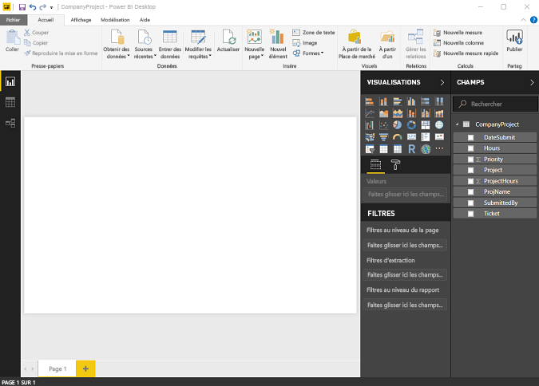
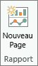

# Vue Rapport dans Power BI Desktop
Si vous avez déjà utilisé Power BI, vous savez combien il est facile de créer des rapports fournissant des perspectives et des informations dynamiques sur vos données. En outre, Power BI met à votre disposition d’autres fonctions avancées dans Power BI Desktop. Grâce  à Power BI Desktop, vous pouvez créer des requêtes avancées, combiner des données de plusieurs sources, créer des relations entre des tables et bien plus encore.

Power BI Desktop comprend la **vue Rapport**, où vous pouvez créer un nombre quelconque de pages de rapport avec des visualisations. La vue Rapport procure pratiquement la même expérience conceptuelle que le mode Édition d’un rapport dans le service Power BI. Vous pouvez déplacer des visualisations et effectuer des opérations comme copier-coller, fusionner, etc.

La différence est qu’avec Power BI Desktop, vous pouvez utiliser vos requêtes et modéliser vos données pour obtenir les meilleures analyses possibles dans les rapports. Vous pouvez ensuite enregistrer votre fichier Power BI Desktop à l’emplacement de votre choix (lecteur local ou cloud).

## Jetons un œil !
Quand vous chargez pour la première fois des données dans Power BI Desktop, le canevas de la **vue Rapport** est vide.

Vous pouvez basculer entre la **vue Rapport**, la **vue Données** et la **vue Relations** en sélectionnant les icônes dans la barre de navigation gauche :

Une fois que vous avez ajouté des données, vous pouvez ajouter des champs à une nouvelle visualisation dans le canevas.

Pour changer de type de visualisation, vous pouvez le sélectionner dans le groupe **Visualisation** du ruban, ou cliquer sur l’icône **Changer de type de visualisation** et sélectionner le type de votre choix.

> [!TIP]
> Effectuez des essais avec différents types de visualisations. Il est important que votre visualisation véhicule clairement les informations contenues dans vos données.
> 
> 

Un rapport possède au moins une page vierge au départ. Les pages apparaissent dans le volet de navigation à gauche du canevas. Vous pouvez ajouter toutes sortes de visualisations à une page, mais il est important de ne pas en abuser. Une page qui comporte trop de visualisations apparaît surchargée et devient difficile à explorer. Vous pouvez ajouter de nouvelles pages à votre rapport. Cliquez simplement sur **Nouvelle Page** dans le ruban.

Pour supprimer une page, cliquez sur le **X** sur l’onglet de la page au bas de la vue Rapport.

> [!NOTE]
> Vous ne pouvez pas épingler des rapports et des visualisations à un tableau de bord à partir de Power BI Desktop. Au lieu de cela, vous devez [Publier à partir de Power BI Desktop](desktop-upload-desktop-files.md) sur votre site Power BI.

## Masquer les pages d’un rapport

Lorsque vous créez un rapport, vous pouvez également masquer les pages d’un rapport. Cela peut être utile si vous devez créer des données sous-jacentes ou des visuels dans un rapport, mais souhaitez éviter que ces pages soient visibles à d’autres personnes, par exemple si vous créez des tables ou des visuels utilisés dans d’autres pages du rapport. Il existe de nombreuses autres raisons créatives de créer une page de rapport, puis de la masquer dans un rapport à publier. 

Il est facile de masquer une page de rapport. Il suffit de cliquer avec le bouton droit sur l’onglet de la page du rapport puis de sélectionner **Masquer** dans le menu qui s’affiche.

Il existe quelques considérations à prendre en compte lorsque vous masquez une page de rapport :

* Vous pouvez toujours afficher un rapport masqué dans **Power BI Desktop**, même si le titre de la page est grisé. Dans l’image suivante, la page 4 est masquée.

    

* Vous *ne pouvez pas* afficher une page de rapport masquée lorsque vous visualisez le rapport dans le **service Power BI**.

* Le masquage d’une page de rapport ne constitue *pas* une mesure de sécurité. La page reste disponible pour les utilisateurs, et son contenu est toujours accessible à l’aide de la méthode d’extraction, entre autres.

* Lorsqu’une page est masquée en mode Affichage, aucune flèche de navigation n’apparaît.

