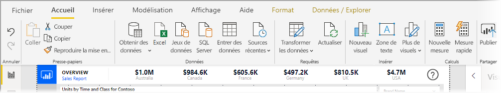
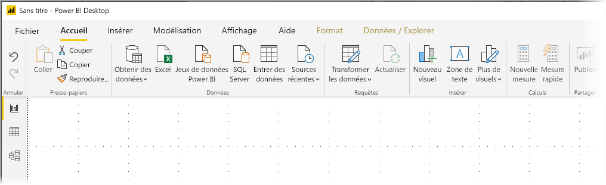
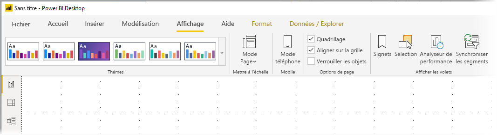
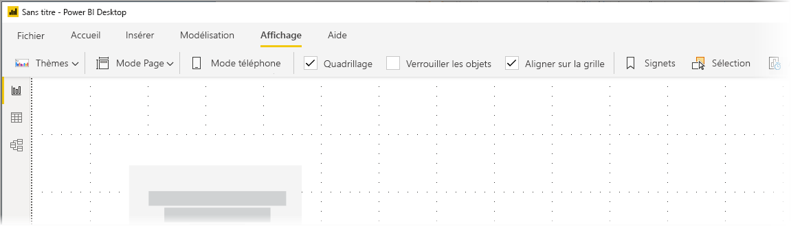

# Utiliser le ruban mis à jour dans Power BI Desktop (préversion)

À compter de la mise à jour de novembre 2019, Power BI Desktop modifiera son ruban pour mieux aligner son apparence et son expérience avec les autres produits Microsoft, notamment Microsoft Office.

Le ruban mis à jour est en préversion pour nous permettre de recueillir les commentaires des utilisateurs et des clients, et nous assurer que l'expérience est exceptionnelle. Cette phase de préversion, de retour d’informations et d’amélioration devrait durer quelques mois, avant que le ruban Power BI Desktop mis à jour ne soit mis à la disposition du public. 

## Comment activer le ruban mis à jour

Le ruban mis à jour dans Power BI est une fonctionnalité en préversion et doit être activé. Pour l’activer, sélectionnez **Fichier > Options et paramètres > Options**, puis **Fonctionnalité en préversion** dans la colonne gauche. Le volet droit affiche une sélection **Ruban mis à jour**. Cochez la case à côté de **Ruban mis à jour** pour activer la fonctionnalité en préversion. Vous devez redémarrer Power BI Desktop pour appliquer la fonctionnalité en préversion.

## Fonctionnalités du nouveau ruban

Les avantages de la mise à jour de notre ruban sont destinés à faciliter et à améliorer l'expérience dans Power BI Desktop et dans d'autres produits Microsoft. 

Ces avantages peuvent être regroupés dans les catégories suivantes :

* **Amélioration de l'apparence et de la disposition** : les icônes et les fonctionnalités du ruban Power BI Desktop mis à jour reprennent l'apparence et la disposition des éléments du ruban présents dans les applications Office.

    

* **Une galerie de thèmes intuitive** : la galerie de thèmes, disponible dans le ruban **Affichage**, offre l'aspect familier de la galerie de thèmes PowerPoint. Ainsi, les images dans le ruban vous montrent à quoi ressembleront les changements de thème s'ils sont appliqués à votre rapport, par exemple les combinaisons de couleurs et les polices. 

    

* **Contenu dynamique du ruban basé sur votre affichage** : dans le ruban Power BI Desktop existant, les icônes ou commandes qui n'étaient pas disponibles étaient simplement grisées, créant une expérience non optimale. Avec le ruban mis à jour, les icônes sont affichées et organisées dynamiquement pour vous permettre d’identifier toujours les options à votre disposition selon le contexte.

* **Un ruban à une seule ligne qui vous fait gagner de l'espace une fois réduit** : un autre avantage du ruban mis à jour est la possibilité de réduire le ruban sur une seule ligne afin d’afficher dynamiquement les éléments du ruban selon le contexte. 

    

En plus de ces changements visibles, un ruban mis à jour nous permet également d’intégrer les futures mises à jour à Power BI Desktop et à son ruban, par exemple :

* Créer des commandes plus flexibles et intuitives dans le ruban, notamment la galerie de visuels
* Ajouter les thèmes Office *noir* et *gris foncé* à Power BI Desktop
* Améliorer l’accessibilité

## Étapes suivantes
Vous pouvez connecter toutes sortes de données à l’aide de Power BI Desktop. Pour plus d’informations sur les sources de données, consultez les ressources suivantes :

* [Qu’est-ce que Power BI Desktop ?](desktop-what-is-desktop.md)
* [Sources de données dans Power BI Desktop](desktop-data-sources.md)
* [Mettre en forme et combiner des données dans Power BI Desktop](desktop-shape-and-combine-data.md)
* [Se connecter à des classeurs Excel dans Power BI Desktop](desktop-connect-excel.md)   
* [Entrer des données directement dans Power BI Desktop](desktop-enter-data-directly-into-desktop.md)   

