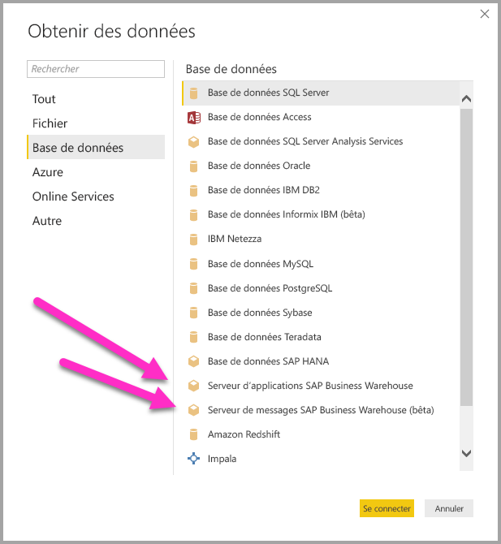
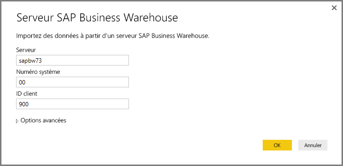
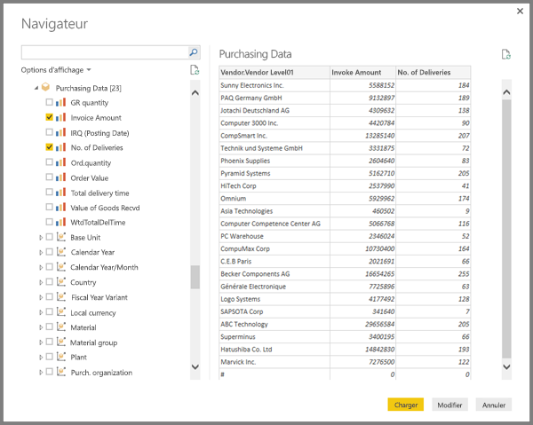

# Utilisation de SAP BW Connector dans Power BI Desktop
Avec Power BI Desktop, vous pouvez accéder aux données **SAP BusinessWarehouse (BW)**.

## Installation de SAP BW Connector
Pour utiliser **SAP BW Connector**, passez en revue les étapes d’installation suivantes :

1. Installez la bibliothèque **SAP NetWeaver** sur votre ordinateur local. Vous pouvez obtenir la bibliothèque **SAP NetWeaver** auprès de votre administrateur SAP ou directement depuis le [Centre de téléchargement de logiciels SAP](https://support.sap.com/swdc). Étant donné que le **Centre de téléchargement de logiciels SAP** modifie sa structure fréquemment, des informations plus spécifiques sur la navigation dans ce site ne sont pas disponibles. La bibliothèque **SAP NetWeaver** est généralement incluse dans l’installation des outils du client SAP.
   
   Vous pouvez rechercher *Note SAP n° 1025361* pour obtenir l’emplacement de téléchargement de la version la plus récente. Vérifiez que l’architecture de la bibliothèque **SAP NetWeaver** (32 ou 64 bits) correspond à votre installation de **Power BI Desktop**, puis installez tous les fichiers inclus dans le **Kit de développement logiciel (SDK) SAP NetWeaver RFC** conformément à la note SAP.
2. La boîte de dialogue **Obtenir des données** comporte une entrée pour **SAP Business Warehouse Application Server** et **SAP Business Warehouse Message Server** dans la catégorie **Base de données**.
   
   

## Fonctionnalités de SAP BW Connector
Les fonctionnalités **SAP BW Connector** dans Power BI Desktop vous permettent d’importer des données à partir de vos cubes **SAP Business Warehouse Server** ou d’utiliser DirectQuery. 

Pour en savoir plus sur **SAP BW Connector** et sur son utilisation avec DirectQuery, consultez l’article [DirectQuery et SAP Business Warehouse (BW)](desktop-directquery-sap-bw.md).

Pour pouvoir vous connecter, vous devez spécifier un *Serveur*, un *Numéro de système* et un *ID client*.

Vous pouvez également spécifier deux autres **options avancées** : le code de langue et une instruction MDX personnalisée à exécuter sur le serveur spécifié.

Si aucune instruction MDX n’a été spécifiée, la fenêtre **Navigator** qui s’affiche présente la liste des cubes disponibles sur le serveur, avec l’option d’accès et de sélection des éléments dans les cubes disponibles, notamment les dimensions et les mesures. Power BI expose les requêtes et les cubes exposés par les [BAPI OLAP BW Open Analysis Interface](https://help.sap.com/saphelp_nw70/helpdata/en/d9/ed8c3c59021315e10000000a114084/content.htm).

Lorsque vous sélectionnez un ou plusieurs éléments sur le serveur, un aperçu de la table de sortie est créé en conséquence.

La fenêtre **Navigator** fournit également un certain nombre d’**Options d’affichage** qui vous permettent d’effectuer les opérations suivantes :

* **Affichage *Uniquement les éléments sélectionnés* ou *Tous les éléments* (affichage par défaut) :** cette option est utile pour la vérification de l’ensemble final d’éléments sélectionnés. Une approche alternative à cet affichage consiste à sélectionner les *Noms de colonne* dans la zone *Aperçu*.
* **Activer les aperçus de données (comportement par défaut) :** Vous pouvez également contrôler si les aperçus de données doivent être affichés dans cette boîte de dialogue. La désactivation des aperçus de données réduit le nombre des appels serveur car les données jusqu’alors requises pour les aperçus deviennent inutiles.
* **Noms techniques :** SAP BW prend en charge la notion de *noms techniques* pour les objets d’un cube. Les noms techniques permettent à un propriétaire de cube d’exposer des *noms conviviaux* pour des objets du cube et non pas uniquement des *noms physiques* pour ces objets.

Après avoir sélectionné tous les objets nécessaires dans le **navigateur**, vous pouvez décider quoi faire, en sélectionnant un des boutons suivants dans la partie inférieure de la fenêtre **Navigator** :

* **Charger** déclenche le chargement de groupes de lignes pour la table de sortie vers le modèle de données Power BI Desktop, puis propose l’affichage **Rapport** pour vous permettre de visualiser les données ou d’apporter d’autres modifications à l’aide des affichages **Données** ou **Relations**.
* **Modifier** affiche **l’éditeur de requête**, dans lequel vous pouvez effectuer la transformation des données supplémentaires et le filtrage des étapes avant que l’ensemble de lignes soit inséré dans le modèle de données Power BI Desktop.

Outre le fait que vous pouvez importer des données à partir de cubes **SAP BW**, n’oubliez pas que vous pouvez également importer des données à partir d’une large gamme d’autres sources de données dans Power BI Desktop, puis les combiner dans un rapport unique. Cela présente toutes sortes de scénarios intéressant de génération de rapports et d’analyse sur les données **SAP BW**.

## Résolution des problèmes
Cette section fournit des situations de dépannage (et les solutions correspondantes) utilisable avec cette version préliminaire du connecteur **SAP BW**.

1. Les données numériques de **SAP BW** retournent des décimales au lieu de virgules. Par exemple, 1,000,000 est retourné en tant que 1.000.000.
   
   **SAP BW** retourne des données décimales avec un caractère *,* (virgule) ou *.* (point) comme séparateur décimal. Pour spécifier l’option que **SAP BW** doit utiliser comme séparateur décimal, le pilote utilisé par **Power BI Desktop** effectue un appel à *BAPI_USER_GET_DETAIL*. Cet appel retourne une structure appelée **DEFAULTS**, qui a un champ appelé *DCPFM* qui stocke *Decimal Format Notation*. Elle prend l’une des trois valeurs suivantes :
   
       ‘ ‘ (space) = Decimal point is comma: N.NNN,NN
       'X' = Decimal point is period: N,NNN.NN
       'Y' = Decimal point is N NNN NNN,NN
   
   Les clients qui ont signalé ce problème ont constaté que l’appel à *BAPI_USER_GET_DETAIL* échoue pour un utilisateur particulier (qui affiche des données incorrectes), avec un message d’erreur semblable au suivant :
   
       You are not authorized to display users in group TI:
           <item>
               <TYPE>E</TYPE>
               <ID>01</ID>
               <NUMBER>512</NUMBER>
               <MESSAGE>You are not authorized to display users in group TI</MESSAGE>
               <LOG_NO/>
               <LOG_MSG_NO>000000</LOG_MSG_NO>
               <MESSAGE_V1>TI</MESSAGE_V1>
               <MESSAGE_V2/>
               <MESSAGE_V3/>
               <MESSAGE_V4/>
               <PARAMETER/>
               <ROW>0</ROW>
               <FIELD>BNAME</FIELD>
               <SYSTEM>CLNTPW1400</SYSTEM>
           </item>
   
   Pour résoudre cette erreur, les utilisateurs doivent demander à leur administrateur SAP d’accorder à l’utilisateur SAPBW utilisé dans Power BI le droit d’exécuter *BAPI_USER_GET_DETAIL*. Il est également important de vérifier que l’utilisateur a la valeur *DCPFM* requise, comme décrit précédemment dans cette solution de dépannage.
2. **Connectivité pour les requêtes SAP BEx**
   
   Vous pouvez effectuer des requêtes **BEx** dans Power BI Desktop en activant une propriété spécifique, comme illustré dans l’image suivante :
   
   

## Étapes suivantes
Pour plus d’informations sur SAP HANA et DirectQuery, consultez les ressources suivantes :

* [DirectQuery et SAP HANA](desktop-directquery-sap-hana.md)
* [DirectQuery dans Power BI](desktop-directquery-about.md)
* [Sources de données prises en charge par DirectQuery](desktop-directquery-data-sources.md)
