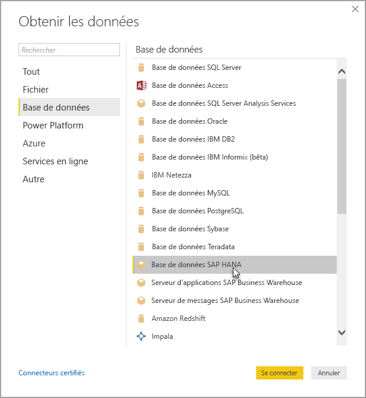

# Utiliser SAP HANA dans Power BI Desktop
Avec Power BI Desktop, vous pouvez désormais accéder aux bases de données **SAP HANA** . Pour utiliser **SAP HANA**, le pilote ODBC de HANA SAP doit être installé sur l’ordinateur client local pour que la connexion de données **SAP HANA** de Power BI Desktop fonctionne correctement. Vous pouvez télécharger le pilote ODBC de SAP HANA à partir du [centre de téléchargement des logiciels SAP](https://support.sap.com/swdc). À partir de là, recherchez SAP HANA CLIENT pour les ordinateurs Windows. Étant donné que le **Centre de téléchargement de logiciels SAP** modifie sa structure fréquemment, des informations plus spécifiques sur la navigation dans ce site ne sont pas disponibles.

Pour vous connecter à une base de données **SAP HANA**, sélectionnez **Obtenir des données > Base de données > Base de données SAP HANA**, comme indiqué dans l’image suivante :

Lorsque vous vous connectez à une base de données SAP HANA, spécifiez le nom et le port du serveur au format *serveur:port*. L’image suivante présente un exemple avec un serveur nommé *ServerXYZ* et un port *30015*.

Dans cette version, **SAP HANA** en mode [DirectQuery](desktop-directquery-sap-hana.md) est pris en charge dans Power BI Desktop et le service Power BI, et vous pouvez publier ou charger des rapports qui utilisent **SAP HANA** en mode DirectQuery pour le service Power BI. Vous pouvez également publier et charger des rapports dans le service Power BI quand vous n’utilisez pas **SAP HANA** en mode DirectQuery.

## Fonctionnalités prises en charge pour SAP HANA
Cette version comporte de nombreuses fonctionnalités pour **SAP HANA**, comme indiqué dans la liste suivante :

* Le connecteur Power BI pour **SAP HANA** utilise le pilote ODBC de SAP pour offrir la meilleure expérience utilisateur.
* **SAP HANA** prend en charge les options DirectQuery et Importer.
* Power BI prend en charge les modèles d’informations HANA (comme les vues d’analyse et de calcul) et il a un mode de navigation optimisé.
* Avec **SAP HANA**, vous pouvez également utiliser la fonctionnalité SQL direct pour la connexion aux tables Row et Column.
* Comprend la navigation améliorée pour les modèles HANA
* Power BI prend en charge les variables et paramètres d’entrée **SAP HANA** .

## Limitations de SAP HANA
Il existe également quelques limitations à l’utilisation de **SAP HANA**, indiquées ci-dessous :

* Les chaînes NVARCHAR sont tronquées à 4 000 caractères Unicode.
* SMALLDECIMAL n’est pas pris en charge.
* VARBINARY n’est pas pris en charge.
* Les dates valides sont comprises entre le 30/12/1899 et le 31/12/9999.

## Étapes suivantes
Pour plus d’informations sur DirectQuery, consultez les ressources suivantes :

* [DirectQuery et SAP HANA](desktop-directquery-sap-hana.md)
* [DirectQuery dans Power BI](desktop-directquery-about.md)
* [Sources de données prises en charge par DirectQuery](desktop-directquery-data-sources.md)

