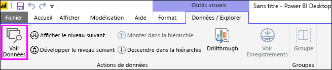
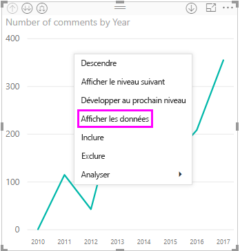
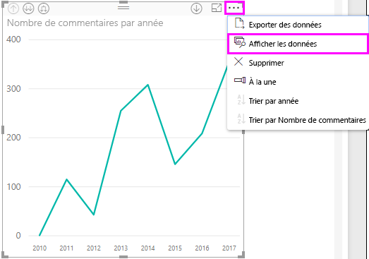
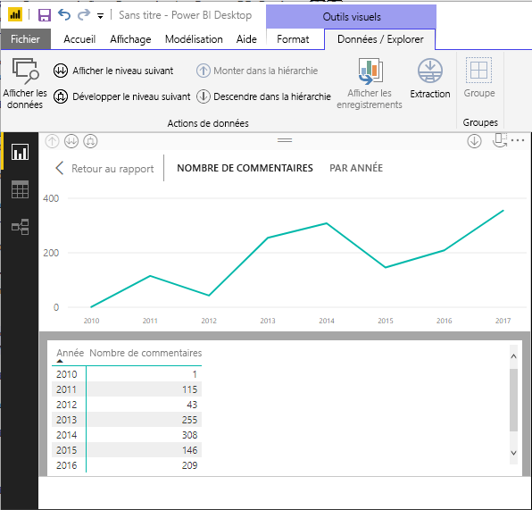
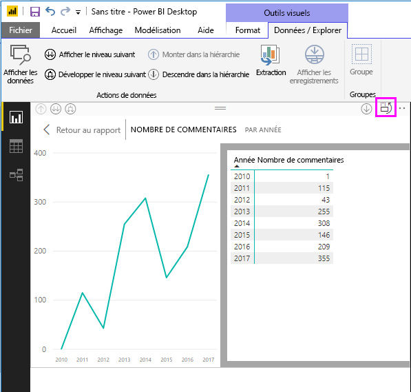
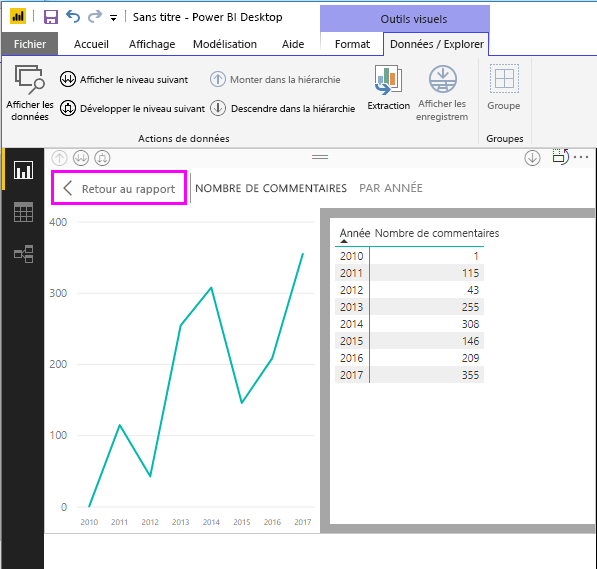
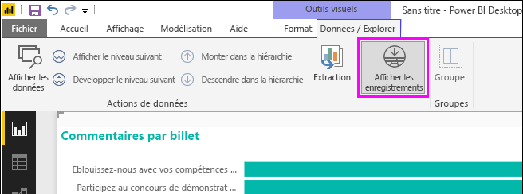
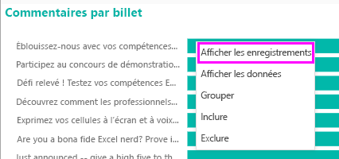
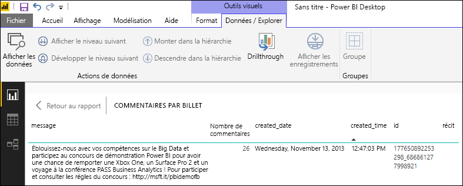
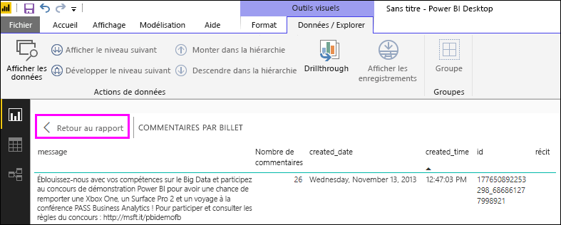

# Utiliser Afficher les données et Afficher les enregistrements dans Power BI Desktop
Dans **Power BI Desktop**, vous pouvez explorer les détails d’une visualisation et consulter des représentations textuelles des données sous-jacentes ou enregistrements de données individuelles du visuel sélectionné. Ces fonctionnalités sont parfois appelées *interactif*, *extraction* ou *extraction jusqu’aux détails*.

Vous pouvez utiliser **Consulter les données** pour afficher une version textuelle des valeurs utilisées par la visualisation sélectionnée ou utiliser **Consulter les enregistrements** pour afficher toutes les données d’un enregistrement ou d’un point de données sélectionné. 

>[!IMPORTANT]
>**Consulter les données** et **Consulter les enregistrements** prennent en charge uniquement les types de visualisation suivants :
>  - Graphique à barres
>  - Histogramme
>  - Graphique en anneau
>  - Carte choroplèthe
>  - Entonnoir
>  - Carte
>  - Graphique en secteurs
>  - Treemap

## Utiliser Consulter les données dans Power BI Desktop

**Consulter les données** vous montre les données sous-jacentes d’une visualisation. **Consulter les données** s’affiche dans l’onglet **Données / Explorer** dans la section **Outils visuels** du ruban lorsqu’une visualisation est sélectionnée.

Vous pouvez également consulter les données en cliquant avec le bouton de droite sur une visualisation, puis en sélectionnant **Afficher les données** dans le menu qui s’affiche ; ou en sélectionnant les points de suspension (...) **Plus d’options** dans le coin supérieur droit d’une visualisation, puis en sélectionnant **Afficher les données**.

&nbsp;&nbsp;

> [!NOTE]
> Vous devez pointer la souris sur un point de données du visuel pour que le menu contextuel soit disponible.

Lorsque vous sélectionnez **Consulter les données** ou **Afficher les données**, le canevas de Power BI Desktop affiche en même temps le visuel et la représentation textuelle des données. Dans *l’affichage horizontal*, le visuel est affiché dans la moitié supérieure du canevas et les données s’affichent dans la moitié inférieure. 

Vous pouvez également basculer vers un affichage horizontal ou un *affichage vertical* en sélectionnant l’icône dans l’angle supérieur droit du canevas.

Pour revenir au rapport, sélectionnez **< Retour au rapport** dans l’angle supérieur gauche du canevas.

## Utiliser Consulter les enregistrements dans Power BI Desktop

Vous pouvez également vous concentrer sur un enregistrement de données et explorer les données qui se trouvent derrière. Pour utiliser **Consulter les enregistrements**, sélectionnez une visualisation, puis sélectionnez **Consulter les enregistrements** dans l’onglet **Données/Exploration** dans la section **Outils du visuel** du ruban, puis sélectionnez un point de données ou une ligne sur la visualisation. 

> [!NOTE]
> Si le bouton **Consulter les enregistrements** du ruban est désactivé et grisé, cela signifie que la visualisation sélectionnée ne prend pas en charge **Consulter les enregistrements**.

Vous pouvez également cliquez avec le bouton de droite sur un élément de données et sélectionnez **Consulter les enregistrements** dans le menu qui s’affiche.

Lorsque vous sélectionnez **Consulter les enregistrements** pour un élément de données, le canevas de Power BI Desktop affiche toutes les données associées à l’élément sélectionné. 

Pour revenir au rapport, sélectionnez **< Retour au rapport** dans l’angle supérieur gauche du canevas.

> [!NOTE]
>**Consulter les enregistrements** présente les limitations suivantes :
> - Vous ne pouvez pas modifier les données dans l’affichage **Consulter les enregistrements** et les enregistrer à nouveau dans le rapport.
> - Vous ne pouvez pas utiliser **Afficher les enregistrements** lorsque votre visuel utilise une mesure calculée.
> - Vous ne pouvez pas utiliser **Consulter les enregistrements** quand vous êtes connecté à un modèle MD (multidimensionnel) en direct.

## Étapes suivantes
Il existe toutes sortes de fonctionnalités de mise en forme de rapports et de gestion des données dans **Power BI Desktop**. Consultez les ressources suivantes pour voir quelques exemples :

* [Utiliser le regroupement et le compartimentage dans Power BI Desktop](desktop-grouping-and-binning.md)
* [Utiliser le quadrillage, l’alignement sur la grille, l’ordre de plan, l’alignement et la distribution dans les rapports Power BI Desktop](desktop-gridlines-snap-to-grid.md)

