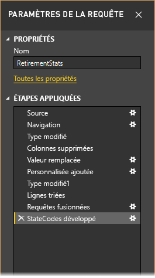
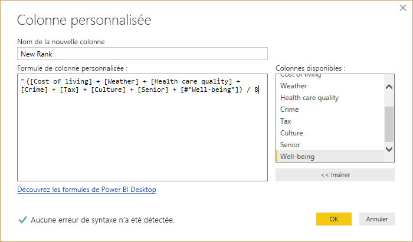
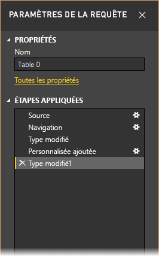
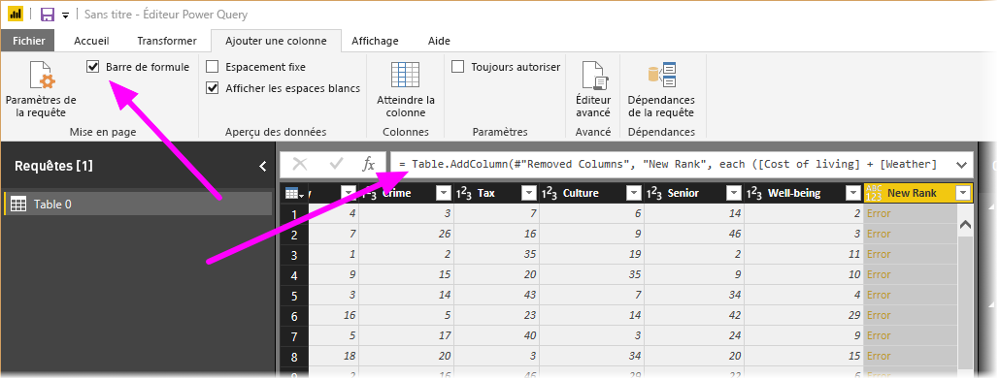
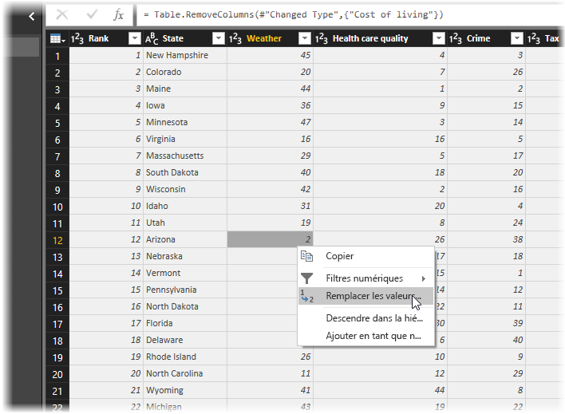
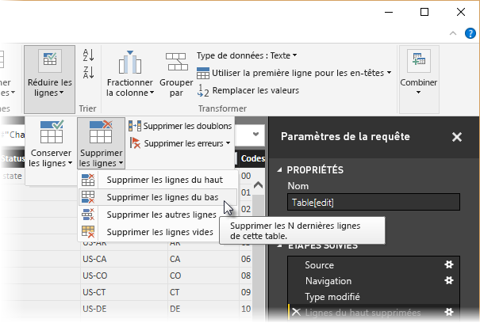
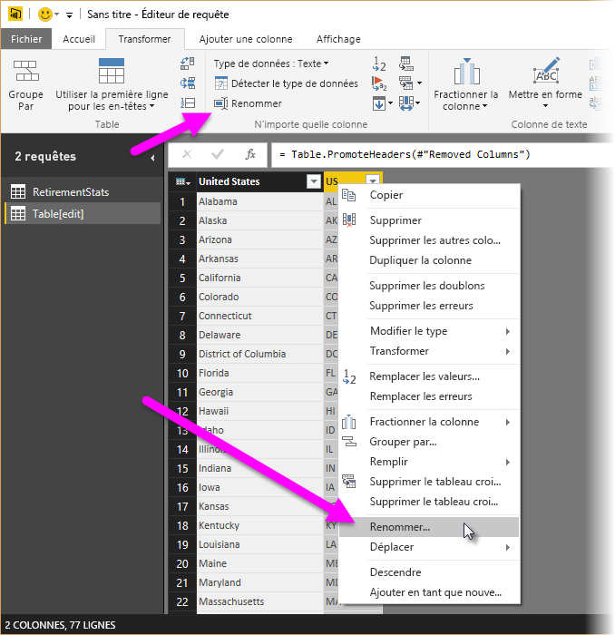
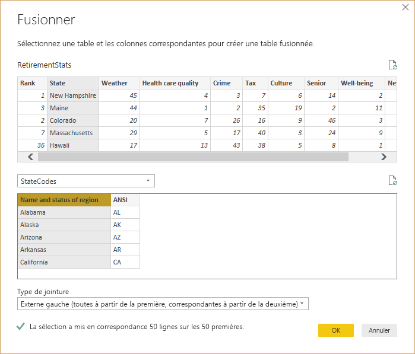
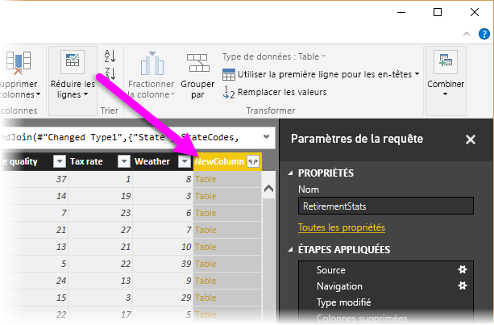
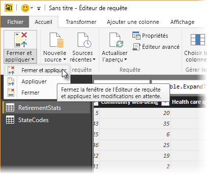

# Mettre en forme et combiner des données dans Power BI Desktop
Avec **Power BI Desktop**, vous pouvez vous connecter à différents types de sources de données, puis mettre en forme les données en fonction de vos besoins. *Mettre en forme* des données consiste à transformer les données, par exemple à renommer des colonnes ou des tables, à remplacer du texte par des nombres, à supprimer des lignes, à définir la première ligne comme en-têtes, etc. *Combiner* des données consiste à se connecter à plusieurs sources de données, à les mettre en forme en fonction des besoins, puis à les consolider dans une seule requête utile.

Cet article montre comment mettre en forme une requête à l’aide de Power BI Desktop, et met en évidence les tâches courantes. Pour plus d’informations sur la requête utilisée ici, notamment sur sa création de toutes pièces, consultez [Prise en main de Power BI Desktop](desktop-getting-started.md).

Il est utile de savoir que l’ **Éditeur de requête** dans Power BI Desktop propose un grand nombre de menus contextuels, en plus du ruban. La plupart des éléments que vous pouvez sélectionner dans la section **Transformer** du ruban est également disponible en cliquant avec le bouton droit sur un élément (par exemple, sur une colonne) et en choisissant une option dans le menu qui s’affiche.

## Mettre en forme les données
Quand vous mettez en forme des données dans l’Éditeur de requête, vous fournissez des instructions pas à pas (l’Éditeur de requête effectue cela pour vous) pour ajuster les données au fur et à mesure qu’elles sont chargées et présentées. La source de données d’origine n’est pas affectée. Seule cette vue particulière des données est ajustée ou *mise en forme*.

Les étapes que vous spécifiez (par exemple, renommer une table, transformer un type de données ou supprimer des colonnes) sont enregistrées par l’Éditeur de requête. Chaque fois que cette requête se connecte à la source de données, ces mêmes opérations sont effectuées afin que les données soient toujours mises en forme de la manière que vous spécifiez. Ce processus se produit chaque fois que vous utilisez la fonctionnalité Éditeur de requête dans Power BI Desktop ou pour toute personne qui utilise votre requête partagée, comme dans le service **Power BI**. Ces étapes sont capturées, de manière séquentielle, dans le volet **Paramètres des requêtes**, sous **Étapes appliquées**.

L’illustration suivante montre le volet **Paramètres d’une requête** pour une requête qui a été mise en forme. Nous passerons en revue chacune de ces étapes dans les paragraphes suivants.

Dans [Prise en main de Power BI Desktop](desktop-getting-started.md), nous avons récupéré des données sur la retraite en nous connectant à une source de données web ; nous allons à présent mettre en forme ces données en fonction de nos besoins.

Pour commencer, ajoutons une colonne personnalisée pour calculer le classement en fonction de facteurs d’égalité de toutes les données, et comparons-la à la colonne _Classement_ existante.  Voici le ruban **Ajouter une colonne**, avec une flèche pointant sur le bouton **Colonne personnalisée** permettant d’ajouter une colonne personnalisée.

Dans la boîte de dialogue **Colonne personnalisée**, entrez _Nouveau classement_ dans **Nouveau nom de colonne** et les informations suivantes dans **Formule de colonne personnalisée** :

    ([Cost of living] + [Weather] + [Health care quality] + [Crime] + [Tax] + [Culture] + [Senior] + [#"Well-being"]) / 8

Vérifiez que le message d’état indique _« Aucune erreur de syntaxe n’a été détectée »_ et cliquez sur **OK**.

Pour maintenir la cohérence des données de la colonne, transformons ses nouvelles valeurs en nombres entiers. Il suffit pour cela de cliquer avec le bouton droit sur l’en-tête de la colonne et de sélectionner **Modifier le type \> Nombre entier**. 

Si vous devez sélectionner plusieurs colonnes, commencez par en sélectionner une, maintenez la touche **Maj** enfoncée pour sélectionner des colonnes adjacentes supplémentaires, puis cliquez avec le bouton droit sur un en-tête de colonne pour modifier toutes les colonnes sélectionnées. Vous pouvez également utiliser la touche **Ctrl** pour sélectionner des colonnes non adjacentes.

Vous pouvez également *transformer* les types de données de la colonne dans le ruban **Transformer**. Voici le ruban **Transformer** , avec une flèche pointant vers le bouton **Type de données** qui vous permet de modifier le type de données actuel.

Notez que dans **Paramètres d’une requête**, la section **Étapes appliquées** reflète toutes les étapes de mise en forme appliquées aux données. Pour supprimer une étape quelconque du processus de mise en forme, il suffit de sélectionner le **X** à gauche de l’étape. Dans l’image suivante, la section **Étapes appliquées** reflète les étapes effectuées jusqu’à présent : connexion au site web (**Source**) ; sélection de la table (**Navigation**) ; et, pendant le chargement de la table, conversion automatique, par l’Éditeur de requête, des colonnes de nombres du type de données *Texte* au type de données *Nombre entier* (**Type modifié**). Les deux dernières étapes indiquent nos actions précédentes avec **Added Custom** (Ajout de colonne personnalisée) et **Changed Type1** (Modification de Type1). 

Avant d’utiliser cette requête, nous devons apporter quelques modifications pour réorganiser ses données :

* *Ajuster les classements en supprimant une colonne* : nous avons identifié que le **Cost of living** (Coût de la vie) n’est pas un facteur déterminant pour nos résultats. Après avoir supprimé cette colonne, nous constatons un problème : les données restent inchangées, quoique ce soit facile à corriger avec Power BI Desktop, ce qui illustre une fonction pratique des **Étapes appliquées** dans la requête.
* *Corriger certaines erreurs* : puisque nous avons supprimé une colonne, il nous faut réajuster nos calculs dans la colonne **Nouveau classement**, ce qui implique de modifier une formule.
* *Trier les données* : selon les colonnes **Nouveau classement** et **Classement**. 
* *Remplacer les données* : nous montrerons comment remplacer une valeur en particulier et préciserons qu’il est nécessaire d’insérer une **Étape appliquée**.
* *Modifier le nom de la table* : le nom **Table 0** n’est pas un descripteur utile, mais il est facile de le modifier.

Pour supprimer la colonne **Cost of living** (Coût de la vie), sélectionnez-la et cliquez sur l’onglet **Accueil** du ruban, puis sur **Supprimer les colonnes**, comme dans l’illustration suivante.

Vous remarquerez que les valeurs _Nouveau classement_ n’ont pas changé, à cause de l’ordre des étapes. Étant donné que l’Éditeur de requête enregistre les étapes de manière séquentielle, mais indépendamment les unes des autres, vous pouvez déplacer chaque **étape appliquée** vers le haut ou vers le bas dans la séquence. Cliquez simplement avec le bouton droit sur n’importe quelle étape. L’Éditeur de requête vous propose alors un menu comportant les options suivantes : **Renommer**, **Supprimer**, **Supprimer****jusqu’à la fin** (supprimer l’étape actuelle, ainsi que toutes les étapes suivantes), **Monter** ou **Descendre**. Poursuivez et déplacez la dernière étape _Removed Columns_ (Suppression de colonnes) juste au-dessus de l’étape _Added Custom_ (Ajout de colonne personnalisée).

Ensuite, sélectionnez l’étape _Added Custom_ (Ajout de colonne personnalisée). Vous remarquerez que les données affichent maintenant _Error_ (Erreur), ce que nous devrons résoudre. 

Il existe plusieurs façons d’obtenir des informations sur chaque erreur. Vous pouvez sélectionner la cellule (sans cliquer sur le mot **Erreur**) ou cliquer sur le mot **Erreur** directement. Si vous sélectionnez la cellule *sans* cliquer directement sur le mot **Erreur**, l’Éditeur de requête affiche les informations sur l’erreur en bas de la fenêtre.

Si vous cliquez sur le mot *Erreur* directement, l’Éditeur de requête crée une **étape appliquée** dans le volet **Paramètres d’une requête** et affiche des informations sur l’erreur. Comme nous ne souhaitons pas procéder ainsi, sélectionnez **Annuler**.

Pour résoudre les erreurs, sélectionnez la colonne _Nouveau classement_, puis affichez la formule de données de la colonne en ouvrant le ruban **Vue** et en cochant la case **Barre de formule**. 

Vous pouvez maintenant supprimer le paramètre _Cost of living_ (Coût de la vie) et décrémenter le diviseur en modifiant la formule ainsi : 

    Table.AddColumn(#"Removed Columns", "New Rank", each ([Weather] + [Health care quality] + [Crime] + [Tax] + [Culture] + [Senior] + [#"Well-being"]) / 7)

Cochez la case verte à gauche de la zone de formule ou appuyez sur **Entrée** ; les données sont alors remplacées par les valeurs révisées, et l’étape **Added Custom** (Ajout de colonne personnalisée) devrait maintenant s’effectuer *sans erreurs*.

> [!NOTE]
> Vous pouvez également utiliser la commande **Supprimer les erreurs** (depuis le ruban ou le menu contextuel), qui supprime toutes les lignes contenant des erreurs. Dans notre cas, elle aurait supprimé toutes les lignes dans nos données ; or, nous souhaitons les conserver dans la table.

Trions maintenant les données selon la colonne **Nouveau classement**. Sélectionnez d’abord la dernière étape appliquée, **Changed Type1** (Modification de Type1) pour récupérer les dernières données. Ensuite, sélectionnez la liste déroulante à côté de l’en-tête de colonne **Nouveau classement** et cliquez sur **Tri croissant**.

Les données sont maintenant triées en fonction du **Nouveau classement**.  Dans la colonne **Classement** en revanche, on remarque que les données ne sont pas triées correctement dans le cas où la valeur **Nouveau classement** est égale. Pour résoudre ce problème, sélectionnez la colonne **Nouveau classement** et modifiez ainsi la formule dans la **Barre de formule** :

    = Table.Sort(#"Changed Type1",{{"New Rank", Order.Ascending},{"Rank", Order.Ascending}})

Cochez la case verte à gauche de la zone de formule ou appuyez sur **Entrée** ; les lignes sont maintenant triées à la fois par _Nouveau classement_ et par _Classement_.

En outre, vous pouvez sélectionner n’importe quelle **étape appliquée** dans la liste et poursuivre la mise en forme des données à ce stade de la séquence. L’Éditeur de requête insère automatiquement une nouvelle étape après l’ **tape appliquée**actuellement sélectionnée. Faisons un essai.

Tout d’abord, sélectionnez **l’Étape appliquée** (soit _Removed Columns_ (Suppression de colonnes)) avant d’ajouter la colonne personnalisée. Nous remplacerons ici la valeur de classement _Weather_ (Météo) en Arizona. Cliquez avec le bouton droit sur la cellule contenant le classement _Weather_ (Météo) de l’Arizona et sélectionnez *Remplacer les valeurs* dans le menu qui s’affiche. Identifiez **l’Étape appliquée** sélectionnée (l’étape qui précède _Added Custom_ (Ajout de colonne personnalisée)).

Étant donné que nous allons insérer une étape, l’Éditeur de requête nous avertit que cette opération risque de provoquer une rupture de la requête. Nous devons être prudents et attentifs ! Dans la mesure où nous suivons un didacticiel qui montre comment créer, supprimer, insérer et réorganiser des étapes de façon conviviale grâce à l’Éditeur de requête, nous sélectionnons naturellement **Insérer**.

Remplacez la valeur par _51_ ; les données de l’Arizona sont modifiées. Quand vous créez une étape appliquée, l’Éditeur de requête lui attribue un nom basé sur l’action effectuée, en l’occurrence **Valeur remplacée**. Quand plusieurs étapes portent le même nom dans votre requête, l’Éditeur de requête ajoute un numéro séquentiel à chaque **étape appliquée** pour les différencier.

Sélectionnez maintenant la dernière **Étape appliquée**, _Tri de lignes_ ; vous remarquerez que les données ont changé en ce qui concerne le nouveau classement de l’Arizona.  La raison en est que nous avons inséré l’étape _Replaced Value_ (Remplacement de valeur) au bon endroit, avant l’étape _Added Custom_ (Ajout de colonne personnalisée).

Cet exemple est certes un peu complexe, mais il illustre bien la puissance et la polyvalence de l’Éditeur de requête.

Enfin, nous voulons modifier le nom de cette table par quelque chose de plus explicite. Au moment de créer des rapports, il est particulièrement utile d’avoir des noms de table descriptifs, notamment si nous nous connectons à plusieurs sources de données qui sont toutes répertoriées dans le volet **Champs** de la vue **Rapport** .

Il est facile de modifier le nom d’une table : dans le volet **Paramètres d’une requête** , sous **Propriétés**, tapez simplement le nouveau nom de la table, comme l’illustre l’image suivante, et appuyez sur **Entrée**. Appelons cette table *RetirementStats*.

Bien, nous avons mis en forme ces données comme nous le souhaitions. À présent, connectons-nous à une autre source de données et combinons des données.

## Combiner des données
Les données relatives aux différents États sont intéressantes et peuvent être utiles pour la création de requêtes et d’efforts d’analyse supplémentaires. Toutefois, elles posent un problème : la plupart de ces données utilisent une abréviation à deux lettres pour les codes d’États, à la place du nom complet de l’État. Nous avons besoin d’un moyen d’associer les noms des États à leurs abréviations.

Par chance, il existe une autre source de données publiques qui a précisément cette fonction, mais un effort important de mise en forme sera nécessaire pour la connecter à la table relative à la retraite. Voici la ressource web dédiée aux abréviations des États :

<http://en.wikipedia.org/wiki/List_of_U.S._state_abbreviations>

Dans le ruban **Accueil** de l’Éditeur de requête, sélectionnez **Nouvelle source \> Web**, tapez l’adresse, puis sélectionnez **Se connecter**. Le navigateur affiche alors ce qu’il a trouvé sur cette page web.

 

Sélectionnez **Codes et abréviations...**, qui comprend les données que nous souhaitons ; un gros effort de mise en forme sera quand même nécessaire pour alléger les données de cette table en fonction de nos besoins.

> [!TIP]
> Existe-t-il un moyen plus rapide ou plus facile d’effectuer les étapes suivantes ? Oui, il est possible de créer une *relation* entre les deux tables et de mettre en forme les données en fonction de cette relation. Les étapes suivantes restent importantes pour apprendre à travailler avec des tables. Sachez que les relations peuvent vous aider à rapidement utiliser les données provenant de plusieurs tables.
> 
> 

Pour mettre ces données en forme, procédez comme suit :

* Supprimez la ligne du haut : elle est liée à la façon dont la table de cette page web a été créée, et nous n’en avons pas besoin. Sous l’onglet **Accueil** du ruban, sélectionnez **Réduire les lignes \>Supprimer les lignes \>Supprimer les lignes du haut**.

La fenêtre **Supprimer les lignes du haut** s’affiche, dans laquelle vous pouvez spécifier le nombre de lignes à supprimer.

>[!NOTE]
>Si Power BI importe accidentellement les en-têtes sous la forme d’une ligne dans votre table de données, vous pouvez sélectionner **Utiliser la première ligne comme en-tête** dans l’onglet **Accueil** ou dans l’onglet **Transformer** du ruban pour corriger votre table.

* Supprimez les 26 lignes du bas : elles concernent les territoires, que nous n’avons pas besoin d’inclure. Sous l’onglet **Accueil**du ruban, sélectionnez **Réduire les lignes \> Supprimer les lignes \> Supprimer les lignes du bas**.

* La table RetirementStats ne contenant pas d’informations pour Washington DC, nous devons la filtrer de notre liste. Sélectionnez la flèche déroulante en regard de la colonne Region Status (État de la région), puis désactivez la case à cocher en regard de **Federal district**(District fédéral).

* Supprimez quelques colonnes inutiles : sachant qu’il nous faut simplement le mappage des États avec leurs abréviations officielles en deux lettres, vous pouvez supprimer les autres colonnes : **Column1**, **Column3**, **Column4** et de **Column6** à **Column11**. Tout d’abord, sélectionnez **Column1**, puis maintenez la touche **CTRL** enfoncée pour sélectionner les autres colonnes à supprimer (vous pouvez ainsi sélectionner plusieurs colonnes non contiguës). Sous l’onglet Accueil du ruban, sélectionnez **Supprimer les colonnes \> Supprimer les colonnes**.

>[!NOTE]
>Il est maintenant judicieux de souligner que la *séquence* des étapes appliquées dans l’Éditeur de requête est importante et peut affecter la manière dont les données sont mises en forme. Il est également important de savoir comment une étape peut avoir un impact sur une étape ultérieure. Si vous supprimez une étape de la section Étapes appliquées, les étapes suivantes peuvent ne pas se comporter comme prévu initialement, en raison de l’impact de la séquence des étapes de la requête.

>[!NOTE]
>Quand vous redimensionnez la fenêtre Éditeur de requête pour réduire sa largeur, certains éléments du ruban sont condensés pour tirer le meilleur parti de l’espace visible. Quand vous augmentez la largeur de la fenêtre Éditeur de requête, les éléments de ruban sont développés pour exploiter pleinement la zone agrandie du ruban.

* Renommez les colonnes, ainsi que la table ; comme d’habitude, il existe plusieurs façons de renommer une colonne : sélectionnez la colonne, puis cliquez sur **Rename** (Renommer) sous l’onglet **Transform** (Transformer) du ruban, ou cliquez avec le bouton droit, puis choisissez **Rename...** (Renommer...) dans le menu qui s’affiche. Dans l’image suivante, les flèches indiquent les deux options ; vous ne devez en choisir qu’une seule.

Nous allons les renommer *State Name* et *State Code*. Pour renommer la table, tapez simplement le nom dans la zone **Nom** du volet **Paramètres d’une requête** . Appelons cette table *StateCodes*.

Comme la table StateCodes présente désormais la forme qui nous convient, nous pouvons combiner ces deux tables ou requêtes en une seule. Étant donné que les tables dont nous disposons maintenant sont le résultat des requêtes que vous avez appliquées aux données, elles sont souvent appelées *requêtes*.

Il existe deux façons principales de combiner des requêtes : par *fusion* et par *ajout*.

Pour ajouter une ou plusieurs colonnes à une autre requête, vous **fusionnez** les requêtes. Pour ajouter des lignes de données à une requête existante, vous **ajoutez** la requête.

Dans le cas présent, nous souhaitons fusionner les requêtes. Pour commencer, dans le volet gauche de l’Éditeur de requête, sélectionnez la requête *dans laquelle* nous voulons que l’autre requête fusionne, dans ce cas *RetirementStats*. Ensuite, sélectionnez **Combine\>Merge Queries**(Combiner > Fusionner les requêtes) sous l’onglet **Home**(Accueil) du ruban.

Vous êtes invité à définir les niveaux de confidentialité pour vous assurer que les données sont combinées sans inclure ou transférer des données que vous ne voulez pas transférer.

La fenêtre **Fusionner** apparaît ensuite. Celle-ci vous invite à sélectionner la table à fusionner dans la table déjà sélectionnée, puis les colonnes correspondantes à utiliser pour la fusion. Sélectionnez State dans la table (requête) *RetirementStats* , puis sélectionnez la requête *StateCodes* (opération simple ici, car il existe une seule autre requête, alors que quand vous vous connectez à de nombreuses sources de données, vous avez le choix entre de nombreuses requêtes). Quand vous sélectionnez les colonnes correspondantes appropriées ( **State** dans *RetirementStats* et **State Name** dans *StateCodes* ), la fenêtre **Fusionner** ressemble à l’illustration ci-dessous et le bouton **OK** est activé.

Une colonne ( **NewColumn** ) est créée à la fin de la requête, qui correspond au contenu de la table (requête) qui a été fusionnée avec la requête existante. Toutes les colonnes de la requête fusionnée sont condensées dans la colonne **NewColumn**, mais vous pouvez choisir de **développer** la table et d’inclure les colonnes de votre choix.

Pour développer la table fusionnée et sélectionner les colonnes à inclure, sélectionnez l’icône de développement (). La fenêtre **Développer** apparaît.

Dans le cas présent, comme nous voulons uniquement la colonne **State Code**, sélectionnez cette colonne, puis cliquez sur **OK**. Décochez la case Utiliser le nom de la colonne d’origine comme préfixe, car cette opération ne présente ici aucun intérêt. Si vous conservez cette option, la colonne fusionnée sera nommée **NewColumn.State Code** (nom de la colonne d’origine, ou **NewColumn**, suivi d’un point et du nom de la colonne insérée dans la requête).

>[!NOTE]
>Vous souhaitez explorer d’autres manières d’insérer la table **NewColumn** ? Vous pouvez faire des essais et si les résultats ne vous satisfont pas, supprimez simplement cette étape de la liste **Étapes appliquées** dans le volet **Paramètres d’une requête**. Votre requête retourne à l’état précédant l’application de l’étape **Développer**. Vous pouvez ainsi faire autant d’expérimentation que vous le souhaitez, jusqu’à ce que le processus de développement vous satisfasse.

Vous disposez à présent d’une requête (table) unique associant deux sources de données, dont chacune a été mise en forme pour répondre à nos besoins. Cette requête peut servir de base pour un grand nombre d’autres connexions de données intéressantes, telles que des statistiques de coût du logement, des données démographiques ou des opportunités de travail dans un État.

Pour appliquer les modifications et fermer l’Éditeur de requête, sélectionnez **Fermer et Appliquer** sous l’onglet de ruban **Accueil**. Le jeu de données transformé s’affiche dans Power BI Desktop, prêt à l’usage pour la création de rapports.

## Étapes suivantes
Power BI Desktop vous permet d’effectuer des tâches très diverses. Pour plus d’informations sur ses fonctionnalités, passez en revue les ressources suivantes :

* [Prise en main de Power BI Desktop](desktop-getting-started.md)
* [Présentation des requêtes dans Power BI Desktop](desktop-query-overview.md)
* [Sources de données dans Power BI Desktop](desktop-data-sources.md)
* [Se connecter aux données dans Power BI Desktop](desktop-connect-to-data.md)
* [Tâches courantes relatives aux requêtes dans Power BI Desktop](desktop-common-query-tasks.md)   

