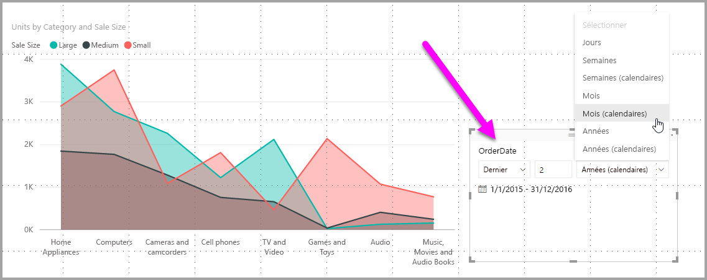
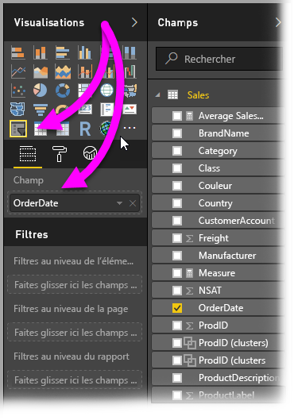
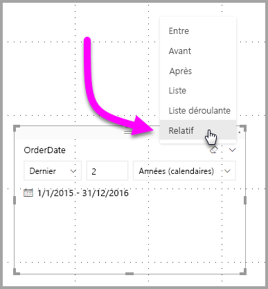
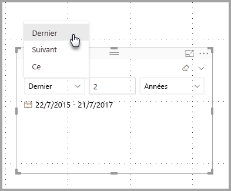
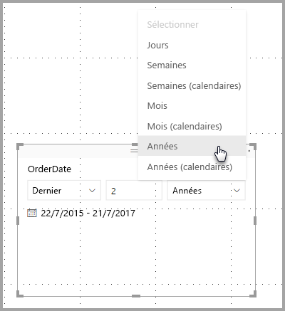
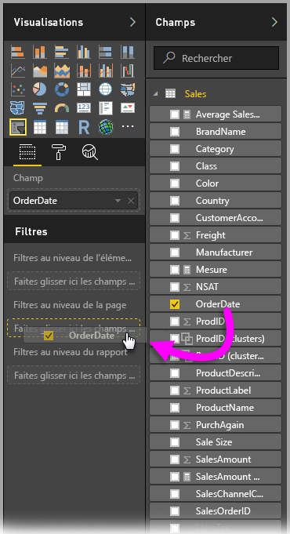
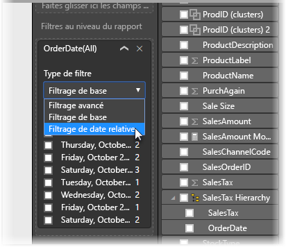
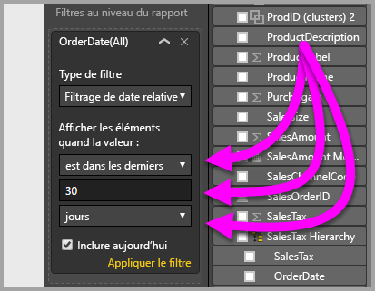

# Utiliser un segment et un filtre de date relative dans Power BI Desktop
Un **segment de date relative** ou un **filtre de date relative** permet d’appliquer des filtres basés sur le temps à n’importe quelle colonne de date dans votre modèle de données. Par exemple, vous pouvez utiliser un **segment de date relative** pour afficher uniquement les données produites durant les trente derniers jours (ou mois, mois calendaires, etc.). Et lorsque vous actualisez les données, la période relative applique automatiquement la contrainte de date relative appropriée.

## Utilisation du segment de plage de dates relatives
Vous pouvez utiliser le segment de date relative comme tout autre segment. Créez simplement un visuel de **segment** pour votre rapport, puis sélectionnez une valeur de date pour **Champ**. Dans l’image suivante, le champ *OrderDate* est sélectionné.

Sélectionnez le signe ^ dans l’angle supérieur droit du **segment de date relative** pour afficher un menu.

Pour le segment de date relative, sélectionnez *Relatif*.

Vous pouvez ensuite sélectionner les paramètres. Pour la première liste déroulante du *segment de date relative*, les choix suivants sont disponibles :

* Dernier
* Suivant
* Ce

Ces sélections sont affichées dans l’image suivante.

Le paramètre Suivant (au milieu) du *segment de date relative* vous permet de taper un nombre, pour définir la plage de dates relatives.

Le troisième paramètre vous permet de sélectionner la mesure de date. Voici les choix disponibles :

* Jours
* Semaines
* Semaines (calendaires)
* Mois
* Mois (calendaires)
* Années
* Années (calendaires)

Ces sélections sont affichées dans l’image suivante.

Si vous sélectionnez *Mois* à partir de cette liste et entrez 2 dans le paramètre du milieu, voici ce qui se produit : en partant du principe que nous sommes le 20 juillet, les données incluses dans les visuels limités par le segment affichent les données des deux mois précédents, à partir du 20 mai jusqu’au 20 juillet (date d’aujourd’hui).

À présent, si vous sélectionnez *Mois (calendaires)*, les visuels limités affichent les données du 1er mai jusqu’au 30 juin (les deux derniers mois calendaires complets).

## Utilisation du filtre de plage de dates relatives
Vous pouvez aussi créer un filtre de plage de dates relatives pour une page ou l’intégralité de votre rapport. Pour cela, il vous suffit de faire glisser un champ de date dans la zone **Filtres au niveau de la page** ou **Filtres au niveau du rapport** dans le volet **Champ**, comme indiqué dans l’image suivante.

Après cela, vous pouvez modifier la plage de dates relatives de la même façon que vous personnalisez le **segment de date relative**. Sélectionnez **Filtrage de date relative** dans la liste déroulante **Type de filtre**.

Une fois **Filtrage de date relative** sélectionné, trois sections à modifier s’affichent, notamment une zone numérique intermédiaire, comme pour un segment.

C’est tout ce dont vous avez besoin pour utiliser ces contraintes de dates relatives dans vos rapports.

## Considérations et limitations
Les considérations et limitations suivantes s’appliquent actuellement à l’utilisation du **segment et du filtre de plage de dates relatives**.

* Les modèles de données de **Power BI** n’incluent pas les informations de fuseau horaire. Ces modèles peuvent stocker des heures, mais sans indication de leur fuseau horaire.
* Le filtre et segment sont basés par défaut sur le fuseau UTC, donc si vous configurez un filtre dans un rapport, puis que vous l’envoyez à un collègue situé sur le même fuseau horaire, les mêmes données sont affichées. Toutefois, si votre collègue n’est pas situé dans le fuseau horaire UTC, les données affichées ne sont pas les mêmes, en raison du décalage horaire.
* Vous pouvez convertir au fuseau UTC les données saisies dans un fuseau horaire local en utilisant **l’éditeur de requête**.

