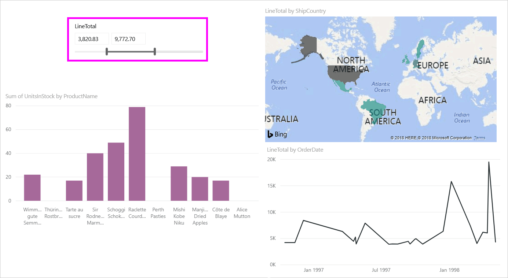
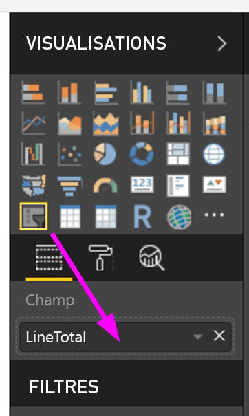
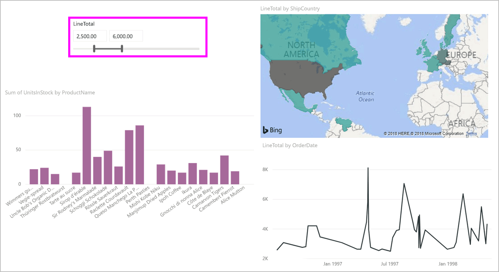
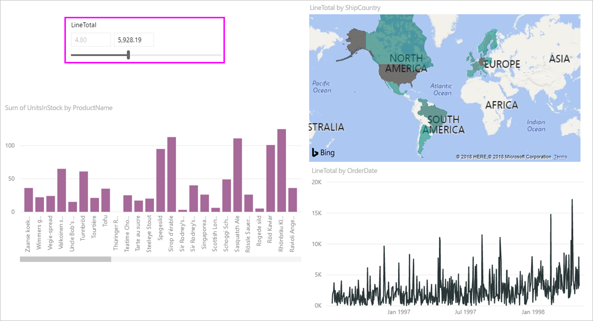
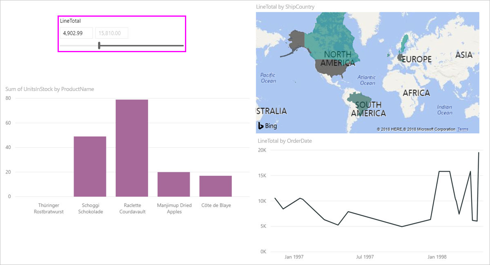

# Utiliser le segment de plages numériques dans Power BI

[!INCLUDE [applies-to](includes/applies-to.md)] [!INCLUDE [yes-desktop](includes/yes-desktop.md)] [!INCLUDE [yes-service](includes/yes-service.md)]

Le sélecteur de plages numériques vous permet d’appliquer toutes sortes de filtres à toute colonne numérique dans votre modèle de données. Il existe trois options pour filtrer vos données numériques : entre des valeurs, inférieur ou égal à une valeur, ou supérieur ou égal à une valeur. Cette technique simple est un moyen puissant de filtrer vos données.

## Video

Dans cette vidéo, nous allons examiner pas à pas la création d’un segment de plages numériques.

> [!NOTE]
> Cette vidéo utilise une version antérieure de Power BI Desktop.

<iframe width="560" height="315" src="https://www.youtube.com/embed/zIZPA0UrJyA" frameborder="0" allowfullscreen></iframe> 

## Ajouter un segment de plages numériques

Vous pouvez utiliser le sélecteur de plages numériques comme tout autre segment. Créez simplement un visuel **Segment** pour votre rapport, puis sélectionnez une valeur numérique pour **Champ**. Dans l’image suivante, nous avons sélectionné le champ **LineTotal**.

Sélectionnez la flèche pointant vers le bas dans l’angle supérieur droit du sélecteur de plages numériques pour afficher un menu.

Pour la plage numérique, vous avez le choix entre les trois options suivantes :

* **Entre**
* **Inférieur ou égal à**
* **Supérieur ou égal à**

Quand vous sélectionnez **Entre** dans le menu, un curseur s’affiche. Vous pouvez utiliser ce curseur pour sélectionner des valeurs numériques comprises entre les nombres. Parfois, la précision du déplacement de la barre du segment rend difficile le choix exact de ce nombre. Vous pouvez également utiliser le curseur et sélectionner l’une des cases pour taper les valeurs souhaitées. Cette option est pratique quand vous souhaitez effectuer un découpage sur des nombres spécifiques.

Dans l’image suivante, la page de rapport filtre les valeurs **LineTotal** comprises entre 2500.00 et 6000.00.

Quand vous sélectionnez **Inférieur ou égal à**, la poignée de gauche (valeur inférieure) de la barre du curseur disparaît, et vous ne pouvez ajuster que la limite supérieure de la barre du curseur. Dans l’image suivante, nous avons positionné la valeur maximale de la barre du curseur sur 5928.19.

Pour finir, si vous sélectionnez **Supérieur ou égal à**, la poignée de droite (valeur supérieure) de la barre du curseur disparaît. Vous pouvez ensuite ajuster la valeur inférieure, comme illustré dans l’image suivante. À présent, seuls les articles dont la valeur **LineTotal** est supérieure ou égale à 4902.99 s’affichent dans les visuels de la page de rapport.

## Aligner sur des nombres entiers avec le sélecteur de plages numériques

Un sélecteur de plages numériques s’aligne sur les nombres entiers si le type de données du champ sous-jacent est *Nombre entier*. Cette fonctionnalité permet à votre segment de s’aligner avec précision sur des nombres entiers. Les champs *Nombre décimal* vous permettent d’entrer ou de sélectionner des fractions d’un nombre. La mise en forme définie dans la zone de texte correspond à celle définie dans le champ, même si vous pouvez entrer ou sélectionner des nombres plus précis.

## Format d’affichage du sélecteur de plages de dates

Quand vous utilisez un segment pour afficher ou définir une plage de dates, les dates s’affichent au format *Date courte*. Les paramètres régionaux du navigateur ou du système d’exploitation de l’utilisateur déterminent le format de la date. Ainsi, il s’agira du format d’affichage, quels que soient les paramètres de type de données pour les données ou le modèle sous-jacents.

Vous pourriez, par exemple, avoir un format de date long pour le type de données sous-jacent. Dans ce cas, un format de date tel que *jjjj, MMMM J, aaaa* mettrait en forme une date dans d’autres visuels ou circonstances comme *Wednesday, March 14, 2001*. Mais dans le segment de plage de dates, cette date s’affiche dans le segment sous la forme *03/14/2001*.

L’affichage au format Date courte dans le sélecteur garantit le maintien d’une longueur de chaîne cohérente et compacte dans le sélecteur.

## Considérations et limitations

Les considérations et limitations suivantes s’appliquent à l’utilisation du sélecteur de plages numériques :

* Le sélecteur de plages numériques filtre chaque ligne sous-jacente dans les données, mais pas de valeur agrégée. Par exemple, supposez que vous utilisez un champ *Montant des ventes*. Le segment filtre alors chaque transaction en fonction du montant des ventes, et non de la somme du montant des ventes pour chaque point de données d’un visuel.
* Cela ne fonctionne pas actuellement avec des mesures.
* Vous pouvez taper n’importe quel nombre dans un sélecteur numérique, même s’il se trouve en dehors de la plage de valeurs de la colonne sous-jacente. Cette option vous permet de configurer des filtres si vous savez que les données peuvent changer ultérieurement.
