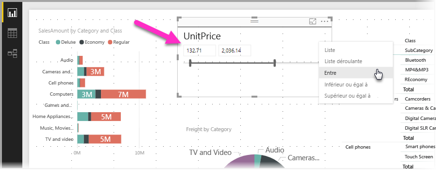
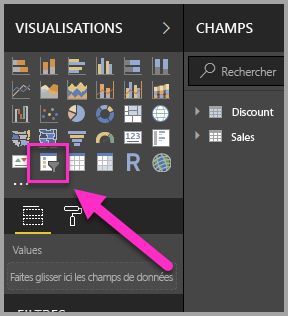
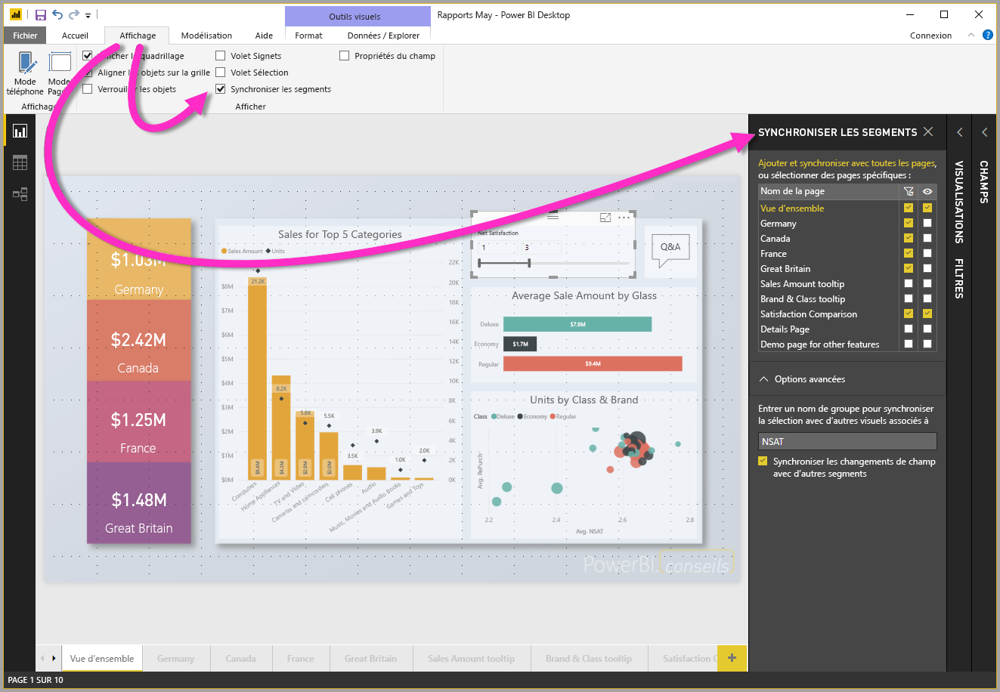
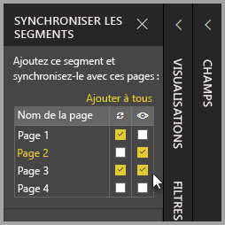

# Utilisation de segments Power BI Desktop

Vous pouvez utiliser un **segment** dans **Power BI Desktop** pour filtrer les résultats de visuels sur la page de votre rapport. Et les segments vous permettent d’ajuster facilement le filtre appliqué en interagissant avec le segment lui-même. Vous pouvez également spécifier des options pour définir l’apparence de votre segment et votre interaction avec lui. L’illustration suivante montre un segment et son menu déroulant *Type*. 

Un segment peut être affiché selon différents types :

* List
* Liste déroulante
* Entre
* Inférieur ou égal à
* Supérieur ou égal à

Vous pouvez ajouter un segment à un rapport en cliquant sur le visuel du **segment** dans le volet **Visualisations**.

Les segments se comportent de la même façon dans **Power BI Desktop** et le **service Power BI**. Pour obtenir un didacticiel sur l’utilisation des segments, consultez [Segments dans le service Power BI (didacticiel)](power-bi-visualization-slicers.md).

## Synchroniser des segments entre les pages d’un rapport

Dans **Power BI Desktop** vous pouvez synchroniser des segments entre plusieurs pages d’un rapport. Pour synchroniser des segments, dans le volet **Affichage** du ruban, sélectionnez **Synchroniser les segments**. Lorsque vous synchronisez des segments, le volet **Synchroniser les segments** s’affiche, comme illustré dans l’image suivante.

Dans le volet **Synchroniser les segments**, vous pouvez spécifier comment le segment doit être synchronisé entre les pages du rapport. Vous pouvez spécifier si chaque segment doit être **appliqué** à chaque page du rapport, et si le segment doit être **visible** sur chacune de ces pages.

Par exemple, vous pouvez placer un segment sur la **page 2** de votre rapport, comme illustré dans l’image suivante. Vous pouvez ensuite spécifier si ce segment doit *s’appliquer* à chaque page sélectionnée, et si ce segment doit être *visible* sur chaque page du rapport sélectionné. Vous pouvez appliquer n’importe quelle combinaison de ces options, pour chaque segment. 

Le lien **Ajouter à tous** du volet applique le segment sélectionné à toutes les pages du rapport.

Notez que les sélections indiquées dans le volet **Synchroniser les segments** s’appliquent uniquement au *segment sélectionné*. Vous pouvez appliquer plusieurs segments à différentes pages, et utiliser le volet pour définir la façon dont chaque segment est appliqué individuellement dans les différentes pages de votre rapport. 

Votre sélection de segments peut être synchronisée, mais d’autres sélections comme la définition du style, la modification et la suppression ne sont *pas* synchronisées. 

## Étapes suivantes

Les articles suivants pourraient également vous intéresser :

* [Segments dans le service Power BI (didacticiel)](power-bi-visualization-slicers.md)
* [Utiliser le Sélecteur de plages numériques dans Power BI Desktop](desktop-slicer-numeric-range.md)
* [Utiliser un segment et un filtre de date relative dans Power BI Desktop](desktop-slicer-filter-date-range.md)

