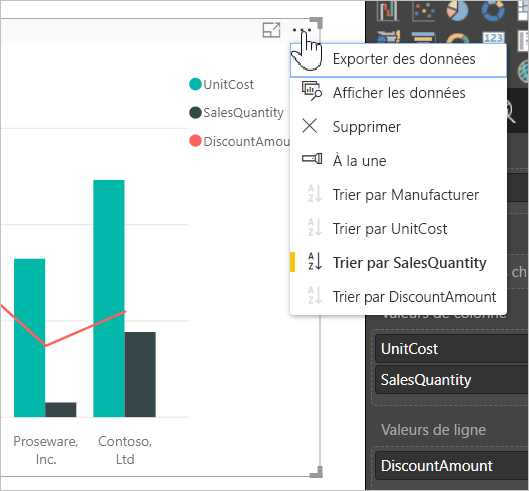
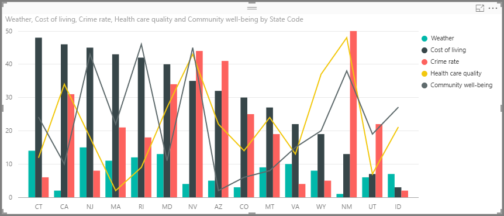
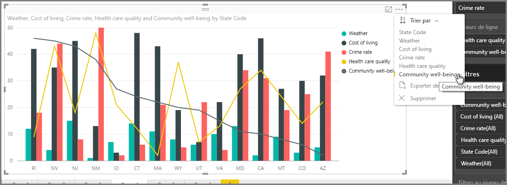
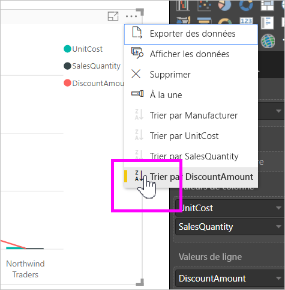
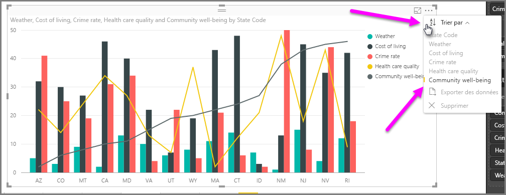
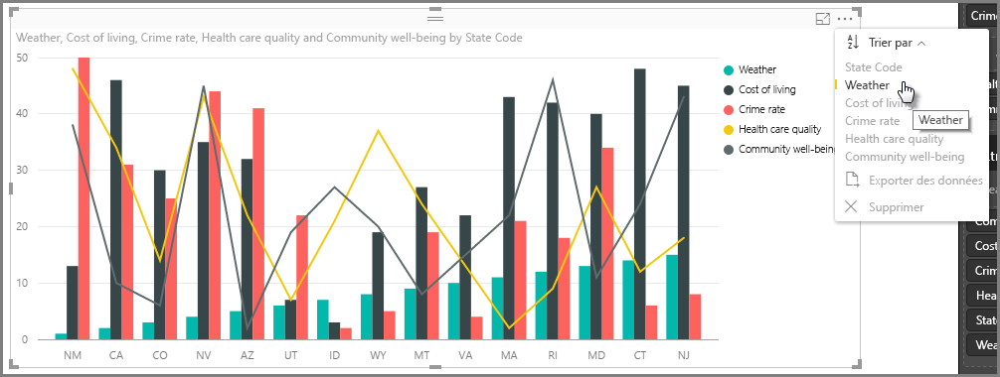
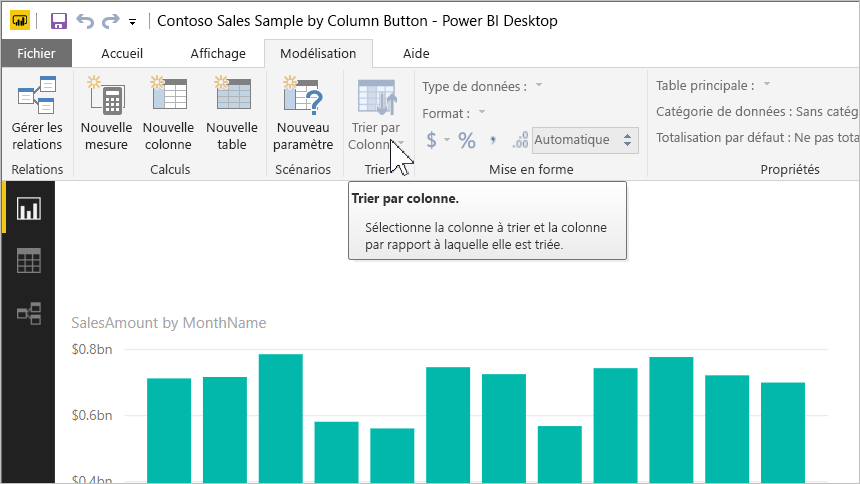
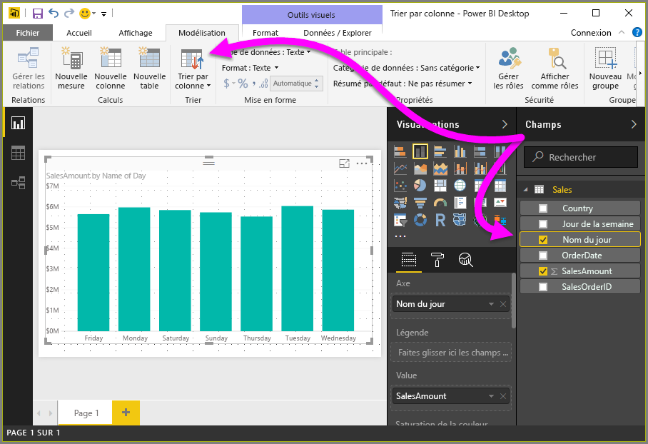
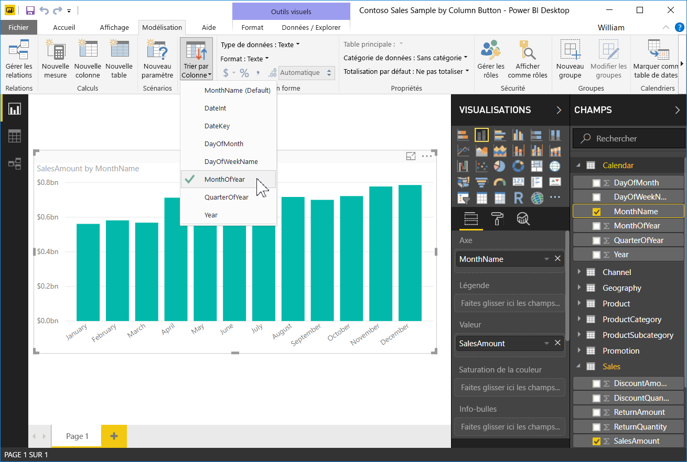
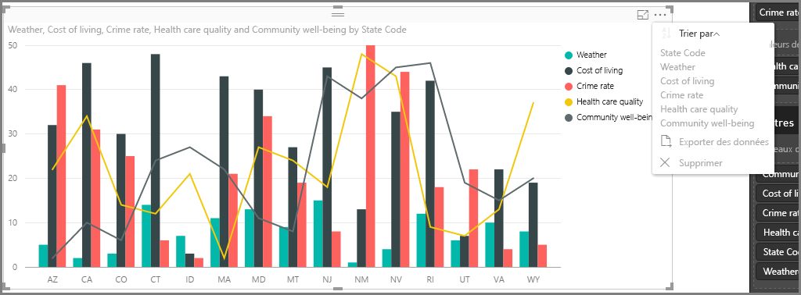

# Trier par colonne dans Power BI Desktop
Dans **Power BI Desktop** et le **service Power BI**, vous pouvez modifier l’apparence d’un visuel en le triant par différents champs de données. En modifiant le mode de tri d’un visuel, vous pouvez mettre en surbrillance les informations que vous souhaitez transmettre et vérifier que le visuel reflète la tendance (ou l’importance) que vous souhaitez transmettre.

Si vous utilisez des données numériques (par exemple, des chiffres de ventes) ou des données texte (comme des noms d’État), vous pouvez trier vos visualisations comme vous le souhaitez et leur donner l’aspect souhaité.  **Power BI** offre une grande souplesse sur le plan du tri et des menus rapides que vous pouvez utiliser. Sur n’importe quel visuel, sélectionnez le menu des points de suspension (…), puis l’option **Trier par**. Choisissez ensuite le champ par lequel vous voulez trier, comme illustré dans l’image suivante.

## Approfondissement et exemple
Prenons un exemple plus approfondi et voyons comment il fonctionne dans **Power BI Desktop**.

La visualisation suivante répertorie les 15 premiers États en matière de météo (avec le plus de jours ensoleillés, classés de 1 à 50, le 1er ayant le plus de jours ensoleillés). Voici la visualisation telle qu’elle apparaît avant tout tri.

L’élément visuel est actuellement trié par **Coût de la vie**, nous pouvons le constater en faisant correspondre la couleur des barres décroissantes à la légende, mais il existe une meilleure méthode pour déterminer la colonne active : la boîte de dialogue **Trier par**, disponible dans le menu de points de suspension (...) dans le coin supérieur droit de l’élément visuel. Lorsque vous sélectionnez les points de suspension, vous observez ce qui suit :

Il y a plusieurs choses à noter dans le menu qui s’affiche lorsque vous sélectionnez les points de suspension :

* La barre jaune à côté de **Coût de la vie**, et le fait que **Coût de la vie** est en gras
* La petite icône à côté des mots **Trier par**, qui affiche **Z/A** (Z avant A) et une flèche vers le bas.

Nous allons examiner chacun de ces éléments indépendamment dans les deux sections suivantes.

## Sélection de la colonne à utiliser pour le tri
Vous avez remarqué la barre jaune à côté de **Coût de la vie** dans le menu **Trier par**, qui indique que l’élément visuel utilise la colonne **Coût de la vie** pour trier l’élément visuel. Il est simple de trier avec une autre colonne, sélectionnez simplement les points de suspension pour afficher le menu **Trier par**, puis sélectionnez une autre colonne. C’est aussi simple que cela.

Dans l’image suivante, nous avons sélectionné **Bien-être** en tant que colonne que nous souhaitons trier. Cette colonne se trouve être une des lignes sur l’élément visuel, plutôt qu’une des barres. Voici à quoi elle ressemble une fois que nous sélectionnons **Bien-être**

Remarquez les changements sur l’élément visuel. Les valeurs sont maintenant triées de la valeur de « Bien-être » la plus élevée (dans ce cas RI pour Rhode Island) pour les États inclus dans ce visuel, jusqu’à AZ (pour Arizona), qui a la valeur la plus basse. Souvenez-vous que le graphique global ne comprend toujours que les 15 États avec le plus de jours ensoleillés, nous les avons simplement triés sur la base d’une autre colonne dans l’élément visuel.

Mais que se passe-t-il si nous souhaitons effectuer un tri en ordre croissant, plutôt que décroissant ? La section suivante montre à quel point cela est simple.

## Sélection de l’ordre de tri : du plus petit au plus grand, du plus grand au plus petit
Lorsque nous examinons de plus près le menu **Trier par** à partir de l’image précédente, nous voyons que l’icône à côté de **Trier par** montre **Z/A** (Z avant A). Jetons un œil :

Lorsque **Z/A** s’affiche, cela signifie que l’élément visuel est trié en fonction de la colonne sélectionnée, de la plus grande à la plus petite valeur. Vous souhaitez changer cela ? Aucun problème. Appuyez ou cliquez simplement sur l’icône **Z/A** pour modifier l’ordre sur **A/Z** et trier l’élément visuel (sur la base de la colonne sélectionnée) de la plus petite à la plus grande valeur.

Voici le même élément visuel, cette fois après avoir appuyé sur l’icône **Z/A** dans le menu **Trier par** pour modifier l’ordre. Notez que AZ (Arizona) est maintenant le premier État répertorié et RI (Rhode Island) le dernier, l’inverse d’avant.

Vous pouvez trier sur la base d’une colonne incluse dans l’élément visuel : nous pouvons facilement sélectionner Météo en tant que colonne en fonction de laquelle nous souhaitons trier, puis sélectionner **Z/A** dans le menu **Trier par** pour afficher d’abord les États avec le plus de jours ensoleillés (la valeur la plus élevée, Météo équivaut au nombre de jours ensoleillés dans ce modèle de données), tout en conservant les autres colonnes dans l’élément visuel, indépendamment de leur valeur pour cet État. Voici un aperçu de l’élément visuel avec ces paramètres.

## Tri à l’aide du bouton Trier par colonne
Il existe une autre façon de trier vos données : utilisez le bouton **Trier par colonne** situé dans le ruban **Modélisation**.

Cette méthode de tri nécessite que vous sélectionniez une colonne dans le volet **Champs**, puis le bouton **Trier par colonne** pour choisir comment vous souhaitez trier votre visuel (par quelle colonne). Vous devez sélectionner la colonne (le champ) que vous souhaitez trier dans le volet **Champs** afin d’activer le bouton **Trier par colonne**. Sinon, le bouton est inactif.

Examinons un exemple courant : vous souhaitez trier les données de chaque jour de la semaine dans l’ordre chronologique. Pour cela, procédez comme suit.

1. Tout d’abord, notez que lorsque le visuel est sélectionné, mais qu’aucune colonne n’est sélectionnée dans le volet **Champs**, le bouton **Trier par colonne** est inactif (grisé).
   
   
2. Lorsque vous sélectionnez la colonne selon laquelle effectuer le tri, dans le volet **Champs**, le bouton **Trier par colonne** devient actif.
   
   
3. À présent, le visuel étant sélectionné, vous pouvez sélectionner *Jour de la semaine*, au lieu de la valeur par défaut (*Nom du jour*) pour trier le visuel dans l’ordre souhaité, à savoir en fonction du jour de la semaine.
   
   

C’est tout. N’oubliez pas que vous devez sélectionner une colonne dans le volet **Champs** pour que le bouton **Trier par colonne** devienne actif.

## Retour à la colonne par défaut pour le tri
Vous pouvez trier avec la colonne de votre choix, mais vous pourriez souhaiter rétablir l’élément visuel à sa colonne de tri par défaut. Aucun problème. Pour un élément visuel qui a une colonne de tri sélectionnée (une colonne de tri sélectionnée a une barre jaune située à ses côtés dans le menu **Trier par**, comme nous l’avons appris), ouvrez simplement le menu **Trier par** et sélectionnez à nouveau cette colonne et la visualisation revient à sa colonne de tri par défaut.

Par exemple, voici notre graphique précédent :

Lorsque vous revenez au menu et sélectionnez **Météo** à nouveau, le visuel est de nouveau trié par ordre alphabétique du **Code d’état**, le comportement par défaut, comme illustré dans l’image suivante.

Avec autant d’options de tri de vos éléments visuels, la création du graphique ou de l’image que vous souhaitez est un jeu d’enfant.

