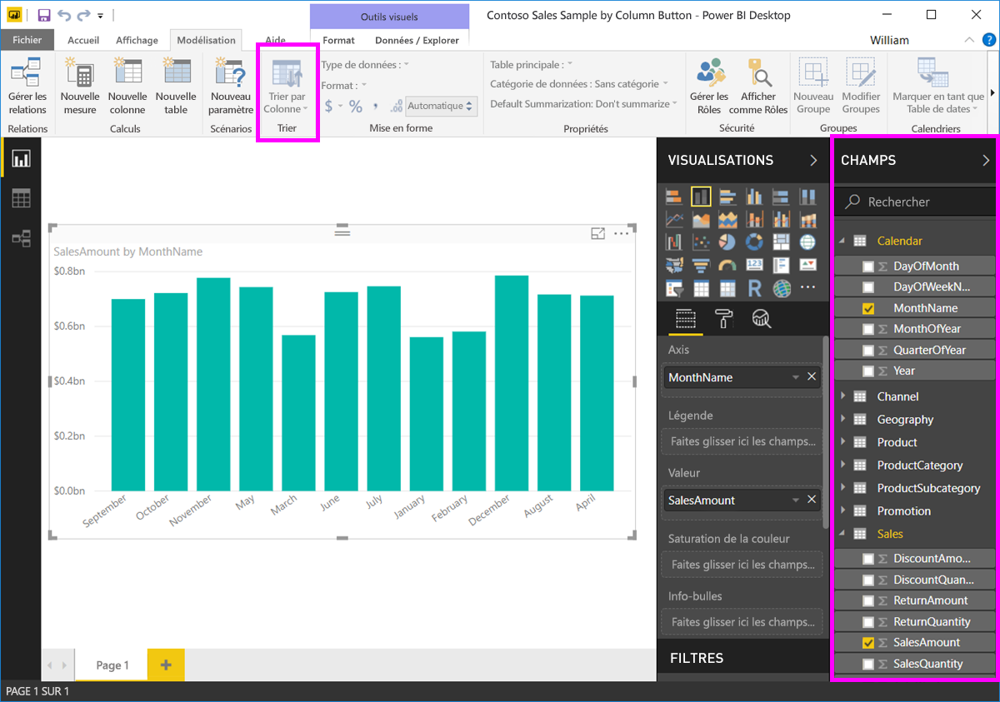

# Trier par colonne dans Power BI Desktop
Dans **Power BI Desktop** et le **service Power BI**, vous pouvez modifier l’apparence d’un visuel en le triant par différents champs de données. En changeant la façon dont vous triez un visuel, vous pouvez mettre en évidence les informations que vous voulez transmettre et vérifier que le visuel reflète cette tendance (ou cette importance).

Que vous utilisiez des données numériques (par exemple des chiffres de ventes) ou des données texte (comme des noms d’État), vous pouvez trier vos visualisations comme vous le souhaitez et leur donner l’aspect souhaité.  **Power BI** offre une grande souplesse sur le plan du tri et des menus rapides que vous pouvez utiliser. Sur n’importe quel visuel, sélectionnez le menu des points de suspension (…), puis sélectionnez ensuite le champ sur lequel vous voulez trier, comme illustré dans l’image suivante.

## Approfondissement et exemple
Prenons un exemple plus approfondi et voyons comment il fonctionne dans **Power BI Desktop**.

La visualisation suivante montre les coûts, les quantités et les montants par nom de fabricant. Voici la visualisation telle qu’elle apparaît avant le tri.

Le visuel est actuellement trié par **SalesQuantity**. Nous pouvons le constater d’après la correspondance entre la couleur des barres décroissantes et la légende, mais il existe une meilleure méthode pour déterminer la colonne de tri active : le menu des points de suspension (...) dans le coin supérieur droit du visuel. Lorsque vous sélectionnez les points de suspension, vous observez ce qui suit :

* Le champ de tri actuel est **SalesQuantity**, ce qui est indiqué par le fait que **Trier par SalesQuantity** est en gras et a une barre jaune. 

* L’ordre du tri actuel est du plus petit au plus grand, comme indiqué par la petite icône **A/Z** (A au-dessus de Z) et une flèche vers le bas.

Nous allons examiner distinctement le champ de tri et l’ordre de tri dans les deux sections suivantes.

## Sélection de la colonne à utiliser pour le tri
Vous avez remarqué la barre jaune à côté de **Trier par SalesQuantity** dans le menu **Plus d’options**, qui indique que le visuel est trié sur la colonne **SalesQuantity**. Il est facile de trier sur une autre colonne : sélectionnez simplement les points de suspension pour afficher le menu correspondant, puis sélectionnez une autre colonne.

Dans l’image suivante, nous avons sélectionné *DiscountAmount* comme colonne sur laquelle nous voulons trier. Cette colonne se trouve être une des lignes sur l’élément visuel, plutôt qu’une des barres. Voici le visuel une fois que nous avons sélectionné **Trier par DiscountAmount**.

Remarquez les changements sur l’élément visuel. Les valeurs sont maintenant classées de la plus grande valeur de DiscountAmount, qui dans ce visuel est Fabrikam Inc., à Northwind Traders, qui a la valeur la plus faible. 

Mais que se passe-t-il si nous souhaitons effectuer un tri en ordre croissant, plutôt que décroissant ? La section suivante montre à quel point cela est simple.

## Sélection de l’ordre de tri : du plus petit au plus grand, du plus grand au plus petit
Quand nous examinons de plus près le menu **Options** dans l’image précédente, nous voyons que l’icône à côté de **Trier par DiscountAmount** montre **Z/A** (Z au-dessus de A). Jetons un œil :

Lorsque **Z/A** s’affiche, cela signifie que l’élément visuel est trié en fonction de la colonne sélectionnée, de la plus grande à la plus petite valeur. Vous souhaitez changer cela ? Aucun problème. Appuyez ou cliquez simplement sur l’icône **Z/A** pour modifier l’ordre sur **A/Z** et trier l’élément visuel (sur la base de la colonne sélectionnée) de la plus petite à la plus grande valeur.

Voici le même visuel, cette fois après avoir appuyé sur l’icône **Z/A** de l’élément de menu **Trier par DiscountAmount** pour en changer l’ordre. Notez que Northwind Traders est maintenant le premier constructeur de la liste, et que Fabrikam Inc. est le dernier, c’est-à-dire l’inverse du tri précédent.

Vous pouvez trier sur n’importe quelle colonne incluse dans le visuel : nous pouvons facilement sélectionner SalesQuantity comme colonne en fonction de laquelle nous voulons trier, puis sélectionner **Trier par SalesQuantity** dans le menu pour afficher d’abord les fabricants avec le plus de ventes, tout en conservant les autres colonnes dans le visuel, indépendamment de leur valeur pour ce fabricant. Voici un aperçu de l’élément visuel avec ces paramètres.

## Tri à l’aide du bouton Trier par colonne
Il existe une autre façon de trier vos données : utilisez le bouton **Trier par colonne** situé dans le ruban **Modélisation**.

Cette méthode de tri nécessite que vous sélectionniez une colonne dans le volet **Champs**, puis le bouton **Trier par colonne** pour choisir comment vous souhaitez trier votre visuel (par quelle colonne). Vous devez sélectionner la colonne (le champ) que vous souhaitez trier dans le volet **Champs** afin d’activer le bouton **Trier par colonne**. Sinon, le bouton est inactif.

Examinons un exemple courant : vous avez des données pour chaque mois de l’année et vous voulez les trier par ordre chronologique. Pour cela, procédez comme suit.

1. Tout d’abord, notez que lorsque le visuel est sélectionné, mais qu’aucune colonne n’est sélectionnée dans le volet **Champs**, le bouton **Trier par colonne** est inactif (grisé).
   
   

2. Lorsque vous sélectionnez la colonne selon laquelle effectuer le tri, dans le volet **Champs**, le bouton **Trier par colonne** devient actif.
   
   
3. À présent, le visuel étant sélectionné, vous pouvez sélectionner *MonthOfYear* au lieu de la valeur par défaut (*MonthName*) pour trier le visuel dans l’ordre souhaité : en fonction du mois de l’année.
   
   

C’est tout. N’oubliez pas que vous devez sélectionner une colonne dans le volet **Champs** pour que le bouton **Trier par colonne** devienne actif.

## Retour à la colonne par défaut pour le tri
Vous pouvez trier avec la colonne de votre choix, mais vous pourriez souhaiter rétablir l’élément visuel à sa colonne de tri par défaut. Aucun problème. Pour un visuel qui a une colonne de tri sélectionnée (comme nous l’avons vu, une colonne de tri sélectionnée apparaît avec une barre jaune à côté d’elle dans le menu des points de suspension), ouvrez simplement le menu **Plus d’options** et resélectionnez cette colonne : la visualisation revient à sa colonne de tri par défaut.

Par exemple, voici notre graphique précédent :

Quand vous revenez au menu et que vous resélectionnez **SalesQuantity**, le visuel est de nouveau trié selon l’ordre alphabétique de **Manufacturer**, le comportement par défaut, comme illustré dans l’image suivante.

Avec autant d’options de tri de vos éléments visuels, la création du graphique ou de l’image que vous souhaitez est un jeu d’enfant.

