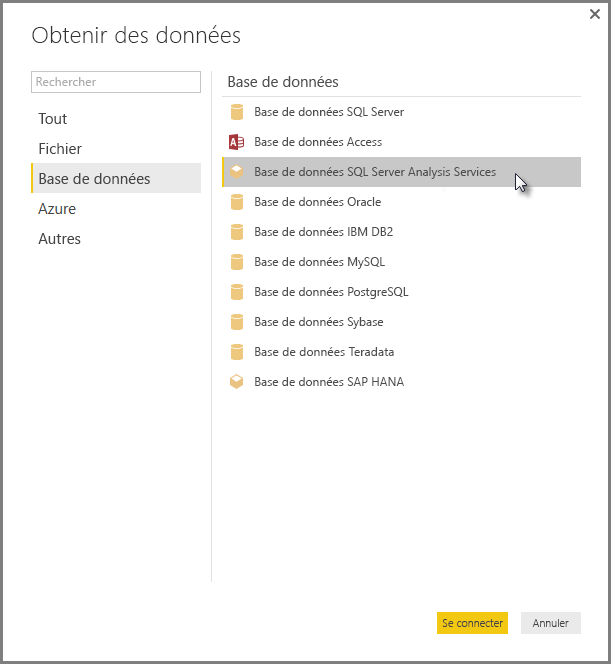

# Se connecter aux modèles multidimensionnels SSAS dans Power BI Desktop
Power BI Desktop vous permet d’accéder aux **modèles multidimensionnels SSAS**, communément appelés **SSAS MD**.

Pour vous connecter à une base de données **SSAS MD**, sélectionnez **Obtenir des données &gt; Base de données &gt; Base de données SQL Server Analysis Services**, comme indiqué dans l’image suivante :

Les **modèles multidimensionnels SSAS** en mode de connexion active sont pris en charge dans le service Power BI et dans Power BI Desktop. Vous pouvez également publier et charger des rapports qui utilisent les **modèles multidimensionnels SSAS** en mode réel au service Power BI.

## Capacités et fonctionnalités de SSAS MD
Les sections suivantes décrivent les fonctionnalités et capacités des connexions Power BI et SSAS MD.

### Métadonnées tabulaires des modèles multidimensionnels
Le tableau suivant illustre la correspondance entre les objets multidimensionnels et les métadonnées tabulaires qui sont renvoyés à Power BI Desktop. Power BI interroge le modèle pour obtenir les métadonnées tabulaires et, en fonction des métadonnées renvoyées, il exécute les requêtes DAX appropriées sur Analysis Services quand vous créez une visualisation comme une table, une matrice, un graphique ou un segment.

| Objet BISM multidimensionnel | Métadonnées tabulaires |
| --- | --- |
| Cube |Modèle |
| Dimension de cube |Table |
| Attributs de la dimension (clés), nom |Colonnes |
| Groupe de mesures |Table |
| Mesure |Mesure |
| Mesures sans groupe de mesures associé |Dans une table appelée *Mesures* |
| Relation groupe de mesures -> dimension de Cube |Relation |
| Perspective |Perspective |
| Indicateur de performance clé |Indicateur de performance clé |
| Hiérarchies parent-enfant/utilisateur |Hiérarchies |

### Mesures, groupes de mesures et indicateurs de performance clés
Les groupes de mesures dans un cube multidimensionnel sont exposés dans Power BI sous forme de tables et accompagnés du signe ∑, dans le volet **Champs** . Les mesures calculées qui ne sont pas associées à un groupe de mesures sont regroupées dans une table spéciale appelée *Mesures* dans les métadonnées tabulaires.

Dans un modèle multidimensionnel, vous pouvez définir un ensemble de mesures ou d’indicateurs de performance clés dans un cube à placer dans un *Dossier d’affichage*, ce qui peut simplifier les modèles complexes. Power BI reconnaît les dossiers d’affichage dans les métadonnées tabulaires et affiche les mesures et indicateurs de performance clés dans les dossiers d’affichage. Les indicateurs de performance clés dans les bases de données multidimensionnelles prennent en charge *Valeur*, *Objectif*, *Graphique d’état* et *Graphique de tendance*.

### Types d’attributs de dimension
Les modèles multidimensionnels prennent également en charge l’association d’attributs de dimension avec des types d’attributs de dimension spécifiques. Par exemple, une dimension **Géographie**, pour laquelle les attributs de dimension *Ville*, *État/région*, *Pays* et *Code postal* sont associés à des types géographiques appropriés, sont exposés dans les métadonnées tabulaires. Power BI reconnaît les métadonnées, ce qui vous permet de créer des visualisations de carte. Ces associations sont identifiables grâce à l’icône *carte* située en regard de l’élément dans le volet **champ** volet dans Power BI.

Power BI peut également générer des images lorsque vous fournissez un champ contenant l’URL (Uniform Resource Locator) des images. Vous pouvez désigner ces champs comme type *ImageURL* dans SQL Server Data Tools (ou par la suite dans Power BI) et les informations relatives au type sont transmises à Power BI dans les métadonnées tabulaires. Power BI peut ensuite récupérer ces images à partir de l’URL et les afficher dans des visuels.

### Hiérarchies parent-enfant
Les modèles multidimensionnels prennent en charge les hiérarchies parent-enfant, qui sont présentées comme *hiérarchie* dans les métadonnées tabulaires. Chaque niveau de la hiérarchie parent-enfant est exposé sous forme de colonne masquée dans les métadonnées tabulaires. L’attribut clé de la dimension parent-enfant n’est pas exposé dans les métadonnées tabulaires.

### Membres calculés de dimension
Les modèles multidimensionnels prennent en charge la création de différents types de *membres calculés*. Les deux types de membres calculés les plus courants sont les suivants :

* membres calculés sur les hiérarchies d’attributs non frères de *Tous*
* membres calculés sur les hiérarchies d’utilisateur

Les modèles multidimensionnels exposent les *membres calculés sur les hiérarchies d’attributs* sous forme de valeurs d’une colonne. Il existe quelques options et contraintes supplémentaires lors de l’exposition de ce type de membre calculé :

* L’attribut de dimension peut avoir une propriété *UnknownMember* facultative
* Un attribut contenant des membres calculés ne peut pas être l’attribut clé de la dimension, sauf s’il est le seul attribut de la dimension
* Un attribut contenant des membres calculés ne peut pas être un attribut parent-enfant

Les membres calculés des hiérarchies d’utilisateurs ne sont pas exposés dans Power BI. Au lieu de cela, vous serez en mesure de vous connecter à un cube contenant des membres calculés dans des hiérarchies d’utilisateur, mais vous ne pourrez pas afficher les membres calculés s’ils ne respectent pas les contraintes mentionnées dans la liste précédente.

### Sécurité
Les modèles multidimensionnels prennent en charge la sécurité au niveau des cellules et de la dimension au moyen des *rôles*. Lorsque vous vous connectez à un cube avec Power BI, vous êtes authentifié et évalué afin d’obtenir les autorisations appropriées. Lorsque la *sécurité de dimension* est appliquée à un utilisateur, les membres de la dimension respective ne sont pas visibles par l’utilisateur dans Power BI. Toutefois, lorsqu’une autorisation de *sécurité de cellule* est définie pour un utilisateur, lorsque certaines cellules sont restreintes, cet utilisateur ne peut pas se connecter au cube à l’aide de Power BI.

## Considérations et limitations
Il existe certaines limitations à l’utilisation de **SSAS MD**:

* Les serveurs doivent exécuter SQL Server 2012 SP1 CU4 ou des versions ultérieures d’Analysis Services pour que le connecteur SSAS MD de Power BI Desktop fonctionne correctement
* *Actions* et *jeux nommés* ne sont pas exposés à Power BI, mais vous pouvez toujours vous connecter à des cubes qui contiennent également les propriétés *actions* ou *jeux nommés* et créer des rapports et des éléments visuels.
* Vous risquez de rencontrer un problème où Power BI affiche les métadonnées d’un modèle SSAS, mais vous n’arrivez pas à récupérer les données du modèle. Cela peut se produire si vous avez la version 32 bits du fournisseur MSOLAP installée sur votre système et pas la version 64 bits. L’installation de la version 64 bits peut résoudre le problème.
* Vous ne pouvez pas créer des mesures « au niveau du rapport » lors de la création d’un rapport qui est connecté en direct à un modèle multidimensionnel SSAS. Les seules mesures disponibles sont celles définies dans le modèle MD.

## Fonctionnalités prises en charge de SSAS MD dans Power BI Desktop
Les fonctionnalités suivantes de SSAS MD sont pris en charge dans Power BI Desktop :

* La consommation des éléments suivants est prise en charge dans cette version de **SSAS MD** (vous pouvez obtenir [des informations supplémentaires](https://msdn.microsoft.com/library/jj969574.aspx) sur ces fonctionnalités) :
  * Dossiers d’affichage
  * Tendances d’indicateurs de performance clés
  * Membres par défaut
  * Attributs de la dimension
  * Membres calculés de la dimension (doit être un membre réel unique quand la dimension comporte plusieurs attributs, ne peut pas être l’attribut clé de la dimension sauf si c’est le seul attribut et ne peut pas être un attribut parent-enfant)
  * Types d’attributs de la dimension
  * Hiérarchies
  * Mesures (avec ou sans groupes de mesures)
  * Mesures en tant que Variant
  * Indicateurs de performance clés (KPI)
  * ImageUrls
  * Sécurité de la dimension

## Résolution des problèmes 
La liste suivante décrit tous les problèmes connus lors de la connexion à SQL Server Analysis Services (SSAS). 

* **Erreur : Impossible de charger le schéma de modèle** : cette erreur se produit généralement quand l’utilisateur qui se connecte à Analysis Services n’a pas accès à la base de données/au cube.
