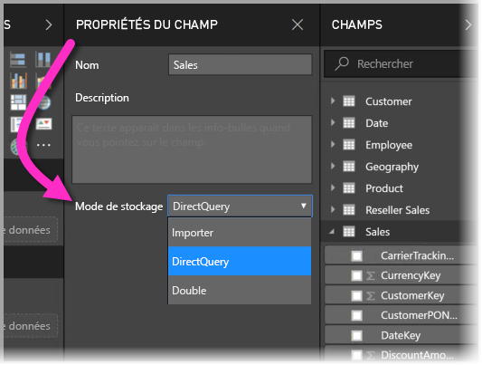
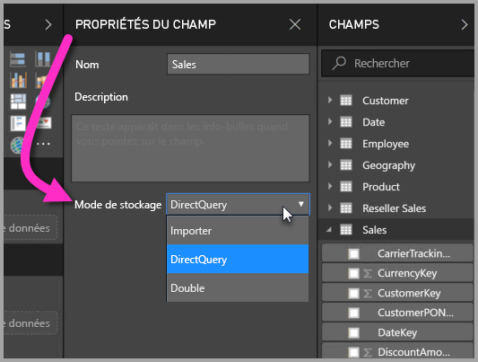
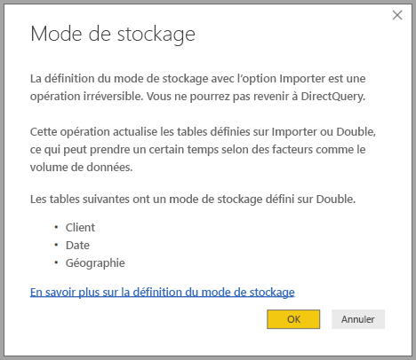

# Mode de stockage dans Power BI Desktop (préversion)

Dans **Power BI Desktop** vous pouvez spécifier le **mode de stockage** des tables, qui vous permet de contrôler si les données de la table sont mises en cache en mémoire pour les rapports. 

La définition du **mode de stockage** offre de nombreux avantages. Vous pouvez définir un **mode de stockage** pour chaque table individuellement dans votre modèle, ce qui permet à un seul jeu de données de tirer parti d’un ou de plusieurs des avantages suivants :

* **Performances des requêtes** : comme les utilisateurs interagissent avec les visuels dans les rapports Power BI, les requêtes DAX sont soumises au jeu de données. La mise en cache des données en mémoire par définition correcte du **mode de stockage** peut améliorer les performances des requêtes et l’interactivité de vos rapports.
* **Jeux de données volumineux** : les tables qui ne sont pas mises en cache ne consomment pas de mémoire pour la mise en cache. Vous pouvez activer une analyse interactive de jeux de données volumineux qui sont trop grands ou trop coûteux pour être complètement mis en cache en mémoire. Vous pouvez choisir quelles tables valent la peine d’être mises en cache et quelles tables n’en valent pas la peine.
* **Optimisation de l’actualisation des données** : les tables qui ne sont pas mises en cache n’ont pas besoin d’être actualisées. Vous pouvez réduire les temps d’actualisation en mettant en cache uniquement les données nécessaires pour répondre à vos accords de niveau de service et aux besoins de votre entreprise.
* **Exigences de temps quasi réel** : les tables avec des exigences de temps quasi réel peuvent tirer parti de ne pas être mises en cache afin de réduire la latence des données.
* **Écrire différée** : l’écriture différée permet aux utilisateurs professionnels d’analyser des scénarios en modifiant les valeurs des cellules. Des applications personnalisées peuvent appliquer des modifications à la source de données. Les tables qui ne sont pas mises en cache peuvent refléter des modifications immédiatement, permettant l’analyse instantanée des effets.

Le paramètre **mode de stockage** dans **Power BI Desktop** est une des trois fonctionnalités connexes :

* **Modèles composites** : permet à un rapport d’avoir plusieurs connexions de données, y compris des connexions provenant de DirectQuery ou d’une importation, dans toutes les combinaisons.
* **Relations plusieurs-à-plusieurs** : les **modèles composites** vous permettent d’établir des **relations plusieurs-à-plusieurs** entre des tables, sans saisir obligatoirement des valeurs uniques dans les tables et en supprimant les précédentes solutions de contournement telles que la présentation de nouvelles tables uniquement pour établir des relations. 
* **Mode de stockage** : vous pouvez désormais spécifier les visuels qui nécessitent une requête pour les sources de données principales, et ceux qui n’en ont pas besoin sont importés même s’ils sont basés sur DirectQuery, ce qui améliore les performances et réduit la charge du serveur principal. Auparavant, même de simples visuels comme les segments initiés par des requêtes sont envoyés à des sources principales. 

Cette collection de trois fonctionnalités connexes pour **modèles composites** est décrite dans différents articles :

* Les **modèles composites** sont décrits en détail dans un article dédié, [Modèles composites dans Power BI Desktop (préversion)](desktop-composite-models.md).
* Les **relations plusieurs-à-plusieurs** sont décrites dans un propre dédié, [Relations plusieurs-à-plusieurs dans Power BI Desktop (version préliminaire)](desktop-many-to-many-relationships.md).
* Le **mode de stockage** est décrit en détail dans cet article.

## Fonctionnalité de préversion d’activation du mode de stockage

La fonctionnalité **Mode de stockage** est en préversion et doit être activée dans **Power BI Desktop**. Pour activer le **mode de stockage**, sélectionnez **Fichiers > Options et paramètres > Options > Fonctionnalités en préversion**, puis cochez la case **modèles composites**. 

Vous devrez redémarrer **Power BI Desktop** pour activer la fonctionnalité.

## À l’aide de la propriété de mode de stockage

Vous pouvez définir la propriété **Mode de stockage** sur chaque table dans votre modèle. Pour définir le **mode de stockage**, sélectionnez la table dans le volet **Champs**, puis cliquez avec le bouton droit pour afficher le menu contextuel. Dans le menu contextuel, sélectionnez **Propriétés**.

La sélection du **mode de stockage** sélection est affichée dans le volet **Propriétés de champ** pour la table. À partir de là, vous pouvez afficher le **mode de stockage** actuel ou le modifier.

Il existe trois valeurs pour le **mode de stockage** :

* **Importer** : lorsqu’il est mis sur **importer**, les tables importées sont mises en cache. Les requêtes soumises au jeu de données Power BI qui retournent des données à partir de tables d’importation peuvent uniquement être satisfaites à partir de données mises en cache.
* **DirectQuery** : avec ce paramètre, les tables DirectQuery ne sont pas mises en cache. Les requêtes soumises aux jeux de données Power BI (par exemple, les requêtes DAX) qui retournent des données à partir de tables DirectQuery ne peuvent être satisfaites qu’en exécutant des requêtes à la demande à la source de données. Les requêtes envoyées à la source de données utilisent le langage de requête de cette source de données (par exemple, SQL).
* **Double** : les tables doubles peuvent agir comme mises en cache ou non mises en cache, selon le contexte de la requête envoyée au jeu de données Power BI. Dans certains cas, les requêtes sont remplies à partir des données mises en cache ; dans d’autres cas, les requêtes sont remplies en exécutant une requête à la demande à la source de données.

La modification d’une table à importer est *irréversible* ; elle ne peut plus être à nouveau transformée en DirectQuery ou en Double.

## Contraintes sur les tables DirectQuery et Double

Les tables doubles sont soumises aux mêmes contraintes que les tables DirectQuery. Celles-ci incluent des transformations M limitées et des fonctions DAX restreintes dans les colonnes calculées. Consultez [Implications de l’utilisation de DirectQuery](desktop-directquery-about.md#implications-of-using-directquery) pour plus d’informations.

## Règles de relation sur des tables avec différents modes de stockage

Les relations doivent respecter les règles basées sur le **mode de stockage** des tables associées. Cette section fournit des exemples de combinaisons valides. Consultez [Relations plusieurs à plusieurs dans Power BI Desktop (préversion)](desktop-many-to-many-relationships.md) pour en savoir plus.

Sur un jeu de données avec une seule source de données, les combinaisons de relations **1 à plusieurs** suivantes sont valides :

| Table du côté **plusieurs** | Table du côté **1** |
| ------------- |----------------------| 
| Double          | Double                 | 
| Importer        | Importer ou Double       | 
| DirectQuery   | DirectQuery ou Double  | 

## Propagation de double
Examinons un exemple. Considérez le modèle simple suivant, où toutes les tables sont d’une source unique qui prend en charge l’importation et DirectQuery.

Supposons que toutes les tables dans ce modèle sont en mode DirectQuery pour commencer. Si nous modifions ensuite le **mode de stockage** de la table *SurveyResponse* à importer, l’invite suivante s’affiche :

Les tables de dimension (*Client*, *Date* et *Géographie*) doivent être définies sur **Double** pour se conformer aux règles de relation décrites précédemment. Au lieu d’exiger que ces tables soient définies sur **Double** à l’avance, elles peuvent être définies en une seule opération.

La logique de propagation est conçue pour apporter une aide dans le cas de modèles qui contiennent de nombreuses tables. Supposons que vous disposez d’un modèle de 50 tables et que seules certaines tables de faits (transactionnelles) doivent être mises en cache. La logique dans **Power BI Desktop** détermine l’ensemble minimal des tables de dimension qui doivent être définies sur **Double**, de sorte que vous n’êtes pas obligé de le faire.

La logique de la propagation traverse uniquement un côté des relations **1 à plusieurs**.

* La modification de la table *Client* en **Importer** (au lieu de modifier *SurveyResponse*) n’est pas autorisée en raison de ses relations avec les tables DirectQuery *Sales* et *SurveyResponse*.
* La modification de la table *Client* en **Double** (au lieu de modifier *SurveyResponse*) est autorisée. La logique de propagation définit la table *Géographie* pour qu’elle soit également **Double**.

## Exemple d’utilisation du mode de stockage
Nous allons poursuivre avec l’exemple de la section précédente et imaginer que nous appliquons les paramètres de propriété de **mode de stockage** suivants :

| Table                   | Mode de stockage         |
| ----------------------- |----------------------| 
| *Sales*                 | DirectQuery          | 
| *SurveyResponse*        | Importer               | 
| *Date*                  | Double                 | 
| *Client*              | Double                 | 
| *Géographie*             | Double                 | 

Ces paramètres de propriété de mode de stockage entraînent les comportements suivants, en supposant que la table *Sales* comporte un volume de données important.
* Les tables de dimension (*Date*, *Client* et *Géographie*) sont mises en cache, les temps initiaux de chargement du rapport doivent être courts lors de la récupération des valeurs de segment à afficher.
* Le fait de ne pas mettre en cache la table *Sales*, donne les résultats suivants :
    * Les temps d’actualisation des données sont améliorés et la consommation de mémoire est réduite.
    * Les requêtes de rapports basées sur la table *Sales* s’exécutent en mode DirectQuery, qui peut prendre plus de temps, mais est plus proche du temps réel, car aucune latence de mise en cache n’est introduite.

* Les requêtes de rapport basées sur la table *SurveyResponse* sont renvoyées à partir du cache en mémoire et, par conséquent, elles doivent être relativement rapides.

## Requêtes accédant au cache ou le manquant

En vous connectant à **SQL Profiler** sur le port de diagnostic de **Power BI Desktop**, vous pouvez voir quelles requêtes accèdent au cache en mémoire ou le manquant en effectuant une trace basée sur les événements suivants :

* Événements de requêtes\Début de requête
* Traitement de requête\Début de requête Vertipaq SE
* Traitement de requête\Début de DirectQuery

Pour chaque événement de *Début de requête*, vérifiez d’autres événements ayant le même ID *ActivityID*. Par exemple, s’il n’y a pas d’événement *Début de DirectQuery*, mais qu’il y a un événement *Début de la requête Vertipaq SE*, c’est que le cache a répondu à la requête.

Les requêtes qui font référence à des tables en mode **Double** renvoient des données à partir du cache si possible, sinon elles reviennent au mode DirectQuery.

Si l’on continue avec l’exemple précédent, la requête suivante fait référence uniquement à une colonne de la table *Date*, qui est en mode **Double**. Par conséquent, elle devrait atteindre le cache.

La requête suivante fait référence uniquement à une colonne de la table *Sales*, qui se trouve en mode **DirectQuery**. Par conséquent, elle ne devrait *pas* atteindre le cache.

La requête suivante est intéressante, car elle combine les deux colonnes. Cette requête n’atteindra pas le cache. Initialement, vous pouvez prévoir de récupérer des valeurs *CalendarYear* dans le cache et des valeurs *SalesAmount* dans la source, puis combiner les résultats, mais cela serait moins efficace que d’envoyer l’opération SUM/GROUP au système source. Si l’opération a été repoussée vers la source, le nombre de lignes retournées sera probablement bien moindre. 

> [!NOTE]
> Ce comportement est différent de [relations plusieurs à plusieurs dans Power BI Desktop (préversion)](desktop-many-to-many-relationships.md) lors de la combinaison des tables mises en cache et non mises en cache.

## Les caches doivent toujours être synchronisés.

Les requêtes affichées dans la section précédente montrent que les tables **Doubles** accèdent parfois au cache et n’y accèdent parfois pas. Pour cette raison, si le cache est obsolète, des valeurs différentes peuvent être retournées. L’exécution de la requête ne tentera pas de masquer des problèmes de données, par exemple, en filtrant les résultats DirectQuery pour qu’ils correspondent aux valeurs mises en cache. Il vous incombe de connaître vos flux de données et de réaliser la conception en conséquence. Il existe des techniques établies pour gérer ces cas à la source, si nécessaire.

Le mode de stockage **Double** est une optimisation des performances. Il ne doit être utilisé que de manières qui ne compromettent pas la capacité à répondre aux besoins de l’entreprise. Pour un autre comportement, envisagez d’utiliser les techniques décrites dans l’article [Relations plusieurs à plusieurs dans Power BI Desktop (préversion)](desktop-many-to-many-relationships.md).

## Affichage des donnés
Si au moins une table dans le jeu de données a son **mode de stockage** défini sur Importer ou Double, l’onglet **Affichage des données** s’affiche.

Lorsqu’elles sont sélectionnées dans *Affichage des données**, les tables **Doubles** et **Importer** affichent des données mises en cache. Tables de DirectQuery n’affichent pas les données, et un message s’affiche que les États des tables de DirectQuery ne peut pas être affichés.

## Considérations et limitations

Il existe quelques limitations pour cette version de **mode de stockage** et sa corrélation avec des **modèles composites**.

Les sources multidimensionnelles suivantes ne peuvent pas être utilisées avec les **modèles composites** :

* SAP HANA
* SAP Business Warehouse
* SQL Server Analysis Services
* Jeux de données Power BI

Lors de la connexion à ces sources multidimensionnelles à l’aide de DirectQuery, vous ne pouvez pas non plus vous connecter à une autre source DirectQuery ni combiner les données avec des données importées.

Les limitations existantes concernant l’utilisation de DirectQuery s’appliquent lorsque vous utilisez des **modèles composites**. Plusieurs de ces limitations sont désormais appliquées par table, selon le **mode de stockage** de la table. Par exemple, une colonne calculée d’une table importée peut référencer d’autres tables, mais une colonne calculée d’une table DirectQuery est toujours limitée pour référencer uniquement des colonnes de la même table. D’autres limitations s’appliquent au modèle dans son ensemble, si aucune des tables du modèle n’est de type DirectQuery. Par exemple, les fonctionnalités **QuickInsights** et **Q&A** ne sont pas disponibles sur un modèle si une des tables qu’il contient possède un **mode de stockage** de type DirectQuery. 

## Étapes suivantes

Les articles suivants décrivent en détail les modèles composites ainsi que le mode DirectQuery.

* [Modèles composites dans Power BI Desktop (préversion)](desktop-composite-models.md)
* [Relations plusieurs-à-plusieurs dans Power BI Desktop (préversion)](desktop-many-to-many-relationships.md)

Articles DirectQuery :

* [Utilisation de DirectQuery dans Power BI](desktop-directquery-about.md)
* [Sources de données prises en charge par DirectQuery dans Power BI](desktop-directquery-data-sources.md)

