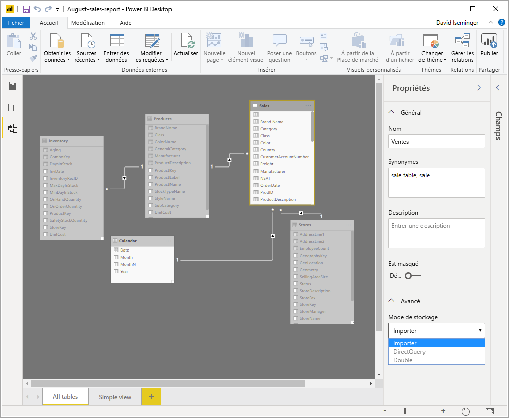
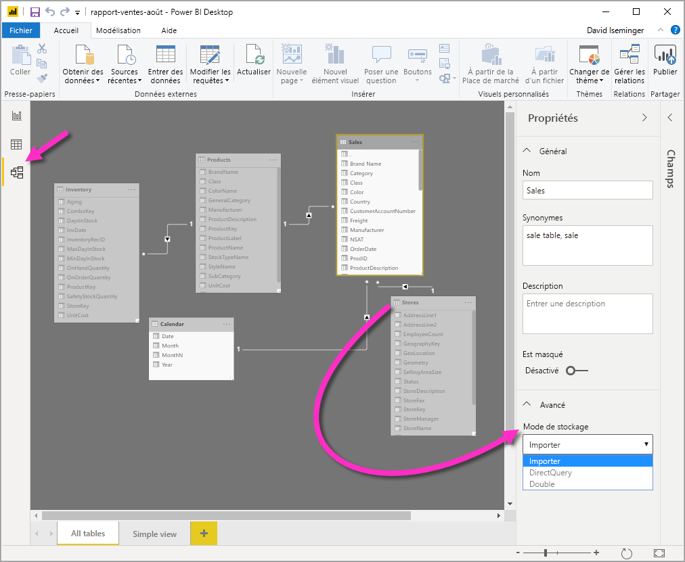

# Gérer le mode de stockage dans Power BI Desktop

Dans Microsoft Power BI Desktop, vous pouvez spécifier le *mode de stockage* des tables. Le *mode de stockage* vous permet de contrôler si Power BI Desktop place en cache des données de table en mémoire pour les rapports. 

La définition du mode de stockage offre de nombreux avantages. Vous pouvez définir le mode de stockage pour chaque table individuellement dans votre modèle. Cette action permet d’avoir un seul jeu de données, ce qui offre les avantages suivants :

* **Performances des requêtes** : Comme les utilisateurs interagissent avec les visuels dans les rapports Power BI, les requêtes Data Analysis Expressions (DAX) sont soumises au jeu de données. La mise en cache des données en mémoire par définition correcte du mode de stockage peut améliorer les performances des requêtes et l’interactivité de vos rapports.

* **Jeux de données volumineux** : Les tables qui ne sont pas mises en cache ne consomment pas de mémoire pour la mise en cache. Vous pouvez activer une analyse interactive de jeux de données volumineux qui sont trop grands ou trop coûteux pour être complètement mis en cache en mémoire. Vous pouvez choisir quelles tables valent la peine d’être mises en cache et quelles tables n’en valent pas la peine.

* **Optimisation de l’actualisation des données** : Les tables qui ne sont pas mises en cache n’ont pas besoin d’être actualisées. Vous pouvez réduire les temps d’actualisation en mettant en cache uniquement les données nécessaires pour répondre à vos accords de niveau de service et aux besoins de votre entreprise.

* **Exigences de temps quasi réel** : Les tables avec des exigences de temps quasi réel peuvent tirer parti de ne pas être mises en cache afin de réduire la latence des données.

* **Réécriture** : L’écriture différée permet aux utilisateurs professionnels d’analyser des scénarios en modifiant les valeurs des cellules. Des applications personnalisées peuvent appliquer des modifications à la source de données. Les tables qui ne sont pas mises en cache peuvent afficher des modifications immédiatement, permettant l’analyse instantanée des effets.

Le paramètre de mode de stockage dans Power BI Desktop est une des trois fonctionnalités connexes :

* **Modèles composites** : Permet à un rapport d’avoir deux connexions de données ou plus, y compris des connexions provenant de DirectQuery ou d’une importation, dans toutes les combinaisons. Pour plus d’informations, consultez [Modèles composites dans Power BI Desktop](desktop-composite-models.md).

* **Relations plusieurs à plusieurs** : Avec les *modèles composites*, vous pouvez établir des *relations plusieurs à plusieurs* entre les tables. Les *relations plusieurs à plusieurs* suppriment la nécessité d’avoir des valeurs uniques dans les tables. Les solutions de contournement préalables, comme la présentation de nouvelles tables uniquement pour établir des relations, sont également supprimées. Pour plus d’informations, consultez [Relations plusieurs à plusieurs dans Power BI Desktop](desktop-many-to-many-relationships.md).

* **Mode de stockage** : Vous pouvez désormais spécifier les visuels qui nécessitent une requête sur les sources de données back-end. Les visuels qui ne nécessitent pas une requête sont importés même s’ils sont basés sur DirectQuery. Cette fonctionnalité permet d’améliorer les performances et de réduire la charge du serveur principal. Auparavant, même de simples visuels, comme les segments, initiaient des requêtes qui étaient envoyées à des sources back-end. Le mode de stockage est décrit en détail dans cet article.

> [!NOTE]
> Vous pouvez voir le mode de stockage actuel en sélectionnant la vue **Modèle**, en sélectionnant la table d’intérêt, puis, dans la section **Avancé** du volet **Propriétés**, en affichant la valeur **Mode de stockage**.

## Utiliser la propriété du mode de stockage

Vous pouvez définir la propriété Mode de stockage sur chaque table dans votre modèle. Pour définir le mode de stockage ou voir son paramétrage actuel, dans la vue **Modèle**, sélectionnez la table dont vous voulez voir ou définir les propriétés, sélectionnez le volet **Propriétés**, développez la section **Avancé**, puis développez la liste déroulante **Mode de stockage**.

Il existe trois valeurs pour le mode de stockage :

* **Importer** : Lorsque la valeur est définie sur **Importer**, les tables importées sont mises en cache. Les requêtes soumises au jeu de données Power BI qui retournent des données à partir de tables d’importation peuvent uniquement être satisfaites à partir de données mises en cache.

* **DirectQuery** : Avec ce paramètre, les tables DirectQuery ne sont pas mises en cache. Les requêtes que vous soumettez au jeu de données Power BI (par exemple, les requêtes DAX) et qui retournent des données à partir de tables DirectQuery ne peuvent être satisfaites qu’en exécutant des requêtes à la demande à la source de données. Les requêtes envoyées à la source de données utilisent le langage de requête de cette source de données (par exemple, SQL).

* **Double** : Les tables doubles peuvent agir comme mises en cache ou non mises en cache, selon le contexte de la requête envoyée au jeu de données Power BI. Dans certains cas, vous répondez aux requêtes à partir des données mises en cache. Dans d’autres cas, vous répondez aux requêtes en exécutant une requête à la demande à la source de données.

Le fait de modifier une table sur le paramètre **Importer** est une opération *irréversible*. Cette propriété ne peut pas être remodifiée en DirectQuery ou Double.

> [!NOTE]
> Vous pouvez utiliser le mode de stockage *Double* dans Power BI Desktop et dans le service Power BI.

## Contraintes sur les tables DirectQuery et Double

Les tables doubles ont les mêmes contraintes fonctionnelles que les tables DirectQuery. Ces contraintes incluent des transformations M limitées et des fonctions DAX restreintes dans les colonnes calculées. Pour plus d’informations, consultez [Implications de l’utilisation de DirectQuery](desktop-directquery-about.md#implications-of-using-directquery).

## Propagation de double
Considérez le modèle simple suivant, où toutes les tables sont d’une source unique qui prend en charge l’importation et DirectQuery.

Supposons que toutes les tables dans ce modèle sont en mode DirectQuery pour commencer. Si nous modifions ensuite le **mode de stockage** de la table *SurveyResponse* sur Importer, la fenêtre d’avertissement suivante s’affiche :

Les tables de dimension (*Customer* (Client), *Geography* (Géographie) et *Date*) peuvent être définies sur **Dual** (Double) afin de réduire le nombre de relations faibles dans le jeu de données et améliorer les performances. Les relations faibles impliquent en général au moins une table DirectQuery où la logique de jonction ne peut pas être envoyée aux systèmes sources. Le fait que les tables **Double** peuvent agir en tant que DirectQuery ou Importer permet d’éviter ce problème.

La logique de propagation est conçue pour apporter une aide dans le cas de modèles qui contiennent de nombreuses tables. Supposons que vous disposez d’un modèle de 50 tables et que seules certaines tables de faits (transactionnelles) doivent être mises en cache. La logique dans Power BI Desktop calcule l’ensemble minimal des tables de dimension qui doivent être définies sur **Double**, de sorte que vous n’êtes pas obligé de le faire.

La logique de la propagation traverse uniquement un côté des relations **1 à plusieurs**.

## Exemple d’utilisation du mode de stockage
Nous allons poursuivre avec l’exemple de la section précédente et imaginer que nous appliquons les paramètres de propriété de mode de stockage suivants :

| Table                   | Mode de stockage         |
| ----------------------- |----------------------| 
| *Sales*                 | DirectQuery          | 
| *SurveyResponse*        | Importer               | 
| *Date*                  | Double                 | 
| *Client*              | Double                 | 
| *Géographie*             | Double                 | 

La définition de ces propriétés de mode de stockage entraînent les comportements suivants, en supposant que la table *Sales* comporte un volume de données important.
* Power BI Desktop met en cache les tables de dimension (*Date*, *Client* et *Géographie*), donc les temps initiaux de chargement des rapports doivent être courts lors de la récupération des valeurs de segment à afficher.
* En ne mettant pas en cache la table *Sales*, Power BI Desktop donne les résultats suivants :
    * Les temps d’actualisation des données sont améliorés et la consommation de mémoire est réduite.
    * Les requêtes de rapport qui sont basées sur la table *Sales* sont exécutées en mode DirectQuery. Ces requêtes peuvent prendre plus longtemps, mais sont plus proches du temps réel, car aucune latence de mise en cache n’est introduite.

* Les requêtes de rapport basées sur la table *SurveyResponse* sont renvoyées à partir du cache en mémoire et, par conséquent, elles doivent être relativement rapides.

## Requêtes accédant au cache ou le manquant

En connectant **SQL Profiler** au port de diagnostic de Power BI Desktop, vous pouvez voir quelles requêtes accèdent au cache en mémoire ou le manquant en effectuant une trace basée sur les événements suivants :

* Événements de requêtes\Début de requête
* Traitement de requête\Début de requête Vertipaq SE
* Traitement de requête\Début de DirectQuery

Pour chaque événement de *Début de requête*, vérifiez d’autres événements ayant le même ID *ActivityID*. Par exemple, s’il n’y a pas d’événement *Début de DirectQuery*, mais qu’il y a un événement *Début de la requête Vertipaq SE*, c’est que le cache a répondu à la requête.

Les requêtes qui font référence à des tables en mode **Double** renvoient des données à partir du cache si possible, sinon elles reviennent au mode DirectQuery.

Si l’on continue avec l’exemple précédent, la requête suivante fait référence uniquement à une colonne de la table *Date*, qui est en mode **Double**. Par conséquent, la requête devrait atteindre le cache.

La requête suivante fait référence uniquement à une colonne de la table *Sales*, qui se trouve en mode **DirectQuery**. Par conséquent, elle ne devrait *pas* atteindre le cache.

La requête suivante est intéressante, car elle combine les deux colonnes. Cette requête n’atteint pas le cache. Initialement, vous pouvez prévoir de récupérer des valeurs *CalendarYear* dans le cache et des valeurs *SalesAmount* dans la source, puis combiner les résultats, mais cette approche est moins efficace que d’envoyer l’opération SUM/GROUP BY au système source. Si l’opération a été repoussée vers la source, le nombre de lignes retournées sera probablement bien moindre. 

> [!NOTE]
> Ce comportement est différent des [relations plusieurs à plusieurs dans Power BI Desktop](desktop-many-to-many-relationships.md) lors de la combinaison des tables mises en cache et non mises en cache.

## Les caches doivent toujours être synchronisés.

Les requêtes affichées dans la section précédente montrent que les tables **Doubles** accèdent parfois au cache et n’y accèdent parfois pas. Pour cette raison, si le cache est obsolète, des valeurs différentes peuvent être retournées. L’exécution de la requête ne tentera pas de masquer des problèmes de données, par exemple, en filtrant les résultats DirectQuery pour qu’ils correspondent aux valeurs mises en cache. Il vous incombe de connaître vos flux de données et de réaliser la conception en conséquence. Il existe des techniques établies pour gérer ces cas à la source, si nécessaire.

Le mode de stockage *Double* est une optimisation des performances. Il doit être utilisé seulement s’il ne compromet pas la capacité à répondre aux besoins de l’entreprise. Pour un autre comportement, envisagez d’utiliser les techniques décrites dans l’article [Relations plusieurs à plusieurs dans Power BI Desktop](desktop-many-to-many-relationships.md).

## Affichage des donnés
Si au moins une table dans le jeu de données a son mode de stockage défini sur **Importer** ou **Double**, l’onglet **Affichage des données** s’affiche.

Lorsqu’elles sont sélectionnées dans **Affichage des données**, les tables **Doubles** et **Importer** affichent des données mises en cache. Les tables DirectQuery n’affichent pas les données, et un message s’affiche indiquant que les tables DirectQuery ne peuvent pas être affichées.

## Considérations et limitations

Il existe quelques limitations pour cette version de mode de stockage et sa corrélation avec des modèles composites.

Les sources (multidimensionnelles) Live Connect suivantes ne peuvent pas être utilisées avec les modèles composites :

* SAP HANA
* SAP Business Warehouse
* SQL Server Analysis Services
* Jeux de données Power BI
* Azure Analysis Services

Lorsque vous vous connectez à ces sources multidimensionnelles à l’aide de DirectQuery, vous ne pouvez pas vous connecter à une autre source DirectQuery ni la combiner avec des données importées.

Les limitations existantes concernant l’utilisation de DirectQuery s’appliquent lorsque vous utilisez des modèles composites. Plusieurs de ces limitations sont désormais appliquées par table, selon le mode de stockage de la table. Par exemple, une colonne calculée d’une table importée peut référencer d’autres tables, mais une colonne calculée d’une table DirectQuery est toujours limitée pour référencer uniquement des colonnes de la même table. D’autres limitations s’appliquent au modèle dans son ensemble, si aucune des tables du modèle n’est de type DirectQuery. Par exemple, les fonctionnalités QuickInsights et Q&A ne sont pas disponibles sur un modèle si une des tables qu’il contient possède un mode de stockage de type DirectQuery. 

## Étapes suivantes

Pour plus d’informations sur les modèles composites et DirectQuery, consultez les articles suivants :
* [Modèles composites dans Power BI Desktop](desktop-composite-models.md)
* [Relations plusieurs à plusieurs dans Power BI Desktop](desktop-many-to-many-relationships.md)
* [Utiliser DirectQuery dans Power BI](desktop-directquery-about.md)
* [Sources de données prises en charge par DirectQuery dans Power BI](desktop-directquery-data-sources.md)
