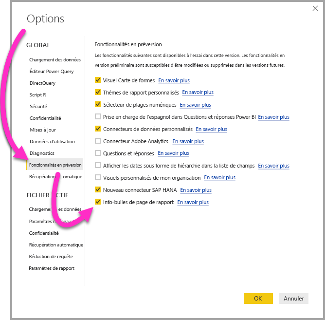
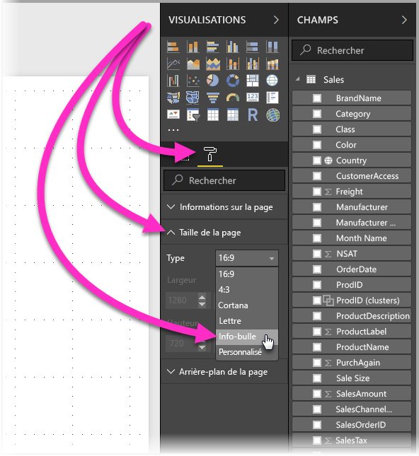
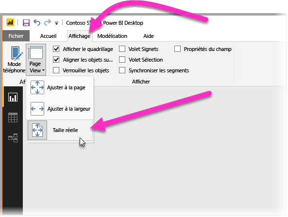

# Créer des info-bulles basées sur des pages de rapport dans Power BI Desktop (préversion)
Vous pouvez créer des **info-bulles de rapport** attrayantes qui s’affichent quand vous pointez sur les visuels, basées sur les pages de rapport que vous créez dans **Power BI Desktop**. Quand vous créez une page de rapport à utiliser comme info-bulle, vos info-bulles personnalisées peuvent inclure des visuels, des images et toute autre collection d’éléments que vous créez dans la page de rapport. 

Vous pouvez créer autant de pages d’info-bulle que vous le souhaitez. Vous pouvez associer chaque page d’info-bulle à un ou plusieurs champs dans votre rapport. De cette manière, quand vous pointez sur un visuel qui inclut le champ sélectionné, l’info-bulle que vous avez créée dans votre page d’info-bulle s’affiche, filtrée sur le point de données sur lequel vous pointez avec la souris. 

Les infos-bulle de rapport permettent d’effectuer toutes sortes de choses intéressantes. Voyons maintenant comment créer et configurer des info-bulles.

### Activer la préversion des info-bulles 
Étant donné que les info-bulles de rapport sont actuellement disponibles en préversion, vous devez les activer avant de pouvoir en créer. Pour activer la préversion des info-bulles de rapport, sélectionnez **Fichier > Options et paramètres > Options > Fonctionnalités en préversion** dans Power BI Desktop, puis cochez la case à côté de **Info-bulles de page de rapport**. 

Vous devrez redémarrer **Power BI Desktop** après avoir activé la préversion des info-bulles de rapport.

## Créer une page d’info-bulle de rapport
Pour commencer, créez une page de rapport en cliquant sur le bouton **+** situé en bas du canevas de **Power BI Desktop**, dans la zone des onglets. Le bouton se trouve après le dernier onglet dans le rapport. 

Votre info-bulle peut être de n’importe quelle taille en théorie. Toutefois, comme les info-bulles s’affichent sur le canevas du rapport quand vous pointez dessus, il est préférable de limiter leur taille. Dans le volet **Format** de la carte **Taille de la page**, vous pouvez voir un nouveau modèle de taille de page appelé *Info-bulle*. Ce modèle utilise une taille de canevas de page de rapport prédéfinie pour votre info-bulle.

Par défaut, **Power BI Desktop** ajuste le canevas du rapport en fonction de l’espace disponible dans la page. Cet ajustement convient généralement, mais pas dans le cas des info-bulles. Pour avoir une meilleure idée du résultat final de votre info-bulle terminée, vous pouvez changer l’option **Mode Page** à la taille réelle. 

Pour ce faire, sélectionnez l’onglet **Affichage** dans le ruban. À partir de là, sélectionnez **Mode Page > Taille réelle**, comme illustré dans l’image suivante.

Vous pouvez également nommer la page de rapport pour identifier son contenu plus clairement. Sélectionnez simplement la carte **Informations sur la page** dans le volet **Format**, puis tapez un nom dans le champ **Nom**. Dans l’image suivante, le nom de la page de rapport d’info-bulle est *Tooltip 1*, mais vous pouvez choisir un nom plus original.

Vous pouvez ensuite créer les visuels que vous souhaitez afficher dans votre info-bulle. L’image suivante illustre une page d’info-bulle comportant deux cartes et un graphique à barres groupées. Pour donner à l’ensemble l’aspect souhaité, nous avons utilisé une couleur d’arrière-plan différente pour les visuels et la page proprement dite.

Vous avez encore d’autres étapes à effectuer avant de pouvoir utiliser votre page de rapport d’info-bulle comme une info-bulle. Vous devez configurer plusieurs paramètres de la page d’info-bulle, comme décrit dans la section suivante. 

## Configurer la page de rapport d’info-bulle

Une fois que vous avez créé la page de rapport d’info-bulle, vous devez la configurer pour que **Power BI Desktop** l’enregistre comme une info-bulle et pour vous assurer qu’elle s’affiche correctement sur les visuels appropriés.

Tout d’abord, faites glisser le curseur **Info-bulle** sur **Activé** dans la carte **Informations sur la page** pour configurer la page en tant qu’info-bulle. 

Après cela, sélectionnez les champs pour lesquels vous souhaitez afficher l’info-bulle de rapport. L’info-bulle s’affichera sur les visuels du rapport qui contiennent le champ sélectionné. Sélectionnez le ou les champs concernés en les faisant glisser dans le compartiment **Champs de l’info-bulle**, situé dans la section **Champs** du volet **Visualisations**. Dans l’image suivante, le champ *SalesAmount* a été glissé dans le compartiment **Champs de l’info-bulle**.

 
Dans le compartiment **Champs de l’info-bulle**, vous pouvez ajouter des champs de catégorie et de valeurs numériques, y compris des mesures.

Une fois que vous avez terminé de créer la page de rapport d’info-bulle, cette page est utilisée comme info-bulle dans tous les visuels du rapport qui contiennent les champs ajoutés au compartiment **Champs de l’info-bulle**, et elle remplace ainsi l’info-bulle par défaut de Power BI.

## Configuration manuelle d’une info-bulle de rapport

Nous avons vu que vous pouvez créer une info-bulle qui s’affiche automatiquement quand vous pointez sur un visuel contenant le champ spécifié. Vous pouvez également configurer manuellement une info-bulle. 

Il y a maintenant une carte **Info-bulle** dans le volet **Mise en forme** de chaque visuel qui prend en charge les info-bulles de rapport. 

Pour configurer une info-bulle manuellement, sélectionnez le visuel pour lequel vous voulez la configurer, puis dans le volet **Visualisations**, sélectionnez la section **Format** et développez la carte **Info-bulle**.

Ensuite, dans la liste déroulante **Page**, sélectionnez la page d’info-bulle à utiliser pour le visuel sélectionné. Notez que seules les pages de rapport qui sont définies comme pages **Info-bulle** s’affichent dans la boîte de dialogue.

La configuration manuelle d’une info-bulle est utile dans de nombreux cas. Vous pouvez configurer une page vide pour une info-bulle afin de remplacer l’info-bulle par défaut sélectionnée par Power BI. Cela vous permet également d’empêcher l’affichage de l’info-bulle qui est sélectionnée automatiquement par Power BI. Par exemple, dans le cas d’un visuel contenant deux champs qui sont chacun associés à une info-bulle différente, Power BI sélectionne et affiche une seule de ces info-bulles. Si ce n’est pas ce que vous voulez, vous pouvez alors sélectionner manuellement l’info-bulle à afficher.

## Rétablir les info-bulles par défaut

Si vous créez une info-bulle manuellement pour un visuel, vous pouvez à tout moment rétablir l’info-bulle par défaut de Power BI pour l’utiliser à la place de la vôtre. Pour ce faire, quand un visuel est sélectionné et que la carte **Info-bulle** est développée, sélectionnez simplement *Automatique* dans la liste déroulante **Page** pour rétablir l’info-bulle par défaut.

## Info-bulles de rapport personnalisées et graphiques en courbes

Vous devez garder à l’esprit certains points quand vous utilisez des info-bulles de rapport qui interagissent avec des visuels de graphique en courbes ou des visuels faisant l’objet d’une mise en évidence croisée.

### Info-bulles de rapport et graphiques en courbes

Quand une info-bulle de rapport s’affiche dans un graphique en courbes, une seule info-bulle s’affiche pour toutes les courbes dans le graphique. Ce comportement est similaire au comportement de l’info-bulle par défaut pour les graphiques en courbes, qui affiche également une seule info-bulle. 

Cela est dû au fait que le champ dans la légende n’est pas passé comme filtre pour l’info-bulle. Dans l’image suivante, l’info-bulle affichée montre toutes les ventes du jour dans les trois catégories représentées dans l’info-bulle de rapport (dans cet exemple, Deluxe, Economy et Regular). 

### Info-bulles de rapport et mise en évidence croisée

Quand un visuel fait l’objet d’une mise en évidence croisée dans un rapport, les info-bulles de rapport affichent toujours les données mises en évidence, même si vous pointez sur la section estompée du point de données. Dans l’image suivante, la souris pointe sur la section estompée du graphique à barres (c’est-à-dire la section qui n’est pas mise en évidence), mais l’info-bulle de rapport affiche quand même les données de la section mise en évidence de ce point de données (les données mises en évidence).

## Considérations et limitations
Pour cette préversion des **info-bulles** de rapport, il y a quelques considérations et limitations à prendre en compte.

* Les info-bulles de rapport ne sont pas prises en charge lors de l’affichage des rapports dans des applications mobiles, ou dans des environnements intégrés, y compris Publier sur le web. 
* Les info-bulles de rapport ne sont pas prises en charge pour les visuels personnalisés. 
* Les info-bulles de rapport ne prennent pas en charge l’affichage des champs clusters. 
* Quand ils sélectionnent un champ à afficher pour les info-bulles de rapport, entre un champ et une catégorie, les visuels qui contiennent ce champ affichent uniquement l’info-bulle spécifiée si une correspondance est trouvée lors de la totalisation avec le champ sélectionné. 

## Étapes suivantes
Pour plus d’informations sur les fonctionnalités qui sont similaires ou liées aux info-bulles de rapport, consultez les articles suivants :

* [Utiliser une extraction dans Power BI Desktop](desktop-drillthrough.md)
* [Afficher une vignette de tableau de bord ou un visuel de rapport en mode Focus](service-focus-mode.md)

