# Tutoriel : Créer des colonnes calculées dans Power BI Desktop

Parfois, les données que vous analysez ne contiennent pas de champ particulier vous permettant d’obtenir les résultats que vous recherchez. C’est là qu’interviennent les *colonnes calculées*. Les colonnes calculées utilisent des formules du langage DAX (Data Analysis Expressions) pour définir les valeurs d’une colonne, assembler des valeurs de texte à partir de deux colonnes différentes jusqu’à calculer une valeur numérique à partir d’autres valeurs. Par exemple, supposons que vos données incluent des champs **Ville** et **État**, mais que vous voulez un champ **Emplacement** unique qui possède ces deux informations, par exemple « Miami, FL ». C’est là précisément qu’interviennent les colonnes calculées.

Les colonnes calculées sont semblables aux [mesures](desktop-tutorial-create-measures.md), dans le sens où toutes deux reposent sur des formules DAX, mais elles diffèrent dans la manière dont elles sont utilisées. Vous utilisez souvent des mesures dans une zone **Valeurs** d’une visualisation pour calculer les résultats en fonction des autres champs. Vous utilisez des colonnes calculées en tant que nouveaux **Champs** dans les lignes, les axes, les légendes et les zones de groupes de visualisations.

Ce tutoriel va vous aider à comprendre et à créer les colonnes calculées et à les utiliser dans des visualisations de rapports dans Power BI Desktop. 

### Conditions préalables
- Ce didacticiel s’adresse aux utilisateurs de Power BI déjà familiarisés avec l’utilisation de Power BI Desktop pour créer des modèles plus avancés. Vous devez déjà savoir comment utiliser **Obtenir des données** et **Éditeur Power Query** pour importer des données, travailler sur plusieurs tables associées et ajouter des champs dans le Canevas de rapport. Si vous découvrez seulement Power BI Desktop, veillez à consulter [Prise en main de Power BI Desktop](desktop-getting-started.md).
  
- Ce tutoriel utilise [l’exemple de vente Contoso pour Power BI Desktop](http://download.microsoft.com/download/4/6/A/46AB5E74-50F6-4761-8EDB-5AE077FD603C/Contoso%20Sales%20Sample%20for%20Power%20BI%20Desktop.zip), le même utilisé pour le tutoriel [Créer vos propres mesures dans Power BI Desktop](desktop-tutorial-create-measures.md). Ces données de ventes de la société fictive Contoso, Inc. ont été importées à partir d’une base de données, vous ne pourrez donc pas vous connecter à la source de données ni l’afficher dans l’Éditeur Power Query. Téléchargez et extrayez le fichier sur votre propre ordinateur, puis ouvrez-le dans Power BI Desktop.

## Créer une colonne calculée avec des valeurs de tables associées

Dans votre rapport de ventes, vous souhaitez afficher des catégories et des sous-catégories de produits sous des valeurs uniques, comme par exemple « Téléphones mobiles – Accessoires », « Téléphones mobiles – Smartphones et PDA », et ainsi de suite. Il n’existe aucun champ dans la liste **Champs** qui vous donne ces données, mais il existe un champ **ProductCategory** et un champ **ProductSubcategory**, chacun dans sa propre table. Vous pouvez créer une colonne calculée qui combine les valeurs de ces deux colonnes. Les formules DAX peuvent tirer profit de la pleine puissance du modèle que vous possédez déjà, y compris les relations entre les différentes tables existantes. 

 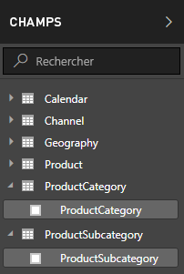

1.  Sélectionnez les points de suspension (...) **Plus d’options** ou cliquez avec le bouton de droite sur la table **ProductSubcategory** figurant dans la liste Champs, puis sélectionnez **Nouvelle colonne**. Cela crée votre nouvelle colonne dans la table ProductSubcategory.
    
    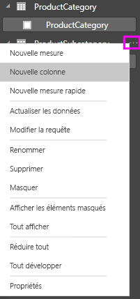
    
    La barre de formules apparaît en haut du Canevas de rapport, où vous pouvez nommer votre colonne et entrer une formule DAX.
    
    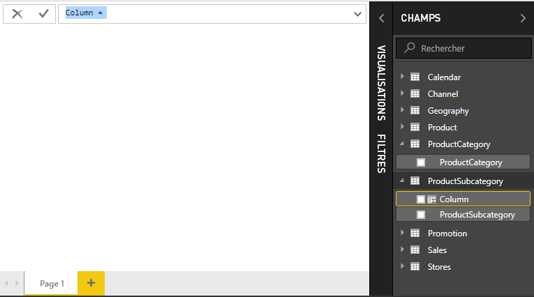
    
2.  Par défaut, une nouvelle colonne calculée est nommée simplement Colonne. Si vous ne la renommez pas, les nouvelles colonnes supplémentaires seront nommées Colonne 2, Colonne 3 et ainsi de suite. Vous souhaitez que votre colonne soient plus identifiable, par conséquent, étant donné que le nom **Colonne** est déjà en surbrillance dans la barre de formules, renommez-la en saisissant **ProductFullCategory**, puis saisissez le signe égal (**=**).
    
3.  Vous souhaitez que les valeurs de votre nouvelle colonne commencent par le nom ProductCategory. Comme cette colonne figure dans une table différente, bien qu’associée, vous pouvez utiliser la fonction [RELATED](https://msdn.microsoft.com/library/ee634202.aspx) pour l’obtenir.
    
    Après le signe égal, saisissez **r**. Une liste déroulante de suggestions affiche toutes les fonctions DAX commençant par la lettre R. La sélection de chaque fonction permet d’afficher une description de ses effets. La saisie permet de mettre à l’échelle la liste de suggestions au plus proche de la fonction dont vous avez besoin. Sélectionnez **RELATED**, puis appuyez sur **Entrée**.
    
    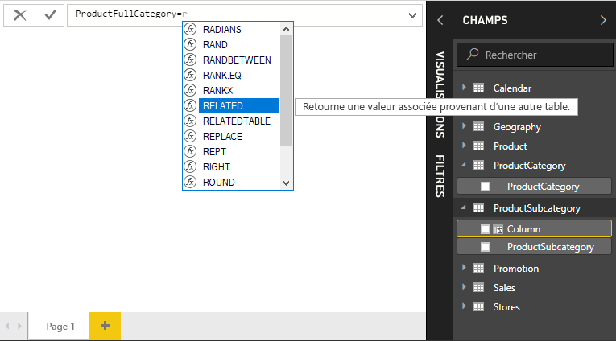
    
    Une parenthèse ouvrante apparaît avec une autre liste de suggestions des colonnes associées, que vous pouvez passer à la fonction RELATED, avec des descriptions et des détails sur les paramètres attendus. 
    
    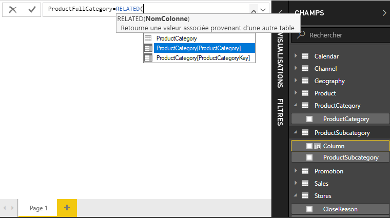
    
4.  Vous souhaitez la colonne **ProductCategory** de la table **ProductCategory**. Sélectionnez **ProductCategory[ProductCategory]**, appuyez sur **Entrée**, puis saisissez un type de parenthèse fermante.
    
    > [!TIP]
    > Les erreurs de syntaxe sont le plus souvent provoquées par une parenthèse fermante manquante ou mal placée, bien que parfois Power BI Desktop l’ajoute pour vous.
    
4. Vous souhaitez des tirets et des espaces pour séparer les ProductCategories et ProductSubcategories dans les nouvelles valeurs, par conséquent, après la parenthèse fermante de la première expression, saisissez un espace, esperluette (**&**), guillemet double (**«**), espace, tiret (**-**), un autre espace, un autre guillemet double et une autre esperluette. La formule doit maintenant ressembler à ceci :
    
    `ProductFullCategory = RELATED(ProductCategory[ProductCategory]) & " - " &`
    
    > [!TIP]
    > S’il vous faut plus d’espace, sélectionnez le chevron vers le bas situé à droite de la barre de formules pour développer l’éditeur de formules. Dans l’éditeur, appuyez sur **Alt et Entrée** pour descendre d’une ligne et sur **Tab** pour déplacer les éléments.
    
5.  Saisissez un crochet ouvrant (**[**), puis sélectionnez la colonne **[ProductSubcategory]** pour finir la formule. 
    
    
    
    Il n’est pas nécessaire d’utiliser une autre fonction RELATED pour appeler la table ProductSubcategory dans la deuxième expression, parce que vous créez la colonne calculée dans cette table. Vous pouvez saisir [ProductSubCategory] avec le préfixe du nom de la table (pleinement qualifié) ou sans (non qualifié).
    
6.  Complétez la formule en appuyant sur **Entrée** ou en sélectionnant la coche dans la barre de formules. La formule valide et le nom de la colonne **ProductFullCategory** s’affiche dans la table **ProductSubcategory** dans la liste Champs. 
    
    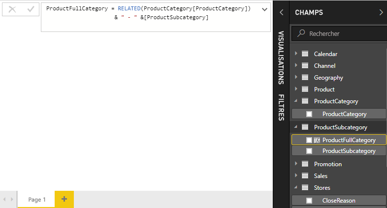
    
    >[!NOTE]
    >Dans Power BI Desktop, les colonnes calculées obtiennent une icône spéciale dans la liste de champs, indiquant qu’elles contiennent des formules. Dans le service PowerBI (votre site Power BI), il n’existe aucun moyen pour modifier des formules. Les colonnes calculées n’ont donc pas d’icônes.
    
## Utiliser votre nouvelle colonne dans un rapport

Maintenant, vous pouvez utiliser votre nouvelle colonne ProductFullCategory pour examiner SalesAmount via ProductFullCategory.

1. Sélectionnez ou faites glisser la colonne **ProductFullCategory** à partir de la table **ProductSubcategory** vers le Canevas de rapport pour créer une table affichant tous les noms de ProductFullCategory.
   
   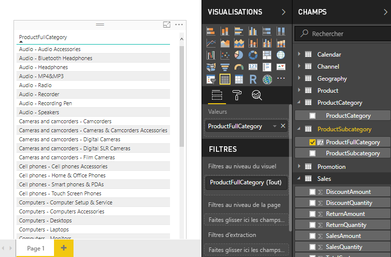
    
2. Sélectionnez ou faites glisser le champ **SalesAmount** à partir de la table **Ventes** dans la table pour afficher le montant des ventes pour chaque catégorie complète de produit.
   
   
    
## Créer une colonne calculée qui utilise une fonction IF

L’exemple de vente Contoso contient les données de ventes des magasins actifs et inactifs. Vous souhaitez vous assurer que les ventes des magasins actifs sont clairement séparées des ventes des magasins inactifs dans votre rapport en créant un champ Active StoreName. Dans la nouvelle colonne calculée Active StoreName, chaque magasin actif apparaît avec le nom complet du magasin, tandis que les magasins inactifs sont regroupés sous « Inactif ». 

Heureusement, la table Magasins possède une colonne nommée **État**, avec des valeurs « Activé » pour les magasins actifs et « Désactivé » pour les magasins inactifs, que vous pouvez utiliser pour créer des valeurs pour la nouvelle colonne Active StoreName. Votre formule DAX utilise la fonction logique [IF](https://msdn.microsoft.com/library/ee634824.aspx) pour tester l’État de chaque magasin et retourner une valeur particulière selon le résultat. Si l’État d’un magasin est « Activé », la formule retourne le nom du magasin. S’il est « Désactivé », la formule assigne un Active StoreName de « Inactif ». 

1.  Créez une nouvelle colonne calculée dans la table **Magasins** et nommez-la **Active StoreName** dans la barre de formules.
    
2.  Après le signe **=**, commencez à taper **IF**. La liste de suggestions vous montre ce que vous pouvez ajouter. Sélectionnez **IF**.
    
    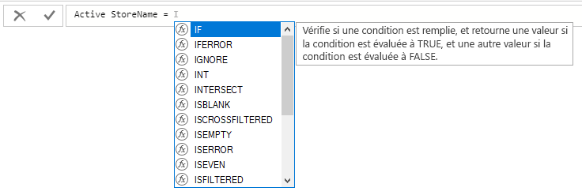
    
3.  Le premier argument pour IF est un test logique pour savoir si l’État du magasin est « Activé ». Saisissez un crochet ouvrant **[**, qui permet de répertorier des colonnes de la table Magasins et sélectionnez **[État]**.
    
    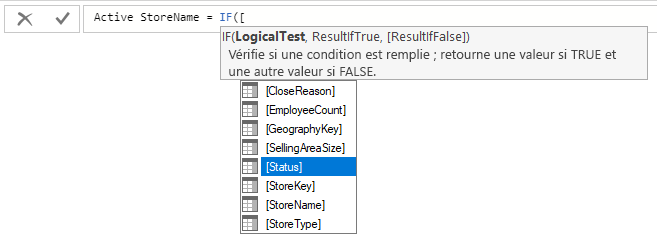
    
4.  Juste après **[État]**, saisissez **= « Activé »**, puis saisissez une virgule (**,**) à la fin de l’argument. L’info-bulle suggère que vous devez maintenant ajouter une valeur de retour lorsque le résultat est TRUE.
    
    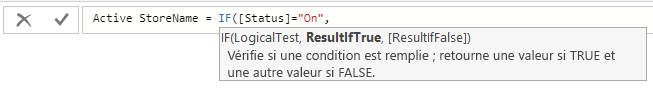
    
5.  Si l’état du magasin est « Activé », vous souhaitez afficher le nom du magasin. Saisissez un crochet ouvrant (**[**) et sélectionnez la colonne **[StoreName]**, puis saisissez une autre virgule. L’info-bulle indique à présent que vous devez ajouter une valeur de retour lorsque le résultat est FALSE. 
    
    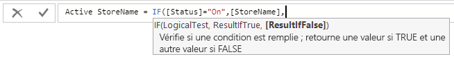
    
6.  Vous souhaitez que la valeur soit *inactif*, par conséquent, saisissez **« Inactif »**, puis complétez la formule en appuyant sur **Entrée** ou en sélectionnant la coche dans la barre de formules. La formule valide et le nouveau nom de la colonne s’affiche dans la table **Magasins** dans la liste Champs.
    
    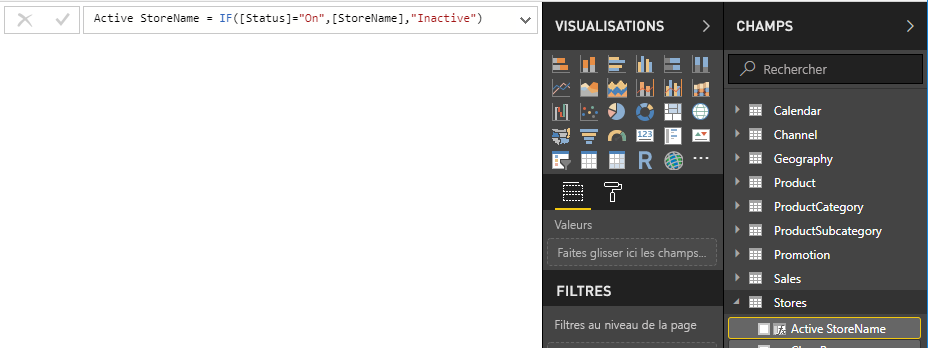
    
8.  Vous pouvez utiliser votre nouvelle colonne Active StoreName dans les visualisations, à l’instar de tout autre champ. Pour afficher SalesAmounts par Active StoreName, sélectionnez le champ **Active StoreName** ou faites-le glisser vers le canevas, puis sélectionnez le champ **SalesAmount** ou faites-le glisser dans la table. Dans cette table, les magasins actifs apparaissent individuellement par nom, mais les magasins inactifs sont rassemblés à la fin comme *Inactif*. 
    
    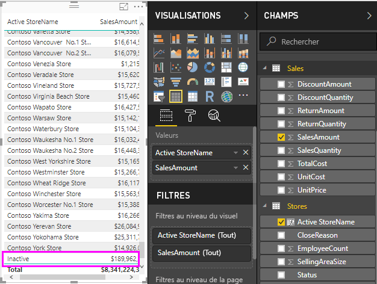
    
## Ce que vous avez appris
Les colonnes calculées peuvent enrichir vos données en favorisant des insights simplifiés. Vous avez appris à créer des colonnes calculées dans la liste de champs et la barre de formules, à utiliser des listes de suggestions et des info-bulles pour vous aider à construire des formules, à appeler des fonctions DAX comme RELATED et IF avec les arguments appropriés et à utiliser vos colonnes calculées dans des visualisations de rapports.

## Étapes suivantes
Si vous souhaitez approfondir vos connaissances des formules DAX et créer des colonnes calculées avec des formules plus avancées, consultez [Informations de base sur DAX dans Power BI Desktop](desktop-quickstart-learn-dax-basics.md). Cet article porte sur les concepts fondamentaux propres à DAX, tels que la syntaxe, les fonctions et une compréhension plus approfondie du contexte.

Veillez à ajouter la page [Informations de référence sur DAX (Data Analysis Expressions)](https://msdn.microsoft.com/library/gg413422.aspx) à vos favoris. Vous y trouverez des informations détaillées sur la syntaxe DAX, les opérateurs et plus de 200 fonctions DAX.

