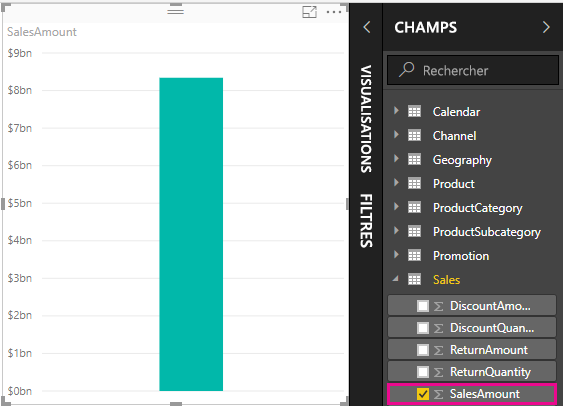
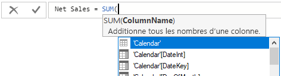
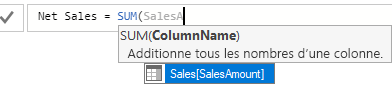
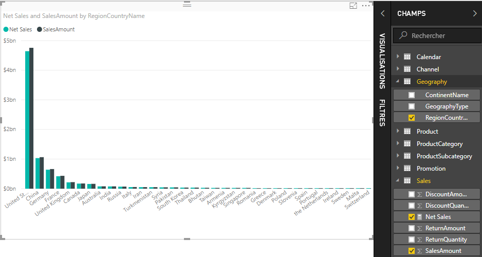
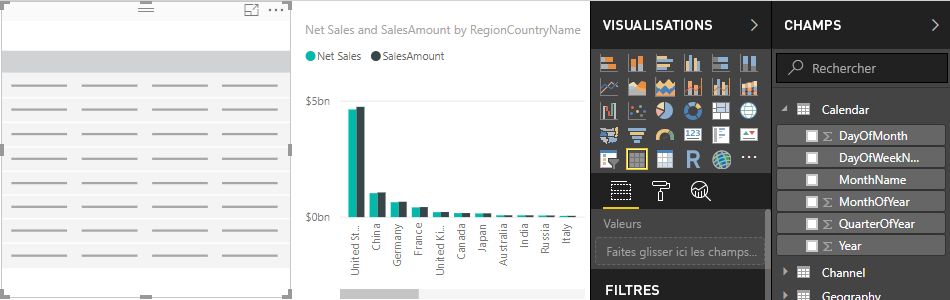
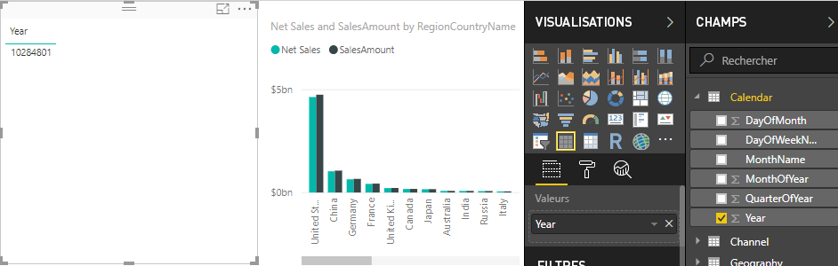
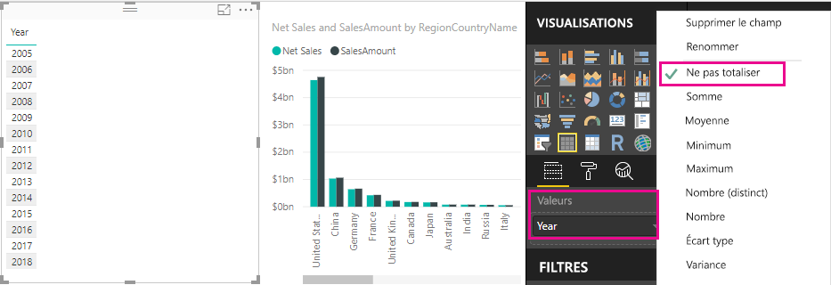
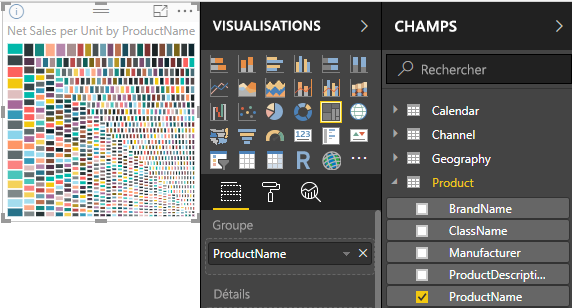

# Didacticiel : créer vos propres mesures dans Power BI Desktop
Certaines solutions d’analyse de données parmi les plus puissantes peuvent être créées dans Power BI Desktop à l’aide de mesures. Les mesures vous aident en effectuant des calculs sur vos données quand vous interagissez avec des rapports. Ce didacticiel vous aidera à comprendre et à créer vos propres mesures élémentaires dans Power BI Desktop.

Cet article s’adresse aux utilisateurs de Power BI déjà familiarisés avec l’utilisation de Power BI Desktop pour créer des modèles plus avancés. Vous devez déjà bien connaître l’utilisation de la fonctionnalité Obtenir des données et de l’Éditeur de requête pour importer des données, l’utilisation de plusieurs tables connexes et l’ajout de champs dans le Canevas de rapport. Si vous découvrez seulement Power BI Desktop, veillez à consulter [Prise en main de Power BI Desktop](desktop-getting-started.md).

Pour effectuer les étapes de ce didacticiel, vous devez télécharger le fichier [Contoso Sales Sample for Power BI Desktop](http://download.microsoft.com/download/4/6/A/46AB5E74-50F6-4761-8EDB-5AE077FD603C/Contoso%20Sales%20Sample%20for%20Power%20BI%20Desktop.zip). Il contient des données sur les ventes en ligne de la société fictive Contoso, Inc. Comme ces données ont été importées à partir d’une base de données, vous ne pouvez pas vous connecter à la source de données ni l’afficher dans l’Éditeur de requête. Une fois le fichier sur votre ordinateur, ouvrez-le dans Power BI Desktop.

## À quoi correspondent ces mesures ?
Les mesures sont le plus souvent créées automatiquement pour vous, par exemple quand vous cochez la case à côté du champ **SalesAmount** dans la table **Sales** figurant dans la liste des champs, ou quand vous faites glisser **SalesAmount** sur le canevas de rapport.

Une nouvelle visualisation apparaît, comme suit :

Vous obtenez un histogramme indiquant un montant global des prix de vente provenant du champ SalesAmount.  Le champ SalesAmount est en fait simplement une colonne nommée SalesAmount dans la table Sales qui a déjà été importée.

La colonne SalesAmount contient plus de deux millions de lignes de prix de vente. Vous vous demandez peut-être pourquoi vous ne voyez pas une table avec des lignes de toutes ces valeurs. En fait, Power BI Desktop sait que toutes les valeurs de SalesAmount sont d’un type de données numérique et que vous souhaitez probablement les agréger d’une manière ou d’une autre, en les cumulant, en calculant leur moyenne, en les décomptant, etc.

Chaque fois que vous voyez un champ avec une icône sigma  dans la liste Champs, cela signifie que le champ est numérique et que ses valeurs peuvent être agrégées. Dans ce cas, quand vous sélectionnez SalesAmount, Power BI Desktop crée sa propre mesure, puis calcule et affiche dans le graphique la somme de tous les montants des ventes.

La somme constitue l’agrégation par défaut quand vous sélectionnez un champ avec un type de données numérique, mais vous pouvez aisément configurer un autre type d’agrégation.

Dans la zone **Valeur** , cliquez sur la flèche orientée vers le bas en regard de **SalesAmount**, puis sélectionnez **Moyenne**.

La visualisation affiche alors la moyenne de tous les prix de vente figurant dans le champ SalesAmount.

Vous pouvez modifier le type d’agrégation en fonction du résultat que vous souhaitez, mais tous les types d’agrégation ne s’appliquent pas à tous les types de données numériques. Par exemple, pour le champ SalesAmount, les opérations Somme et Moyenne ont un sens. Les opérations Minimum et Maximum sont également possibles. En revanche, l’opération Nombre n’a pas vraiment de sens pour le champ SalesAmount, car même si les valeurs sont numériques, elles correspondent à une devise.

La compréhension des agrégations est essentielle à la compréhension des mesures, car chaque mesure effectue un certain type d’agrégation. Vous verrez d’autres exemples d’utilisation d’une agrégation Somme un peu plus tard, quand vous créerez des mesures personnalisées.

Les valeurs calculées à partir des mesures changent toujours en réponse à vos interactions avec votre rapport. Par exemple, si vous faites glisser le champ **RegionCountryName** de la table **Geography** vers votre graphique, la moyenne des montants des ventes pour chaque pays est calculée et affichée.

Quand le résultat d’une mesure change en raison d’une interaction avec votre rapport, vous affectez le *contexte* de votre mesure. En fait, chaque fois que vous interagissez avec votre rapport, vous modifiez le contexte dans lequel une mesure calcule et affiche ses résultats.

Dans la plupart des cas, Power BI fait son travail et calcule et retourne les valeurs en fonction des champs que vous ajoutez et des types d’agrégation que vous choisissez. Toutefois, dans d’autres cas, vous pouvez être amené à créer vos propres mesures pour effectuer des calculs uniques plus complexes.

Dans Power BI Desktop, vous créez vos propres mesures à l’aide du langage de formule DAX (Data Analysis Expressions). Les formules DAX sont très semblables aux formules Excel. En fait, DAX utilise bon nombre de fonctions, opérateurs et syntaxes identiques à ceux des formules Excel. Toutefois, les fonctions de DAX sont conçues pour fonctionner avec des données relationnelles et effectuer des calculs plus dynamiques quand vous interagissez avec vos rapports.

Il existe plus de 200 fonctions DAX capables d’effectuer des opérations très diverses, de simples agrégations comme Somme et Moyenne jusqu’à des fonctions statistiques et de filtrage plus complexes. Nous n’allons pas trop entrer dans les détails du langage DAX ici, mais il existe de nombreuses ressources qui vous aideront à en savoir plus. Une fois que vous aurez parcouru ce didacticiel, veillez à consulter [Principes fondamentaux de DAX dans Power BI Desktop](desktop-quickstart-learn-dax-basics.md).

Quand vous créez vos propres mesures, celles-ci sont ajoutées à la liste Champs pour la table de votre choix. Il s’agit d’une mesure *modèle* qui restera dans votre tableau en tant que champ. L’un des principaux avantages des mesures modèles est que vous pouvez les nommer comme vous le souhaitez pour les rendre plus identifiables. Vous pouvez également les utiliser comme argument dans d’autres expressions DAX, et vous pouvez créer des mesures qui effectuent des calculs complexes très rapidement.

## Créer une mesure personnalisée
Supposez que vous souhaitez analyser vos ventes nettes. Si vous examinez la table Sales dans la liste des champs, vous voyez qu’il n’existe pas de champ NetSales. Toutefois, vous possédez les blocs de construction requis pour créer votre propre mesure afin de calculer les ventes nettes.

Vous avez besoin d’une mesure pour soustraire les remises et les retours des montants des ventes. Comme vous souhaitez que votre mesure calcule un résultat pour un contexte quelconque affiché dans la visualisation, dans les faits, vous devez soustraire la somme de DiscountAmount et ReturnAmount de la somme de SalesAmount. Cela peut sembler quelque peu déroutant pour le moment, mais ne vous inquiétez pas, vous y verrez plus clair dans un instant.

### Ventes nettes
1.  Effectuez un clic droit ou cliquez sur la flèche orientée vers le bas dans la table **Sales** figurant dans la liste des champs, puis cliquez sur **Nouvelle mesure**. Cela garantit l’enregistrement de votre nouvelle mesure dans la table Sales, où elle est plus facile à trouver.
    
    
    
    > [!TIP]
    > Vous pouvez également créer une mesure en cliquant sur le bouton Nouvelle mesure dans l’onglet Accueil du ruban de Power BI Desktop.
    > 
    > 
    > 
    > Quand vous créez une mesure à partir du ruban, la mesure peut être créée dans l’une quelconque des tables. Une mesure n’est pas tenue d’appartenir à une table particulière, mais il est plus facile de la trouver si elle est créée dans une table plus logique pour vous. Si vous voulez qu’elle figure dans une table particulière, commencez par cliquer sur la table pour la rendre active. Cliquez ensuite sur Nouvelle mesure. Dans le cas présent, vous allez créer votre première mesure dans la table Sales.
    > 
    > 
    
    La barre de formule apparaît en haut du canevas du rapport. C’est là que vous pouvez renommer votre mesure et entrer une formule DAX.
    
    
    
    Spécifiez un nom pour votre nouvelle mesure. Par défaut, une nouvelle mesure est simplement nommée Mesure. Si nous ne la renommez pas, quand vous en créerez d’autres, elles seront nommées Mesure 2, Mesure 3, etc. Pour que vos mesures soient plus identifiables, nommez-les Net Sales.
    
2. Mettez en surbrillance **Measure** (Mesure) dans la barre de formule, puis tapez **Net Sales** (Ventes nettes).
    
    À présent, vous pouvez commencer à entrer la formule.
    
3.  Après le signe égal, tapez un **S**. Une liste déroulante de suggestions s’affiche avec toutes les fonctions DAX commençant par la lettre S. Plus vous tapez de caractères, plus les suggestions de la liste se rapprochent de la fonction dont vous avez besoin. Sélectionnez **SUM** en faisant défiler l’affichage vers le base, puis appuyez sur Entrée.
    
    
    
    Quand vous appuyez sur Entrée, une parenthèse ouvrante apparaît avec une autre liste de suggestions présentant toutes les colonnes disponibles que vous pouvez passer à la fonction SUM.
    
    
    
    Une expression apparaît toujours entre une parenthèse ouvrante et une parenthèse fermante. Dans le cas présent, votre expression doit contenir un seul argument à passer à la fonction SUM, une colonne à totaliser. Vous pouvez réduire votre liste de colonnes en tapant les premières lettres de ce que vous voulez. Dans le cas présent, vous voulez la colonne SalesAmount, si bien que quand vous commencez à taper salesam, la liste est réduite à deux éléments que vous pouvez sélectionner. Ils correspondent en fait à la même colonne. Un élément indique simplement [SalesAmount], car vous créez votre mesure dans la table qui contient la colonne SalesAmount. L’autre élément indique le nom de la table avant le nom de la colonne.
    
    
    
    En général, il est conseillé d’entrer le nom qualifié complet d’une colonne. Cela facilite la lecture de vos formules.
    
4. Sélectionnez **Sales[SalesAmount]** (Ventes[MontantVente]), puis tapez une parenthèse fermante.
    
    > [!TIP]
    > Les erreurs de syntaxe sont le plus souvent provoquées par une parenthèse fermante manquante ou mal placée.
    > 
    > 
    
    Maintenant, il convient de soustraire les deux autres colonnes.
    
5.  Après la parenthèse fermante de votre première expression, tapez un espace, puis un opérateur moins (**-**), suivi d’un autre espace. Ensuite, entrez une autre fonction SUM avec la colonne **Sales[DiscountAmount]** comme argument.
    
    
    
    Vous commencez à manquer d’espace pour votre formule. Aucun problème.
    
6.  Cliquez sur le chevron orienté vers le bas, situé à droite de la barre de formule.
    
    
    
    À présent, vous avez davantage d’espace. Vous pouvez entrer les nouvelles parties dans votre formule sur une nouvelle ligne en appuyant sur Alt+Entrée. Vous pouvez également déplacer des éléments en utilisant la touche Tab.
    
    
    
    Maintenant, vous pouvez ajouter la dernière partie de votre formule.
    
7.  Ajoutez un autre opérateur moins suivi d’une autre fonction SUM et de la colonne **Sales[ReturnAmount]** comme argument.
    
    
    
    La formule semble maintenant prête.

8.  Appuyez sur Entrée ou cliquez sur la coche dans la barre de formule pour terminer. La formule est validée et ajoutée à la liste des champs dans la table Sales.

### Ajouter la nouvelle mesure à un rapport
À présent, vous pouvez ajouter la mesure Net Sales dans le canevas du rapport de manière à ce que les ventes nettes soient calculées pour les autres champs que vous ajoutez éventuellement au rapport. Examinez les ventes nettes par pays.

1.  Faites glisser la mesure **Net Sales** à partir de la table **Sales** dans le canevas du rapport.
    
2. Maintenant, faites glisser le champ **RegionCountryName** à partir de la table **Geography** (Géographie) dans le graphique.
    
    
    
    Ajoutez d’autres données.
    
3.  Faites glisser le champ **SalesAmount** dans le graphique pour voir la différence entre les ventes nettes et le montant des ventes.
    
    Maintenant, votre graphique contient vraiment deux mesures : la mesure SalesAmount qui a été totalisée automatiquement et la mesure Net Sales que vous avez créée. Dans chaque cas, les résultats ont été calculés dans le contexte d’un autre champ présent dans le graphique, les pays figurant dans RegionCountryName.
    
    
    
    Vous allez ajouter un segment afin de décomposer encore les ventes nettes et les montants des ventes par année civile.
    
4.  Cliquez sur une zone vide en regard du graphique, puis dans **Visualisations**, cliquez sur la visualisation Table.
    
    
    
    Cette opération crée une visualisation de table vide dans le canevas de rapport.
    
    
    
5.  Faites glisser le champ **Year** à partir de la table **Calendar** dans la nouvelle table vide.
    
    
    
    Comme Year est un champ numérique, Power BI Desktop totalise ses valeurs et génère un graphique. Toutefois, cela ne présente pas un grand intérêt comme segment.
    
6. Dans **Values** (Valeurs), cliquez sur la flèche vers le bas en regard de **Year** (Année), puis cliquez sur **Do Not Summarize** (Ne pas résumer).
    
    
    
    Maintenant, nous pouvons modifier le champ Year en segment dans la visualisation de table.

    7.  Dans **Visualisations**, cliquez sur la visualisation **Segment**.

    
    
    À présent, Year fait office de segment. Vous pouvez sélectionner tout individu ou groupe d’années et les visualisations de votre rapport seront toutes découpées en conséquence.
    
8. Continuez et cliquez sur **2013**. Vous voyez le graphique changer. Vos mesures Net Sales et SalesAmount sont recalculées, présentant les nouveaux résultats juste pour 2013. Ici encore, vous avez modifié le contexte dans lequel vos mesures calculent et affichent les résultats.
    
    

## Créer une mesure supplémentaire
Maintenant que vous savez comment créer vos propres mesures, vous allez en créer une autre.

### Ventes nettes par unité
Que se passe-t-il si vous voulez savoir quels sont les produits vendus avec le plus de ventes par unité ?

Vous pouvez créer une autre mesure. Dans ce cas, vous souhaitez diviser les ventes nettes par la quantité d’unités vendues. En fait, vous souhaitez diviser le résultat de votre mesure Net Sales par la somme de Sales[SalesQuantity].

1.  Créez une mesure nommée **Net Sales per Unit** dans la table Sales ou Products.
    
    Dans cette mesure, vous allez utiliser la mesure Net Sales créée précédemment. Avec DAX, vous pouvez référencer d’autres mesures dans votre formule.
    
2.  Commencez à taper **Net Sales**. La liste de suggestions vous montre ce que vous pouvez ajouter. Sélectionnez **[Net Sales]**.
    
    
    
    Vous pouvez également référencer une autre mesure en tapant simplement un crochet ouvrant (**[**). La liste de suggestions vous montre uniquement les mesures que vous pouvez ajouter dans votre formule.
    
    
    
3.  Juste après **[Net Sales]**, entrez un espace, puis un opérateur de division (**/**), puis entrez une fonction SUM et tapez **Quantity**. La liste de suggestions montre toutes les colonnes dont le nom inclut Quantity. Sélectionnez **Sales[SalesQuantity]**. La formule doit maintenant ressembler à ceci :
    
    > **Net Sales per Unit = [Net Sales] / SUM(Sales[SalesQuantity])**
    > 
    > 
    
    Pas mal, non ? La saisie de formules DAX est vraiment simple quand vous utilisez la fonctionnalité de recherche et de suggestion de l’éditeur DAX. À présent, vous allez voir ce que vous obtenez avec votre nouvelle mesure Net Sales per Unit.
    
4. Faites glisser la mesure **Net Sales per Unit** (Ventes nettes par unité) dans une zone vide du canevas du rapport.
    
    
    
    Rien de très intéressant, n’est-ce pas ? Ne vous inquiétez pas.
    
5.  Modifiez le type de visualisation de graphique en spécifiant **Tree Map**.
    
    
    
6. À présent, faites glisser le champ **ProductCategory** à partir de la table **ProductCategory** vers le bas dans la zone **Group** (Groupe).
    
    
    
    Ces informations sont intéressantes, mais comment faire si vous souhaitez connaître les ventes nettes par produit ?
    
7. Supprimez le champ **ProductCategory** et faites glisser le champ **ProductName** à partir de la table **Product** (Produit) vers le bas dans la zone **Group** (Groupe). 
    
    
    
    Bon, il est vrai que nous ne faisons qu’expérimenter, mais admettez que c’est plutôt sympa ! Il est aussi possible de filtrer ce Treemap de plusieurs façons, mais cela dépasse le champ d’application de ce didacticiel.

## Ce que vous avez appris
Les mesures présentent une efficacité véritable pour l’élaboration des analyses que vous souhaitez à partir de vos données. Vous avez appris à créer des mesures à l’aide de la barre de formule. Vous pouvez nommer les mesures de la manière la plus explicite, et les listes de suggestions facilitent la recherche et la sélection de l’élément approprié à ajouter à vos formules. Vous avez également bénéficié d’une présentation des contextes, dans lesquels le résultat des calculs effectués dans les mesures change en fonction d’autres champs ou d’autres expressions dans la formule de vos mesures.

## Étapes suivantes
Si vous souhaitez approfondir vos connaissances des formules DAX et créer des mesures plus avancées, consultez [Principes fondamentaux de DAX dans Power BI Desktop](desktop-quickstart-learn-dax-basics.md). Cet article porte sur les concepts fondamentaux propres à DAX, tels que la syntaxe, les fonctions et une compréhension plus approfondie du contexte.

Veillez à ajouter la page [Informations de référence sur DAX (Data Analysis Expressions)](https://msdn.microsoft.com/library/gg413422.aspx) à vos favoris. Vous y trouverez des informations détaillées sur la syntaxe DAX, les opérateurs et plus de 200 fonctions DAX.

