# Didacticiel : analyses de Facebook à l’aide de Power BI Desktop

Dans ce didacticiel, vous apprenez à importer des données depuis Facebook et à les utiliser dans Power BI Desktop. Vous allez vous connecter et importer des données depuis la page Facebook Power BI, vous appliquerez des transformations aux données importées et vous utiliserez les données dans des visualisations de rapport.

## Se connecter à une page Facebook

Ce didacticiel utilise des données de la [page Facebook de Microsoft Power BI](https://www.facebook.com/microsoftbi) (*https://www.facebook.com/microsoftbi*). Vous n’avez pas besoin d’informations d’identification spécifiques pour vous connecter à cette page et importer des données, à l’exception d’un compte Facebook personnel.

1. Ouvrez Power BI Desktop, puis sélectionnez **Obtenir des données** dans la boîte de dialogue **Mise en route**, ou dans l’onglet du ruban **Accueil**, sélectionnez **Obtenir des données**, puis sélectionnez **Plus...**.
   
2. Dans la boîte de dialogue **Obtenir des données**, sélectionnez **Facebook** à partir du groupe **Services en ligne**, puis sélectionnez **Se connecter**.
   
   
   
   Une boîte de dialogue s’affiche pour vous avertir des risques liés à l’utilisation d’un service tiers.
   
   
   
3. Sélectionnez **Continuer**. La boîte de dialogue **Facebook** s’affiche.
   
4. Tapez ou collez le nom de la page **microsoftbi** dans la zone de texte **Nom d’utilisateur**, sélectionnez **Publications** dans la liste déroulante **Connexion** et sélectionnez **OK**.
   
   
   
5. Quand vous êtes invité à indiquer vos informations d’identification, connectez-vous à votre compte Facebook et autorisez l’accès de Power BI via votre compte.
   
   

   Après la connexion à la page Facebook de Power BI, vous obtenez un aperçu des données **Publications** de la page. 
   
   
   
## Mettre en forme et transformer les données importées

Vous souhaitez voir et afficher les publications avec le plus de commentaires au fil du temps, mais vous constatez dans l’aperçu des données **Publications** que les données **created_time** sont difficiles à lire et à comprendre, et qu’il n’existe aucune donnée sur les commentaires. Vous devez effectuer une mise en forme et un nettoyage des données pour en tirer le meilleur parti. Vous pouvez utiliser **Power Query Editor** de Power BI Desktop pour modifier les données, avant ou après leur importation dans Power BI Desktop. 

### Fractionner la colonne de date et d’heure

Tout d’abord, séparez les valeurs de date et d’heure dans la colonne **created_time** afin de la rendre plus lisible. 

1. Dans l’aperçu des données Facebook, sélectionnez **Modifier**. 
   
   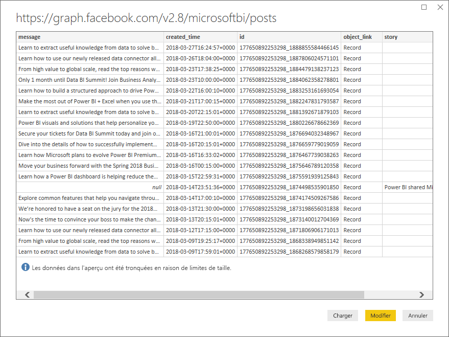
   
   **Power Query Editor** de Power BI Desktop s’ouvre dans une nouvelle fenêtre et affiche l’aperçu des données à partir de la page Facebook de Power BI. 
   
   
   
2. Sélectionnez la colonne **created_time**. Notez qu’elle est actuellement d’un type de données Texte, représenté par une icône **ABC** dans l’en-tête de la colonne. Cliquez avec le bouton droit sur l’en-tête et sélectionnez **Fractionner la colonne > Par délimiteur** dans le menu déroulant ou sélectionnez **Fractionner la colonne > Par délimiteur** sous **Transformer** dans l’onglet Accueil du ruban.  
   
   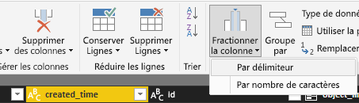
   
3. Dans la boîte de dialogue **Fractionner la colonne par délimiteur**, sélectionnez **Personnalisé** dans la liste déroulante, entrez **T** (le caractère qui commence la partie heure des valeurs created_time) dans le champ d’entrée, puis sélectionnez **OK**. 
   
   
   
   La colonne se divise en deux colonnes qui contiennent les chaînes avant et après le délimiteur **T** et qui sont nommées **created_time.1** et **created_time.2**, respectivement. Notez que Power BI a automatiquement détecté et modifié les types de données sur **Date** pour la première colonne et **Heure** pour la deuxième colonne. Les valeurs de date et d’heure ont également été mises en forme pour être plus lisibles.
   
4. Renommez les colonnes en double-cliquant sur chaque en-tête de colonne ou en sélectionnant chaque colonne et en sélectionnant **Renommer** dans le groupe **N’importe quelle colonne** de l’onglet **Transformer** du ruban, puis tapez les nouveaux en-têtes de colonnes : **created_date** et **created_time**, respectivement.
   
   
   
### Développer la colonne imbriquée

Maintenant que les données de date et d’heure sont telles que vous le souhaitez, vous allez exposer les données de commentaires en développant une colonne imbriquée. 

1. Sélectionnez la colonne **object_link**, puis sélectionnez  pour ouvrir la boîte de dialogue **Développer/Agréger**. Sélectionnez **Connexions**, puis sélectionnez **OK**. 
   
   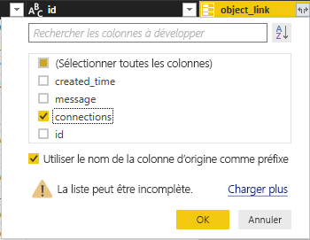
   
   L’en-tête de la colonne est remplacé par **object_link.connections**.
2. Sélectionnez à nouveau  en haut de la colonne **object_link.connections**, sélectionnez **Commentaires**, puis sélectionnez **OK**. L’en-tête de la colonne est remplacé par **object_link.connections.comments**.
   
3. Sélectionnez  en haut de la colonne **object_link.connections.comments** et cette fois, sélectionnez **Agréger** au lieu de Développer dans la boîte de dialogue. Sélectionnez **# Count of id** (Nombre d’ID), puis **OK**. 
   
   
   
   Maintenant, la colonne affiche le nombre de commentaires pour chaque message. 
   
4. Renommez la colonne **Count of object_link.connections.comments.id** en **Number of comments** (Nombre de commentaires).
   
5. Sélectionnez la flèche vers le bas en regard de l’en-tête **Number of comments**, puis sélectionnez **Sort Descending** (Tri décroissant) pour afficher les Publications triées de celle ayant le plus de commentaires à celle en ayant le moins. 
   
   
   
### Passer en revue les étapes de la requête

Lors de la mise en forme et de la transformation des données dans **Power Query Editor**, chaque étape a été enregistrée dans la zone **Étapes appliquées** du volet **Paramètres de requête** à droite de la fenêtre de Power Query Editor. Vous pouvez consulter la section Étapes appliquées pour voir exactement les modifications que vous avez effectuées. Si nécessaire, vous pouvez les modifier, les supprimer ou les réorganiser (mais cela peut être risqué, car la modification des étapes précédentes peut endommager les étapes suivantes). 

Après avoir appliqué ces transformations de données, vos Étapes appliquées doivent se présenter comme suit :
   
   
   
   >[!TIP]
   >Sous-jacentes aux Étapes appliquées, des formules sont écrites dans le **langage Power Query**, également connu sous de langage **M**. Pour afficher et modifier les formules, sélectionnez **Éditeur avancé** dans le groupe **Requête** de l’onglet Accueil du ruban. 

### Importer les données transformées

Lorsque vous êtes satisfait des données, sélectionnez **Fermer et appliquer** > **Fermer et appliquer** dans l’onglet Accueil du ruban pour les importer dans Power BI Desktop. 
   
   
   
   Une boîte de dialogue affiche la progression du chargement des données dans le modèle de données Power BI Desktop. 
   
   
   
   Une fois les données chargées, elles s’affichent dans la vue Rapport en tant que nouvelle Requête dans la liste Fields (Champs).
   
   
   
## Utiliser les données dans des visualisations de rapport 

Les données étant importées de la page Facebook, vous pouvez rapidement et facilement mieux les explorer à l’aide de visualisations. La création d’une visualisation est facile ; il vous suffit de sélectionner un champ ou de le faire glisser à partir de la liste **Fields** (Champs) vers le canevas de rapport.

### Créer un graphique à barres

1. Dans la vue Rapport de Power BI Desktop, sélectionnez **message** dans la liste Fields (Champs), ou faites-le glisser vers le canevas. Une table montrant tous les messages publiés s’affiche dans le canevas. 
   
   
   
2. Une fois cette table sélectionnée, sélectionnez également **Number of comments** (Nombre de commentaires) dans la liste Fields ou faites-le glisser vers la table. 
   
3. Sélectionnez l’icône **Graphique à barres empilées** dans le volet Visualisations. La table se transforme en graphique à barres pour indiquer le nombre de commentaires par publication. 
   
   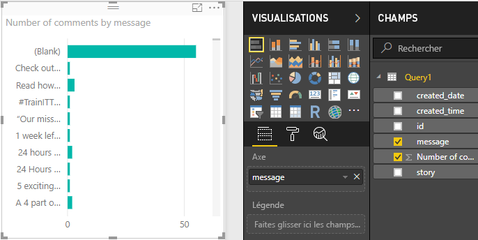
   
4. Sélectionnez les points de suspension (...) dans le coin supérieur droit de la visualisation, puis sélectionnez **Sort by Number of comments** (Trier par Nombre de commentaires) pour trier la table par nombre décroissant de commentaires. 
   
   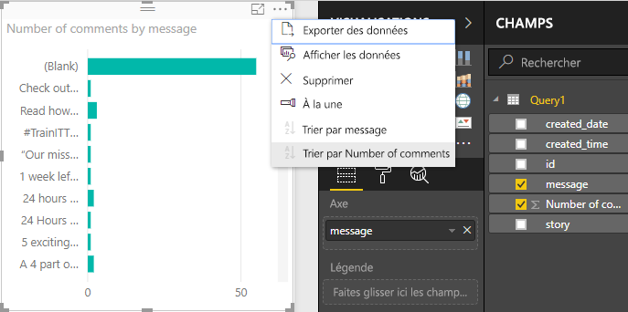
   
5. Notez que les commentaires les plus nombreux étaient associés à des messages vides, ou **Blank**, (ces publications étaient peut-être des récits, des liens, des vidéos ou tout autre contenu non textuel). Pour exclure la ligne Blank, sélectionnez **message (tous)** sous **Filtres** au bas du volet Visualisations, sélectionnez **Sélectionner tout**, puis désélectionnez **Blank** (Vide). L’entrée dans Filtres est remplacée par **message is not (Blank)** (le message n’est pas (vide)) et la ligne Blank disparaît de la visualisation du graphique. 
   
   
   
### Mettre en forme le graphique

La visualisation devient plus intéressante, mais vous ne pouvez pas voir une grande partie de la publication dans le graphique. Pour afficher davantage de texte de la publication :

1. À l’aide des poignées sur la visualisation du graphique, redimensionnez le graphique pour qu’il soit aussi grand que possible. 
   
2. Avec le graphique sélectionné, sélectionnez **l’icône Format** (rouleau de peinture) dans le volet Visualisations.
   
3. Sélectionnez la flèche vers le bas en regard de **l’axe des Y** et faites glisser le curseur en regarde de **Taille maximale** complètement vers la droite (50 %). 
4. Réduisez également la **Taille du texte** sur **10** pour afficher plus de texte.
   
   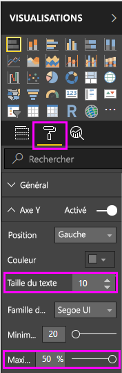
   
   Le graphique affiche à présent plus de contenu de la publication. 
   
   
   
L’axe X (nombre de commentaires) du graphique n’affiche pas des valeurs exactes et semble perdu au bas du graphique. Vous décidez d’utiliser à la place des étiquettes de données. 

1. Sélectionnez l’icône Format, puis le curseur en regard de **l’axe des X** pour le **désactiver**. 
   
2. Sélectionnez le curseur en regard de **Étiquettes de données** pour les **activer**. Le graphique affiche maintenant le nombre exact de commentaires pour chaque publication.
   
   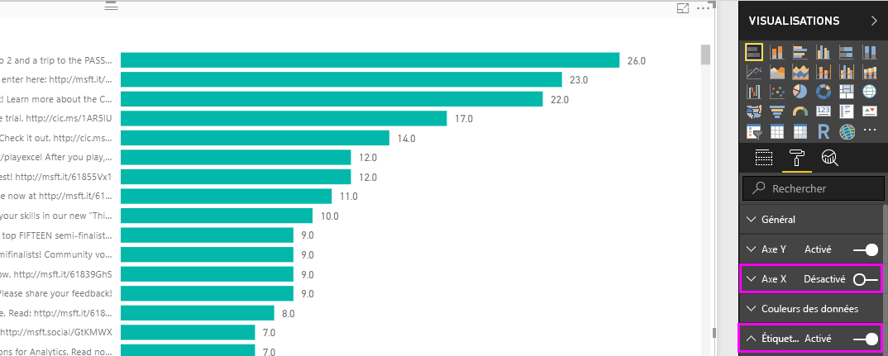
   
### Modifier le type de données

C’est mieux, mais toutes les étiquettes de données ont une décimale **.0**, ce qui est perturbant et trompeur, car **Number of posts** (Nombre de publications) doit être un nombre entier. Vous devez modifier le type de données de la colonne **Number of posts** (Nombre de publications) sur Whole Number (Nombre entier).

1. Pour modifier le type de données, cliquez avec le bouton droit sur **Query1** dans la liste Fields (Champs), ou pointez dessus et sélectionnez les points de suspension (...) **Plus d’options**, puis sélectionnez **Modifier la requête**. Vous pouvez également sélectionner **Modifier les requêtes** à partir de la zone **Données externes** de l’onglet Accueil du ruban, puis sélectionnez **Modifier les requêtes** dans la liste déroulante. **Power Query Editor** de Power BI Desktop s’ouvre dans une fenêtre distincte.
   
   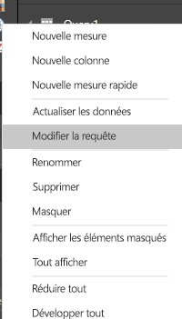     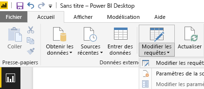
   
2. Dans Power Query Editor, sélectionnez la colonne **Number of comments** (Nombre de commentaires) et modifiez le type de données sur **Whole Number** (Nombre entier) en procédant de l’une des manières suivantes : 
   - En sélectionnant l’icône **1.2** en regard de l’en-tête de la colonne **Number of comments** (Nombre de commentaires), puis en sélectionnant **Whole Number** (Nombre entier) dans la liste déroulante, ou
   - En cliquant avec le bouton droit sur l’en-tête de la colonne et en sélectionnant **Modifier le type > Nombre entier**, ou
   - En sélectionnant **Type de données : nombre décimal** dans le groupe **Transformer** de l’onglet Accueil, ou le groupe **N’importe quelle colonne** de l’onglet **Transformer**, et en sélectionnant **Nombre entier**.
   
   L’icône dans l’en-tête de la colonne est remplacé par **123**, ce qui indique un type de données Nombre entier.
   
   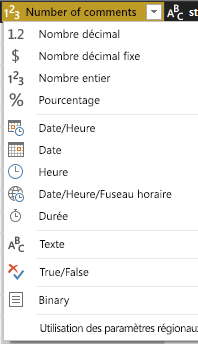
   
3. Sélectionnez **Fermer et appliquer**, ou simplement **Appliquer**, pour appliquer les modifications tout en laissant la fenêtre Power Query Editor ouverte. Une fois les modifications chargées, les étiquettes de données sur le graphique deviennent des nombres entiers. 
   
   
   
### Créer un segment de date

Vous souhaitez visualiser le nombre de commentaires sur les publications au fil du temps. Vous pouvez créer une visualisation de segment pour filtrer les données du graphique pour différentes périodes. 

1. Cliquez sur une zone vide du canevas, puis sélectionnez **l’icône Slicer** (Segment) dans le volet Visualisations. Une visualisation de segment vide s’affiche. 
   
   
   
2. Sélectionnez le champ **created_date** dans la liste Fields (Champs), ou faites-le glisser vers le nouveau segment. Le segment se transforme en curseur de plage de dates, selon le type de données Date.
   
   
   
3. Déplacez les poignées du curseur pour sélectionner des plages de dates différentes et notez que les données du graphique sont filtrées en conséquence. Vous pouvez également sélectionner les champs de date dans le segment et entrer des dates spécifiques, ou les sélectionner dans un calendrier contextuel.
    
   
   
### Mettre en forme les visualisations

Vous décidez de donner au graphique un titre plus descriptif et plus intéressant. 

1. Avec le graphique sélectionné, sélectionnez l’icône **Format**, puis sélectionnez la flèche vers le bas pour développer **Titre**.
2. Remplacez le **texte du titre** par **Comments per post** (Commentaires par publication). 
3. Sélectionnez la flèche vers le bas en regard de **Couleur de police**, puis sélectionnez une couleur verte en accord avec les barres vertes de la visualisation.
4. Augmentez la **Taille du texte** sur **10** et modifiez la **Famille de polices** sur **Segoe (gras)**.

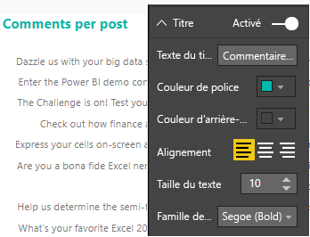

Faites des essais avec d’autres options et paramètres de mise en forme pour modifier l’apparence de vos visualisations. 

## Créer plus de visualisations

Comme vous pouvez le voir, vous pouvez facilement personnaliser les visualisations dans votre rapport pour présenter les données de la façon souhaitée. Par exemple, essayez d’utiliser les données importées de Facebook pour créer ce graphique en courbes affichant le nombre de commentaires au fil du temps.

Power BI Desktop fournit une expérience de bout en bout transparente, allant de la récupération de données d’un large éventail de sources de données à la visualisation de ces données au moyen de méthodes interactives et enrichies, en passant par leur mise en forme en fonction des besoins d’analyse. Une fois que votre rapport est prêt, vous pouvez [le charger dans le service Power BI](desktop-upload-desktop-files.md) et créer des tables de bord basés sur celui-ci, que vous pouvez partager avec d’autres utilisateurs de Power BI.

## Étapes suivantes
* [Autres didacticiels Power BI Desktop](http://go.microsoft.com/fwlink/?LinkID=521937)
* [Vidéos relatives à Power BI Desktop](http://go.microsoft.com/fwlink/?LinkID=519322)
* [Forum Power BI](http://go.microsoft.com/fwlink/?LinkID=519326)
* [Blog Power BI](http://go.microsoft.com/fwlink/?LinkID=519327)

