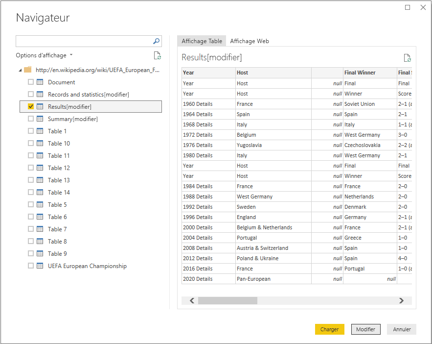
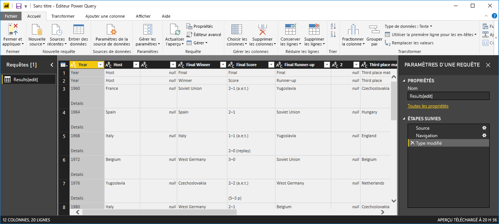
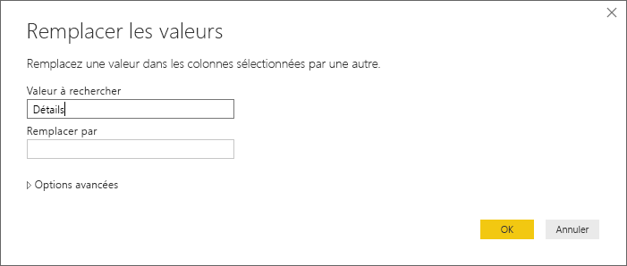
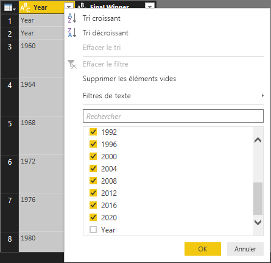
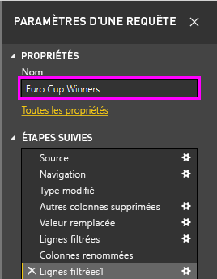
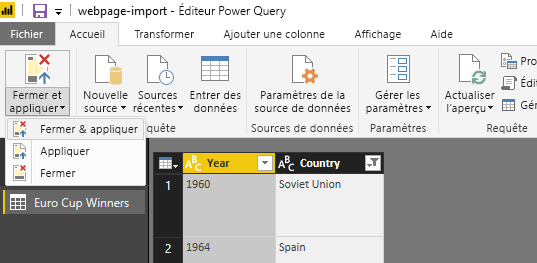
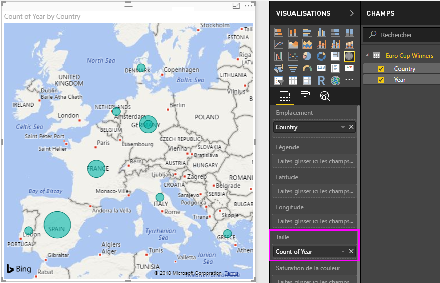

# Analyse des données de page web à l’aide de Power BI Desktop (didacticiel)
Dans ce didacticiel, vous allez apprendre à importer une table de données à partir d’une page web et à créer un rapport pour visualiser ces données. Dans le cadre de ce processus, vous naviguez dans des tables via une page web et appliquez des étapes de transformation de données pour donner une nouvelle forme à la table.

 Contenu de cet article :

* **Tâche 1 :** se connecter à une source de données web
* **Tâche 2 :** mettre en forme les données dans la vue Requête
  * Étape 1 : supprimer des colonnes pour afficher uniquement les colonnes dignes d’intérêt
  * Étape 2 : remplacer des valeurs pour nettoyer les valeurs d’une colonne sélectionnée
  * Étape 3 : filtrer les valeurs d’une colonne
  * Étape 4 : renommer une colonne
  * Étape 5 : filtrer les valeurs null d’une colonne
  * Étape 6 : renommer une requête
  * Étapes de requête créées
* **Tâche 3 :** créer des visualisations en utilisant la vue Rapport
  * Étape 1 : charger la requête dans votre rapport
  * Étape 2 : créer une visualisation Carte

## Tâche 1 : se connecter à une source de données web
 Dans la tâche 1, vous importez une table de résumé de tournoi à partir de la page Wikipédia du championnat d’Europe de football de l’UEFA à l’adresse suivante : http://en.wikipedia.org/wiki/UEFA\_European\_Football\_Championship

### Ajouter une source de données d’une page Wikipédia
1. Dans la boîte de dialogue **Prise en main** ou sous l’onglet **Accueil** du ruban, sélectionnez **Obtenir des données**.
2. Dans la boîte de dialogue **Obtenir des données** qui s’affiche, vous pouvez choisir parmi une large gamme de sources de données pour importer des données dans Power BI Desktop. Nous allons sélectionner **Web**, qui est disponible sous le groupe **Toutes** ou **Autre**.
3. Dans la boîte de dialogue **Contenu web**, dans la zone de texte **URL**, collez l’URL Wikipédia (http://en.wikipedia.org/wiki/UEFA\_European\_Football\_Championship).
4. Cliquez sur **OK**.

Une fois établie la connexion à la page web, la liste des tables disponibles dans cette page Wikipédia apparaît dans la boîte de dialogue **Navigateur**. Vous pouvez cliquer sur chacune de ces tables pour afficher un aperçu des données.

Dans le volet gauche du **Navigateur**, sélectionnez la table **Results[edit]** des résultats récapitulatifs du tournoi, ou sélectionnez la table **Results[edit]** et sélectionnez **Modifier**. Cela nous permettra de remodeler cette table avant de la charger dans le rapport, car les données ne se présentent pas dans la forme nécessaire pour notre analyse.

Nous obtiendrons ainsi un aperçu de la table dans la vue Requête, où nous pourrons appliquer un ensemble d’étapes de transformation pour nettoyer les données.

## Tâche 2 : mettre en forme les données de la table subject
La table subject étant sélectionnée pour votre requête de données, vous pouvez apprendre à effectuer différentes étapes de mise en forme et de nettoyage de données.

**Étape 1 :** supprimer des colonnes pour afficher uniquement les colonnes dignes d’intérêt

Dans cette étape, vous supprimez toutes les colonnes sauf **Year** et **Final Winner**.

1. Dans la grille d’**aperçu de la requête**, sélectionnez les colonnes **Year** et **Final Winner** (utilisez **Ctrl** + **clic**.
2. Cliquez avec le bouton droit sur un en-tête de colonne dans la grille d’ **aperçu de la requête**, puis cliquez sur **Supprimer d’autres colonnes** pour supprimer les colonnes non sélectionnées. Notez que vous pouvez également effectuer cette opération dans le groupe **Gérer les colonnes** de l’onglet **Accueil** du ruban.

**Étape 2 :** remplacer des valeurs pour nettoyer les valeurs d’une colonne sélectionnée

Dans cette étape, vous remplacez le suffixe Details dans la colonne **Year**. Ce suffixe étant sur une ligne à part, il n’est pas visible dans l’aperçu de la table. Toutefois, si vous cliquez sur l’une des cellules comportant une valeur numérique dans la colonne Year, vous verrez la valeur complète dans la vue détaillée.

1. Sélectionnez la colonne **Year**.
2. Dans le ruban de la **vue Requête**, cliquez sur **Remplacer les valeurs** sous l’onglet **Accueil** ou cliquez avec le bouton droit sur la colonne **Year**, puis cliquez sur **Remplacer les valeurs** pour remplacer Details par une chaîne vide.
3. Dans la boîte de dialogue **Remplacer les valeurs**, tapez Details dans la zone de texte **Valeur à rechercher** et laissez la zone de texte **Remplacer par** vide.
4. Cliquez sur **OK**.

 **Étape 3 :** filtrer les valeurs d’une colonne

Dans cette étape, vous filtrez la colonne **Year** pour afficher les lignes qui ne contiennent pas « Year ».

1. Cliquez sur la flèche déroulante de filtre dans la colonne **Year**.
2. Dans la liste déroulante **Filtrer**, décochez l’option **Year**.
3. Cliquez sur **OK**.

**Étape 4 :** renommer une colonne

Les données de la colonne **Year** étant nettoyées, nous allons nous pencher sur la colonne **Final Winner**.

Dans la mesure où seule la liste des vainqueurs nous intéresse, nous pouvons renommer cette colonne **Country**.

1. Sélectionnez la colonne **Final Winner** dans l’aperçu de la requête.
2. Dans la **vue Requête** du ruban, sous l’onglet **Transformer** et le groupe **N’importe quelle colonne**, sélectionnez l’option **Renommer**.
3. Cela rend le nom de colonne modifiable. Nous allons renommer cette colonne **Country**.

**Étape 5 :** filtrer les valeurs null d’une colonne

Nous devons également filtrer les valeurs null de la colonne **Country**. Pour ce faire, nous pouvons utiliser le menu Filtrer vu à l’étape 3 ou procéder comme suit :

1. Dans la colonne **Country**, cliquez avec le bouton droit sur une cellule qui contient une valeur null.
2. Sélectionnez **Filtres de texte -\> N’est pas égal à** dans le menu contextuel.
3. Cette opération crée une étape de filtre permettant de supprimer les lignes qui contiennent la valeur null dans la colonne **Country**.

**Étape 6 :** nommer une requête

Dans cette étape, vous nommez votre dernière requête **Euro Cup Winners**.

1. Dans le volet **Paramètres d’une requête**, dans la zone de texte **Nom**, entrez **Euro Cup Winners**.
   
   

## Tâche 3 : créer des visualisations à l’aide de la vue Rapport
Les données ayant la forme nécessaire pour notre analyse, nous pouvons charger la table résultante dans notre rapport et créer quelques visualisations.

**Étape 1 :** charger la requête dans votre rapport

Pour charger les résultats de la requête dans Power BI Desktop et créer le rapport, nous sélectionnons **Fermer et charger** dans le ruban **Accueil**.

Cette opération déclenche l’évaluation de la requête et le chargement de la sortie de table dans le rapport. Dans Power BI Desktop, sélectionnez l’icône **Rapport** pour afficher la vue Rapport dans Power BI Desktop.

Les champs de la table résultants apparaissent dans le **volet Champs** à droite de la **vue Rapport**.

**Étape 2 :** créer une visualisation Carte

Pour créer une visualisation, nous pouvons faire glisser-déplacer des champs de la **liste Champs** dans le **canevas de rapport**.

1. Faites glisser-déplacer le champ **Country** dans le **canevas de rapport**. Cette opération crée une visualisation dans le **canevas de rapport**. Dans ce cas, étant donné que nous disposons d’une liste de pays, nous obtenons une **visualisation Carte**.
   
   
2. Nous pouvons facilement modifier le type de visualisation en cliquant sur une autre icône dans le volet **Visualisation**.
   
   
3. Nous allons conserver le type de visualisation **Carte**. Nous pouvons aussi redimensionner la visualisation en faisant glisser un angle de la visualisation jusqu’à obtenir la taille souhaitée.
   
   
4. Notez qu’actuellement tous les points de la carte ont la même taille. Nous voulons modifier cela afin que la taille du point représentant chaque pays soit proportionnelle au nombre de tournois de la coupe d’Europe gagnés par le pays concerné. Pour ce faire, nous pouvons faire glisser le champ **Year** de la **liste Champs** jusqu’à la zone **Valeurs** dans la moitié inférieure du **volet Champs**.
   
   

Comme vous pouvez le voir, il est très facile de personnaliser les visualisations dans votre rapport, afin de présenter les données de la façon souhaitée. Power BI Desktop fournit une expérience de bout en bout transparente, allant de la récupération de données d’un large éventail de sources de données à la visualisation de ces données au moyen de méthodes interactives et enrichies, en passant par leur mise en forme en fonction des besoins d’analyse. Une fois que votre rapport est prêt, vous pouvez [le charger dans Power BI](desktop-upload-desktop-files.md) et créer des tableaux de bord basés sur celui-ci, que vous pouvez partager avec d’autres utilisateurs de Power BI.

Ainsi prend fin le didacticiel **Importation de données à partir du web**. Vous pouvez télécharger le fichier Power BI Desktop complet [ici](http://download.microsoft.com/download/1/4/E/14EDED28-6C58-4055-A65C-23B4DA81C4DE/Analyzing_Data_From_The_Web.pbix).

## Où obtenir des informations supplémentaires ?
* [Autres didacticiels Power BI Desktop](http://go.microsoft.com/fwlink/?LinkID=521937)
* [Vidéos relatives à Power BI Desktop](http://go.microsoft.com/fwlink/?LinkID=519322)
* [Forum Power BI](http://go.microsoft.com/fwlink/?LinkID=519326)
* [Blog Power BI](http://go.microsoft.com/fwlink/?LinkID=519327)

