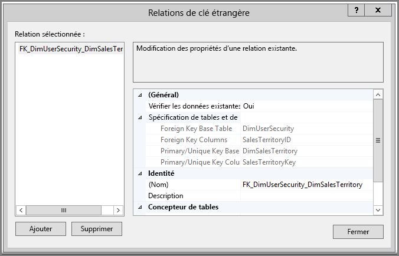
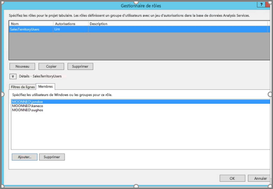
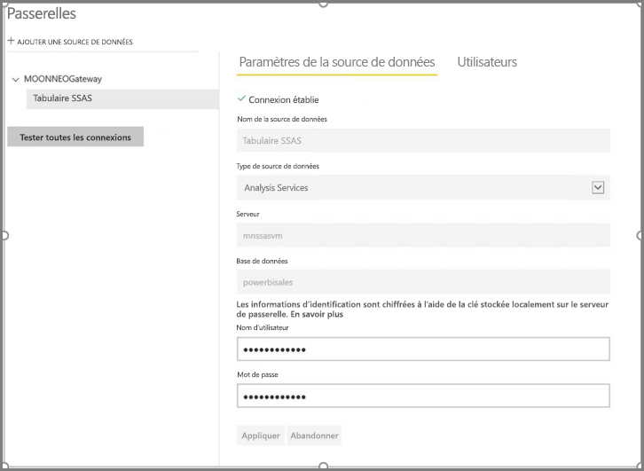
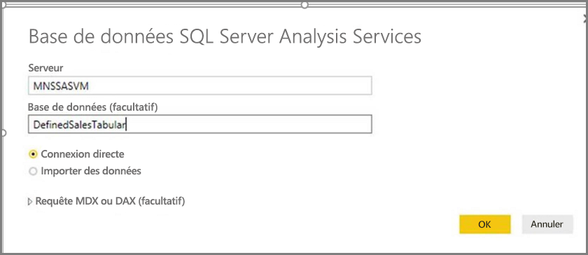
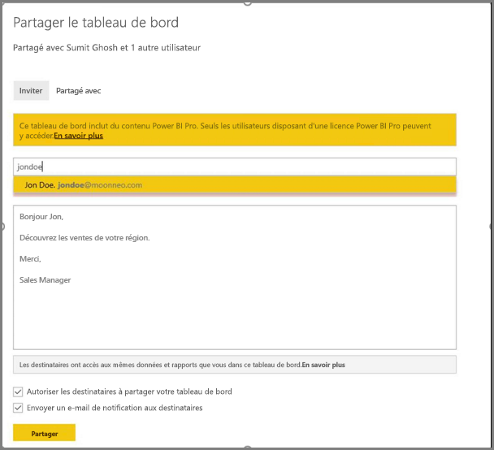
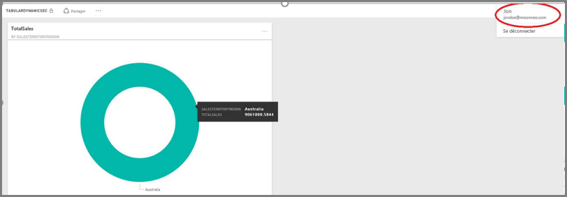

# <a name="dynamic-row-level-security-with-analysis-services-tabular-model"></a>Sécurité dynamique au niveau des lignes avec le modèle tabulaire Analysis Services
Ce didacticiel présente les étapes nécessaires à l’implémentation de la **sécurité au niveau des lignes** dans votre **modèle tabulaire Analysis Services**. Par ailleurs, il montre comment l’utiliser dans un rapport Power BI. Les étapes de ce didacticiel sont conçues pour vous aider à suivre facilement son déroulement et à apprendre les étapes nécessaires en se basant sur un exemple de jeu de données.

Elles sont décrites en détail ci-dessous pour vous aider à comprendre ce que vous devez faire pour implémenter la sécurité dynamique au niveau des lignes avec le modèle tabulaire Analysis Services :

* Créer une table de sécurité dans la base de données **AdventureworksDW2012**
* Générer le modèle tabulaire avec les tables de faits et de dimension nécessaires
* Définir les rôles et les autorisations des utilisateurs
* Déployer le modèle dans une instance du **modèle tabulaire Analysis Services**
* Utiliser Power BI Desktop pour générer un rapport qui affiche les données correspondant à l’utilisateur qui accède au rapport
* Déployer le rapport dans le **service Power BI**
* Créer un tableau de bord basé sur le rapport
* Partager le tableau de bord avec vos collègues

Pour suivre les étapes de ce didacticiel, vous avez besoin de la base de données **AdventureworksDW2012**, que vous pouvez télécharger dans le **[dépôt](https://github.com/Microsoft/sql-server-samples/releases/tag/adventureworks)**.

## <a name="task-1-create-the-user-security-table-and-define-data-relationship"></a>Tâche 1 : Créer la table de sécurité utilisateur et définir la relation de données
De nombreux articles publiés décrivent comment définir la sécurité dynamique au niveau des lignes avec le **modèle tabulaire SQL Server Analysis Services (SSAS)**. Pour notre exemple, nous suivons les instructions de l’article [Implémenter la sécurité dynamique à l’aide des filtres de lignes](https://msdn.microsoft.com/library/hh479759.aspx). Les étapes suivantes vous guideront pour mener à bien la première tâche de ce didacticiel :

1. Notre exemple utilise la base de données relationnelle **AdventureworksDW2012**. Dans celle-ci, créez la table **DimUserSecurity**, comme illustré dans l’image suivante. Pour cet exemple, nous utilisons SQL Server Management Studio (SSMS) pour créer la table.
   
   
2. Une fois la table créée et enregistrée, nous devons créer la relation entre la colonne **SalesTerritoryID** de la table **DimUserSecurity** et la colonne **SalesTerritoryKey** de la table **DimSalesTerritory**, comme illustré dans l’image suivante. Pour cela, il est possible d’utiliser **SSMS** en cliquant avec le bouton droit sur la table **DimUserSecurity** et en sélectionnant **Conception**. Sélectionnez ensuite **Concepteur de tables -> Relations...**  dans le menu.
   
   
3. Enregistrez la table, puis ajoutez quelques lignes d’informations utilisateur en cliquant à nouveau avec le bouton droit sur la table **DimUserSecurity** et en sélectionnant **Modifier les 200 premières lignes**. Une fois que vous avez ajouté les utilisateurs, les lignes de la table **DimUserSecurity** ont le même aspect que dans l’image suivante :
   
   
   
   Nous reviendrons à ces utilisateurs lors des prochaines tâches.
4. Ensuite, nous faisons une *jointure interne* avec la table **DimSalesTerritory**, qui affiche les détails de région associés à l’utilisateur. Le code suivant exécute la *jointure interne* et l’image ci-dessous montre comment la table s’affiche une fois la *jointure interne* correctement effectuée.
   
       select b.SalesTerritoryCountry, b.SalesTerritoryRegion, a.EmployeeID, a.FirstName, a.LastName, a.UserName from [dbo].[DimUserSecurity] as a join  [dbo].[DimSalesTerritory] as b on a.[SalesTerritoryKey] = b.[SalesTerritoryID]
   
   
5. Notez que l’image ci-dessus présente des informations telles que l’utilisateur responsable de la région de ventes. Ces données sont affichées en raison de la relation que nous avons créée à l’**étape 2**. Notez également que l’utilisateur **Jon Doe fait partie de la région de ventes Australie**. Nous reviendrons à John Doe lors des tâches et étapes à venir.

## <a name="task-2-create-the-tabular-model-with-facts-and-dimension-tables"></a>Tâche 2 : Créer le modèle tabulaire avec les tables de faits et de dimension
1. Une fois que votre entrepôt de données relationnelles est en place, il est temps de définir votre modèle tabulaire. Celui-ci peut être créé à l’aide de **SQL Server Data Tools (SSDT)**. Pour obtenir plus d’informations sur la façon de définir un modèle tabulaire, consultez [Créer un nouveau projet de modèle tabulaire](https://msdn.microsoft.com/library/hh231689.aspx).
2. Importez toutes les tables nécessaires dans le modèle, comme indiqué ci-dessous.
   
    
3. Définissez ensuite un rôle appelé **SalesTerritoryUsers** avec l’autorisation **Lecture**. Pour cela, cliquez sur le menu **Modèle** de SQL Server Data Tools, puis sur **Rôles**. Dans la boîte de dialogue **Gestionnaire de rôles**, cliquez sur **Nouveau**.
4. Sous l’onglet **Membres** du **Gestionnaire de rôles**, ajoutez les utilisateurs que nous avons définis dans la table **DimUserSecurity** lors de la **tâche 1 - étape 3**.
   
    
5. Ensuite, ajoutez les fonctions appropriées pour les tables **DimSalesTerritory** et **DimUserSecurity** , comme indiqué ci-dessous sous l’onglet **Filtres de lignes** .
   
    
6. Dans cette étape, nous utilisons la fonction **LOOKUPVALUE** pour renvoyer les valeurs d’une colonne dans laquelle le nom d’utilisateur Windows est le même que celui renvoyé par la fonction **USERNAME**. Les requêtes peuvent ensuite être restreintes pour que les valeurs renvoyées par **LOOKUPVALUE** correspondent aux valeurs de cette même table ou d’une table connexe. Dans la colonne **Filtre DAX**, tapez la formule suivante :
   
       =DimSalesTerritory[SalesTerritoryKey]=LOOKUPVALUE(DimUserSecurity[SalesTerritoryID], DimUserSecurity[UserName], USERNAME(), DimUserSecurity[SalesTerritoryID], DimSalesTerritory[SalesTerritoryKey])
    Dans cette formule, la fonction **LOOKUPVALUE** renvoie toutes les valeurs de la colonne **DimUserSecurity[SalesTerritoryID]**, où **DimUserSecurity[UserName]** est identique à l’utilisateur Windows actuellement connecté et où **DimUserSecurity[SalesTerritoryID]** est identique à **DimSalesTerritory[SalesTerritoryKey]**.
   
   L’ensemble de ventes SalesTerritoryKey renvoyé par **LOOKUPVALUE** est ensuite utilisé pour limiter les lignes affichées dans **DimSalesTerritory**. Seules les lignes où l’élément **SalesTerritoryKey** de la ligne est compris dans la plage d’ID renvoyée par la fonction **LOOKUPVALUE** sont affichées.
8. Pour la table **DimUserSecurity**, dans la colonne **DAX Filter**, tapez la formule suivante :
   
       =FALSE()

    Cette formule indique que toutes les colonnes sont converties en condition booléenne false et que, par conséquent, aucune colonne de la table **DimUserSecurity** ne peut être interrogée.
1. Nous devons à présent traiter et déployer le modèle. Vous pouvez consulter l’[article sur le déploiement](https://msdn.microsoft.com/library/hh231693.aspx) pour obtenir de l’aide au moment de déployer le modèle.

## <a name="task-3-adding-data-sources-within-your-on-premises-data-gateway"></a>Tâche 3 : Ajout de sources de données dans la passerelle de données locale
1. Une fois que votre modèle tabulaire est déployé et prêt à être utilisé, vous devez ajouter une connexion de source de données à votre serveur tabulaire Analysis Services dans votre portail Power BI.
2. Pour permettre au **service Power BI** d’accéder à votre service d’analyse local, la **[passerelle de données locale](service-gateway-onprem.md)** doit être installée et configurée dans votre environnement.
3. Une fois que la passerelle de données locale est correctement configurée, vous devez créer une connexion à la source de données pour votre instance tabulaire **Analysis Services**. Cet article va vous aider à [ajouter une source de données à partir du portail Power BI](service-gateway-enterprise-manage-ssas.md).
   
   
4. Une fois que l’étape précédente est terminée, la passerelle est configurée et prête à interagir avec votre source de données **Analysis Services** locale.

## <a name="task-4-creating-report-based-on-analysis-services-tabular-model-using-power-bi-desktop"></a>Tâche 4 : Création d’un rapport basé sur le modèle tabulaire Analysis Services à l’aide de Power BI Desktop
1. Lancez **Power BI Desktop** et sélectionnez **Obtenir des données > Base de données** .
2. Dans la liste des sources de données, sélectionnez **Base de données SQL Server Analysis Services**, puis **Connexion**.
   
   
3. Renseignez les détails de l’instance tabulaire **Analysis Services** et sélectionnez **Connexion directe**. Sélectionnez **OK**. Avec **Power BI**, la sécurité dynamique fonctionne uniquement avec **Connexion directe**.
   
   
4. Vous pouvez alors constater que le modèle qui a été déployé se trouve dans l’instance **Analysis Services**. Sélectionnez le modèle en question, puis **OK**.
   
   
5. **Power BI Desktop** affiche maintenant tous les champs disponibles, à droite de la zone de dessin dans le volet **Champs**.
6. Dans le volet **Champs** à droite, sélectionnez la mesure **SalesAmount** dans la table **FactInternetSales** et la dimension **SalesTerritoryRegion** dans la table **SalesTerritory**.
7. Comme nous voulons que ce rapport reste simple, nous n’allons pas ajouter de colonnes. Pour avoir une représentation plus significative des données, nous allons définir la visualisation sur **Graphique en anneau**.
   
   
8. Une fois que le rapport est prêt, vous pouvez le publier directement sur le portail Power BI. Sur le ruban **Accueil** de **Power BI Desktop**, sélectionnez **Publier**.

## <a name="task-5-creating-and-sharing-a-dashboard"></a>Tâche 5 : Création et partage d’un tableau de bord
1. Vous avez créé le rapport et cliqué sur **Publier** dans **Power BI Desktop**. Le rapport est maintenant publié dans le service **Power BI**. Nous pouvons à présent faire la démonstration de notre scénario de sécurité du modèle en utilisant l’exemple que nous avons créé lors des étapes précédentes.
   
   Dans son rôle, **Responsable des ventes - Sumit** peut voir les données des différentes régions de ventes. Par conséquent, il crée ce rapport (celui créé lors des étapes de la tâche précédente) et le publie dans le service Power BI.
   
   Il crée ensuite un tableau de bord dans le service Power BI, qu’il nomme **TabularDynamicSec** en fonction de ce rapport. Dans l’image suivante, notez que le responsable des ventes (Sumit) peut voir les données correspondant à l’ensemble des régions de vente.
   
   
2. Sumit partage désormais le tableau de bord avec son collègue, Jon Doe, responsable des ventes dans la région Australie.
   
   
   
   
3. Quand Jon Doe se connecte au service **Power BI** et affiche le tableau de bord partagé créé par Sumit, il doit voir **uniquement** les ventes de la région dont il est responsable. Par conséquent, Jon Doe se connecte, accède au tableau de bord que Sumit a partagé avec lui et voit **uniquement** les ventes de la région Australie.
   
   
4. Félicitations ! La sécurité dynamique au niveau des lignes qui a été définie dans le modèle tabulaire **Analysis Services** local a été correctement répercutée et observée dans le service **Power BI**. Power BI utilise la propriété **effectiveusername** pour envoyer les informations d’identification Power BI actuelles à la source de données locale pour exécuter les requêtes.

## <a name="task-6-understanding-what-happens-behind-the-scenes"></a>Tâche 6 : Comprendre ce qui se passe en arrière-plan
1. Cette tâche suppose que vous êtes familiarisé avec le Générateur de profils SQL, car vous devez capturer une trace du Générateur de profils SQL Server sur votre instance tabulaire SSAS locale.
2. La session est initialisée dès que l’utilisateur (dans ce cas, Jon Doe) accède au tableau de bord dans le service Power BI. Vous pouvez voir que le rôle **salesterritoryusers** prend effet immédiatement avec le nom d’utilisateur en vigueur **<EffectiveUserName>jondoe@moonneo.com</EffectiveUserName>**
   
       <PropertyList><Catalog>DefinedSalesTabular</Catalog><Timeout>600</Timeout><Content>SchemaData</Content><Format>Tabular</Format><AxisFormat>TupleFormat</AxisFormat><BeginRange>-1</BeginRange><EndRange>-1</EndRange><ShowHiddenCubes>false</ShowHiddenCubes><VisualMode>0</VisualMode><DbpropMsmdFlattened2>true</DbpropMsmdFlattened2><SspropInitAppName>PowerBI</SspropInitAppName><SecuredCellValue>0</SecuredCellValue><ImpactAnalysis>false</ImpactAnalysis><SQLQueryMode>Calculated</SQLQueryMode><ClientProcessID>6408</ClientProcessID><Cube>Model</Cube><ReturnCellProperties>true</ReturnCellProperties><CommitTimeout>0</CommitTimeout><ForceCommitTimeout>0</ForceCommitTimeout><ExecutionMode>Execute</ExecutionMode><RealTimeOlap>false</RealTimeOlap><MdxMissingMemberMode>Default</MdxMissingMemberMode><DisablePrefetchFacts>false</DisablePrefetchFacts><UpdateIsolationLevel>2</UpdateIsolationLevel><DbpropMsmdOptimizeResponse>0</DbpropMsmdOptimizeResponse><ResponseEncoding>Default</ResponseEncoding><DirectQueryMode>Default</DirectQueryMode><DbpropMsmdActivityID>4ea2a372-dd2f-4edd-a8ca-1b909b4165b5</DbpropMsmdActivityID><DbpropMsmdRequestID>2313cf77-b881-015d-e6da-eda9846d42db</DbpropMsmdRequestID><LocaleIdentifier>1033</LocaleIdentifier><EffectiveUserName>jondoe@moonneo.com</EffectiveUserName></PropertyList>
3. En fonction de la demande de nom d’utilisateur en vigueur, Analysis Services convertit la demande en informations d’identification moonneo\jondoe après interrogation de l’annuaire Active Directory local. Une fois qu’**Analysis Services** obtient les informations d’identification réelles à partir d’Active Directory, selon l’accès aux données dont dispose l’utilisateur, **Analysis Services** retourne les seules données pour lesquelles il dispose d’une autorisation.
4. Si d’autres activités ont lieu dans le tableau de bord, par exemple, si Jon Doe passe du tableau de bord au rapport sous-jacent, avec le Générateur de profils SQL, vous voyez une requête spécifique revenir vers le modèle tabulaire Analysis Services en tant que requête DAX.
   
   
5. Vous pouvez également voir ci-dessous la requête DAX exécutée pour remplir les données du rapport.
   
   ```
   EVALUATE
     ROW(
       "SumEmployeeKey", CALCULATE(SUM(Employee[EmployeeKey]))
     )
   
   <PropertyList xmlns="urn:schemas-microsoft-com:xml-analysis">``
             <Catalog>DefinedSalesTabular</Catalog>
             <Cube>Model</Cube>
             <SspropInitAppName>PowerBI</SspropInitAppName>
             <EffectiveUserName>jondoe@moonneo.com</EffectiveUserName>
             <LocaleIdentifier>1033</LocaleIdentifier>
             <ClientProcessID>6408</ClientProcessID>
             <Format>Tabular</Format>
             <Content>SchemaData</Content>
             <Timeout>600</Timeout>
             <DbpropMsmdRequestID>8510d758-f07b-a025-8fb3-a0540189ff79</DbpropMsmdRequestID>
             <DbPropMsmdActivityID>f2dbe8a3-ef51-4d70-a879-5f02a502b2c3</DbPropMsmdActivityID>
             <ReturnCellProperties>true</ReturnCellProperties>
             <DbpropMsmdFlattened2>true</DbpropMsmdFlattened2>
             <DbpropMsmdActivityID>f2dbe8a3-ef51-4d70-a879-5f02a502b2c3</DbpropMsmdActivityID>
           </PropertyList>
   ```

## <a name="considerations"></a>Considérations
Voici quelques éléments à prendre en considération quand vous utilisez la sécurité au niveau des lignes, SSAS et Power BI :

1. La sécurité locale au niveau des lignes avec Power BI est uniquement disponible avec une connexion directe.
2. Une fois que le modèle a été traité, les modifications apportées aux données sont immédiatement disponibles pour les utilisateurs (qui accèdent au rapport avec une **Connexion active**) à partir du service Power BI.

