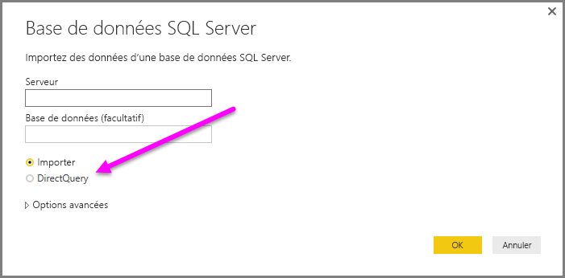
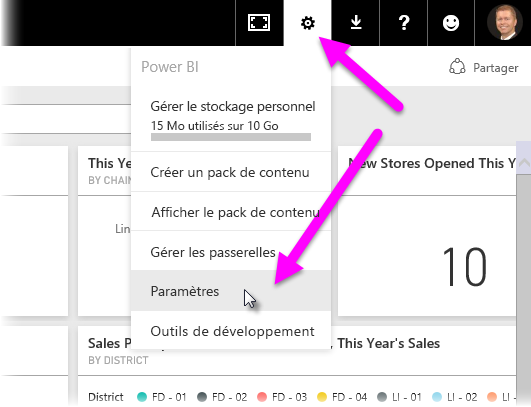

# Utilisation de DirectQuery dans Power BI Desktop
Avec **Power BI Desktop**, lorsque vous vous connectez à votre source de données, vous pouvez toujours importer une copie des données dans **Power BI Desktop**. Pour certaines sources de données, une autre approche consiste à se connecter directement à la source de données à l’aide de **DirectQuery**.

## Sources de données prises en charge
Pour obtenir la liste complète des sources données compatibles avec **DirectQuery**, voir [Sources de données prises en charge par DirectQuery](desktop-directquery-data-sources.md).

## Connexion à l’aide de DirectQuery
Lorsque vous utilisez la commande **Get Data** pour vous connecter à une source de données prise en charge par **DirectQuery**, une fenêtre de connexion vous permet de sélectionner la manière dont vous souhaitez vous connecter.  

Les différences entre la sélection des commandes **Importer** et **DirectQuery** sont les suivantes :

**Importer** – Les tables et colonnes sélectionnées sont importées dans **Power BI Desktop**. Lorsque vous créez une visualisation ou interagissez avec elle, **Power BI Desktop** utilise les données importées. Vous devez actualiser les données, ce qui a pour effet de réimporter le jeu complet de données, pour voir les modifications apportées aux données sous-jacentes depuis l’importation initiale ou la dernière actualisation.

**DirectQuery** – Aucune donnée n’est importée ou copiée dans **Power BI Desktop**. Pour des sources relationnelles, les tables et colonnes sélectionnées apparaissent dans la liste **Champs**. Pour des sources multidimensionnelles telles que SAP Business Warehouse, les dimensions et mesures du cube sélectionné s’affichent dans la liste **Champs**. Lorsque vous créez une visualisation ou interagissez avec elle, **Power BI Desktop** interroge la source de données sous-jacente, ce qui signifie que les données affichées sont toujours à jour.

De nombreuses transformations et modélisations des données sont disponibles lors de l’utilisation de **DirectQuery**, mais avec certaines limitations. Lorsque vous créez une visualisation ou interagissez avec elle, la source sous-jacente doit être interrogée, et le temps nécessaire pour actualiser la visualisation dépend des performances de la source de données sous-jacente. Si les données nécessaires au traitement de la demande ont récemment été demandées, Power BI Desktop utilise des données récentes pour réduire le temps d’affichage de la visualisation. La sélection de la commande **Actualiser** dans le ruban **Accueil** garantit que toutes les visualisations sont actualisées avec des données à jour.

L’article [Power BI et DirectQuery](desktop-directquery-about.md) décrit **DirectQuery** en détail. Pour plus d’informations sur les avantages, les limitations et d’autres considérations importantes en rapport avec l’utilisation de **DirectQuery**, voir les sections suivantes.

## Avantages de l’utilisation de DirectQuery
Il existe quelques avantages à l’utilisation de **DirectQuery** :

* **DirectQuery** vous permet de créer des visualisations sur des jeux de données très volumineux, qu’il serait autrement impossible d’importer au préalable dans leur totalité avec une pré-agrégation.
* Les modifications des données sous-jacentes peuvent exiger une actualisation des données, et pour certains rapports, l’affichage des données actuelles peut exiger des transferts de données volumineux, ce qui rend une nouvelle importation des données irréalisable. Par contre, les rapports **DirectQuery** utilisent toujours des données à jour
* La limitation de jeu de données de 1 Go ne s’applique *pas* à **DirectQuery**

## Limitations de DirectQuery
Il existe actuellement quelques limitations à l’utilisation de **DirectQuery**:

* Toutes les tables doivent provenir d’une seule base de données.
* Si la requête de l’**Éditeur de requête** est trop complexe, une erreur se produit. Pour corriger cette erreur, vous devez soit supprimer l’étape problématique dans l’**Éditeur de requête**, soit *Importer* les données au lieu d’utiliser **DirectQuery**. Pour des sources multidimensionnelles telles que SAP Business Warehouse, aucun **Éditeur de requête** n’est disponible.
* Le filtrage de la relation est limité à un seul sens, au lieu de s’étendre aux deux (bien qu’une fonctionnalité en version préliminaire permette d’activer un filtrage croisé dans les deux sens pour **DirectQuery**). Pour des sources multidimensionnelles telles que SAP Business Warehouse, aucune relation n’est définie dans le modèle.
* **DirectQuery**n’intègre pas de fonctionnalités de Time Intelligence. Par exemple, le mode **DirectQuery**traitement spécial des colonnes de date (année, trimestre, mois, jour, etc.).
* Par défaut, les limitations sont placées sur des expressions DAX autorisées dans les mesures ; consultez le paragraphe suivant (situé après cette liste à puces) pour plus d’informations.
* Le renvoi de données est limité à 1 million de lignes lors de l’utilisation de **DirectQuery**. Cela a une incidence sur les lignes renvoyées, et non sur les agrégations ou les calculs utilisés pour créer le jeu de données renvoyé à l’aide de **DirectQuery**. Par exemple, vous pouvez agréger 10 millions de lignes avec la requête qui s’exécute sur la source de données et renvoyer avec précision les résultats de cette agrégation à Power BI à l’aide de **DirectQuery** tant que les données renvoyées à Power BI représentent moins de 1 million de lignes. Si plus de 1 million de lignes est renvoyé par **DirectQuery**, Power BI renvoie une erreur.

Pour garantir des performances acceptables aux requêtes envoyées à la source de données sous-jacente, les limitations sont imposées aux mesures par défaut. Les utilisateurs avancés peuvent choisir de contourner cette limitation en sélectionnant **Fichier > Options**, puis **Paramètres > Options et paramètres > DirectQuery**, puis l’option *Autoriser des mesures sans restriction en mode DirectQuery*. Quand cette option est sélectionnée, toute expression DAX valide pour une mesure est utilisable. Les utilisateurs doivent savoir, toutefois, que certaines expressions qui fonctionnent très bien quand les données sont importées peuvent générer des requêtes très lentes pour la source principale en mode DirectQuery.

## Considérations importantes concernant l’utilisation de DirectQuery
Lors de l’utilisation de **DirectQuery**, vous devez prendre en considération les trois points suivants :

* **Charge et performances** : toutes les demandes **DirectQuery** étant envoyées à la base de données source, le temps nécessaire pour actualiser un élément visuel dépend du temps que cette source principale met à répondre avec les résultats de la requête (ou des requêtes). Le temps de réponse recommandé (avec le renvoi des données demandées) en cas d’utilisation de **DirectQuery** pour des éléments visuels est de cinq secondes ou moins, avec un temps de réponse maximal recommandé de 30 secondes pour le renvoi des résultats. Si le temps de réponse est plus long, l’expérience d’un utilisateur utilisant le rapport devient d’une médiocrité pratiquement inacceptable. En outre, une fois qu’un rapport est publié sur le service Power BI, toute requête prenant plus de quelques minutes expire, et l’utilisateur reçoit un message d’erreur.
  
  La charge sur la base de données source doit également être prise en considération, en fonction du nombre d’utilisateurs de Power BI qui utiliseront le rapport publié. L’utilisation de la *Sécurité au niveau des lignes* peut également avoir un impact significatif. En effet, une vignette de tableau de bord sans sécurité au niveau des lignes partagée par plusieurs d’utilisateurs a pour effet d’envoyer une requête unique à la base de données, alors que l’utilisation de la sécurité au niveau des lignes sur une vignette de tableau de bord signifie généralement que l’actualisation d’une vignette nécessite une requête *par utilisateur*, ce qui augmente considérablement la charge sur la base de données source, et peut avoir une incidence sur les performances.
  
  Power BI crée des requêtes aussi efficaces que possible. Toutefois, dans certaines situations, la requête générée peut ne pas être suffisamment efficace pour éviter une actualisation qui échoue. Un exemple de cette situation est quand une requête générée doit extraire un trop grand nombre de lignes (supérieur à 1 million) à partir de la source de données principale, auquel cas l’erreur suivante se produit :
  
      The resultset of a query to external data source has exceeded
      the maximum allowed size of '1000000' rows.
  
  Cette situation peut se produire avec un simple graphique qui comprend une colonne de la cardinalité très élevée, avec l’option d’agrégation définie sur *ne pas résumer*. L’élément visuel doit avoir uniquement des colonnes avec une cardinalité inférieure à 1 million, ou des filtres appropriés doivent avoir appliqués.
* **Sécurité** : tous les utilisateurs d’un rapport publié se connectent à la source de données principale en utilisant les informations d’identification entrées après la publication sur le service Power BI. C’est la même situation que quand des données sont importées : tous les utilisateurs voient les mêmes données, indépendamment des règles de sécurité définies dans la source principale. Les clients qui souhaitent une sécurité par utilisateur procèdent à l’implémentation avec des sources DirectQuery et utilisent RLS. [En savoir plus sur RLS](service-admin-rls.md).
* **Fonctionnalités prises en charge** : les fonctionnalités de **Power BI Desktop** ne sont pas toutes prises en charge en mode **DirectQuery**, ou leur prise en charge est limitée. De plus, certaines fonctionnalités du service Power BI (telles que *Informations rapides*) qui ne sont pas disponibles pour les jeux de données utilisent **DirectQuery**. Ainsi, la limitation de telles fonctionnalités lors de l’utilisation de **DirectQuery** doit être prise en considération pour déterminer l’opportunité d’utiliser **DirectQuery**.   

## Publication sur le service Power BI
Des rapports créés à l’aide de **DirectQuery** peuvent être publiés sur le service Power BI.

Si la source de données utilisée n’a pas besoin de la **Passerelle de données locale** (**Azure SQL Database**, **Azure SQL Data Warehouse** ou **Redshift**), des informations d’identification doivent être fournies avant que le rapport publié s’affiche dans le service Power BI.

Vous pouvez fournir des informations d’identification en sélectionnant l’icône d’engrenage **Paramètres** dans Power BI, puis sélectionner **Paramètres**.

Power BI affiche la fenêtre **Paramètres** . À partir de là, sélectionnez l’onglet **Jeu de données** , choisissez le jeu de données qui utilise **DirectQuery**, puis sélectionnez **Modifier les informations d’identification**.

Tant que les informations d’identification n’ont pas été fournies, l’ouverture d’un rapport publié ou l’exploration d’un jeu de données créé avec une connexion **DirectQuery** à de telles sources de données génère une erreur.

Pour des sources de données autres que **Azure SQL Database**, **Azure SQL Data Warehouse** et **Redshift** qui utilisent DirectQuery, une **Passerelle de données locale** doit être installée et la source de données doit être inscrite pour établir une connexion de données. Si vous le souhaitez, vous pouvez [en apprendre davantage sur la passerelle de données locale](http://go.microsoft.com/fwlink/p/?LinkID=627094).

## Étapes suivantes
Pour plus d’informations sur **DirectQuery**, consultez les ressources suivantes :

* [DirectQuery dans Power BI](desktop-directquery-about.md)
* [Sources de données prises en charge par DirectQuery](desktop-directquery-data-sources.md)
* [DirectQuery et SAP BW](desktop-directquery-sap-bw.md)
* [DirectQuery et SAP HANA](desktop-directquery-sap-hana.md)
* [Passerelle de données locale](service-gateway-onprem.md)

