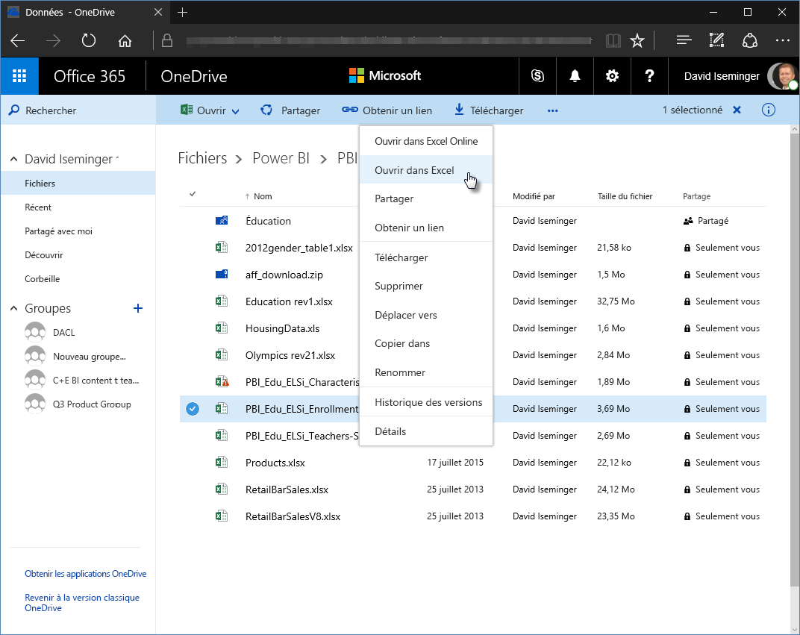
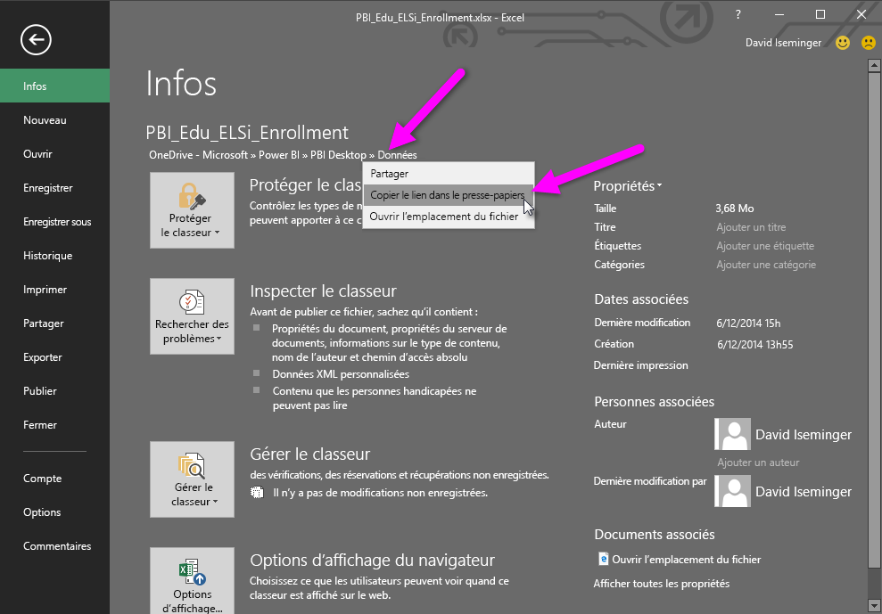
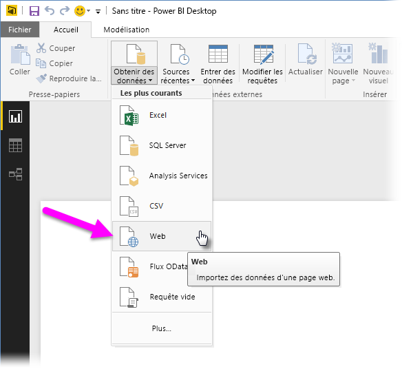
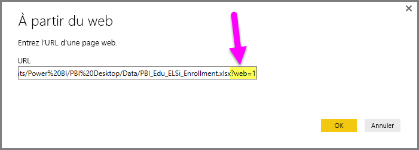

# Utilisation des liens OneDrive Entreprise dans Power BI Desktop
Beaucoup de gens ont des classeurs Excel stockés sur leur lecteur OneDrive Entreprise qui seraient parfaitement adaptés à une utilisation avec Power BI Desktop. Avec **Power BI Desktop**, vous pouvez utiliser les liaisons en ligne pour les fichiers **Excel** stockés dans **OneDrive Entreprise** pour créer des rapports et des éléments visuels. Vous pouvez utiliser un compte **OneDrive Entreprise** de groupe, ou votre compte **OneDrive Entreprise** individuel.

Obtention d’un lien en ligne depuis **OneDrive Entreprise** requiert des étapes spécifiques. Les sections suivantes détaillent ces étapes, ce qui vous permet de partager le lien de fichier au sein des groupes, sur différentes machines, et avec vos collègues.

## Obtenir un lien depuis d’Excel, à partir du navigateur
1. Accédez à votre emplacement OneDrive Entreprise avec un navigateur. Faites un clic droit sur le fichier que vous souhaitez utiliser, puis sélectionnez **Ouvrir dans Excel**
   
   > [!NOTE]
   > L’interface de votre navigateur peut différer de celle de l’image. Il existe plusieurs manières de sélectionner **Ouvrir dans Excel** pour les fichiers de l’interface de votre navigateur **OneDrive Entreprise**. Vous pouvez utiliser n’importe quelle option qui vous permet d’ouvrir le fichier dans Excel.
   > 
   > 
   
   
2. Dans **Excel**, sélectionnez **Fichier > Infos** et sélectionnez le lien au-dessus du bouton **Protéger le classeur**. Sélectionnez **Copier le lien dans le Presse-papiers** (votre version peut indiquer **Copier le chemin d’accès dans le Presse-papiers**).
   
   

## Utiliser le lien dans Power BI Desktop
Dans Power BI Desktop, vous pouvez utiliser le lien que vous venez de copier dans le presse-papiers. Procédez comme suit :

1. Dans Power BI Desktop, sélectionnez **Obtenir des données > Web**
   
   
2. Collez le lien dans la boîte de dialogue **À partir du Web** (ne cliquez **pas** sur OK pour le moment).
   
    
3. Notez la chaîne *?web=1* à la fin du lien. Vous devez *supprimer cette portion de la chaîne de l’URL Web* **avant** de sélectionner **OK**, afin que **Power BI Desktop** accède correctement à votre fichier.
4. Si **Power BI Desktop** vous demande des informations d’identification, choisissez **Windows** (pour les sites SharePoint locaux) ou **Compte professionnel** (pour les sites Office 365 ou OneDrive Entreprise).
   
   

Une fenêtre de **Navigateur** s’affiche et vous permet de sélectionner parmi une liste de tableaux, feuilles et plages du classeur Excel. De là, vous pouvez utiliser le fichier OneDrive Entreprise comme n’importe quel autre fichier Excel, et créer des rapports et l’utiliser dans des jeux de données comme vous le feriez pour n’importe quelle autre source de données.

> [!NOTE]
> Pour utiliser un fichier **OneDrive Entreprise** en tant que source de données dans le service Power BI, avec l’option d’**actualisation du service** activée pour ce fichier, veillez à sélectionner **OAuth2** comme **méthode d’authentification** lors de la configuration de vos paramètres d’actualisation. Sinon, vous pouvez rencontrer une erreur (telle que *Échec de la mise à jour des informations d’identification de la source de données*) quand vous essayez de vous connecter ou d’actualiser. Si vous sélectionnez **OAuth2** comme méthode d’authentification, vous résolvez cette erreur d’informations d’identification.
> 
> 

