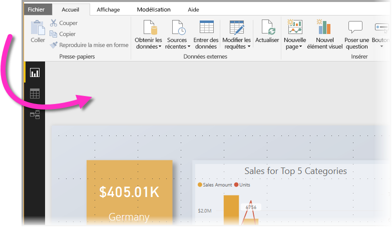
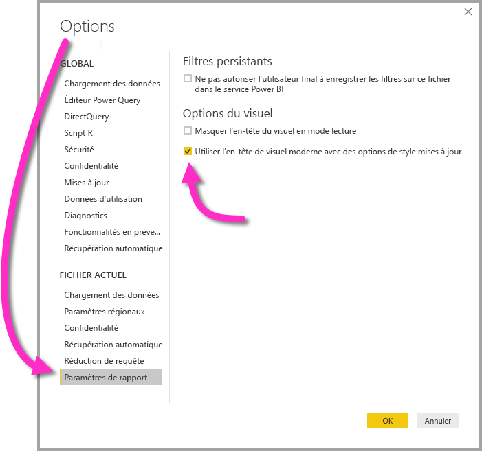

# Utiliser des éléments visuels pour améliorer des rapports Power BI

Avec **Power BI Desktop** vous pouvez utiliser des éléments visuels, tels que le papier peint et les en-têtes de visuels, pour améliorer l’apparence de vos rapports.

À partir de la version de juillet 2018 de **Power BI Desktop**, vous pouvez apporter des améliorations à utiliser dans vos rapports et rendre vos analyses et vos rapports encore plus attrayants qu’avant. Les améliorations présentées dans cet article sont les suivantes : 

* Application de **papier peint** à vos rapports afin que votre arrière-plan puisse améliorer ou mettre en surbrillance des éléments de l’histoire que vous souhaitez raconter avec vos données
* Utilisation d’**en-têtes de visuels** améliorés pour des visualisations individuelles afin de créer des visuels parfaitement alignés sur le canevas de rapport. 

Les sections suivantes décrivent comment utiliser ces améliorations et comment les appliquer à vos rapports.

## Utilisation de papier peint dans les rapports Power BI

Vous pouvez mettre en forme la zone grise en dehors de votre page de rapport à l’aide de **papier peint**. Dans l’image suivante, une flèche indique où la zone de papier peint s’applique. 

Vous pouvez soit définir un papier peint pour chaque page du rapport, soit avoir le même pour chaque page de votre rapport. Pour définir votre papier peint, appuyez ou cliquez sur l’icône de **mise en forme** lorsqu’aucun élément visuel n’est sélectionné dans votre rapport et que la carte **papier peint** s’affiche dans le volet.

Vous pouvez choisir une couleur à appliquer en tant que **papier peint** en sélectionnant la liste déroulante **Couleur**, ou vous pouvez sélectionner le bouton **Ajouter une image** bouton pour sélectionner une image à appliquer comme papier peint. Vous pouvez également appliquer de la transparence à votre papier peint, qu’il s’agisse d’une couleur ou d’une image, avec le curseur **Transparence**.

Il est utile de garder à l’esprit les définitions suivantes, qui se rapportent au **papier peint** :

* La zone grise en dehors de votre zone de rapport est la zone de **papier peint**.
* La zone du canevas où vous pouvez placer des éléments visuels est appelée **page** de rapport et peut être modifiée dans le **volet Format** à l’aide de la liste déroulante **Arrière-plan de page**.

La page **rapport** est toujours au premier plan (par rapport au papier peint), tandis que le **papier peint**, qui se trouve derrière, est l’élément le plus éloigné à l’arrière de la page de rapport. Lorsque vous appliquez la transparence à la page, elle est également appliquée aux éléments visuels dans votre rapport, ce qui rend votre papier peint visible à l’arrière-plan à travers vos éléments visuels.

Pour tous les nouveaux rapports, les paramètres par défaut sont les suivants :

* La **page** de rapport a la valeur **blanc** et sa transparence est définie sur **100 %**.
* Le **papier peint** a la valeur **blanc** et sa transparence est définie sur **0 %**.

Lorsque vous définissez la transparence l’arrière-plan de votre page sur plus de 50 %, une bordure en pointillés apparaît lorsque vous créez ou modifiez votre rapport pour vous montrer la limite de la bordure du canevas du rapport. 

Il est important de noter que la limite en pointillés ne s’affiche *que* lors de la modification de votre rapport et n’est *pas* visible pour les personnes qui consultent votre rapport publié, par exemple dans le **service Power BI**.

> [!NOTE]
> Si vous utilisez des arrière-plans de couleur foncée pour le papier peint et que vous définissez la couleur de texte en blanc ou dans une couleur très claire, n’oubliez pas que la fonctionnalité **Exporter au format PDF** n’inclut pas le papier peint : ainsi, les exportations avec des polices de couleur blanche seront pratiquement invisibles dans le fichier PDF exporté. Pour plus d’informations sur **l’exportation au format PDF**, consultez [Exporter au format PDF](desktop-export-to-pdf.md).

## Utilisation d’en-têtes de visuels améliorés dans les rapports Power BI

À partir de la version de juillet 2018 de **Power BI Desktop**, les en-têtes des visuels dans les rapports ont été nettement améliorés. Les améliorations principales sont que l’en-tête a été détaché du visuel afin que sa position puisse être ajustée en fonction de votre préférence de disposition et de positionnement, et qu’il apparaît maintenant dans le visuel proprement dit au lieu de flotter au-dessus de lui. 

Par défaut, l’en-tête apparaît à l’intérieur du visuel et est aligné sur le titre. Dans l’image suivante, vous pouvez voir l’en-tête (l’icône d’épingle, l’icône de développement et l’icône de points de suspension) dans le visuel et aligné à droite, le long de la même position horizontale que le titre du visuel.

Si votre visuel n’a pas de titre, l’en-tête flotte en haut du visuel et est aligné à droite, comme indiqué dans l’image suivante. 

Si votre visuel est toujours positionné en haut de votre rapport, l’en-tête du visuel s’insère alors en bas du visuel. 

Chaque visuel a également une carte dans la section **Mise en forme** du volet **Visualisations** appelée **En-tête de visuel**. Vous pouvez y ajuster tous les types de caractéristiques de l’en-tête de visuel.

> [!NOTE]
> La visibilité des bascules n’affecte pas votre rapport lorsque vous le créez ou le modifiez. Vous devez publier le rapport et l’afficher en mode de lecture pour voir l’effet. Ce comportement garantit que les nombreuses options fournies dans les en-têtes de visuels sont importantes lors de l’édition, en particulier les icônes d’avertissement, qui vous alertent en cas de problèmes pendant la modification.

Pour les rapports qui s’affichent uniquement dans le **service Power BI**, vous pouvez ajuster l’utilisation d’en-têtes de visuels en accédant à **Mon espace de travail > Rapports**, puis en sélectionnant l’icône **Paramètres**. Vous y voyez les paramètres du rapport pour lequel vous avez sélectionné **Paramètres**, et vous pouvez y ajuster les paramètres comme le montre l’image suivante.

### Activation des en-têtes de visuels améliorés pour les rapports existants

L’en-tête du nouveau visuel est le comportement par défaut pour tous les nouveaux rapports. Pour les rapports existants, vous devez activer ce comportement dans **Power BI Desktop** en accédant à **Fichier > Options et paramètres > Options**, puis, dans la section **Paramètres du rapport**, activer la case à cocher **Utiliser l'en-tête de visuel moderne avec des options de style mises à jour**.

## Étapes suivantes
Pour plus d’informations sur **Power BI Desktop** et la prise en main de cette solution, voir les articles suivants.

* [Qu’est-ce que Power BI Desktop ?](desktop-what-is-desktop.md)
* [Présentation des requêtes dans Power BI Desktop](desktop-query-overview.md)
* [Sources de données dans Power BI Desktop](desktop-data-sources.md)
* [Se connecter aux données dans Power BI Desktop](desktop-connect-to-data.md)
* [Mettre en forme et combiner des données dans Power BI Desktop](desktop-shape-and-combine-data.md)
* [Tâches courantes relatives aux requêtes dans Power BI Desktop](desktop-common-query-tasks.md)   

